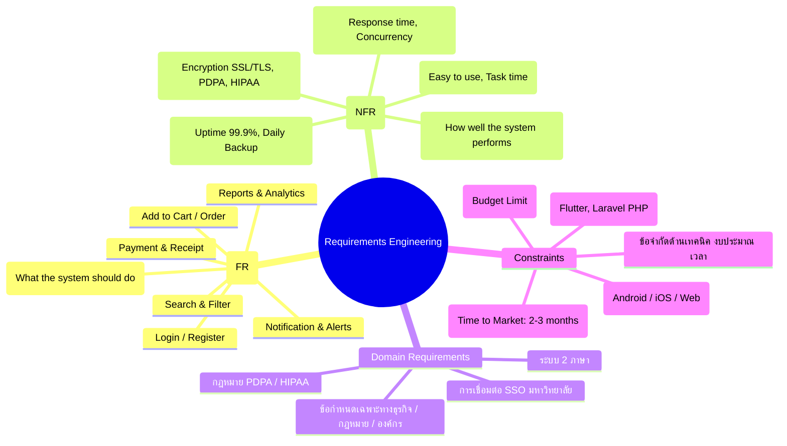
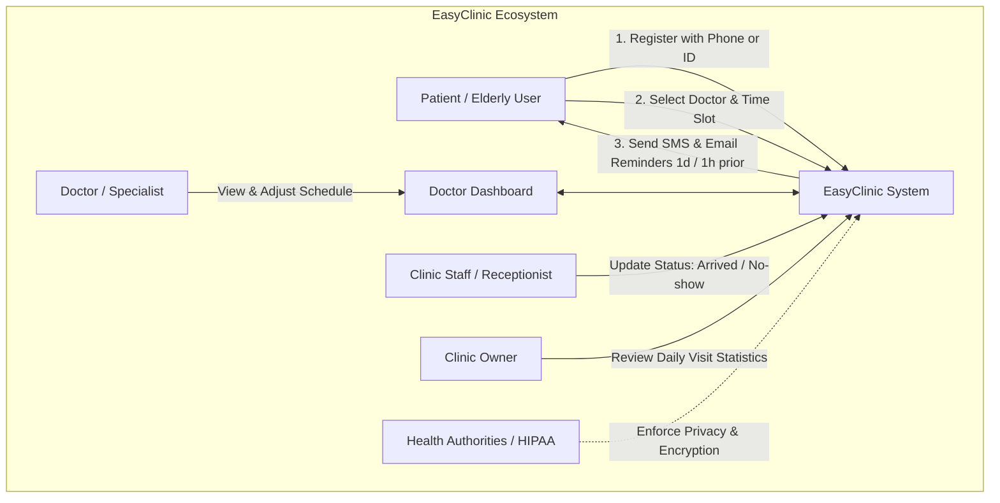
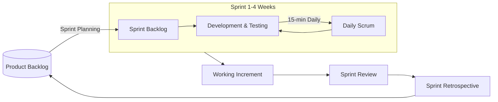

# 📘 แนวข้อสอบกลางภาควิชา Software Engineering (Midterm Exam Prep Guide)

> [!INFO] ข้อมูลและกติกาการสอบ (จาก `mid.png`)
> - **วันและเวลาสอบ**: วันอังคารที่ 19 ส.ค. 68 เวลา 09.00 น.
> - **รูปแบบการสอบ**: เปิดตำราได้ (Open Book)
> - **ภาษาของข้อสอบ**: **โจทย์เป็นภาษาอังกฤษ**
> - **การตอบ**: สามารถตอบเป็นภาษาไทยได้ **แต่ถ้าตอบเป็นภาษาอังกฤษทุกข้อ จะได้คะแนนพิเศษเพิ่ม +5 คะแนน**
> - **จำนวนข้อสอบ**: 5 ข้อ (คะแนนรวม 30 คะแนน)
> - **ขอบเขตเนื้อหา**:
>   1. **วิเคราะห์ Case Study**: Functional Requirements, Non-Functional Requirements, Domain Requirements, Constraints, Stakeholders & Roles, Product Vision
>   2. **อธิบายทฤษฎีและการประยุกต์**: Agile Software Engineering & Scrum Framework (Roles, Events, Artifacts)

---

## 📑 สารบัญ (Table of Contents)
1. [[#1. สูตรลัดและแม่แบบการวิเคราะห์โจทย์ (Cheat Sheet & Templates)]]
2. [[#2. สรุปแปลโจทย์และเฉลย Case Studies ทั้งหมด (Practice-ReqEng)]]
   - 2.1 FreshMart (E-commerce Website)
   - 2.2 KMUTNB University Cafeteria (Mobile App)
   - 2.3 PizzaFriend - ร้านพิซซ่าคุณพลอย (Mobile App)
   - 2.4 ReadSmart (Online Bookstore)
   - 2.5 EasyClinic (Appointment Booking System)
3. [[#3. สรุปทฤษฎี Agile & Scrum Framework (Scrum 3-5-3)]]
4. [[#4. ชุดเก็งแนวข้อสอบ 5 ข้อ พร้อมเฉลย 2 ภาษา (Mock Exam)]]

---

# 1. สูตรลัดและแม่แบบการวิเคราะห์โจทย์ (Cheat Sheet & Templates)



### 1.1 ตารางเปรียบเทียบการจำแนก Requirements
| ประเภท | คำอธิบาย | ตัวอย่างภาษาอังกฤษสำหรับเขียนตอบ |
| :--- | :--- | :--- |
| **Functional (FR)** | ระบบต้องมีฟังก์ชันหรือบริการอะไรบ้าง | *The system shall allow [User] to [Action]...* |
| **Non-Functional (NFR)** | คุณสมบัติเชิงคุณภาพ ประสิทธิภาพ และความปลอดภัย | *The system must respond within [X] seconds...*<br>*The system shall support at least [X] concurrent users...* |
| **Domain Requirement** | กฎเกณฑ์ทางธุรกิจ กฎหมายเฉพาะทาง หรือการเชื่อมต่อระบบเดิม | *The system must comply with [PDPA / HIPAA regulations]...*<br>*The system must integrate with the university account database.* |
| **Constraint** | ข้อจำกัดเชิงเทคโนโลยี เวลา งบประมาณ หรือแพลตฟอร์ม | *The app must be developed using Flutter.*<br>*The project must be completed within 3 months.* |

### 1.2 แม่แบบ Product Vision (Moore's Vision Template)
โครงสร้างมาตรฐาน 6 บรรทัดสำหรับนำไปเขียนวิสัยทัศน์ผลิตภัณฑ์:
```text
FOR         [Target Customer / กลุ่มผู้ใช้งานเป้าหมาย]
WHO         [Statement of Need / ปัญหาหรือความต้องการของผู้ใช้]
OUR PRODUCT [Product Name & Category / ชื่อผลิตภัณฑ์และประเภทระบบ]
THAT        [Key Benefit / ประโยชน์หลักและคุณสมบัติเด่นที่แก้ไขปัญหาได้]
UNLIKE      [Competitive Alternative / ทางเลือกเดิมหรือคู่แข่ง]
OUR PRODUCT [Primary Differentiation / จุดเด่นและข้อได้เปรียบที่เหนือกว่า]
```

---

# 2. สรุปแปลโจทย์และเฉลย Case Studies ทั้งหมด (Practice-ReqEng)

---

## 2.1 Case Study 1: FreshMart E-commerce Website

> [!NOTE] แปลโจทย์สถานการณ์
> **FreshMart** เป็นร้านขายของชำออนไลน์แห่งใหม่ที่ต้องการส่งมอบผักสด ผลไม้ และของใช้จำเป็นประจำวันถึงมือลูกค้าในกรุงเทพฯ คุณสุพรรษา (เจ้าของร้าน) ต้องการสร้างเว็บไซต์ที่ใช้งานง่าย เพื่อให้ลูกค้าสั่งซื้อสินค้าออนไลน์และได้รับการจัดส่งอย่างรวดเร็ว

### การวิเคราะห์ Requirements (English & Thai)
* **Functional Requirements (FR)**:
  1. The system shall allow customers to register and log in using email and password. *(ระบบต้องให้ลูกค้าลงทะเบียนและเข้าสู่ระบบด้วยอีเมลและรหัสผ่าน)*
  2. The system shall display product listings categorized clearly into sections (e.g., vegetables, fruits, bakery). *(ระบบต้องแสดงรายการสินค้าแบ่งตามหมวดหมู่)*
  3. Customers shall be able to add, edit, and remove items from a shopping cart. *(ลูกค้าสามารถเพิ่ม แก้ไข และลบสินค้าในตะกร้าได้)*
  4. The system shall calculate and display the total price of items in the shopping cart. *(ระบบต้องคำนวณและแสดงยอดราคารวมในตะกร้าสินค้า)*
  5. Customers shall select available delivery time slots for their orders. *(ลูกค้าสามารถเลือกรอบเวลาจัดส่งสินค้าได้)*
  6. The system shall accept online payments via credit cards, debit cards, and mobile banking. *(ระบบต้องรับชำระเงินออนไลน์ผ่านบัตรเครดิต บัตรเดบิต และ Mobile Banking)*
  7. The system shall automatically send an order confirmation email with delivery details upon successful order. *(ระบบต้องส่งอีเมลยืนยันคำสั่งซื้อพร้อมรายละเอียดการส่งของทันที)*
* **Non-Functional Requirements (NFR)**:
  - **Usability**: The website must be intuitive, allowing first-time users to complete their order in $< 10$ minutes. *(ใช้งานง่าย ลูกค้าใหม่สั่งซื้อเสร็จใน 10 นาที)*
  - **Performance**: The website should respond to user actions within 3 seconds, and support at least 500 concurrent users without slowdowns. *(ตอบสนองใน 3 วินาที รองรับผู้ใช้พร้อมกันอย่างน้อย 500 คน)*
  - **Reliability**: Maintain $\ge 99.9\%$ uptime and perform automated daily backups at 2:00 AM. *(ความเสถียร 99.9% สำรองข้อมูลอัตโนมัติทุกวันเวลาตี 2)*
  - **Security**: Customer personal and payment information must be encrypted using SSL/TLS during transactions. *(เข้ารหัสข้อมูลส่วนบุคคลและข้อมูลการเงินด้วย SSL/TLS)*
* **Domain Requirements**:
  - The website must comply with Thailand’s Personal Data Protection Act (PDPA). *(ปฏิบัติตามกฎหมายคุ้มครองข้อมูลส่วนบุคคล PDPA)*
  - The system must support bilingual product information display (Thai and English). *(รองรับการแสดงผล 2 ภาษา ทั้งภาษาไทยและภาษาอังกฤษ)*
* **Constraints**:
  - **Framework**: Must be developed using Laravel PHP framework.
  - **Hosting**: Must run on a Linux-based server located in Thailand.
  - **Budget**: Total development cost should not exceed 200,000 Baht.
  - **Timeline**: Must be fully operational and launched within 3 months.

---

## 2.2 Case Study 2: KMUTNB University Cafeteria Mobile App

> [!NOTE] แปลโจทย์สถานการณ์
> โรงอาหารของมหาวิทยาลัยเทคโนโลยีพระจอมเกล้าพระนครเหนือ (มจพ.) ต้องการแก้ปัญหาการสั่งอาหารโดยพัฒนาแอปมือถือให้นักศึกษา โดยนักศึกษาเข้าสู่ระบบด้วยอีเมลของมหาวิทยาลัย เลือกดูเมนูอาหาร ใส่ตะกร้า คำนวณเงิน ชำระเงินผ่าน Mobile banking หรือ Digital wallet ร้านค้าได้รับแจ้งเตือนทันที นักศึกษาเห็นเวลาประมาณการรับอาหาร รองรับผู้ใช้พร้อมกัน 1,000 คน และรักษาความปลอดภัยข้อมูลตามนโยบายมหาวิทยาลัย

### การวิเคราะห์ Requirements (English & Thai)
* **Functional Requirements (FR)**:
  1. The system must allow students to log in using their university email (`@kmutnb.ac.th`). *(ล็อกอินด้วยอีเมลมหาวิทยาลัย)*
  2. Students must be able to browse menus, select food items, and add them to a cart. *(ดูเมนู เลือกอาหาร ใส่ตะกร้าสินค้า)*
  3. The system must calculate total prices and display an order summary before checkout. *(คำนวณราคารวมและแสดงสรุปคำสั่งซื้อ)*
  4. Students must be able to pay through mobile banking or digital wallets. *(ชำระเงินผ่าน Mobile Banking หรือ Digital Wallet)*
  5. The system must immediately notify cafeteria staff when a new order is placed. *(แจ้งเตือนเจ้าหน้าที่โรงอาหารทันทีเมื่อมีออเดอร์ใหม่)*
  6. The system must clearly display estimated pickup times for students. *(แสดงเวลาประมาณการในการรับอาหารให้นักศึกษาทราบ)*
* **Non-Functional Requirements (NFR)**:
  - **Performance**: The app should support at least 1,000 simultaneous users without performance degradation. *(รองรับผู้ใช้พร้อมกันอย่างน้อย 1,000 คนโดยระบบไม่หน่วง)*
  - **Usability**: The system should be user-friendly, allowing students to quickly learn basic operations. *(ใช้งานง่าย นักศึกษาเรียนรู้การใช้งานเบื้องต้นได้อย่างรวดเร็ว)*
* **Domain Requirements**:
  - The system must integrate with the university's account system for student authentication. *(เชื่อมต่อกับระบบบัญชีผู้ใช้งานส่วนกลางของมหาวิทยาลัย)*
  - The system must comply with university-specific data privacy regulations. *(ปฏิบัติตามนโยบายความเป็นส่วนตัวของข้อมูลของมหาวิทยาลัย)*
* **Constraints**:
  - The app must run on both Android and iOS devices. *(ต้องใช้งานได้ทั้งบน Android และ iOS)*
  - The app must be completed and ready to launch within 2 months. *(ต้องพัฒนาให้เสร็จและพร้อมใช้งานภายใน 2 เดือน)*

---

## 2.3 Case Study 3: PizzaFriend (ร้านพิซซ่าของคุณพลอย)

> [!NOTE] แปลโจทย์สถานการณ์
> คุณพลอยเจ้าของร้านพิซซ่าย่านมหาวิทยาลัย พบว่านักศึกษาต้องรอคิวสั่งอาหารนานมากช่วงพักกลางวัน จึงจ้างทีมพัฒนาสร้างแอป **"PizzaFriend"** ให้นักศึกษาลงทะเบียน/ล็อกอิน ดูเมนูพร้อมรูปและราคา เลือกขนาด แป้ง ท็อปปิ้ง ใส่ตะกร้า คำนวณเงิน รองรับโอนเงินและบัตรเครดิต ส่งใบเสร็จทางอีเมล ลูกค้าใหม่สั่งได้เสร็จใน 5 นาที โหลดเมนูใน 2 วินาที รองรับ 300 คนพร้อมกัน มีรายงานยอดขายประจำวันและสินค้าขายดี ปฏิบัติตาม PDPA เข้ารหัสธุรกรรม พัฒนาด้วย Flutter บน Android/iOS ให้เสร็จใน 3 เดือน

### การวิเคราะห์ Requirements & Product Vision
* **Functional Requirements (FR)**:
  1. The app must allow customers to register and log in using email and password. *(ลงทะเบียนและล็อกอินด้วยอีเมลและรหัสผ่าน)*
  2. The system must display the pizza menu with photos, descriptions, and prices. *(แสดงเมนูพิซซ่าพร้อมรูปภาพและราคา)*
  3. Customers must be able to select pizza sizes, crusts, and toppings, then add items to the cart. *(เลือกขนาด แป้ง ท็อปปิ้ง และเพิ่มลงตะกร้า)*
  4. The app must calculate total costs and display an order summary before checkout. *(คำนวณราคารวมและแสดงสรุปรายการสั่งซื้อ)*
  5. The system must support payment via mobile banking transfers and credit cards. *(ชำระเงินผ่าน Mobile Banking และบัตรเครดิต)*
  6. The app must instantly send an order confirmation receipt to the customer via email. *(ส่งใบเสร็จยืนยันการสั่งซื้อผ่านอีเมลทันที)*
  7. The system must generate daily sales reports and analyze popular pizza items for store management. *(สร้างรายงานยอดขายประจำวันและวิเคราะห์สินค้าขายดี)*
* **Non-Functional Requirements (NFR)**:
  - **Usability**: First-time customers should be able to complete their initial order within 5 minutes. *(ลูกค้าใหม่สั่งซื้อครั้งแรกเสร็จในเวลาไม่เกิน 5 นาที)*
  - **Performance**: Each screen/menu action must load within 2 seconds. The app must handle at least 300 simultaneous customers without slowing down. *(โหลดเร็วไม่เกิน 2 วินาที รองรับผู้ใช้พร้อมกัน 300 คน)*
  - **Security**: All customer financial data must be encrypted during transactions, and customer data storage must comply with PDPA. *(เข้ารหัสข้อมูลการเงินและเก็บข้อมูลตามกฎหมาย PDPA)*
* **Domain Requirements**:
  - Daily sales tracking and inventory/promotion analytics specific to pizza store business management. *(ระบบรายงานยอดขายและวิเคราะห์โปรโมชันเฉพาะของร้านพิซซ่า)*
* **Constraints**:
  - Framework: Must use **Flutter** framework to deliver a single codebase for Android and iOS.
  - Timeline: Must be completed and ready for launch within **3 months**.

#### 💡 Product Vision สำหรับ PizzaFriend (Moore's Template)
```text
FOR         University students and busy lunch-time customers
WHO         need a fast and convenient way to order customized pizza without waiting in long queues
OUR PRODUCT PizzaFriend - Mobile Pizza Ordering App
THAT        allows users to customize pizzas, pay online, and track orders with fast pickup times
UNLIKE      traditional walk-in counter ordering and phone-call ordering
OUR PRODUCT offers a seamless 5-minute ordering flow and Flutter-powered cross-platform accessibility.
```

---

## 2.4 Case Study 4: ReadSmart (Online Bookstore)

> [!NOTE] แปลโจทย์สถานการณ์
> **ReadSmart** เป็นร้านขายหนังสือออนไลน์ทั้งหนังสือเล่มและ E-book ลูกค้าสามารถค้นหาชื่อเรื่อง อ่านรีวิว สั่งซื้อให้ส่งถึงบ้าน หรือดาวน์โหลด E-book ได้ทันที ธุรกิจต้องการพัฒนาเว็บไซต์และแอปมือถือเพื่อปรับปรุงประสบการณ์ลูกค้าและขั้นตอนการทำงานภายใน

### ตารางวิเคราะห์ Stakeholders และบทบาท (Roles)
| Stakeholder (ผู้มีส่วนได้ส่วนเสีย) | ประเภท (Type) | บทบาทและหน้าที่ (Role & Responsibilities) |
| :--- | :--- | :--- |
| **Customer (End User)** | External / Primary | Uses the platform to search, browse, purchase, download e-books, write book reviews, and provide usability feedback. *(ค้นหา ซื้อ ดาวน์โหลด อ่าน และรีวิวหนังสือ)* |
| **Store Manager** | Internal / Business | Oversees inventory, manages product listings, sets promotions/discounts, and ensures customer orders are fulfilled. *(จัดการสต็อกสินค้า เพิ่มรายการหนังสือ จัดโปรโมชัน และดูแลคำสั่งซื้อ)* |
| **Software Developer** | Internal / Technical | Designs, develops, and implements system features and coding according to requirements. *(ออกแบบและเขียนโปรแกรมระบบทั้งหน้าบ้านและหลังบ้าน)* |
| **UX/UI Designer** | Internal / Technical | Designs user interfaces and user experiences for web and mobile apps to ensure ease of use. *(ออกแบบหน้าจอและประสบการณ์การใช้งานเว็บและแอป)* |
| **Payment Service Provider** | External / Third-party | Provides secure, compliant, and reliable online payment gateway processing for credit cards and digital wallets. *(ให้บริการระบบชำระเงินออนไลน์ที่ปลอดภัย)* |

---

## 2.5 Case Study 5: EasyClinic (Appointment Booking System)

> [!NOTE] แปลโจทย์สถานการณ์
> คลินิกเอกชน **EasyClinic** ประสบปัญหาการจัดการคิวหน้าคลินิก คนไข้โทรมาจองคิวแล้วบางรายไม่มาตามนัด (No-show) ทำให้เสียโอกาส จึงต้องการระบบจองคิวออนไลน์ผ่านเว็บและแอป โดยคนไข้ลงทะเบียนด้วยเบอร์โทรหรือเลขบัตรประชาชน เลือกแผนกแพทย์ เลือกหมอ และเลือกวันเวลานัด มีระบบส่ง SMS และอีเมลแจ้งเตือนล่วงหน้า 1 วันและ 1 ชั่วโมง แพทย์มี Dashboard ดูตารางและปรับเวลา เจ้าหน้าที่คลินิกอัปเดตสถานะ เช่น "มาถึงแล้ว" หรือ "ไม่มาตามนัด" มีรายงานสถิติรายวัน เข้ารหัสข้อมูลตามมาตรฐาน HIPAA หรือกระทรวงสาธารณสุข รองรับผู้สูงอายุ (Senior-friendly) พัฒนาเสร็จใน 3 เดือน

### การวิเคราะห์ Stakeholders & Requirements



#### 1. Stakeholders and Their Roles
1. **Patient (End User)**: Registers using phone/national ID, selects medical specialty and doctor, books appointment, and receives SMS/email reminders.
2. **Doctor / Medical Specialist**: Views upcoming appointment schedules via doctor dashboard and adjusts availability/times as needed.
3. **Clinic Staff (Receptionist)**: Monitors booking lists, updates patient statuses ("Arrived" or "No-show"), and handles schedule adjustments.
4. **Clinic Owner / Business Sponsor**: Provides project requirements and budget, and analyzes daily departmental patient statistics to optimize clinic operations.
5. **Health Authorities / Regulators**: Enforces strict medical data privacy and compliance (HIPAA / Ministry of Public Health regulations).

#### 2. Requirements Breakdown
* **Functional Requirements (FR)**:
  1. The system shall allow patients to register using a phone number or national ID.
  2. Patients shall select a medical specialty, doctor, and date/time slot to book an appointment.
  3. The system shall send automated SMS and email reminders 1 day and 1 hour before the appointment.
  4. The system shall provide a doctor dashboard to view and manage appointment schedules.
  5. Clinic staff shall be able to view bookings and mark patient status (e.g., "Arrived", "No-show").
  6. The system shall generate daily service reports and departmental visit statistics.
* **Non-Functional Requirements (NFR)**:
  - **Usability (Senior-friendly)**: The user interface must be senior-friendly, intuitive enough for elderly patients to use without prior training.
  - **Security**: Patient health data must be securely encrypted and comply with HIPAA / Ministry of Public Health standards.
* **Domain Requirements**:
  - Healthcare privacy compliance with HIPAA and local Ministry of Public Health guidelines.
* **Constraints**:
  - Platform compatibility across desktop web browsers and mobile devices (Android and iOS).
  - Development timeline must not exceed 3 months (to launch before flu season).

#### 💡 Product Vision สำหรับ EasyClinic (Moore's Template)
```text
FOR         Clinic patients and healthcare providers
WHO         suffer from inefficient phone-based scheduling, long waiting times, and appointment no-shows
OUR PRODUCT EasyClinic - Online Appointment Booking & Queue Management System
THAT        provides automated slot booking, instant doctor schedule visibility, and proactive SMS/email reminders
UNLIKE      manual phone-call reservations and walk-in queuing
OUR PRODUCT offers a senior-friendly, HIPAA-compliant platform across Web, Android, and iOS.
```

---

# 3. สรุปทฤษฎี Agile & Scrum Framework



## 3.1 Agile Manifesto (4 Core Values)
1. **Individuals and interactions** over processes and tools *(คนและการมีปฏิสัมพันธ์ มากกว่า กระบวนการและเครื่องมือ)*
2. **Working software** over comprehensive documentation *(ซอฟต์แวร์ที่ทำงานได้จริง มากกว่า เอกสารที่ครบถ้วน)*
3. **Customer collaboration** over contract negotiation *(ความร่วมมือกับลูกค้า มากกว่า การต่อรองสัญญา)*
4. **Responding to change** over following a plan *(การตอบสนองต่อการเปลี่ยนแปลง มากกว่า การทำตามแผน)*

---

## 3.2 โครงสร้าง Scrum 3-5-3 (Roles, Events, Artifacts)

### 👥 3 Roles (3 บทบาทหน้าที่)
1. **Product Owner (PO)**:
   - รับผิดชอบสูงสุดในด้านคุณค่าทางธุรกิจ (Business Value) และวิสัยทัศน์ของผลิตภัณฑ์
   - สร้าง ดูแล และจัดลำดับความสำคัญของ **Product Backlog**
   - ตัดสินใจว่าจะสร้างฟีเจอร์ใดก่อน-หลัง และตรวจรับงาน (Acceptance)
2. **Scrum Master (SM)**:
   - ทำหน้าที่เป็นผู้นำรับใช้ (Servant Leader) และผู้ประสานงาน (Facilitator)
   - ดูแลให้ทีมปฏิบัติตามหลักการและกระบวนการของ Scrum อย่างถูกต้อง
   - คอยกำจัดอุปสรรค สิ่งกีดขวาง (Remove Impediments/Blockers) และปกป้องทีมจากสิ่งรบกวนภายนอก
3. **Developers (Development Team)**:
   - ทีมงานข้ามสายงาน (Cross-functional) เช่น โปรแกรมเมอร์, เทสเตอร์, ดีไซเนอร์ (ขนาด 3-9 คน)
   - บริหารจัดการตัวเอง (Self-organizing) มีหน้าที่แปลง Backlog Items ให้กลายเป็นโค้ดและซอฟต์แวร์ที่ทำงานได้จริงในแต่ละ Sprint

---

### ⏱️ 5 Events (5 กิจกรรมใน Scrum)
1. **Sprint**: กรอบเวลาคงที่ (Timebox ปกติ 1–4 สัปดาห์) ในการสร้าง Increment ที่ใช้งานได้จริง
2. **Sprint Planning**: ประชุมช่วงต้น Sprint โดย PO และทีมร่วมกันกำหนดเป้าหมาย (Sprint Goal) และเลือก Backlog เพื่อสร้าง **Sprint Backlog**
3. **Daily Scrum (Daily Stand-up)**: ประชุมสั้นๆ ไม่เกิน 15 นาทีทุกวัน เพื่อติดตามความคืบหน้าและตอบ 3 คำถาม:
   - *What did I do yesterday? (เมื่อวานทำอะไรเสร็จไปบ้าง?)*
   - *What will I do today? (วันนี้จะทำอะไรต่อ?)*
   - *Are there any blockers/impediments? (มีปัญหาหรืออุปสรรคอะไรขวางอยู่หรือไม่?)*
4. **Sprint Review**: การประชุมช่วงท้าย Sprint เพื่อสาธิต (Demo) ซอฟต์แวร์จริงให้ผู้มีส่วนได้ส่วนเสีย (Stakeholders) และลูกค้าดูเพื่อรับฟัง Feedback
5. **Sprint Retrospective**: การประชุมทบทวนภายในทีมหลังจบ Sprint เพื่อประเมินกระบวนการทำงาน เครื่องมือ ความร่วมมือ และวางแผนปรับปรุงใน Sprint ถัดไป

---

### 📦 3 Artifacts (3 ผลผลิตใน Scrum)
1. **Product Backlog**: รายการความต้องการ ฟีเจอร์ และการปรับปรุงทั้งหมดของระบบที่ถูกจัดลำดับความสำคัญไว้ (มีพันธสัญญาคือ *Product Goal*)
2. **Sprint Backlog**: รายการ Backlog items ที่ทีมเลือกมาทำใน Sprint ปัจจุบัน พร้อมแผนงานในการพัฒนา (มีพันธสัญญาคือ *Sprint Goal*)
3. **Increment**: ชิ้นงานซอฟต์แวร์ที่พัฒนาเสร็จสมบูรณ์ ทำงานได้จริง และผ่านเกณฑ์มาตรฐาน **Definition of Done (DoD)** เมื่อสิ้นสุด Sprint

---

# 4. ชุดเก็งแนวข้อสอบ 5 ข้อ พร้อมเฉลย 2 ภาษา (Mock Exam)

> [!TIP] เทคนิคการสอบ
> ในห้องสอบ สามารถลอกโครงสร้างภาษาอังกฤษด้านล่างนี้ไปปรับใช้กับ Case Study ในข้อสอบเพื่อรับ **คะแนนพิเศษ +5 คะแนน** ได้ทันที!

---

### 📝 Question 1: Requirement Analysis (6 Points)
**English Question**: Read the provided case study and identify: (a) Three Functional Requirements, (b) Two Non-Functional Requirements, (c) One Domain Requirement, and (d) One Constraint.

**Model Answer (English)**:
> **(a) Functional Requirements (FR)**:
> 1. The system shall allow users to register and authenticate using their email or phone number.
> 2. The system shall allow customers to browse product/service catalogs, select items, and add them to a cart.
> 3. The system shall calculate total prices, support online payment, and send an automated receipt to the user.
>
> **(b) Non-Functional Requirements (NFR)**:
> 1. *Performance*: The system must respond to user interactions within 2 seconds and support at least 500 concurrent users.
> 2. *Usability*: The user interface must be intuitive, allowing new users to complete their primary task within 5 minutes.
>
> **(c) Domain Requirement**:
> - The system must strictly adhere to data privacy regulations (e.g., Thailand's PDPA or healthcare HIPAA compliance).
>
> **(d) Constraint**:
> - The application must be developed using Flutter framework for Android and iOS, and must be deployed within 3 months.

---

### 📝 Question 2: Stakeholder Identification & Roles (6 Points)
**English Question**: Identify at least 3 internal and 2 external stakeholders for the system and clearly explain the role and responsibility of each stakeholder.

**Model Answer (English)**:
> **Internal Stakeholders**:
> 1. **Product Owner / Business Sponsor**: Defines business requirements, manages project budget, and prioritizes the Product Backlog.
> 2. **Software Developers / Testers**: Responsible for designing, coding, integrating, and testing system functionalities.
> 3. **Store / Operation Manager**: Manages day-to-day operations, updates catalogs, monitors orders, and reviews analytical reports.
>
> **External Stakeholders**:
> 1. **End Users / Customers / Patients**: Use the system to browse, place orders, book appointments, and provide user feedback.
> 2. **Regulatory Authorities (e.g., PDPA / Ministry of Public Health)**: Enforce legal guidelines regarding data privacy, security, and healthcare standards.
> 3. **Payment Gateway Provider**: Facilitates secure online banking, credit card, and digital wallet payment transactions.

---

### 📝 Question 3: Product Vision Formulation (6 Points)
**English Question**: Formulate a complete Product Vision statement for the case study using Moore's Vision Template.

**Model Answer (English)**:
> - **FOR** [Target Customer, e.g., University students and busy lunch-time customers]
> - **WHO** [Statement of Need, e.g., need a fast and seamless way to order food without waiting in long queues]
> - **OUR PRODUCT** [Product Name & Category, e.g., PizzaFriend - Mobile Food Ordering Application]
> - **THAT** [Key Benefit, e.g., allows users to customize menus, pay securely online, and receive accurate pickup notifications]
> - **UNLIKE** [Competitive Alternative, e.g., manual in-person queueing and phone-call reservations]
> - **OUR PRODUCT** [Primary Differentiation, e.g., delivers a 5-minute ordering experience with cross-platform mobile access and real-time order tracking.]

---

### 📝 Question 4: Scrum Roles & Artifacts (6 Points)
**English Question**: Describe the distinct responsibilities of the Product Owner, Scrum Master, and Development Team. Then, explain what the Product Backlog and Sprint Increment are.

**Model Answer (English)**:
> **1. Scrum Roles**:
> - **Product Owner (PO)**: Maximizes the business value of the product and manages the Product Backlog by ordering items based on business priorities.
> - **Scrum Master (SM)**: Acts as a servant leader and facilitator, coaching the team in Scrum practices and removing impediments/blockers.
> - **Developers**: A self-organizing, cross-functional team responsible for turning selected backlog items into a usable Increment each Sprint.
>
> **2. Scrum Artifacts**:
> - **Product Backlog**: An ordered, evolving list of all known requirements, features, and fixes needed for the product.
> - **Increment**: A concrete stepping stone toward the Product Goal; it is the sum of all completed Product Backlog items during a Sprint that meets the *Definition of Done (DoD)*.

---

### 📝 Question 5: Scrum Events & Agile Values (6 Points)
**English Question**: Explain the difference and objectives of **Daily Scrum** versus **Sprint Retrospective**. Additionally, explain why Agile values **"Responding to Change"** over **"Following a Plan"**.

**Model Answer (English)**:
> **1. Daily Scrum vs. Sprint Retrospective**:
> - **Daily Scrum**: A 15-minute daily synchronization meeting for Developers to inspect progress toward the Sprint Goal, adjust the upcoming day's plan, and identify roadblocks.
> - **Sprint Retrospective**: An end-of-sprint meeting where the entire Scrum Team reflects on their processes, tools, relationships, and collaboration to plan actionable improvements for the next Sprint.
>
> **2. Responding to Change over Following a Plan**:
> - In modern software engineering, business environments, user demands, and technology change rapidly. 
> - While having a plan is important, blindly adhering to an outdated plan leads to delivering products that no longer meet customer needs.
> - By embracing change, Agile teams can continuously adapt, pivot based on feedback, and deliver maximum customer value.
