# 📋 เอกสารส่งงาน & เฉลยละเอียด: การบ้าน Activity Diagram
## ATM Core Operations: Deposit, Withdraw, and Transfer

> **วิชา:** วิศวกรรมซอฟต์แวร์ (Software Engineering) ภาคการศึกษา 2568  
> **เอกสารอ้างอิงสไลด์:** [`ActivityDiagram.pdf`](file:///home/few/Projects/software-engineering/04_Work_and_Homework/Activity%20diagram/ActivityDiagram.pdf) (สไลด์ทางการ 27 หน้า)  
> **โจทย์ตามภาพ:** `Screenshot 2026-02-15 182528.png` ("Do an activity diagram for deposit, WD and transfer")  
> **คู่มือ Wiki ฉบับเต็ม:** [`Wiki/01_New_Wiki_68/Lessons/12_Activity_Diagrams.md`](../../Wiki/01_New_Wiki_68/Lessons/12_Activity_Diagrams.md)

---

## 1. การวิเคราะห์ภาพร่างเดิม (Hand-sketched Analysis)

จากภาพร่างเดิมในโฟลเดอร์:
1. `Screenshot 2026-02-15 182548.png` (Transfer)
2. `Screenshot 2026-02-15 182600.png` (Deposit และ Withdraw)

เรานำมาเรียบเรียงและปรับปรุงให้ถูกต้องตามมาตรฐาน **UML 2.x Activity Diagram** อย่างเคร่งครัด:
- ใช้สี่เหลี่ยมข้าวหลามตัด (Decision Diamond) โดย **ไม่มีข้อความภายใน**
- กำกับเงื่อนไขด้วย **Guard Condition ในวงเล็บก้ามปู `[...]`** บนเส้นลูกศร
- มีจุดเริ่มต้น (Initial Node) และจุดสิ้นสุด (Final Node) ชัดเจน

---

## 2. แผนภาพที่ 1: การฝากเงิน (Deposit Activity Diagram)

### โฟลว์การทำงาน
1. เสียบบัตร ATM หรือล็อกอินผ่าน Mobile Banking
2. เลือกเมนู "ฝากเงิน (Deposit)"
3. ระบุจำนวนเงินหรือสอดธนบัตรเข้าช่องรับเงิน
4. จุดตัดสินใจตรวจสอบธนบัตร:
   - `[ธนบัตรไม่ถูกต้อง / ชำรุด]`: แสดงข้อความผิดพลาด คืนธนบัตร และยกเลิก/ให้ลองใหม่
   - `[ธนบัตรถูกต้องครบถ้วน]`: ปรับปรุงยอดเงินในบัญชี (Credit Account)
5. พิมพ์สลิปใบเสร็จ และแสดงข้อความยืนยันสำเร็จ

```mermaid
flowchart TD
    StartNode(( )) --> InsertAuth["Insert ATM Card /<br/>Log in to Mobile Banking"]
    InsertAuth --> SelectDeposit["Select 'Deposit'"]
    SelectDeposit --> EnterAmount["Enter Deposit Amount /<br/>Insert Cash into Slot"]
    EnterAmount --> ValidateCash{ }
    
    ValidateCash -->|"[Invalid / Unrecognized Cash]"| DispErr["Display Error Message &<br/>Return Rejected Banknotes"]
    DispErr --> ReturnCancel["Cancel Transaction"]
    ReturnCancel --> EndFailed((( )))

    ValidateCash -->|"[Valid Cash Counted]"| UpdateBal["Update Account Balance<br/>(Credit Account)"]
    UpdateBal --> Complete["Print Receipt &<br/>Show Confirmation"]
    Complete --> EndSuccess((( )))

    style StartNode fill:#000
    style EndSuccess fill:#000,stroke:#2e7d32,stroke-width:3px
    style EndFailed fill:#000,stroke:#c62828,stroke-width:3px
    style ValidateCash fill:#fff,stroke:#333
```

---

## 3. แผนภาพที่ 2: การถอนเงิน (Withdrawal Activity Diagram)

### โฟลว์การทำงาน
1. ยืนยันตัวตน (บัตร ATM หรือ Mobile Banking)
2. เลือกเมนู "ถอนเงิน (Withdraw)"
3. ระบุจำนวนเงินที่ต้องการถอน
4. จุดตัดสินใจตรวจสอบยอดเงินคงเหลือ:
   - `[ยอดเงินไม่พอ (Insufficient Funds)]`: แสดงข้อความเตือน และยกเลิกรายการ
   - `[ยอดเงินเพียงพอ (Sufficient Funds)]`: ตัดยอดเงินในบัญชี (Debit Account)
5. จ่ายเงินสดผ่านช่องจ่ายเงิน
6. พิมพ์สลิป คืนบัตร และสิ้นสุดรายการสำเร็จ

```mermaid
flowchart TD
    StartNode(( )) --> InsertAuth["Insert ATM Card /<br/>Log in to Mobile Banking"]
    InsertAuth --> SelectWD["Select 'Withdraw'"]
    SelectWD --> EnterWDAmount["Enter Withdrawal Amount"]
    EnterWDAmount --> CheckBal{ }

    CheckBal -->|"[Insufficient Funds]"| DispInsuff["Display 'Insufficient Funds'"]
    DispInsuff --> EndCancel((( )))

    CheckBal -->|"[Sufficient Funds]"| DebitAcc["Debit Sender Account<br/>(Deduct Balance)"]
    DebitAcc --> DispenseCash["Dispense Cash"]
    DispenseCash --> PrintReceipt["Print Receipt / Send Slip"]
    PrintReceipt --> CompleteTx["Eject Card & Complete Transaction"]
    CompleteTx --> EndSuccess((( )))

    style StartNode fill:#000
    style EndSuccess fill:#000,stroke:#2e7d32,stroke-width:3px
    style EndCancel fill:#000,stroke:#c62828,stroke-width:3px
    style CheckBal fill:#fff,stroke:#333
```

---

## 4. แผนภาพที่ 3: การโอนเงิน (Transfer Activity Diagram)

### โฟลว์การทำงาน
1. ยืนยันตัวตนเข้าสู่ระบบ
2. เลือกเมนู "โอนเงิน (Transfer)"
3. กรอกข้อมูลบัญชีปลายทางและจำนวนเงิน
4. จุดตัดสินใจที่ 1 ตรวจสอบยอดเงินผู้โอน:
   - `[ยอดเงินไม่พอ]`: แสดงข้อความแจ้งเตือนและยกเลิก
   - `[ยอดเงินเพียงพอ]`: ส่งคำขอตรวจสอบบัญชีปลายทาง
5. จุดตัดสินใจที่ 2 ตรวจสอบบัญชีผู้รับโอน:
   - `[บัญชีไม่ถูกต้อง / หาไม่พบ]`: แสดงข้อผิดพลาดและยกเลิก
   - `[บัญชีถูกต้อง]`: แสดงข้อมูลยืนยันชื่อผู้รับโอน
6. ตัดเงินบัญชีต้นทาง และเพิ่มเงินบัญชีปลายทาง
7. พิมพ์สลิปหลักฐานการโอน และสิ้นสุดรายการ

```mermaid
flowchart TD
    StartNode(( )) --> InsertAuth["Insert ATM Card /<br/>Log in to Mobile Banking"]
    InsertAuth --> SelectTransfer["Select 'Transfer'"]
    SelectTransfer --> EnterRecipient["Enter Recipient Information<br/>& Transfer Amount"]
    EnterRecipient --> CheckBal{ }

    CheckBal -->|"[Insufficient Funds]"| DispInsuff["Display 'Insufficient Funds'"]
    DispInsuff --> CancelEnd((( )))

    CheckBal -->|"[Sufficient Funds]"| CheckRecipient["Check Recipient Information"]
    CheckRecipient --> RecipientValid{ }

    RecipientValid -->|"[Invalid Account]"| DispAccErr["Display 'Invalid Recipient Account'"]
    DispAccErr --> CancelEnd

    RecipientValid -->|"[Account Valid]"| ConfirmTx["Display Confirmation Screen"]
    ConfirmTx --> DebitSender["Debit Sender Account"]
    DebitSender --> CreditReceiver["Credit Recipient Account"]
    CreditReceiver --> PrintConf["Display Confirmation &<br/>Print Receipt"]
    PrintConf --> SuccessEnd((( )))

    style StartNode fill:#000
    style SuccessEnd fill:#000,stroke:#2e7d32,stroke-width:3px
    style CancelEnd fill:#000,stroke:#c62828,stroke-width:3px
    style CheckBal fill:#fff,stroke:#333
    style RecipientValid fill:#fff,stroke:#333
```

---

## 5. กฎและข้อควรระวังสำคัญสำหรับ Activity Diagram
1. **Decision Diamond (ข้าวหลามตัด):** ห้ามเขียนข้อความคำถามในกล่องข้าวหลามตัด ให้เขียนเฉพาะ Guard `[...]` บนเส้นลูกศร
2. **Action Node (สี่เหลี่ยมมน):** ใช้กริยา + กรรม เช่น "Debit Sender Account", "Dispense Cash"
3. **Control Flow vs Object Flow:** เส้นลูกศรทึบแสดงลำดับการดำเนินงาน (Completion Transition) เมื่อกิจกรรมหนึ่งทำเสร็จจะไหลไปกิจกรรมถัดไปทันที
