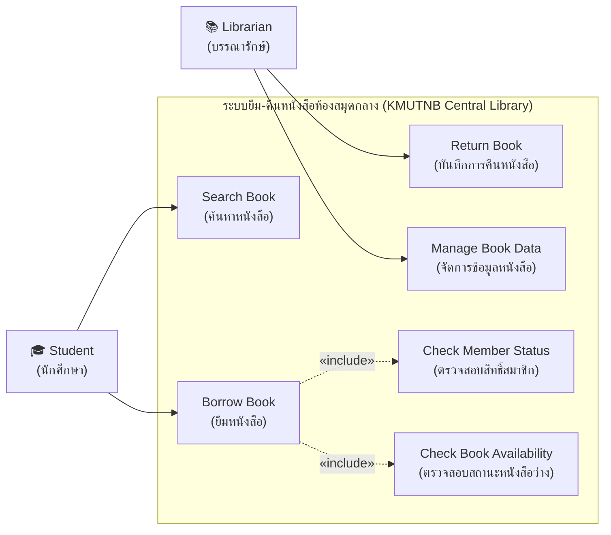

# 📚 การบ้าน Use Case Diagram: ระบบห้องสมุดกลาง (KMUTNB Central Library System)

> **วิชา:** 080203914 วิศวกรรมซอฟต์แวร์ (Software Engineering)  
> **ที่มา:** การบ้านในชั้นเรียนและการบรรยายสดเรื่อง Use Case Diagram (อ้างอิงภาพโจทย์ `Screenshot 2026-02-15 181912.png` และคำบรรยายของอาจารย์)

---

## 🎯 โจทย์และข้อกำหนดความต้องการ (Problem Requirements)

มหาวิทยาลัยต้องการพัฒนาระบบยืม-คืนหนังสือห้องสมุดกลาง (Central Library System) โดยมีข้อกำหนดพฤติกรรมของระบบดังนี้:
1. **นักศึกษา (Student):**
   - สามารถค้นหาหนังสือ (`Search Book`) ได้
   - สามารถทำรายการขอยืมหนังสือ (`Borrow Book`) ได้
2. **เจ้าหน้าที่ห้องสมุด / บรรณารักษ์ (Librarian):**
   - สามารถบันทึกการคืนหนังสือ (`Return Book`) ได้
   - สามารถจัดการข้อมูลหนังสือในระบบได้ (`Manage Book Data`: เพิ่ม แก้ไข ลบข้อมูลหนังสือ)
3. **เงื่อนไขสำคัญของระบบ (Business Rules & Constraints):**
   - ก่อนที่การยืมหนังสือ (`Borrow Book`) จะสำเร็จ **ระบบต้องทำการตรวจสอบสิทธิ์สมาชิกของนักศึกษา (`Check Member Status`) เสมอ**
   - ก่อนที่การยืมหนังสือ (`Borrow Book`) จะสำเร็จ **ระบบต้องตรวจสอบสถานะว่าหนังสือเล่มนั้นยังว่างอยู่ (`Check Book Availability`) เสมอ**

---

## 🧭 การวิเคราะห์องค์ประกอบ (Use Case Elements Analysis)

### 1. Actors (ผู้มีปฏิสัมพันธ์ภายนอกระบบ)
- `Student` (นักศึกษา): Human Actor ผู้ใช้งานหลักในการค้นหาและยืมหนังสือ
- `Librarian` (บรรณารักษ์ / เจ้าหน้าที่ห้องสมุด): Human Actor ผู้ดูแลระบบในการบันทึกการคืนและบริหารจัดการข้อมูลหนังสือ
- ⚠️ *ข้อห้าม:* ห้ามใส่ `Database` หรือ `Web Server` เป็น Actor เพราะเป็นส่วนประกอบภายในระบบ

### 2. Use Cases (ฟังก์ชันงาน)
- `Search Book` (ค้นหาหนังสือ)
- `Borrow Book` (ยืมหนังสือ)
- `Return Book` (บันทึกการคืนหนังสือ)
- `Manage Book Data` (จัดการข้อมูลหนังสือ: เพิ่ม/แก้ไข/ลบ)
- `Check Member Status` (ตรวจสอบสิทธิ์การยืมของสมาชิก)
- `Check Book Availability` (ตรวจสอบความพร้อมของหนังสือว่าว่างหรือไม่)

### 3. Relationships (ความสัมพันธ์)
- **Association:**
  - `Student` $\longleftrightarrow$ `Search Book`
  - `Student` $\longleftrightarrow$ `Borrow Book`
  - `Librarian` $\longleftrightarrow$ `Return Book`
  - `Librarian` $\longleftrightarrow$ `Manage Book Data`
- **Include (`<<include>>`):**
  - `Borrow Book` $\rightarrow$ `<<include>>` $\rightarrow$ `Check Member Status` (ต้องตรวจสอบสิทธิ์สมาชิกทุกครั้งก่อนยืม)
  - `Borrow Book` $\rightarrow$ `<<include>>` $\rightarrow$ `Check Book Availability` (ต้องตรวจสอบว่าหนังสือว่างทุกครั้งก่อนยืม)
  - *เหตุผล:* เป็นเงื่อนไขบังคับ 100% ที่ต้องทำก่อนการยืมจะสำเร็จสมบูรณ์ จึงต้องใช้ `<<include>>` (ไม่ใช่ `<<extend>>`)

---

## 📊 แผนภาพ Use Case Diagram ที่สมบูรณ์ (Mermaid Diagram)

---

## 🔗 เอกสารเชื่อมโยงในคลัง Wiki
- 📘 [Lecture 4: Use Case Modeling Guide](../../Wiki/01_New_Wiki_68/Lessons/05_Use_Case_Diagrams.md)
- 📚 [Case Study 1: Library System Analysis](../../Wiki/01_New_Wiki_68/Lessons/05_Case_Study_1_Library_System.md)
- 🎙️ [In-Class Lecture Notes (15 ก.ย. 2569)](../../Wiki/01_New_Wiki_68/Lessons/In-Class%20Lecture%20-%20Use%20Case%20Diagram%20&%20System%20Analysis.md)
