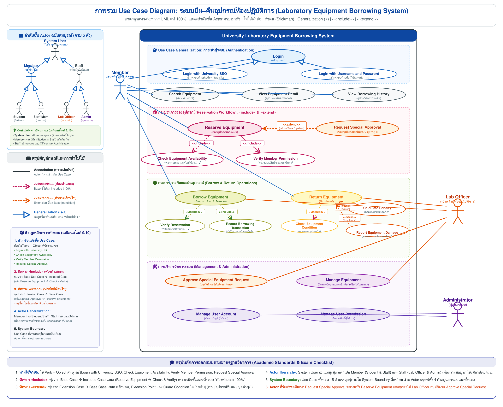
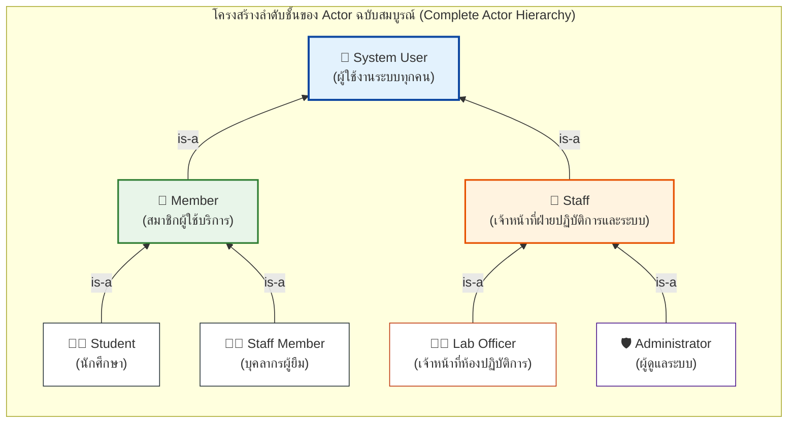
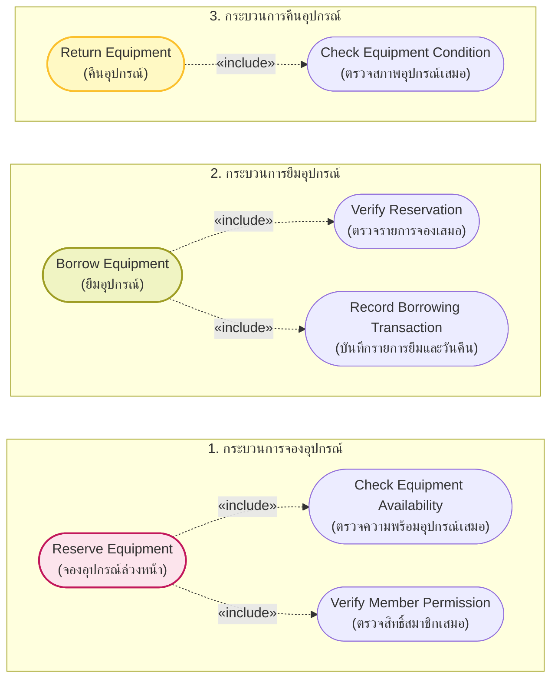
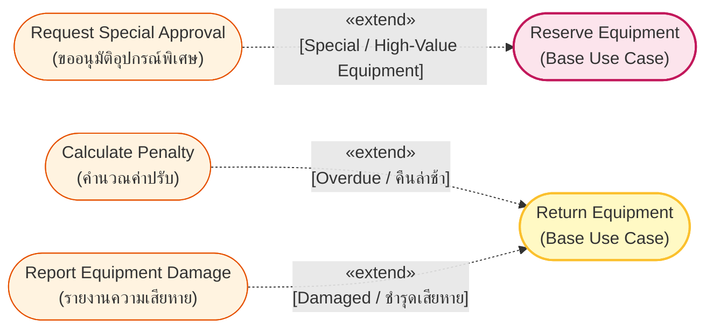
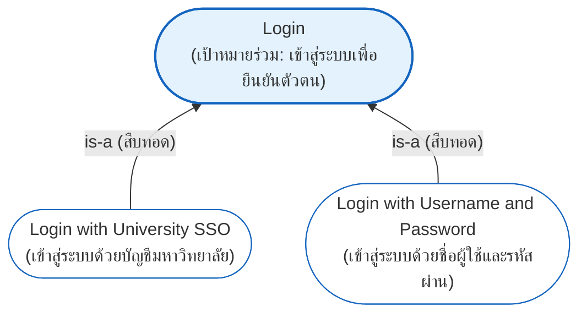
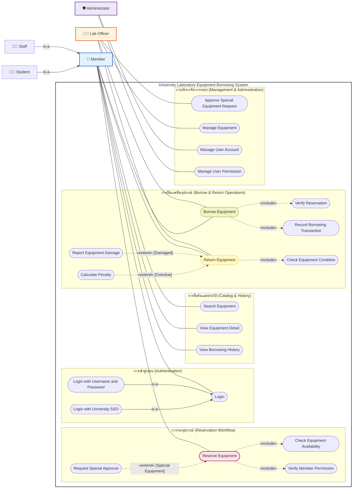
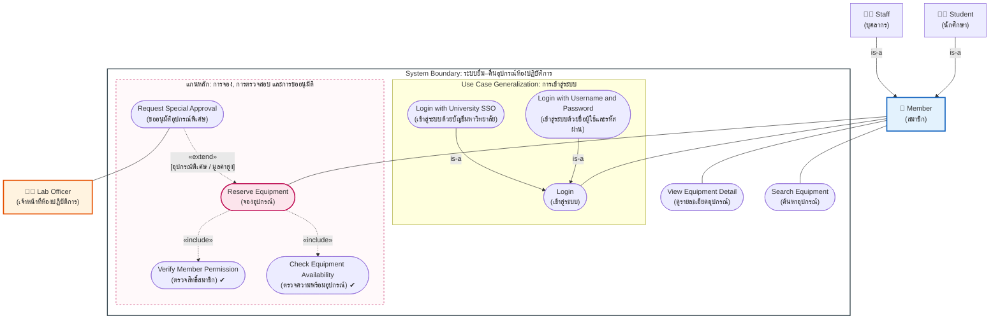

# 📋 เอกสารส่งงาน & เฉลยละเอียด: กรณีศึกษาระบบยืม–คืนอุปกรณ์ห้องปฏิบัติการมหาวิทยาลัย
## University Laboratory Equipment Borrowing System (Case Study 3 Solution)

> [!INFO] 🏷️ ข้อมูลกรณีศึกษาและเอกสารอ้างอิง
> - **วิชา:** วิศวกรรมซอฟต์แวร์ (Software Engineering) ภาคการศึกษา 2568
> - **เอกสารอ้างอิงโจทย์:** `04_Work_and_Homework/Use_Case_Diagram_Workshop/Lab_Equipment_Borrowing_System_Case_Study.pdf` (หรือ `casestudy-usecase.pdf`)
> - **ต้นแบบมาตรฐานการวิเคราะห์:** [[05_Case_Study_2_University_Registration|Case Study 2: University Course Registration System]]
> - **คู่มือทฤษฎี Use Case:** [[05_Use_Case_Diagrams|Lecture 4: Use Case Modeling & Diagrams]]
> - **หมวดหมู่:** 🔧 กรณีศึกษาขั้นสูง ครบทั้ง Actor Generalization, Use Case Generalization, `<<include>>`, และ `<<extend>>`

---

## 📸 แผนภาพเฉลยมาตรฐาน UML (ฉบับสมบูรณ์ — ไม่ใช้คำย่อ)



> [!TIP] 💡 ไฮไลท์การตรวจสอบความถูกต้อง 100% ตามมาตรฐาน UML:
> 1. **ห้ามเขียนย่อชื่อ Use Case:** ทุก Use Case ระบุชื่อเต็มด้วยโครงสร้าง **Verb + Object** (เช่น `Login with University SSO`, `Check Equipment Availability`, `Verify Member Permission`, `Request Special Approval`)
> 2. **Actor เป็นรูปคน (Stickman):** ใช้สัญลักษณ์ตัวคนตามมาตรฐานสากล โดยมี `Member` เป็น Super Actor และมี `Student` กับ `Staff` สืบทอดคุณสมบัติ
> 3. **Generalization (△):** ชี้จากตัวลูก (Sub) ขึ้นหาตัวแม่ (Super) ด้วย **หัวลูกศรสามเหลี่ยมโปร่ง** ทั้งในระดับ Actor และ Use Case
> 4. **`<<include>>` (ต้องทำเสมอ):** เส้นประหัวลูกศรแหลมเปิด พุ่งจาก **Base Case ➔ Included Case** (เช่น `Reserve Equipment` ➔ `Check Equipment Availability` และ `Verify Member Permission`)
> 5. **`<<extend>>` (ทำตามเงื่อนไข):** เส้นประหัวลูกศรแหลมเปิด พุ่งจาก **Extension Case ➔ Base Case** พร้อมระบุเงื่อนไขในวงเล็บ `[condition]`

---

## 📑 สารบัญเนื้อหา (Table of Contents)
1. [โจทย์ของระบบและกฎทางธุรกิจ (System Requirements & Business Rules)](#1-โจทย์ของระบบและกฎทางธุรกิจ)
2. [ขั้นตอนที่ 1: วิเคราะห์ Actor และ Actor Generalization Hierarchy](#2-ขั้นตอนที่-1-วิเคราะห์-actor-และ-actor-generalization-hierarchy)
3. [ขั้นตอนที่ 2: วิเคราะห์ Use Cases ทั้งหมดของระบบ (ห้ามใช้คำย่อ)](#3-ขั้นตอนที่-2-วิเคราะห์-use-cases-ทั้งหมดของระบบ)
4. [ขั้นตอนที่ 3: วิเคราะห์ความสัมพันธ์ «include» (บังคับทำเสมอ 100%)](#4-ขั้นตอนที่-3-วิเคราะห์ความสัมพันธ์-include-บังคับทำเสมอ-100)
5. [ขั้นตอนที่ 4: วิเคราะห์ความสัมพันธ์ «extend» (ทำเพิ่มเติมตามเงื่อนไขเฉพาะ)](#5-ขั้นตอนที่-4-วิเคราะห์ความสัมพันธ์-extend-ทำเพิ่มเติมตามเงื่อนไขเฉพาะ)
6. [ขั้นตอนที่ 5: วิเคราะห์ Use Case Generalization (เป้าหมายเดียวกัน หลากวิธี)](#6-ขั้นตอนที่-5-วิเคราะห์-use-case-generalization-เป้าหมายเดียวกัน-หลากวิธี)
7. [ตารางสรุปความสัมพันธ์ทั้งหมด (Relationship Matrix)](#7-ตารางสรุปความสัมพันธ์ทั้งหมด-relationship-matrix)
8. [ภาพรวม Use Case Diagram ที่สมบูรณ์แบบ (Full System Overview)](#8-ภาพรวม-use-case-diagram-ที่สมบูรณ์แบบ)
9. [แผนภาพแกนหลักตามที่อาจารย์สอนในห้องเรียน (In-Class Focus)](#9-แผนภาพแกนหลักตามที่อาจารย์สอนในห้องเรียน-in-class-focus)
10. [Key Takeaways, กระบวนการวิเคราะห์ 5 ขั้นตอน และ 4 คำถามชวนคิด](#10-key-takeaways-กระบวนการวิเคราะห์-5-ขั้นตอน-และ-4-คำถามชวนคิด)

---

## 1. โจทย์ของระบบและกฎทางธุรกิจ

*📄 อ้างอิงเอกสารโจทย์ `Lab_Equipment_Borrowing_System_Case_Study.pdf`*

มหาวิทยาลัยต้องการพัฒนา **ระบบยืม–คืนอุปกรณ์ห้องปฏิบัติการ (University Laboratory Equipment Borrowing System)** เพื่อจัดการอุปกรณ์ เช่น กล้องถ่ายภาพ, เครื่องวัดไฟฟ้า, ชุดไมโครคอนโทรลเลอร์, Notebook, เครื่องมือช่าง และอุปกรณ์เฉพาะทาง:

### 1.1 ความต้องการของระบบ (System Requirements)
1. **กลุ่มผู้ใช้บริการ:** ประกอบด้วย **นักศึกษา (Student)** และ **บุคลากรของมหาวิทยาลัย (Staff)** ซึ่งทั้งสองกลุ่มถือเป็น **สมาชิก (Member)** ของระบบ
2. **การเข้าสู่ระบบ:** สมาชิกทุกคนต้องเข้าสู่ระบบก่อนใช้งาน โดยรองรับ 2 ช่องทาง คือ เข้าสู่ระบบด้วยบัญชีมหาวิทยาลัย (`Login with University SSO`) หรือเข้าสู่ระบบด้วยชื่อผู้ใช้และรหัสผ่าน (`Login with Username and Password`)
3. **การสืบค้นและตรวจสอบ:** สมาชิกสามารถค้นหาอุปกรณ์ (`Search Equipment`), ดูรายละเอียดอุปกรณ์ (`View Equipment Detail`), ตรวจสอบสถานะความพร้อมใช้งาน (`Check Equipment Availability`) และดูประวัติการยืมของตนเอง (`View Borrowing History`)
4. **การจองอุปกรณ์ล่วงหน้า:** สมาชิกสามารถจองอุปกรณ์ (`Reserve Equipment`) ได้ โดยระบบต้องตรวจสอบสิทธิ์สมาชิก (`Verify Member Permission`) และตรวจสอบความพร้อมใช้งาน (`Check Equipment Availability`) ทุกครั้ง
5. **อุปกรณ์พิเศษ/มูลค่าสูง:** หากเป็นอุปกรณ์ที่กำหนดให้ต้องได้รับอนุญาตเป็นพิเศษ ระบบจะต้องทำการขออนุมัติอุปกรณ์พิเศษ (`Request Special Approval`) ไปยังเจ้าหน้าที่ห้องปฏิบัติการ (`Lab Officer`) ซึ่งเป็นผู้อนุมัติ (`Approve Special Equipment Request`)
6. **การรับอุปกรณ์ (ยืม):** เมื่อถึงวันนัดหมาย สมาชิกนำหลักฐานมาติดต่อเจ้าหน้าที่เพื่อทำรายการยืม (`Borrow Equipment`) โดยเจ้าหน้าที่ต้องตรวจสอบรายการจอง (`Verify Reservation`) และบันทึกรายการยืมพร้อมกำหนดวันคืน (`Record Borrowing Transaction`)
7. **การส่งคืนอุปกรณ์:** เมื่อนำอุปกรณ์มาคืน เจ้าหน้าที่จะทำรายการคืน (`Return Equipment`) โดยต้องตรวจสอบสภาพอุปกรณ์ (`Check Equipment Condition`) ทุกครั้ง หากคืนล่าช้าจะมีการคำนวณค่าปรับ (`Calculate Penalty`) และหากชำรุดเสียหายจะมีการรายงานความเสียหาย (`Report Equipment Damage`)
8. **การจัดการอุปกรณ์:** เจ้าหน้าที่ห้องปฏิบัติการสามารถจัดการข้อมูลอุปกรณ์ (`Manage Equipment`) เช่น เพิ่ม, แก้ไข หรือปรับปรุงสถานะ
9. **การดูแลระบบ:** ผู้ดูแลระบบ (`Administrator`) สามารถจัดการบัญชีผู้ใช้ (`Manage User Account`) และจัดการสิทธิ์ผู้ใช้งาน (`Manage User Permission`)

### 1.2 เงื่อนไขสำคัญทางธุรกิจ (Business Rules & Constraints)
* **Rule 1 (Authentication Generalization):** การล็อกอินมีเป้าหมายร่วมกันคือการยืนยันตัวตน แต่มี 2 วิธีการดำเนินงานเฉพาะทาง คือ `Login with University SSO` และ `Login with Username and Password`
* **Rule 2 (Mandatory Verification on Reservation):** ทุกครั้งที่สมาชิกกดจองอุปกรณ์ ระบบต้องตรวจสอบความพร้อมใช้งานของอุปกรณ์และตรวจสอบสิทธิ์ของสมาชิกก่อนเสมอ ขาดขั้นตอนใดขั้นตอนหนึ่งไม่ได้ (`<<include>>`)
* **Rule 3 (Special Equipment Approval Extension):** เฉพาะกรณีที่อุปกรณ์มีมูลค่าสูงหรือเป็นอุปกรณ์พิเศษเท่านั้น จึงจะเกิดขั้นตอนการขออนุมัติพิเศษ (`<<extend>> [Special / High-Value Equipment]`)
* **Rule 4 (Mandatory Verification on Borrow & Inspection on Return):** ทุกครั้งที่มีการส่งมอบอุปกรณ์ ต้องตรวจใบจองและบันทึกวันคืนเสมอ (`<<include>>`) และทุกครั้งที่รับคืน ต้องตรวจสภาพอุปกรณ์เสมอ (`<<include>>`)
* **Rule 5 (Penalty & Damage Extensions on Return):** การคำนวณค่าปรับเกิดขึ้นเฉพาะเมื่อคืนอุปกรณ์ล่าช้า (`<<extend>> [Overdue]`) และการรายงานความเสียหายเกิดขึ้นเฉพาะเมื่อพบอุปกรณ์ชำรุด (`<<extend>> [Damaged]`)

---

## 2. ขั้นตอนที่ 1: วิเคราะห์ Actor และ Actor Generalization Hierarchy

### 2.1 รายชื่อ Actors ในระบบ
| Actor | บทบาทในระบบ (Role) | เป้าหมายหลัก (Main Goal) | ประเภท Actor |
|:---|:---|:---|:---|
| **System User** | ผู้ใช้งานระบบทุกคน | เข้าสู่ระบบเพื่อยืนยันตัวตน (Login) | Human (Root Super Actor) |
| **Member** | สมาชิกผู้ใช้บริการ | ค้นหา, จอง, ยืม, คืนอุปกรณ์ และดูประวัติการยืม | Human (Super Actor ฝั่งผู้ยืม) |
| **Student** | นักศึกษา | เข้าใช้งานระบบตามสิทธิ์ของนักศึกษา | Human (Sub-Actor ของ Member) |
| **Staff** | บุคลากรของมหาวิทยาลัย | ยืมอุปกรณ์วิจัยและอุปกรณ์เฉพาะทางเพิ่มเติม | Human (Sub-Actor ของ Member) |
| **Lab Officer** | เจ้าหน้าที่ห้องปฏิบัติการ | ส่งมอบอุปกรณ์, รับคืน, ตรวจสภาพ, อนุมัติคำขอพิเศษ และจัดการอุปกรณ์ | Human (Sub-Actor ของ Staff / ผู้ปฏิบัติงาน) |
| **Administrator** | ผู้ดูแลระบบ | จัดการบัญชีผู้ใช้ และกำหนดสิทธิ์การเข้าใช้งานในระบบ | Human (Sub-Actor ของ Staff / ผู้ดูแลระบบ) |

---

### 2.2 โครงสร้างลำดับชั้นของ Actor (Complete Actor Generalization Hierarchy)

ในการออกแบบระบบจริงตามหลักวิศวกรรมซอฟต์แวร์ (เทียบเท่าสไลด์หน้า 2/10 และ 6/10 ของ [[05_Case_Study_2_University_Registration|Case Study 2: ระบบลงทะเบียนเรียน]]) เราสามารถจัดลำดับชั้นของ Actor ทั้งหมดให้อยู่ในโครงสร้าง Generalization เดียวกันได้อย่างสมบูรณ์:



#### 💡 ประโยชน์เชิงสถาปัตยกรรม (Architectural Benefits):
1. **`System User` เป็นรากฐาน (Root Actor):**
   - ทุกคนที่ต้องเข้าใช้งานระบบ (ทั้งนักศึกษา, อาจารย์, เจ้าหน้าที่ห้องแล็บ และแอดมิน) ถือเป็น `System User`
   - ทำให้ Use Case พื้นฐานอย่าง **`Login` (และ Logout)** สามารถเชื่อมโยงเข้ากับ `System User` เพียงเส้นเดียว ทุกคนจะได้รับสิทธิ์การล็อกอินโดยอัตโนมัติ ไม่ต้องลากเส้น Association ซ้ำซ้อนถึง 5 เส้น!
2. **`Member` รวบรวมฝั่งผู้ใช้บริการ (Borrowing Operations):**
   - ทั้ง `Student` และ `Staff Member` สืบทอดมาจาก `Member` ทำให้ Use Cases หลักอย่าง `Search Equipment`, `Reserve Equipment`, `Borrow Equipment`, `Return Equipment` ผูกกับ `Member` เพียงจุดเดียว
3. **`Staff` รวบรวมฝั่งเจ้าหน้าที่ดำเนินงาน (Operational & Administrative Roles):**
   - ทั้ง **`Lab Officer` (เจ้าหน้าที่ห้องแล็บ)** และ **`Administrator` (ผู้ดูแลระบบ)** ต่างมีสถานะเป็นบุคลากรของมหาวิทยาลัย (`Staff`) ที่ปฏิบัติหน้าที่ดูแลระบบและให้บริการ
   - ในแผนภาพของอาจารย์บนกระดาน อาจารย์จึงได้เขียนกำกับว่า `Staff` หรือ `Lab Officer` สามารถเชื่อมกับ Use Case การอนุมัติ (`Approval`) ได้ เพราะเจ้าหน้าที่ห้องแล็บก็คือบุคลากรฝ่ายสนับสนุนของมหาวิทยาลัยนั่นเอง

---

## 3. ขั้นตอนที่ 2: วิเคราะห์ Use Cases ทั้งหมดของระบบ

> [!IMPORTANT] 📌 กฎเหล็ก: ห้ามเขียนย่อชื่อ Use Case!
> ชื่อ Use Case ทุกตัวต้องขึ้นต้นด้วย **คำกริยา (Verb) ตามด้วยกรรม/ส่วนขยาย (Object)** อย่างชัดเจนเสมอ เช่น:
> - ❌ `SSO` ➔ ✔️ `Login with University SSO`
> - ❌ `UP` ➔ ✔️ `Login with Username and Password`
> - ❌ `Check` ➔ ✔️ `Check Equipment Availability`
> - ❌ `Verify` ➔ ✔️ `Verify Member Permission`
> - ❌ `Reserve` ➔ ✔️ `Reserve Equipment`
> - ❌ `Approval` ➔ ✔️ `Request Special Approval`

### รายการ Use Cases แบ่งตามหมวดหมู่การทำงาน (Total 15 Use Cases):
1. **หมวดการเข้าสู่ระบบ (Authentication):**
   * `Login` — เข้าสู่ระบบเพื่อยืนยันตัวตน (General Use Case)
   * `Login with University SSO` — เข้าสู่ระบบด้วยบัญชีมหาวิทยาลัย (Specialized Use Case)
   * `Login with Username and Password` — เข้าสู่ระบบด้วยชื่อผู้ใช้และรหัสผ่าน (Specialized Use Case)
2. **หมวดการสืบค้นและตรวจสอบ (Search & Inquiry):**
   * `Search Equipment` — ค้นหาอุปกรณ์ตามประเภท รหัส หรือชื่อ
   * `View Equipment Detail` — ดูรายละเอียด สถานที่จัดเก็บ และคุณสมบัติ
   * `Check Equipment Availability` — ตรวจสอบสถานะความพร้อมใช้งาน (ว่าง/ถูกจอง/กำลังถูกยืม)
   * `View Borrowing History` — ดูประวัติการยืม–คืนของตนเอง
3. **หมวดการจองอุปกรณ์ (Reservation Workflow):**
   * `Reserve Equipment` — ทำรายการจองอุปกรณ์ล่วงหน้า (Base Use Case)
   * `Verify Member Permission` — ตรวจสอบสิทธิ์ของสมาชิกตามประเภท (Included Use Case)
   * `Request Special Approval` — ยื่นคำขออนุมัติการใช้อุปกรณ์พิเศษ/มูลค่าสูง (Extension Use Case)
   * `Approve Special Equipment Request` — อนุมัติคำขอใช้อุปกรณ์พิเศษ (โดยเจ้าหน้าที่ห้องปฏิบัติการ)
4. **หมวดการยืมและคืนอุปกรณ์ (Borrow & Return Operations):**
   * `Borrow Equipment` — ส่งมอบและทำรายการยืมอุปกรณ์ (Base Use Case)
   * `Verify Reservation` — ตรวจสอบรายการจองก่อนส่งมอบ (Included Use Case)
   * `Record Borrowing Transaction` — บันทึกรายการยืมและกำหนดวันครบกำหนดคืน (Included Use Case)
   * `Return Equipment` — รับคืนอุปกรณ์ (Base Use Case)
   * `Check Equipment Condition` — ตรวจสอบสภาพอุปกรณ์เมื่อรับคืน (Included Use Case)
   * `Calculate Penalty` — คำนวณค่าปรับกรณีส่งคืนเกินกำหนดเวลา (Extension Use Case)
   * `Report Equipment Damage` — บันทึกรายงานความเสียหายของอุปกรณ์ (Extension Use Case)
5. **หมวดการบริหารจัดการระบบ (Management & Administration):**
   * `Manage Equipment` — จัดการข้อมูลอุปกรณ์ในระบบ (เพิ่ม/แก้ไข/ปรับปรุงสถานะ)
   * `Manage User Account` — จัดการบัญชีผู้ใช้งานระบบ
   * `Manage User Permission` — กำหนดและจัดการสิทธิ์ผู้ใช้งาน

---

## 4. ขั้นตอนที่ 3: วิเคราะห์ความสัมพันธ์ «include» (บังคับทำเสมอ 100%)

ความสัมพันธ์แบบ `<<include>>` แสดงถึงพฤติกรรมย่อยที่ Use Case หลัก **ต้องเรียกใช้เสมอ 100%** หากขาดพฤติกรรมนี้ Use Case หลักจะไม่สามารถทำงานสำเร็จได้



### เหตุผลและหลักการของ `<<include>>`:
1. **ต้องเกิดขึ้นเสมอ 100%:** ทุกครั้งที่สมาชิกกดจองอุปกรณ์ (`Reserve Equipment`) ระบบจะยืนยันการจองไม่ได้เลย หากยังไม่ได้ตรวจว่าอุปกรณ์ว่างจริงหรือไม่ และผู้ใช้มีสิทธิ์ยืมอุปกรณ์นั้นหรือไม่
2. **Reuse พฤติกรรมร่วม:** พฤติกรรมการตรวจความพร้อมของอุปกรณ์ (`Check Equipment Availability`) สามารถถูกนำไปใช้ซ้ำได้ทั้งในการสืบค้นทั่วไปและการยืนยันการจอง
3. **ทิศทางลูกศร:** ชี้จาก **Base Use Case ──[«include»]──> Included Use Case** เสมอ

---

## 5. ขั้นตอนที่ 4: วิเคราะห์ความสัมพันธ์ «extend» (ทำเพิ่มเติมตามเงื่อนไขเฉพาะ)

ความสัมพันธ์แบบ `<<extend>>` แสดงถึงพฤติกรรมส่วนขยายที่จะทำงาน **เฉพาะเมื่อตรงตามเงื่อนไขที่กำหนด (Guard Condition)** เท่านั้น ในสภาวะปกติ Base Use Case สามารถทำงานสำเร็จได้โดยไม่ต้องเรียกใช้ Extension



### เหตุผลและหลักการของ `<<extend>>`:
1. **เกิดขึ้นเฉพาะบางสถานการณ์ (Conditional Behavior):** ในการจองอุปกรณ์ทั่วไป สมาชิกสามารถจองสำเร็จได้ทันที แต่ถ้าอุปกรณ์นั้นเข้าเงื่อนไข `[Special / High-Value Equipment]` ระบบจึงจะขยายการทำงานไปขออนุมัติ
2. **เงื่อนไขการขยาย (Extension Points & Guard Conditions):**
   * เกิดขึ้นเมื่อ: `[Special / High-Value Equipment]` ➔ ขยายไปยัง `Request Special Approval`
   * เกิดขึ้นเมื่อ: `[Overdue / คืนล่าช้า]` ➔ ขยายไปยัง `Calculate Penalty`
   * เกิดขึ้นเมื่อ: `[Damaged / ชำรุดเสียหาย]` ➔ ขยายไปยัง `Report Equipment Damage`
3. **Base Use Case สมบูรณ์ได้ด้วยตนเอง:** การยืม-คืนตามปกติส่วนใหญ่จะเสร็จสิ้นโดยไม่มีค่าปรับและไม่มีความเสียหาย
4. **ทิศทางลูกศร:** ชี้จาก **Extension Use Case ──[«extend»]──> Base Use Case** เสมอ

---

## 6. ขั้นตอนที่ 5: วิเคราะห์ Use Case Generalization (เป้าหมายเดียวกัน หลากวิธี)

Use Case Generalization ใช้เมื่อ Use Case มี **เป้าหมายเดียวกัน (Same Goal)** แต่มี **วิธีการดำเนินการหรืออัลกอริทึมที่แตกต่างกันเฉพาะทาง (Specialized Variants)**:



* **เป้าหมายร่วม (General Goal):** สมาชิกต้องการเข้าสู่ระบบเพื่อยืนยันตัวตน (`Login`)
* **วิธีการเฉพาะทาง (Specialized Methods):**
  1. `Login with University SSO` (ผ่าน Identity Provider ของมหาวิทยาลัย)
  2. `Login with Username and Password` (ผ่านฐานข้อมูลบัญชีผู้ใช้ของระบบโดยตรง)
* **สัญลักษณ์:** เส้นทึบปลายลูกศรเป็น **หัวสามเหลี่ยมโปร่ง (△)** ชี้จากตัวลูกขึ้นหาตัวแม่

---

## 7. ตารางสรุปความสัมพันธ์ทั้งหมด (Relationship Matrix)

| ประเภทความสัมพันธ์ | Use Case ต้นทาง (From) | Use Case ปลายทาง (To) | เหตุผลและเงื่อนไข (Meaning / Reason) |
|:---|:---|:---|:---|
| **Actor Generalization** | `Student` | `Member` | `Student is-a Member` (สืบทอดสิทธิ์การใช้งานทั่วไป) |
| **Actor Generalization** | `Staff` | `Member` | `Staff is-a Member` (สืบทอดสิทธิ์การใช้งานทั่วไป) |
| **Use Case Generalization** | `Login with University SSO` | `Login` | รูปแบบการเข้าสู่ระบบด้วย Single Sign-On |
| **Use Case Generalization** | `Login with Username and Password` | `Login` | รูปแบบการเข้าสู่ระบบด้วยชื่อผู้ใช้และรหัสผ่าน |
| **`<<include>>`** | `Reserve Equipment` | `Check Equipment Availability` | ต้องตรวจความพร้อมของอุปกรณ์เสมอทุกครั้งที่จอง |
| **`<<include>>`** | `Reserve Equipment` | `Verify Member Permission` | ต้องตรวจสิทธิ์ของสมาชิกเสมอทุกครั้งที่จอง |
| **`<<extend>>`** | `Request Special Approval` | `Reserve Equipment` | ทำเมื่อ `[Special / High-Value Equipment]` เท่านั้น |
| **`<<include>>`** | `Borrow Equipment` | `Verify Reservation` | เจ้าหน้าที่ต้องตรวจสอบใบจองก่อนส่งมอบอุปกรณ์เสมอ |
| **`<<include>>`** | `Borrow Equipment` | `Record Borrowing Transaction` | ต้องบันทึกรายการยืมและกำหนดวันคืนเสมอ |
| **`<<include>>`** | `Return Equipment` | `Check Equipment Condition` | เจ้าหน้าที่ต้องตรวจสภาพอุปกรณ์ทุกครั้งที่รับคืน |
| **`<<extend>>`** | `Calculate Penalty` | `Return Equipment` | ทำเมื่อ `[Overdue / คืนอุปกรณ์เกินกำหนด]` เท่านั้น |
| **`<<extend>>`** | `Report Equipment Damage` | `Return Equipment` | ทำเมื่อ `[Damaged / ตรวจพบอุปกรณ์ชำรุดเสียหาย]` เท่านั้น |

---

## 8. ภาพรวม Use Case Diagram ที่สมบูรณ์แบบ



---

## 9. แผนภาพแกนหลักตามที่อาจารย์สอนในห้องเรียน (In-Class Focus)

ในห้องเรียน อาจารย์ได้เน้นย้ำจุดตัดคะแนนสำคัญ 4 ประการบนกระดาน โดยเขียนสรุปแบบย่อไว้ดังนี้:
- กล่อง Generalization ของ Login: `SSO` และ `UP` พุ่งเข้าหา `Login`
- กล่อง Core: `Reserve Equipment` พุ่งไปหา `Check Equipment Availability` และ `Verify Member Permission` ด้วย `<<include>>`
- ส่วนต่อขยาย: `Request Special Approval` พุ่งขึ้นหา `Reserve Equipment` ด้วย `<<extend>>`
- ตัวคนด้านขวา: `Lab Officer` เชื่อมโยงกับ `Approval`

เมื่อแปลงเป็น **ชื่อทางการแบบไม่ย่อ** ตามข้อกำหนดทางวิชาการ:



---

## 10. Key Takeaways, กระบวนการวิเคราะห์ 5 ขั้นตอน และ 4 คำถามชวนคิด

### 10.1 สรุป 3 แนวคิดสำคัญที่ต้องจำให้แม่น
1. **`<<include>>` (พฤติกรรมบังคับทำเสมอ 100%):**
   * *ตัวอย่าง:* `Reserve Equipment` ➔ `Check Equipment Availability`, `Verify Member Permission`
   * *คีย์เวิร์ด:* "งานหลักจะสำเร็จไม่ได้ หากไม่มีพฤติกรรมนี้"
2. **`<<extend>>` (พฤติกรรมเพิ่มเติมตามเงื่อนไขเฉพาะ):**
   * *ตัวอย่าง:* `Request Special Approval` ➔ `Reserve Equipment` `[Special Equipment]`
   * *คีย์เวิร์ด:* "เกิดขึ้นเฉพาะบางสถานการณ์ และต้องมีเงื่อนไข `[condition]` กำกับเสมอ"
3. **`Generalization / Specialization` (ความสัมพันธ์แบบ is-a):**
   * *ตัวอย่าง Actor:* `Student is-a Member`, `Staff is-a Member`
   * *ตัวอย่าง Use Case:* `Login with University SSO is a kind of Login`
   * *คีย์เวิร์ด:* "เป้าหมายเดียวกันแต่มีหลายวิธีดำเนินงาน ใช้ลูกศรหัวสามเหลี่ยมโปร่ง (△)"

---

### 10.2 กระบวนการวิเคราะห์ 5 ขั้นตอนสู่ไดอะแกรมคุณภาพ
```text
[1. Requirements]  ➜ ทำความเข้าใจความต้องการและเงื่อนไขของระบบ
       ↓
[2. Actors]        ➜ ระบุผู้ใช้ทั้งหมด และวิเคราะห์ Actor Generalization
       ↓
[3. Use Cases]     ➜ กำหนด Goal ของผู้ใช้ (Verb + Object ห้ามย่อ!)
       ↓
[4. Relationships] ➜ วิเคราะห์ include, extend, และ generalization
       ↓
[5. Use Case Dia]  ➜ วาดแผนภาพที่ชัดเจน ถูกหลัก UML และตรวจสอบเส้นความสัมพันธ์
```

---

### 10.3 4 คำถามชวนคิดสำหรับตรวจสอบความถูกต้องก่อนส่งงาน
> [!TIP] 4 คำถามตรวจสอบความถูกต้อง:
> 1. **อะไรคือพฤติกรรมที่ต้องเกิดทุกครั้ง?** ➔ คำตอบคือ `<<include>>` (พุ่งจาก Base ➔ Included)
> 2. **อะไรคือพฤติกรรมที่เกิดเฉพาะบางเงื่อนไข?** ➔ คำตอบคือ `<<extend>>` (พุ่งจาก Extension ➔ Base พร้อม `[condition]`)
> 3. **Actor ใดมีความสัมพันธ์แบบ is-a หรือใช้สิทธิ์ร่วมกัน?** ➔ คำตอบคือ `Actor Generalization` (พุ่งจาก Sub ➔ Super ด้วย △)
> 4. **Use Case ใดมีเป้าหมายเดียวกันแต่มีหลายวิธีดำเนินการ?** ➔ คำตอบคือ `Use Case Generalization` (พุ่งจาก Sub ➔ Super ด้วย △)

---

## 🔗 เอกสารที่เกี่ยวข้อง
- 📘 [[05_Case_Study_2_University_Registration|เวิร์กช็อปก่อนหน้า: ระบบลงทะเบียนเรียน (University Course Registration)]]
- 📚 [[05_Case_Study_1_Library_System|เวิร์กช็อปพื้นฐาน: ระบบห้องสมุด (Library System)]]
- 🎓 [[05_Use_Case_Diagrams|Lecture 4: สรุปทฤษฎี Use Case Diagram ฉบับเต็ม]]
- 🌐 [[Software Engineering Index|กลับสู่หน้ารวมดัชนี Software Engineering Wiki]]
