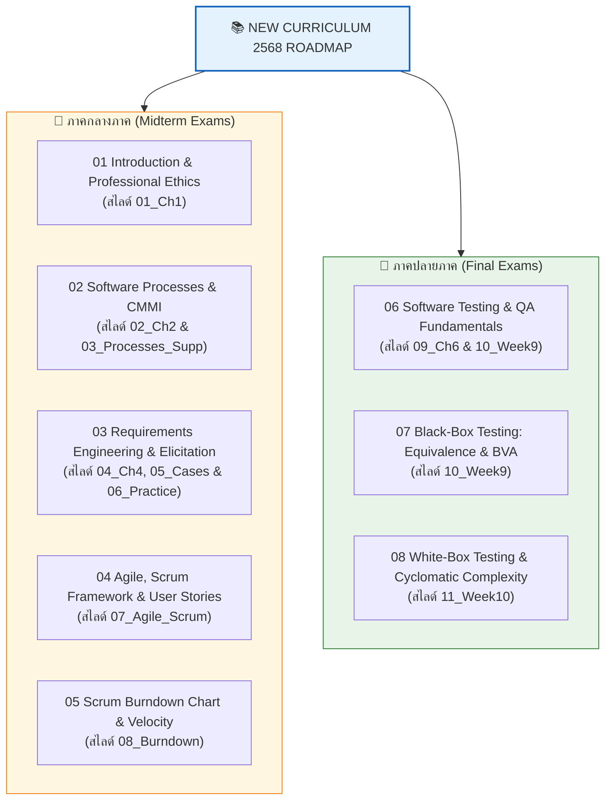
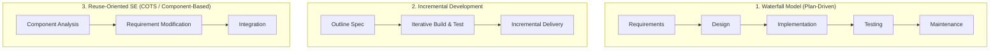
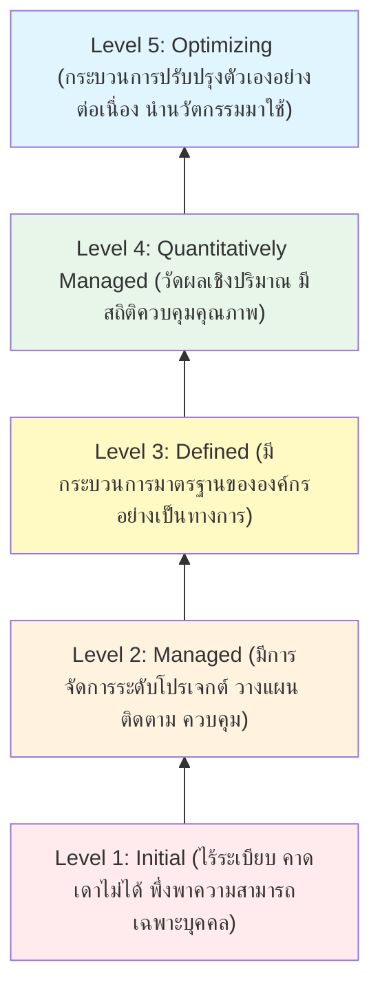
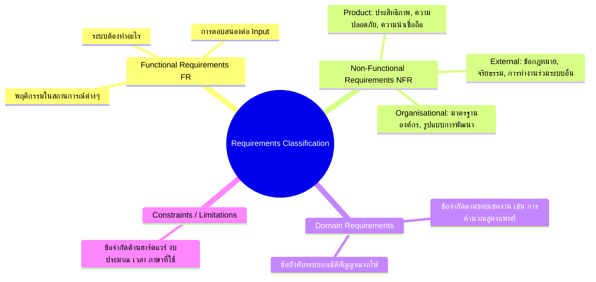
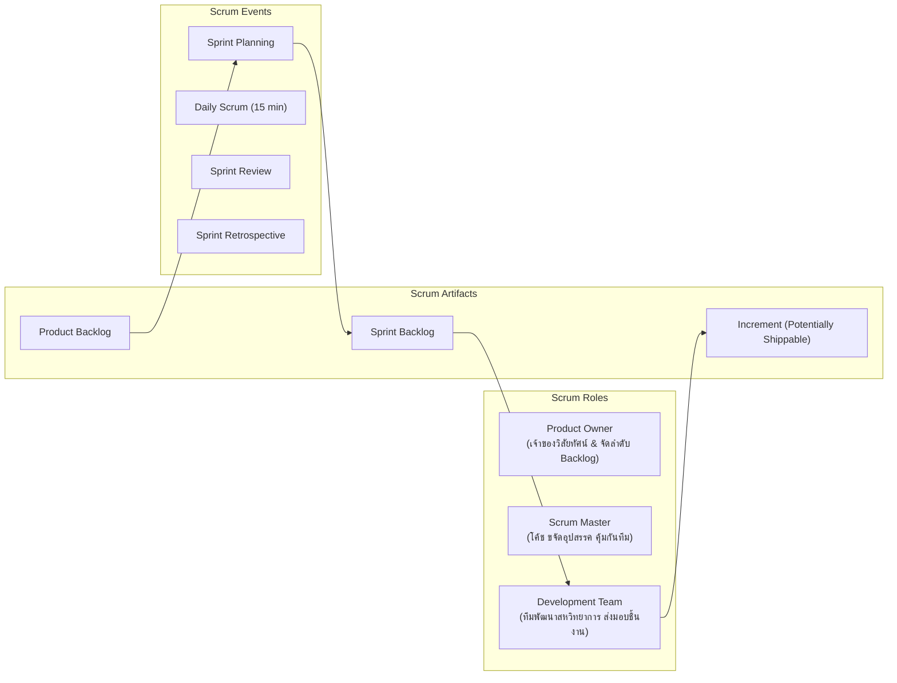
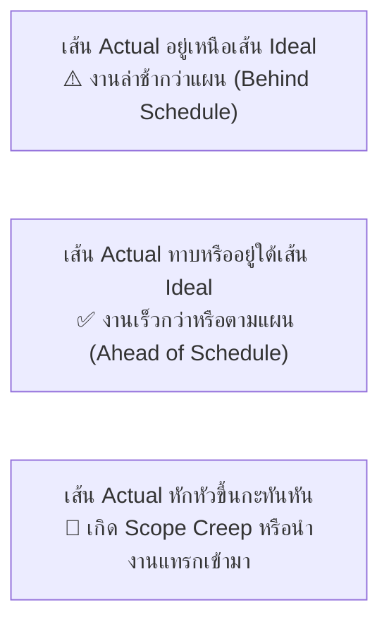
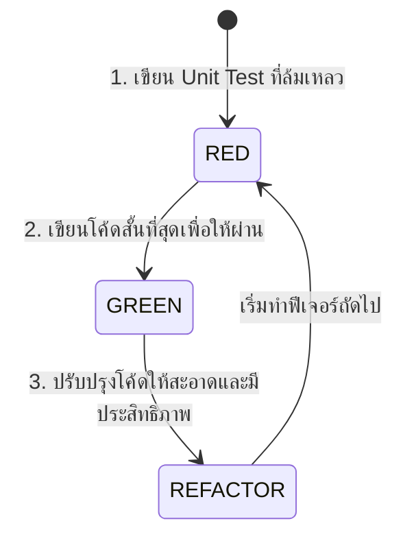

---
tags:
  - software-engineering
  - new-curriculum-68
  - master-wiki
  - midterm
  - final
created: 2026-09-08
updated: 2026-09-08
curriculum: New 2568
type: master-wiki
aliases:
  - 01_New_Curriculum_68_Wiki
  - New Curriculum 68 Master Wiki
  - Master Wiki 68
---

# 🌟 Software Engineering Master Wiki: หลักสูตรใหม่ 2568 (New Curriculum 68)

> [!IMPORTANT] เอกสารสรุปหลักสูตรปัจจุบัน (Academic Year 2568)
> สกัดและเรียบเรียงเนื้อหาจากคลังสไลด์เรียนล่าสุด **`01_New_Slides_68/` (ลำดับ 01 - 11)**, โจทย์ข้อสอบจริงในชั้นเรียน `06_Practice_ReqEng.pdf`, แบบฝึกหัด Burndown Chart, และสไลด์การทดสอบซอฟต์แวร์สัปดาห์ที่ 9-10 อย่างสมบูรณ์ 100% เหมาะสำหรับเตรียมสอบกลางภาค (Midterm) และปลายภาค (Final)

---

## 📑 สารบัญเนื้อหา (Table of Contents)

1. [หมวดที่ 1: บทนำ จรรยาบรรณวิชาชีพ และระบบพื้นฐาน (Intro & Ethics)](#หมวดที่-1-บทนำ-จรรยาบรรณวิชาชีพ-และระบบพื้นฐาน)
2. [หมวดที่ 2: กระบวนการพัฒนาซอฟต์แวร์ และแบบจำลอง CMMI (Software Processes)](#หมวดที่-2-กระบวนการพัฒนาซอฟต์แวร์-และแบบจำลอง-cmmi)
3. [หมวดที่ 3: วิศวกรรมความต้องการ และกรณีศึกษาเชิงปฏิบัติ (Requirements Engineering)](#หมวดที่-3-วิศวกรรมความต้องการ-และกรณีศึกษาเชิงปฏิบัติ)
4. [หมวดที่ 4: ระเบียบวิธีแบบเอไจล์ และ Scrum Framework (Agile & Scrum)](#หมวดที่-4-ระเบียบวิธีแบบเอไจล์-และ-scrum-framework)
5. [หมวดที่ 5: การวิเคราะห์กราฟ Burndown และการวัดความเร็วทีม (Burndown Chart & Velocity)](#หมวดที่-5-การวิเคราะห์กราฟ-burndown-และการวัดความเร็วทีม)
6. [หมวดที่ 6: การทดสอบซอฟต์แวร์และการประกันคุณภาพ (Software Testing & QA)](#หมวดที่-6-การทดสอบซอฟต์แวร์และการประกันคุณภาพ)
7. [หมวดที่ 7: การทดสอบกล่องขาว และ Cyclomatic Complexity Metrics (White-Box Testing)](#หมวดที่-7-การทดสอบกล่องขาว-และ-cyclomatic-complexity-metrics)
8. [ตารางสรุปสูตรและคีย์เวิร์ดเตรียมสอบ (Quick Exam Cheatsheet)](#ตารางสรุปสูตรและคีย์เวิร์ดเตรียมสอบ)

---

# หมวดที่ 1: บทนำ จรรยาบรรณวิชาชีพ และระบบพื้นฐาน

*📄 แหล่งอ้างอิง: `01_Ch1_Introduction.pdf`*

### 1.1 นิยามและแก่นแท้ของวิศวกรรมซอฟต์แวร์
* **ซอฟต์แวร์ (Software):** ไม่ได้หมายถึงเฉพาะตัวโปรแกรมหรือซอร์สโค้ด แต่ประกอบด้วย **โปรแกรมคอมพิวเตอร์และเอกสารที่เกี่ยวข้องทั้งหมด (Computer programs and associated documentation)** เช่น ข้อกำหนดความต้องการ (Requirements), โมเดลการออกแบบ (Design models) และคู่มือผู้ใช้
* **วิศวกรรมซอฟต์แวร์ (Software Engineering - SE):** คือ **สาขาวิชาวิศวกรรมที่เกี่ยวข้องกับทุกแง่มุมของการผลิตซอฟต์แวร์** ตั้งแต่สเปกเบื้องต้นไปจนถึงการบำรุงรักษาและวิวัฒนาการระบบ (Evolution)
* **ความแตกต่างหลัก:**
  * *Computer Science:* มุ่งเน้นทฤษฎีและพื้นฐานขั้นตอนวิธี (Theory & Fundamentals)
  * *Software Engineering:* มุ่งเน้นการสร้างระบบซอฟต์แวร์ที่ใช้งานได้จริงอย่างคุ้มค่าต้นทุน (Practicalities of Developing & Delivering Useful Software)
  * *System Engineering:* ครอบคลุมทั้งระบบ (Hardware, Software, People, Process)

### 1.2 4 คุณลักษณะสำคัญของซอฟต์แวร์ที่ดี (4 Essential Attributes of Good Software)
| คุณลักษณะ (Attribute) | ความหมายและหัวใจสำคัญ | ตัวอย่างข้อบกพร่องที่พบบ่อย |
|:---|:---|:---|
| **1. Maintainability** (บำรุงรักษาง่าย) | ซอฟต์แวร์ต้องถูกเขียนให้อ่านง่าย แก้ไขง่าย เพื่อรองรับการเปลี่ยนแปลงในอนาคต | โค้ด Spaghetti, ไม่มีเอกสาร, ผูกมัดแน่น (Tight Coupling) |
| **2. Dependability & Security** (พึ่งพาได้ ปลอดภัย) | ระบบมีความน่าเชื่อถือ ทนทานต่อข้อผิดพลาด (Reliability) ปลอดภัย และไม่สร้างความเสียหาย | ระบบล่มบ่อย, ข้อมูลรั่วไหล, รวนเมื่อกรอกข้อมูลผิด |
| **3. Efficiency** (มีประสิทธิภาพ) | ไม่สิ้นเปลืองทรัพยากร ทั้ง Memory, CPU cycle, พื้นที่จัดเก็บ และ Bandwidth | โหลดช้า, Memory Leak, กราฟิกหน่วงค้าง |
| **4. Acceptability** (เป็นที่ยอมรับของผู้ใช้) | ใช้งานง่าย เข้าใจได้ (Usable) สอดคล้องกับพฤติกรรมผู้ใช้ และเข้ากันได้กับระบบเดิม | UI ใช้งานยาก, ฟังก์ชันไม่ตรงตามงานจริง |

### 1.3 4 กิจกรรมพื้นฐานในกระบวนการผลิตซอฟต์แวร์ (4 Fundamental Process Activities)
1. **Software Specification:** การกำหนดว่าซอฟต์แวร์ต้องทำอะไรและมีข้อจำกัดอะไรบ้าง
2. **Software Development (Design & Implementation):** การออกแบบสถาปัตยกรรมและการเขียนโปรแกรม
3. **Software Validation:** การตรวจสอบความถูกต้องเพื่อให้มั่นใจว่าเป็นไปตามที่ลูกค้าต้องการ
4. **Software Evolution:** การปรับปรุงเปลี่ยนแปลงซอฟต์แวร์เพื่อตอบสนองความต้องการใหม่

### 1.4 ประเภทผลิตภัณฑ์ซอฟต์แวร์ (Generic vs Customized)
* **Generic Products (ผลิตภัณฑ์ทั่วไป):** พัฒนาขึ้นโดยองค์กรเดี่ยวเพื่อวางขายสู่ตลาดเปิด (เช่น Microsoft Word, Photoshop, Mobile Apps ทั่วไป) โดย *บริษัทผู้พัฒนาเป็นผู้กำหนดสเปกเอง*
* **Customized Products (ผลิตภัณฑ์สั่งทำเฉพาะ):** พัฒนาขึ้นตามสัญญาเพื่อตอบโจทย์ลูกค้าเฉพาะราย (เช่น ระบบ ERP ของโรงพยาบาล, ระบบควบคุมจราจรทางอากาศ) โดย *ลูกค้าเป็นผู้กำหนดสเปก*

### 1.5 จรรยาบรรณวิศวกรซอฟต์แวร์ (ACM/IEEE Code of Ethics - 8 Principles)
วิศวกรซอฟต์แวร์ต้องมีความรับผิดชอบมากกว่าแค่การเขียนโค้ดตามสั่ง ต้องยึดมั่นในจรรยาบรรณ 8 ข้อ:
1. **PUBLIC:** ปฏิบัติงานเพื่อประโยชน์สาธารณะเป็นหลัก
2. **CLIENT AND EMPLOYER:** ทำงานด้วยความซื่อสัตย์เพื่อผลประโยชน์สูงสุดของลูกค้าและนายจ้าง
3. **PRODUCT:** มั่นใจว่าผลิตภัณฑ์มีมาตรฐานระดับมืออาชีพสูงสุดเท่าที่เป็นไปได้
4. **JUDGMENT:** ธำรงไว้ซึ่งความเป็นอิสระและสุจริตในการตัดสินใจทางวิชาชีพ
5. **MANAGEMENT:** ผู้จัดการต้องส่งเสริมแนวทางการพัฒนาซอฟต์แวร์ที่มีจริยธรรม
6. **PROFESSION:** พัฒนาความน่าเชื่อถือและชื่อเสียงของวิชาชีพ
7. **COLLEAGUES:** ยุติธรรมและให้การสนับสนุนเพื่อนร่วมงาน
8. **SELF:** พัฒนาและเรียนรู้อย่างต่อเนื่องตลอดชีวิต

### 1.6 กรณีศึกษามาตรฐาน (Standard Case Studies)
* **Personal Insulin Pump System:** ระบบสมองกลฝังตัวด้านการแพทย์ (Safety-critical system) ที่ต้องเชื่อถือได้ 100% ห้ามทำงานผิดพลาด เพราะส่งผลต่อชีวิตผู้ป่วยโดยตรง
* **Mentcare (Mental Health Clinic):** ระบบเวชระเบียนคลินิกสุขภาพจิต เน้นความเป็นส่วนตัว (Privacy & Confidentiality) และการเข้าถึงข้อมูลเร่งด่วนในภาวะฉุกเฉิน
* **Wilderness Weather Station:** ระบบเก็บข้อมูลสภาพอากาศในพื้นที่ทุรกันดาร ทำงานอัตโนมัติ ทนทานต่อพลังงานจำกัด และสื่อสารผ่านดาวเทียม

---

# หมวดที่ 2: กระบวนการพัฒนาซอฟต์แวร์ และแบบจำลอง CMMI

*📄 แหล่งอ้างอิง: `02_Ch2_SW_Processes.pdf` และ `03_Ch2_Processes_Supplementary_l1.pdf`*

### 2.1 แบบจำลองกระบวนการพัฒนาซอฟต์แวร์ 3 รูปแบบหลัก

| โมเดล (Process Model) | ลักษณะเด่น | ข้อดี (Advantages) | ข้อจำกัด (Disadvantages) | บริบทที่เหมาะสม (Best Fit) |
|:---|:---|:---|:---|:---|
| **Waterfall Model** | แยกขั้นตอนเด็ดขาด ทำทีละเฟสตามลำดับ (Sequential) | วางแผนง่าย มีเอกสารกำกับทุกขั้นตอนชัดเจน | รับมือการเปลี่ยนแปลงยาก ลูกค้าเห็นผลงานช้าสุด | ระบบขนาดใหญ่, สเปกนิ่ง, งานราชการ |
| **Incremental** | แบ่งทำเป็นรอบย่อย ส่งมอบทีละส่วน | ลูกค้าได้ผลงานเร็ว ปรับเปลี่ยนความต้องการได้ง่าย | โครงสร้างระบบอาจเสื่อมถอยหากขาดการ Refactor | ระบบเว็บ/แอปทั่วไป, สเปกเปลี่ยนแปลงบ่อย |
| **Reuse-Oriented** | บูรณาการส่วนประกอบสำเร็จรูป (COTS) | พัฒนาเร็วมาก ลดต้นทุนและความเสี่ยง | ต้องประนีประนอมสเปกตามชิ้นส่วนที่มี ขาดการควบคุม | ระบบ ERP, ระบบมาตรฐานองค์กร |

### 2.2 การรับมือกับการเปลี่ยนแปลง (Coping with Change)
* **Change Anticipation (การคาดการณ์การเปลี่ยนแปลง):** นำเทคนิคเช่น **System Prototyping (การสร้างระบบต้นแบบ)** มาใช้เพื่อทดสอบความต้องการกับผู้ใช้ก่อนเขียนโค้ดจริง
  * *Throw-away Prototyping:* สร้างขึ้นมาเพื่อค้นหาความต้องการแล้วทิ้งไป
  * *Evolutionary Prototyping:* พัฒนาต่อยอดเป็นระบบจริง
* **Change Tolerance (การยอมรับการเปลี่ยนแปลง):** ใช้วิธี **Incremental Delivery** ส่งมอบฟีเจอร์ที่มีมูลค่าสูงสุดให้ลูกค้าก่อน

### 2.3 โมเดลวุฒิภาวะกระบวนการ SEI CMMI (5 Maturity Levels)

---

# หมวดที่ 3: วิศวกรรมความต้องการ และกรณีศึกษาเชิงปฏิบัติ

*📄 แหล่งอ้างอิง: `04_Ch4_Requirements_Engineering.pdf`, `05_Ch4_Requirements_Cases_l2.pdf`, `06_Practice_ReqEng.pdf`*

### 3.1 ระดับของความต้องการ (Requirements Abstraction Levels)
1. **User Requirements:** ข้อความภาษาธรรมชาติและแผนภาพภาพรวม ระบุบริการที่ผู้ใช้คาดหวัง เพื่อให้ลูกค้า/ผู้บริหารเข้าใจ
2. **System Requirements:** รายละเอียดเชิงเทคนิคอย่างเป็นระบบและเจาะลึก กำหนดชัดเจนว่าระบบต้องทำอะไร เป็นสัญญาทางวิศวกรรม

### 3.2 การจำแนกประเภทความต้องการ 4 ด้าน (Sommerville & Exam Standard)

### 3.3 วงจรเกลียวของวิศวกรรมความต้องการ (Spiral RE Process)
1. **Requirements Elicitation & Analysis:** การค้นหา รวบรวม และวิเคราะห์ (Interviews, Ethnography, Scenarios)
2. **Requirements Specification:** การแปลงเป็นเอกสารทางการ (Natural Language, Form-based, Tabular, UML)
3. **Requirements Validation:** การตรวจทานความถูกต้อง (V-C-C-R-V):
   * **Validity:** ตรงกับความต้องการจริงไหม
   * **Consistency:** ขัดแย้งกันเองไหม
   * **Completeness:** ครบถ้วนทุกกรณีไหม
   * **Realism:** ทำได้จริงในงบและเวลาไหม
   * **Verifiability:** ทดสอบหรือวัดผลได้จริงไหม
4. **Requirements Management:** การบริหารจัดการการเปลี่ยนแปลงและ Traceability Matrices

### 3.4 ถอดรหัสชุดโจทย์ฝึกปฏิบัติการ `06_Practice_ReqEng.pdf` (ข้อสอบจริง)
* **กรณีศึกษาคลินิกสุขภาพจิต Mentcare:**
  * *Stakeholders:* แพทย์ (Doctor), พยาบาล (Nurse), เจ้าหน้าที่เวชระเบียน (Receptionist), ผู้ป่วย (Patient), ผู้ดูแลความปลอดภัยระบบ (Security Officer)
  * *Functional Requirement:* ระบบต้องแสดงประวัติการแพ้ยาของผู้ป่วยทันทีที่เปิดดูแฟ้มประวัติ
  * *Non-Functional Requirement:* ข้อมูลเวชระเบียนต้องเข้ารหัสด้วยมาตรฐาน AES-256 และเปิดอ่านได้ภายใน 2 วินาที
  * *Domain Requirement:* การสั่งจ่ายยาที่มีสารเสพติดต้องได้รับการลงนามยืนยันจากแพทย์อาวุโส 2 ท่านเสมอ

### 3.5 คลังแบบจำลอง Use Case Modeling & เวิร์กช็อปภาคปฏิบัติ (2568)
นอกจากการเขียนข้อกำหนด (SRS) แบบข้อความแล้ว การสร้างแบบจำลอง Use Case Diagram เป็นแกนสำคัญของการเปลี่ยน Requirement สู่ภาพรวมระบบ:
* 📘 **บทเรียน Lecture 4 ฉบับสมบูรณ์:** [[05_Use_Case_Diagrams]] (32 สไลด์: Actor, Use Case, include, extend, generalization, Use Case Spec 3 Flows, Traceability)
* 📚 **กรณีศึกษาที่ 1:** [[05_Case_Study_1_Library_System]] (ฝึกวิเคราะห์ Actor, Use Case, และ `<<include>>`)
* 🎓 **กรณีศึกษาที่ 2:** [[05_Case_Study_2_University_Registration]] (เวิร์กช็อปขั้นสูง ครบทั้ง `<<include>>`, `<<extend>>`, และ `Generalization / Specialization`)

---

# หมวดที่ 4: ระเบียบวิธีแบบเอไจล์ และ Scrum Framework

*📄 แหล่งอ้างอิง: `07_Agile_and_Scrum_Framework.pdf`*

### 4.1 Agile Manifesto (4 ค่านิยมหลัก)
> 1. **Individuals and interactions** over processes and tools
> 2. **Working software** over comprehensive documentation
> 3. **Customer collaboration** over contract negotiation
> 4. **Responding to change** over following a plan

### 4.2 Scrum Framework (Roles, Artifacts, Events)

### 4.3 การเขียน User Story ที่ดี (INVEST Criteria)
โครงสร้างมาตรฐาน:
$$\text{"As a } [\text{type of user}], \text{ I want } [\text{an action/goal}] \text{ so that } [\text{a benefit/value}]."$$

* **I - Independent:** เป็นอิสระ ไม่ผูกติดกับ Story อื่น
* **N - Negotiable:** ต่อรองและปรับเปลี่ยนรายละเอียดได้
* **V - Valuable:** มีคุณค่าต่อผู้ใช้หรือธุรกิจอย่างชัดเจน
* **E - Estimable:** ประเมินขนาดและความพยายามได้
* **S - Small:** ขนาดพอดีที่จะทำเสร็จภายใน 1 Sprint
* **T - Testable:** สามารถทดสอบและมี Acceptance Criteria ชัดเจน

---

# หมวดที่ 5: การวิเคราะห์กราฟ Burndown และการวัดความเร็วทีม

*📄 แหล่งอ้างอิง: `08_Scrum_Burndown_Chart.pdf`*

### 5.1 โครงสร้างของ Sprint Burndown Chart
* **แกนนอน (X-axis):** เวลาในการทำงาน (Days in Sprint)
* **แกนตั้ง (Y-axis):** ปริมาณงานที่เหลืออยู่ (Remaining Effort / Story Points / Hours)
* **เส้นอุดมคติ (Ideal Trend Line):** เส้นตรงลากจากจุดเริ่มต้นถึงจุดสิ้นสุด (Zero remaining)
* **เส้นงานจริง (Actual Effort Line):** ปริมาณงานคงเหลือจริงที่บันทึกทุกวันในการประชุม Daily Scrum

### 5.2 การคำนวณ Team Velocity
$$\text{Velocity} = \sum (\text{Story Points ของ User Stories ที่เสร็จสมบูรณ์ตาม DoD ใน 1 Sprint})$$
* **กฎเหล็ก:** นับเฉพาะงานที่ **Done 100%** เท่านั้น งานที่ทำไป 90% จะถูกนับเป็น **0 Story Points** ใน Sprint นั้น

---

# หมวดที่ 6: การทดสอบซอฟต์แวร์และการประกันคุณภาพ

*📄 แหล่งอ้างอิง: `09_Ch6_Software_Testing.pdf` และ `10_Week9_Software_Testing_and_QA.pdf`*

### 6.1 Verification vs Validation (V&V)
* **Verification ("Are we building the product right?"):** การตรวจสอบว่าซอฟต์แวร์ถูกสร้างขึ้นตรงตามข้อกำหนดทางเทคนิคและสเปกหรือไม่
* **Validation ("Are we building the right product?"):** การตรวจสอบว่าซอฟต์แวร์ตรงตามความต้องการและการใช้งานจริงของลูกค้าหรือไม่

### 6.2 ระดับของการทดสอบ (4 Levels of Testing)
1. **Unit Testing:** ทดสอบคลาสหรือฟังก์ชันย่อยเดี่ยวๆ (ใช้นักพัฒนาเป็นผู้เขียน)
2. **Integration Testing:** ทดสอบการส่งข้อมูลและปฏิสัมพันธ์ระหว่างโมดูล
3. **System Testing:** ทดสอบระบบรวมทั้งหมด ทั้งฟังก์ชันและประสิทธิภาพ (NFR)
4. **Acceptance Testing (UAT):** ลูกค้าหรือผู้ใช้ทดสอบด้วยข้อมูลจริงเพื่อลงนามรับมอบ

### 6.3 วงจร Test-Driven Development (TDD)

### 6.4 การออกแบบ Black-Box Test Cases
* **Equivalence Partitioning (EP):** แบ่งข้อมูลนำเข้าออกเป็นกลุ่มสมมูล (Valid Class และ Invalid Class) เพื่อลดจำนวน Test Case โดยเลือกตัวแทนกลุ่มละ 1 ค่า
* **Boundary Value Analysis (BVA):** เจาะจงทดสอบค่าที่ **ขอบเขต** เนื่องจากบั๊กมักเกิดที่จุดเปลี่ยนเงื่อนไข
  * สำหรับเงื่อนไข $1 \le X \le 100$: ค่าที่ต้องทดสอบคือ $0, 1, 2$ (ขอบล่าง) และ $99, 100, 101$ (ขอบบน)

---

# หมวดที่ 7: การทดสอบกล่องขาว และ Cyclomatic Complexity Metrics

*📄 แหล่งอ้างอิง: `11_Week10_Testing_Metrics_Cyclomatic.pdf`*

### 7.1 White-Box Testing และ Control Flow Graph (CFG)
การทดสอบกล่องขาวมุ่งเน้นการตรวจโครงสร้างภายในของโค้ด (Internal logic paths) โดยแปลงโค้ดให้อยู่ในรูป **Control Flow Graph**:
* **Nodes ($N$):** จุดคำสั่ง ลำดับโค้ด หรือเงื่อนไข
* **Edges ($E$):** เส้นเชื่อมทิศทางการไหลของการทำงาน
* **Predicate Nodes ($P$):** โหนดเงื่อนไขที่มีเส้นทางแยกออก $\ge 2$ ทาง (เช่น `if`, `while`, `for`)

### 7.2 สูตรการคำนวณ Cyclomatic Complexity ($V(G)$)
Cyclomatic Complexity บอก **จำนวนเส้นทางอิสระขั้นต่ำ (Basis Paths)** ที่ต้องทดสอบเพื่อให้ครอบคลุมโค้ด 100%:

$$V(G) = E - N + 2$$
$$V(G) = P + 1$$
$$V(G) = \text{จำนวนพื้นที่ปิดและเปิด (Number of Regions: } R\text{)}$$

> [!TIP] ตัวอย่างการคำนวณในการสอบ
> หากโค้ดมีเงื่อนไข `if` 2 ตัว และไม่มีลูปซับซ้อน:
> * $P = 2$
> * $V(G) = 2 + 1 = 3$
> แสดงว่าต้องออกแบบ Test Case อย่างน้อย **3 เส้นทาง** เพื่อทดสอบให้ครอบคลุม Basis Path ทั้งหมด!

---

# ตารางสรุปสูตรและคีย์เวิร์ดเตรียมสอบ

| หัวข้อ | สูตร / คีย์เวิร์ดสำคัญ | ความหมายในการประยุกต์ |
|:---|:---|:---|
| **จรรยาบรรณวิศวกร** | PUBLIC, CLIENT, PRODUCT, JUDGMENT, MANAGEMENT, PROFESSION, COLLEAGUES, SELF | ACM/IEEE 8 Principles |
| **คุณลักษณะซอฟต์แวร์** | Maintainability, Dependability, Efficiency, Acceptability | 4 Attributes of Good Software |
| **การตรวจสอบ RE** | Validity, Consistency, Completeness, Realism, Verifiability | V-C-C-R-V Checklist |
| **เกณฑ์ User Story** | Independent, Negotiable, Valuable, Estimable, Small, Testable | INVEST Template |
| **ความเร็วทีม** | $\sum \text{Story Points of Done Stories}$ | Team Velocity ใน 1 Sprint |
| **ขอบเขตค่าทดสอบ** | $\text{Min}-1, \text{Min}, \text{Min}+1, \text{Max}-1, \text{Max}, \text{Max}+1$ | Boundary Value Analysis |
| **ความซับซ้อนของโค้ด** | $V(G) = E - N + 2 = P + 1 = R$ | McCabe's Cyclomatic Complexity |
