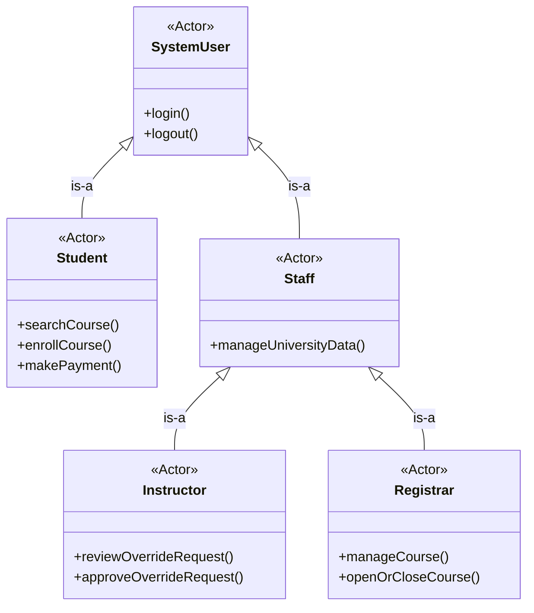
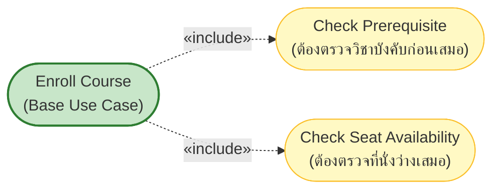
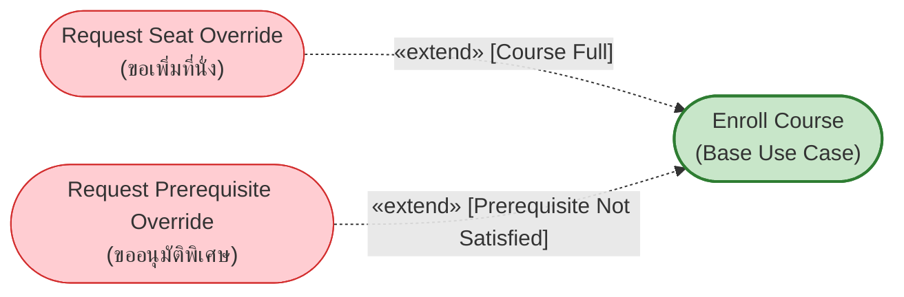
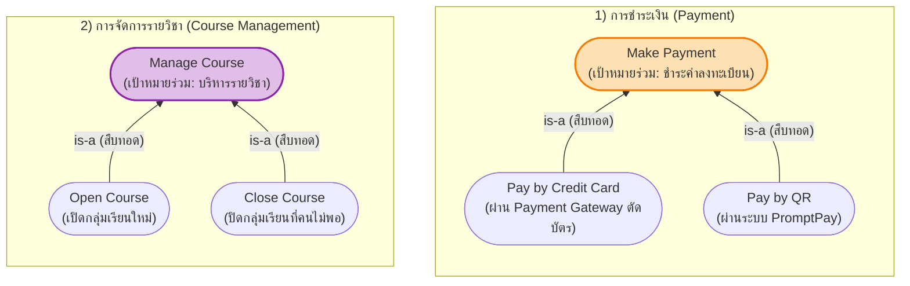
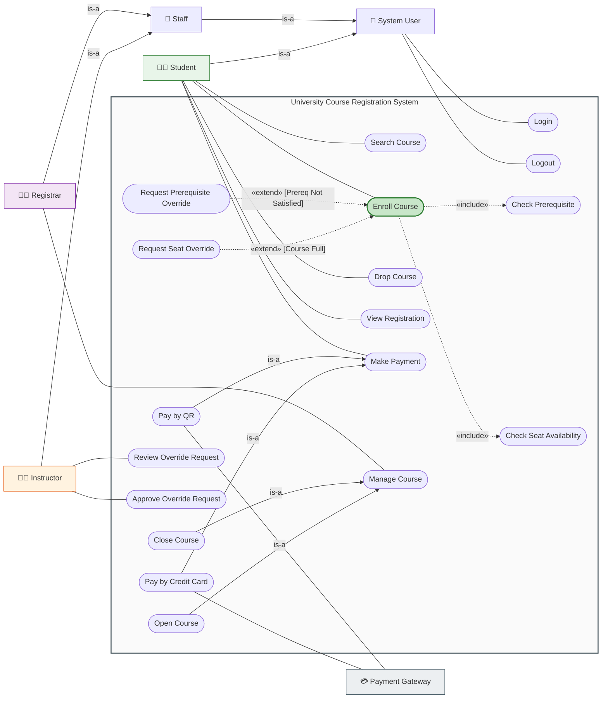

---
tags:
  - software-engineering
  - new-curriculum-68
  - use-case
  - university-registration
  - case-study
  - lecture-4
  - lessons
created: 2026-09-15
updated: 2026-09-15
lecture: 4
type: case-study
curriculum: New 2568
aliases:
  - 05_Case_Study_2_University_Registration
  - University_Registration_System_Workshop
---

# 🎓 เวิร์กช็อป Use Case: ระบบลงทะเบียนเรียนออนไลน์ของมหาวิทยาลัย (University Course Registration System)

> [!INFO] 🏷️ ข้อมูลเวิร์กช็อปและกรณีศึกษาขั้นสูง
> - **สไลด์ต้นฉบับ Workshop:** `04_Work_and_Homework/Use_Case_Diagram_Workshop/University_Course_Registration_System_Case_Study.pdf` (สไลด์ชุดสมบูรณ์ 10 หน้า)
> - **คู่มือทฤษฎีหลัก:** [[05_Use_Case_Diagrams|Lecture 4: Use Case Modeling & Diagrams]]
> - **เวิร์กช็อปพื้นฐานก่อนหน้า:** [[05_Case_Study_1_Library_System|ระบบยืม-คืนหนังสือห้องสมุด (Case Study 1)]]

```mermaid
flowchart TB
    subgraph Boundary ["System Boundary: University Course Registration System"]
        direction TB

        subgraph GeneralCases ["General & Common Use Cases"]
            LOGIN(["Login"])
            LOGOUT(["Logout"])
        end

        subgraph StudentCore ["Student Operations"]
            SEARCH(["Search Course"])
            VIEW(["View Registration"])
            DROP(["Drop Course"])
            ENROLL(["Enroll Course"])
            
            CHK_PRE(["Check Prerequisite"])
            CHK_SEAT(["Check Seat Availability"])

            REQ_SEAT(["Request Seat Override"])
            REQ_PRE(["Request Prerequisite Override"])

            ENROLL -.->|«include»| CHK_PRE
            ENROLL -.->|«include»| CHK_SEAT

            REQ_SEAT -.->|"«extend» [Course Full]"| ENROLL
            REQ_PRE -.->|"«extend» [Prerequisite Not Satisfied]"| ENROLL
        end

        subgraph PaymentCases ["Payment Generalization"]
            PAY(["Make Payment"])
            PAY_CARD(["Pay by Credit Card"])
            PAY_QR(["Pay by QR"])

            PAY_CARD -->|is-a| PAY
            PAY_QR -->|is-a| PAY
        end

        subgraph StaffCases ["Staff Operations"]
            REV_OVER(["Review Override Request"])
            APP_OVER(["Approve Override Request"])
            
            MANAGE(["Manage Course"])
            OPEN_C(["Open Course"])
            CLOSE_C(["Close Course"])

            OPEN_C -->|is-a| MANAGE
            CLOSE_C -->|is-a| MANAGE
        end
    end

    %% Actor Hierarchy
    SysUser["👤 System User"]
    Student["🧑‍🎓 Student"]
    Staff["👔 Staff"]
    Instructor["👨‍🏫 Instructor"]
    Registrar["👩‍💼 Registrar"]
    Gateway["💳 Payment Gateway"]

    Student -->|is-a| SysUser
    Staff -->|is-a| SysUser
    Instructor -->|is-a| Staff
    Registrar -->|is-a| Staff

    %% Associations
    SysUser --- LOGIN
    SysUser --- LOGOUT

    Student --- SEARCH
    Student --- ENROLL
    Student --- DROP
    Student --- VIEW
    Student --- PAY

    Instructor --- REV_OVER
    Instructor --- APP_OVER

    Registrar --- MANAGE

    PAY_CARD --- Gateway
    PAY_QR --- Gateway

    style Boundary fill:#ffffff,stroke:#1565c0,stroke-width:2px
    style SysUser fill:#e3f2fd,stroke:#0d47a1
    style Student fill:#e8f5e9,stroke:#2e7d32
    style Staff fill:#fff3e0,stroke:#e65100
    style Instructor fill:#fbe9e7,stroke:#d84315
    style Registrar fill:#f3e5f5,stroke:#7b1fa2
    style Gateway fill:#eceff1,stroke:#455a64
    style ENROLL fill:#c8e6c9,stroke:#2e7d32,stroke-width:2px
    style PAY fill:#ffe0b2,stroke:#f57c00
    style MANAGE fill:#e1bee7,stroke:#8e24aa
```

> - **หมวดหมู่:** 🔧 เวิร์กช็อปขั้นสูง (Case Study 2 - ครบทั้ง `<<include>>`, `<<extend>>`, และ `Generalization / Specialization`)



---

## 📑 สารบัญเนื้อหา (Table of Contents)
1. [โจทย์ของระบบและกฎทางธุรกิจ 4 ประการ (System Requirements & Business Rules)](#1-โจทย์ของระบบและกฎทางธุรกิจ-4-ประการ)
2. [ขั้นตอนที่ 1: วิเคราะห์ Actor และ Actor Generalization Hierarchy](#2-ขั้นตอนที่-1-วิเคราะห์-actor-และ-actor-generalization-hierarchy)
3. [ขั้นตอนที่ 2: วิเคราะห์ Use Cases ทั้งหมดของระบบ](#3-ขั้นตอนที่-2-วิเคราะห์-use-cases-ทั้งหมดของระบบ)
4. [ขั้นตอนที่ 3: วิเคราะห์ความสัมพันธ์ «include» (บังคับทำเสมอ)](#4-ขั้นตอนที่-3-วิเคราะห์ความสัมพันธ์-include-บังคับทำเสมอ)
5. [ขั้นตอนที่ 4: วิเคราะห์ความสัมพันธ์ «extend» (ทำเพิ่มเติมตามเงื่อนไข)](#5-ขั้นตอนที่-4-วิเคราะห์ความสัมพันธ์-extend-ทำเพิ่มเติมตามเงื่อนไข)
6. [ขั้นตอนที่ 5: วิเคราะห์ Use Case Generalization (เป้าหมายเดียวกัน หลากวิธี)](#6-ขั้นตอนที่-5-วิเคราะห์-use-case-generalization-เป้าหมายเดียวกัน-หลากวิธี)
7. [ตารางสรุปความสัมพันธ์ทั้งหมด (Relationship Matrix)](#7-ตารางสรุปความสัมพันธ์ทั้งหมด-relationship-matrix)
8. [ภาพรวม Use Case Diagram ที่สมบูรณ์แบบ](#8-ภาพรวม-use-case-diagram-ที่สมบูรณ์แบบ)
9. [Key Takeaways, กระบวนการวิเคราะห์ 5 ขั้นตอน และคำถามชวนคิด](#9-key-takeaways-กระบวนการวิเคราะห์-5-ขั้นตอน-และคำถามชวนคิด)

---

## 1. โจทย์ของระบบและกฎทางธุรกิจ 4 ประการ

*📄 อ้างอิงสไลด์หน้า 1/10*

มหาวิทยาลัยต้องการพัฒนาระบบ **University Course Registration System (ระบบลงทะเบียนเรียนออนไลน์)**:

### 1.1 ความต้องการของระบบ (System Requirements)
1. มหาวิทยาลัยต้องการพัฒนาระบบลงทะเบียนเรียนออนไลน์ที่รองรับผู้ใช้หลายกลุ่ม
2. **นักศึกษา:** สามารถค้นหารายวิชา, ลงทะเบียนเรียน, ถอนรายวิชา, ดูผลการลงทะเบียน และชำระค่าลงทะเบียนได้
3. **อาจารย์ผู้สอน:** สามารถตรวจสอบและอนุมัติคำร้องขออนุมัติพิเศษของนักศึกษาได้
4. **เจ้าหน้าที่ทะเบียน:** สามารถเปิด-ปิดรายวิชา และจัดการข้อมูลรายวิชาในหลักสูตรได้
5. **ระบบเชื่อมต่อภายนอก:** ระบบต้องเชื่อมต่อกับ `Payment Gateway` ภายนอกเพื่อประมวลผลการชำระเงิน

### 1.2 เงื่อนไขสำคัญทางธุรกิจ (Business Rules & Constraints)
* **Rule 1 (Prerequisite Check):** ก่อนยืนยันการลงทะเบียน ระบบต้องตรวจสอบว่านักศึกษาสอบผ่านวิชาบังคับก่อน (Prerequisite) ครบถ้วนหรือไม่
* **Rule 2 (Seat Availability Check):** ก่อนยืนยันการลงทะเบียน ระบบต้องตรวจสอบจำนวนที่นั่งว่างในกลุ่มเรียน (Section) นั้น
* **Rule 3 (Seat Override):** หากรายวิชาเต็ม (`[Course Full]`) นักศึกษาสามารถส่งคำร้องขอเพิ่มที่นั่งเป็นกรณีพิเศษได้
* **Rule 4 (Prerequisite Override):** หากไม่ผ่านเงื่อนไขวิชาบังคับก่อน (`[Prerequisite Not Satisfied]`) นักศึกษาสามารถส่งคำร้องขออนุมัติพิเศษจากอาจารย์ผู้สอนได้

---

## 2. ขั้นตอนที่ 1: วิเคราะห์ Actor และ Actor Generalization Hierarchy

*📄 อ้างอิงสไลด์หน้า 2/10, 6/10*

### 2.1 รายชื่อ Actors ในระบบ
| Actor | บทบาทในระบบ (Role) | เป้าหมายหลัก (Main Goal) | ประเภท |
|:---|:---|:---|:---|
| **Student** | นักศึกษา | ค้นหารายวิชา, ลงทะเบียน, ถอนรายวิชา, ชำระเงิน และยื่นคำร้อง | Human (Primary) |
| **Instructor** | อาจารย์ผู้สอน | ตรวจสอบและอนุมัติคำร้องขอโควตา/ขออนุมัติพิเศษของนักศึกษา | Human (Primary) |
| **Registrar** | เจ้าหน้าที่ทะเบียน | เปิด-ปิดรายวิชา และจัดการข้อมูลหลักสูตรรายวิชา | Human (Primary) |
| **Payment Gateway** | ผู้ให้บริการชำระเงินภายนอก | ประมวลผลและตัดยอดเงิน (บัตรเครดิต, QR Code) | External System (Supporting) |

### 2.2 โครงสร้างลำดับชั้นของ Actor (Actor Generalization Hierarchy)
การกำหนด Actor แม่-ลูก (Parent-Child) ช่วยลดความซ้ำซ้อนของการโยงเส้น Association ได้อย่างมาก:



* **ผลของการสืบทอด (Inheritance):**
  * `System User` เชื่อมโยงกับ Use Case พื้นฐาน: `Login` และ `Logout`
  * เมื่อ `Student`, `Instructor`, และ `Registrar` เป็นผู้สืบทอดทางอ้อมของ `System User` ทั้ง 3 บทบาทนี้จึงได้รับสิทธิ์เรียกใช้ `Login` และ `Logout` ได้โดยอัตโนมัติ โดยไม่ต้องลากเส้นโยงซ้ำซ้อนถึง 6 เส้น!

---

## 3. ขั้นตอนที่ 2: วิเคราะห์ Use Cases ทั้งหมดของระบบ

*📄 อ้างอิงสไลด์หน้า 3/10*

จำแนก Use Case ตามเป้าหมายของผู้ใช้ (User Goal) รวมทั้งหมด **12 Use Cases หลัก**:

1. **หมวดผู้ใช้ทั่วไป (System User):**
   * `Login` — เข้าสู่ระบบเพื่อยืนยันตัวตน
   * `Logout` — ออกจากระบบอย่างปลอดภัย
2. **หมวดนักศึกษา (Student):**
   * `Search Course` — ค้นหารายวิชาและตารางสอน
   * `Enroll Course` — ลงทะเบียนเรียนรายวิชาที่เลือก
   * `Drop Course` — ถอนรายวิชาที่ไม่ต้องการเรียน
   * `View Registration` — ตรวจสอบผลการลงทะเบียนและตารางเรียน
   * `Make Payment` — ชำระค่าธรรมเนียมการศึกษา
   * `Request Seat Override` — ยื่นคำร้องขอเพิ่มที่นั่งเมื่อวิชาเต็ม
   * `Request Prerequisite Override` — ยื่นคำร้องขอเรียนเมื่อไม่ผ่านวิชาบังคับก่อน
3. **หมวดอาจารย์ (Instructor):**
   * `Review Override Request` — เปิดดูรายละเอียดและประวัตินักศึกษาที่ยื่นคำร้อง
   * `Approve Override Request` — พิจารณาอนุมัติหรือปฏิเสธคำร้อง
4. **หมวดเจ้าหน้าที่ทะเบียน (Registrar):**
   * `Manage Course` — บริหารจัดการรายวิชาในระบบ (เปิด/ปิดกลุ่มเรียน, แก้ไขจำนวนที่นั่ง)

---

## 4. ขั้นตอนที่ 3: วิเคราะห์ความสัมพันธ์ «include» (บังคับทำเสมอ)

*📄 อ้างอิงสไลด์หน้า 4/10*



### เหตุผลและหลักการของ `<<include>>`:
1. **ต้องเกิดขึ้นเสมอ 100%:** ทุกครั้งที่นักศึกษากดลงทะเบียน (`Enroll Course`) ระบบ *ไม่สามารถบันทึกสำเร็จได้เลย* หากไม่ได้ตรวจสอบว่าสอบผ่าน Prerequisite มาหรือยัง และมีที่นั่งว่างเหลืออยู่หรือไม่
2. **Reuse พฤติกรรมร่วม:** ตรรกะการตรวจสอบ Prerequisite และจำนวนที่นั่ง สามารถนำไปใช้ซ้ำในจุดอื่นได้ (เช่น การจัดตารางสอนล่วงหน้า)
3. **ทิศทางลูกศร:** ชี้จาก `Enroll Course` ──[«include»]──> Included Use Case

---

## 5. ขั้นตอนที่ 4: วิเคราะห์ความสัมพันธ์ «extend» (ทำเพิ่มเติมตามเงื่อนไข)

*📄 อ้างอิงสไลด์หน้า 5/10*



### เหตุผลและหลักการของ `<<extend>>`:
1. **เกิดขึ้นเฉพาะบางสถานการณ์ (Conditional Behavior):** ในสภาวะปกติ นักศึกษาลงทะเบียนสำเร็จโดยไม่ต้องยื่นคำร้องใดๆ แต่ถ้าเกิดเงื่อนไขเฉพาะขึ้น ระบบจะอนุญาตให้ดึง Use Case ขยายนี้เข้ามาทำงาน
2. **เงื่อนไขการขยาย (Extension Condition):**
   * เกิดขึ้นเมื่อ: `[Course Full]` → ขยายไปยัง `Request Seat Override`
   * เกิดขึ้นเมื่อ: `[Prerequisite Not Satisfied]` → ขยายไปยัง `Request Prerequisite Override`
3. **Base Use Case สมบูรณ์ได้ด้วยตนเอง:** นักศึกษาส่วนใหญ่ลงทะเบียนสำเร็จได้โดยไม่ต้องเข้าสู่ลูปของการยื่นคำร้อง
4. **ทิศทางลูกศร:** ชี้จาก Extension Use Case พุ่งเข้าหา Base Use Case (`Enroll Course`) เสมอ

---

## 6. ขั้นตอนที่ 5: วิเคราะห์ Use Case Generalization (เป้าหมายเดียวกัน หลากวิธี)

*📄 อ้างอิงสไลด์หน้า 7/10*

Use Case Generalization ใช้เมื่อ Use Case มี **เป้าหมายเดียวกัน (Same Goal)** แต่มี **วิธีการดำเนินงานหรืออัลกอริทึมที่แตกต่างกันเฉพาะทาง (Specialized Variants)**:



* **Make Payment:** นักศึกษามีเป้าหมายคือจ่ายเงิน แต่วิธีการตัดเงินมี 2 รูปแบบ คือ บัตรเครดิต และ Thai QR Payment
* **Manage Course:** เจ้าหน้าที่ทะเบียนมีเป้าหมายคือบริหารวิชา แต่งานเฉพาะทางคือการเปิดรายวิชาใหม่ หรือปิดรายวิชาที่นักศึกษาลงทะเบียนต่ำกว่าเกณฑ์

---

## 7. ตารางสรุปความสัมพันธ์ทั้งหมด (Relationship Matrix)

*📄 อ้างอิงสไลด์หน้า 8/10*

| ประเภทความสัมพันธ์ | จาก (From) | ถึง (To) | เหตุผลและเงื่อนไข (Meaning / Reason) |
|:---|:---|:---|:---|
| **`<<include>>`** | `Enroll Course` | `Check Prerequisite` | ต้องตรวจวิชาบังคับก่อนเสมอในทุกรอบการลงทะเบียน |
| **`<<include>>`** | `Enroll Course` | `Check Seat Availability` | ต้องตรวจจำนวนที่นั่งว่างเสมอในทุกรอบการลงทะเบียน |
| **`<<extend>>`** | `Request Seat Override` | `Enroll Course` | ทำเมื่อรายวิชาเต็ม `[Course Full]` เท่านั้น |
| **`<<extend>>`** | `Request Prerequisite Override` | `Enroll Course` | ทำเมื่อไม่ผ่าน Prerequisite `[Prerequisite Not Satisfied]` |
| **Actor Generalization** | `Student` | `System User` | `Student is-a System User` (สืบทอด Login, Logout) |
| **Actor Generalization** | `Staff` | `System User` | `Staff is-a System User` (สืบทอด Login, Logout) |
| **Actor Generalization** | `Instructor` | `Staff` | `Instructor is-a Staff` (สืบทอดสิทธิ์บุคลากร) |
| **Actor Generalization** | `Registrar` | `Staff` | `Registrar is-a Staff` (สืบทอดสิทธิ์บุคลากร) |
| **Use Case Generalization** | `Pay by Credit Card` | `Make Payment` | วิธีชำระเงินเฉพาะทางแบบตัดบัตรเครดิต |
| **Use Case Generalization** | `Pay by QR` | `Make Payment` | วิธีชำระเงินเฉพาะทางแบบสแกน QR Code |
| **Use Case Generalization** | `Open Course` | `Manage Course` | รูปแบบการจัดการรายวิชา: เปิดกลุ่มเรียน |
| **Use Case Generalization** | `Close Course` | `Manage Course` | รูปแบบการจัดการรายวิชา: ปิดกลุ่มเรียน |

---

## 8. ภาพรวม Use Case Diagram ที่สมบูรณ์แบบ

*📄 อ้างอิงสไลด์หน้า 9/10*

แผนผังภาพรวมความสัมพันธ์ระหว่าง Actor และ Use Case ทั้งหมดของระบบลงทะเบียนเรียนมหาวิทยาลัย:



---

## 9. Key Takeaways, กระบวนการวิเคราะห์ 5 ขั้นตอน และคำถามชวนคิด

*📄 อ้างอิงสไลด์หน้า 10/10*

### 9.1 สรุป 3 แนวคิดสำคัญที่ต้องจำให้แม่น
1. **`<<include>>` (พฤติกรรมที่ต้องถูกเรียกใช้เสมอ):**
   * *ตัวอย่าง:* `Enroll Course` → `Check Prerequisite`, `Check Seat Availability`
   * *คีย์เวิร์ด:* "งานหลักจะไม่สมบูรณ์ หากไม่มีพฤติกรรมนี้"
2. **`<<extend>>` (พฤติกรรมเพิ่มเติมตามเงื่อนไข):**
   * *ตัวอย่าง:* `Request Seat Override` [Course Full], `Request Prerequisite Override` [Prerequisite Not Satisfied]
   * *คีย์เวิร์ด:* "เกิดขึ้นเฉพาะบางสถานการณ์ เมื่อมีเงื่อนไขที่กำหนด"
3. **`Generalization / Specialization` (ความสัมพันธ์แบบ is-a):**
   * *ตัวอย่าง Actor:* `Instructor is-a Staff`, `Student is-a System User`
   * *ตัวอย่าง Use Case:* `Pay by QR is a kind of Make Payment`
   * *คีย์เวิร์ด:* "เป็นความสัมพันธ์แบบทั่วไป - เฉพาะทาง (แม่ - ลูก)"

---

### 9.2 กระบวนการวิเคราะห์ 5 ขั้นตอนสู่ไดอะแกรมคุณภาพ
```text
[1. Requirements]  ➜ ทำความเข้าใจความต้องการและเงื่อนไขของระบบ
       ↓
[2. Actors]        ➜ ระบุผู้ที่มีปฏิสัมพันธ์กับระบบ (ทั้งคนและระบบภายนอก)
       ↓
[3. Use Cases]     ➜ กำหนดพฤติกรรมและ Goal ของผู้ใช้ (Verb + Object)
       ↓
[4. Relationships] ➜ วิเคราะห์ include, extend, และ generalization
       ↓
[5. Use Case Dia]  ➜ วาดแผนภาพที่ชัดเจน ถูกหลัก UML และนำไปใช้ต่อได้จริง
```

---

### 9.3 4 คำถามชวนคิดสำหรับวิเคราะห์ทุกโจทย์ Use Case
> [!TIP] ฝึกตั้งคำถามเหล่านี้เมื่อเจอโจทย์วิเคราะห์ระบบ
> 1. **อะไรคือพฤติกรรมที่ต้องเกิดทุกครั้ง?** → คำตอบคือ `<<include>>`
> 2. **อะไรคือพฤติกรรมที่เกิดเฉพาะบางเงื่อนไข?** → คำตอบคือ `<<extend>>` พร้อมระบุเงื่อนไขในวงเล็บ `[condition]`
> 3. **Actor ใดมีความสัมพันธ์แบบ is-a หรือใช้สิทธิ์ร่วมกัน?** → คำตอบคือ `Actor Generalization`
> 4. **Use Case ใดมีเป้าหมายเดียวกันแต่มีหลายวิธีดำเนินการ?** → คำตอบคือ `Use Case Generalization`

---

## 🔗 เอกสารที่เกี่ยวข้อง
- 📘 [[Use_Case_Diagram_Master_Guide|Use Case Diagram Master Guide (ทฤษฎีเต็ม 32 หน้า)]]
- 📚 [[Library_System_Workshop|เวิร์กช็อปที่ 1: ระบบยืม-คืนหนังสือห้องสมุด (Library Case Study)]]
- 🏢 [[ATM_and_Elevator_Workshop|เวิร์กช็อป: ระบบ ATM และระบบลิฟต์]]
- 📊 [[Progress Checklist|Progress Checklist ติดตามการอ่าน]]
- 🌐 [[Software Engineering Index|กลับสู่หน้ารวมดัชนี Software Engineering Wiki]]
