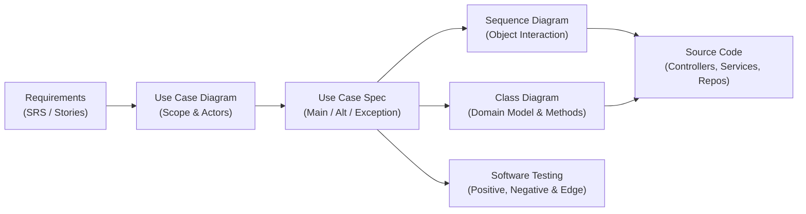

---
tags:
  - software-engineering
  - new-curriculum-68
  - uml
  - use-case
  - textual-use-case
  - scenarios
  - lecture-4
  - lessons
created: 2026-09-15
updated: 2026-09-15
lecture: 4
type: lecture
curriculum: New 2568
aliases:
  - 05_Use_Case_Diagrams
  - Use Case Diagram Master Guide
  - Use_Case_Diagram_Master_Guide
  - Lecture 4 - Use Case Modeling & Textual Specifications
---

# Lecture 4: Use Case Modeling, Diagrams & Specifications (ฉบับหลักสูตรใหม่ 2568)

> [!INFO] 🏷️ หมวดหมู่หลักสูตรและการใช้งาน (Curriculum Classification)
> - **สถานะหลักสูตร:** ⚡ **หลักสูตรใหม่ 2568 (New 68 Core Lesson)** — บทเรียน Lecture 4 เชื่อมระหว่าง Requirements Engineering และ Agile/Scrum
> - **สไลด์ต้นฉบับ:** `04_Work_and_Homework/Use_Case_Diagram_Workshop/Use-Case-Diagram.pdf` (สไลด์ชุดสมบูรณ์ 32 หน้า)
> - **กรณีศึกษาภาคปฏิบัติต่อเนื่องในหมวด Lessons:**
>   - 📚 Case Study 1: [[05_Case_Study_1_Library_System|05_Case_Study_1_Library_System.md]] (ระบบยืม-คืนหนังสือห้องสมุด)
>   - 🎓 Case Study 2: [[05_Case_Study_2_University_Registration|05_Case_Study_2_University_Registration.md]] (ระบบลงทะเบียนเรียนออนไลน์)
>   - 🎙️ สรุปเทปบรรยายสดในห้องเรียน (15 ก.ย. 2569): [[In-Class Lecture - Use Case Diagram & System Analysis|In-Class Lecture - Use Case Diagram & System Analysis.md]]
> - **เป้าหมายการประเมิน:** ⭐ สอบกลางภาค (Midterm Exam), ออกแบบสถาปัตยกรรมระบบ และส่งการบ้าน Workshop

```mermaid
flowchart TD
    UCD["📘 Lecture 4: Use Case Modeling Hub"]

    subgraph FOUNDATION ["1. พื้นฐานและการมองระบบ"]
        DEF["นิยาม: Who wants to do What"]
        POV["มุมมองภายนอก (User POV)<br/>vs โครงสร้างโปรแกรมภายใน"]
        BOUND["System Boundary & Scope Creep"]
    end

    subgraph ELEMENTS ["2. องค์ประกอบหลัก (Elements)"]
        ACT["Actors: Primary, Supporting, System"]
        UC["Use Cases: Goal-oriented (Verb + Object)"]
    end

    subgraph RELATIONS ["3. ความสัมพันธ์ 4 รูปแบบ"]
        ASSOC["Association (—)"]
        INC["«include» (จำเป็นต้องทำเสมอ)"]
        EXT["«extend» (ทำเพิ่มเติมตามเงื่อนไข)"]
        GEN["Generalization (is-a สืบทอด)"]
    end

    subgraph IMPLEMENTATION ["4. การนำไปใช้งานจริง (Lifecycle & Testing)"]
        SPEC["Use Case Specification (3 Flows)"]
        TRACE["Traceability: Req ➔ UC ➔ Test Cases"]
        UML_MAP["Map สู่ Sequence, Class, Code"]
    end

    UCD --> DEF
    UCD --> ACT
    UCD --> ASSOC
    UCD --> SPEC

    style UCD fill:#e1f5fe,stroke:#0288d1,stroke-width:3px
    style FOUNDATION fill:#fff3e0,stroke:#f57c00
    style ELEMENTS fill:#e8f5e9,stroke:#2e7d32
    style RELATIONS fill:#f3e5f5,stroke:#7b1fa2
    style IMPLEMENTATION fill:#ffebee,stroke:#c62828
```



---

## 📑 สารบัญเนื้อหา (Table of Contents)

1. [บทนำ: Use Case Diagram คืออะไรและมีไว้ทำไม](#1-บทนำ-use-case-diagram-คืออะไรและมีไว้ทำไม)
2. [องค์ประกอบพื้นฐาน: Actor, Use Case และ System Boundary](#2-องค์ประกอบพื้นฐาน-actor-use-case-และ-system-boundary)
3. [ความสัมพันธ์ทั้ง 4 ประเภทใน Use Case Diagram](#3-ความสัมพันธ์ทั้ง-4-ประเภทใน-use-case-diagram)
4. [ตารางเปรียบเทียบเจาะลึก: «include» vs «extend»](#4-ตารางเปรียบเทียบเจาะลึก-include-vs-extend)
5. [เทคนิคการสกัด Use Case จากข้อความ Requirement](#5-เทคนิคการสกัด-use-case-จากข้อความ-requirement)
6. [มาตรฐานการเขียน Use Case Specification และ 3 เส้นทาง (Flows)](#6-มาตรฐานการเขียน-use-case-specification-และ-3-เส้นทาง-flows)
7. [กรณีศึกษาตัวอย่าง: ระบบจองห้องพักโรงแรม (Hotel Room Booking)](#7-กรณีศึกษาตัวอย่าง-ระบบจองห้องพักโรงแรม-hotel-room-booking)
8. [ความเชื่อมโยงกับ UML อื่นๆ, Architecture และ Testing](#8-ความเชื่อมโยงกับ-uml-อื่นๆ-architecture-และ-testing)
9. [Use Case กับระเบียบวิธีแบบ Agile และ Non-functional Requirements](#9-use-case-กับระเบียบวิธีแบบ-agile-และ-non-functional-requirements)
10. [6 ข้อผิดพลาดที่พบบ่อย (Common Pitfalls) และ Checklist ตรวจสอบ](#10-6-ข้อผิดพลาดที่พบบ่อย-common-pitfalls-และ-checklist-ตรวจสอบ)
11. [กรณีศึกษาภาคปฏิบัติประจำบทเรียน (Practical Case Studies)](#11-กรณีศึกษาภาคปฏิบัติประจำบทเรียน-practical-case-studies)

---

## 1. บทนำ: Use Case Diagram คืออะไรและมีไว้ทำไม

*📄 อ้างอิงสไลด์หน้า 1-6*

### 1.1 นิยามหลักการ (Core Definition)
> [!info] 💡 นิยาม Use Case Diagram
> **Use Case Diagram** เป็นแผนภาพประเภทพฤติกรรม (Behavioral Diagram) ในภาษา **UML (Unified Modeling Language)** ที่ใช้แสดงความสัมพันธ์ระหว่าง **ผู้เกี่ยวข้องภายนอกระบบ (Actors)** กับ **บริการหรือขอบเขตความสามารถที่ระบบต้องมี (Use Cases)** โดยมุ่งตอบคำถามหลักเพียงข้อเดียวคือ:
> 
> > 💬 **"ใครต้องการทำอะไรกับระบบ?" (Who wants to do what with the system?)**

### 1.2 จุดยืนสำคัญ: User Perspective vs Implementation
* **พฤติกรรมจากมุมมองผู้ใช้ (User's Point of View):** แสดงว่าระบบส่งมอบผลลัพธ์หรือคุณค่า (Goal) อะไรให้ผู้ใช้ โดยไม่สนใจว่าข้างในเขียนโค้ดอย่างไร
* **ไม่ใช่ขั้นตอนโปรแกรม (Not Programming Steps):** Use Case Diagram ไม่ได้แสดงฟังก์ชันระดับต่ำ อัลกอริทึม ตารางฐานข้อมูล หรือปุ่มกด UI
* **ตำแหน่งใน SDLC:** สร้างขึ้นในช่วง **Requirements Engineering (Analysis Phase)** และใช้เป็นศูนย์กลางเชื่อมโยงระหว่างการวิเคราะห์, การออกแบบสถาปัตยกรรม (Design), การเขียนโค้ด (Implementation) ไปจนถึงการเขียนแบบทดสอบ (Testing)

### 1.3 ข้อดีและข้อจำกัด (Pros & Cons)
| ข้อดี (Advantages) | ข้อจำกัด (Limitations) |
|:---|:---|
| • **สื่อสารเข้าใจง่าย:** สื่อสารตรงกันระหว่างลูกค้า, SA, Dev และ Tester แม้ไม่มีพื้นฐาน IT | • **ไม่แสดงลำดับเวลา:** ไม่แสดง Sequence หรือ Step การทำงานก่อนหลัง (ต้องใช้ Activity หรือ Sequence แทน) |
| • **กำหนดขอบเขตระบบชัดเจน (Scope):** แยกสิ่งในระบบและนอกระบบ ป้องกัน Scope Creep | • **ไม่มีตรรกะภายใน:** ไม่แสดงการคำนวณหรือเงื่อนไขเชิงลึก (ต้องพึ่ง Use Case Spec) |
| • **เป็นฐานคิด Test Cases:** 1 Use Case สามารถแตกเป็นชุดทดสอบได้ทันที | • **อาจสร้างสับสนหากความสัมพันธ์เยอะ:** ถ้าใส่ include/extend มากเกินไป แผนภาพจะอ่านยาก |

---

## 2. องค์ประกอบพื้นฐาน: Actor, Use Case และ System Boundary

*📄 อ้างอิงสไลด์หน้า 7-14, 17*

### 2.1 Actor (ตัวแสดง/ผู้มีปฏิสัมพันธ์)
**Actor** คือ ผู้มีปฏิสัมพันธ์กับระบบจาก **ภายนอกระบบ** (อยู่นอก System Boundary เสมอ):
* **Actor = Role ไม่ใช่บุคคล (Role, not Person):** นายสมชายเป็นอาจารย์และเป็นนักศึกษาวิจัย เมื่อใช้งานระบบลงทะเบียน นายสมชายจะสวมบทบาทเป็น Actor `Student` หรือ `Instructor` ตามหน้าที่
* **การจำแนกประเภท Actor:**
  1. **Primary Actor (ผู้กระทำหลัก):** ผู้ริเริ่มการทำงานกับระบบเพื่อให้บรรลุเป้าหมาย (เช่น `Customer`, `Student`)
  2. **Supporting / Secondary Actor (ผู้สนับสนุน / ระบบภายนอก):** ผู้ที่ระบบเรียกใช้งานเพื่อช่วยให้ Use Case สำเร็จ (เช่น `Payment Gateway`, `Email Service`, `Bank System`)
  3. **Human Actor vs System Actor:** มนุษย์ (Stick Figure) หรือระบบคอมพิวเตอร์/ฮาร์ดแวร์ภายนอก (กล่องติดสัญลักษณ์ `<<system>>` หรือ Stick Figure)

> [!CAUTION] กฎเหล็กของ Actor
> 1. **Database ไม่ใช่ Actor:** ฐานข้อมูลของระบบอยู่ภายใน System Boundary ระบบต้องจัดการเอง ห้ามดึง Database มาเป็น Actor เด็ดขาด!
> 2. **Actor ต้องอยู่นอกกรอบ System Boundary เสมอ**

### 2.2 Use Case (กรณีการใช้งาน)
**Use Case** คือ คำอธิบายพฤติกรรมหรือบริการที่ระบบมอบให้แก่ Actor เพื่อให้บรรลุ **User Goal**:
* **หลักการตั้งชื่อ:** ต้องเป็น **กริยา + กรรม (Verb + Object)** เสมอ เช่น `Register Account`, `Search Product`, `Place Order`, `Enroll Course`
* **Goal-Oriented:** ต้องสะท้อนเป้าหมายที่มีคุณค่า ไม่ใช่ชื่อทางเทคนิค:
  * ✅ `Search Product` / `Place Order` (ผู้ใช้ต้องการสั่งซื้อ)
  * ❌ `Order Button` / `Click Submit` (ผู้ใช้ไม่ได้มีเป้าหมายชีวิตว่าจะมากดปุ่ม)

```text
[ระดับความละเอียดของ Use Case (Granularity)]:
• Summary Level (กว้างเกินไป): Manage University ❌
• User Goal Level (พอดี เหมาะสม): Enroll Course, Borrow Book ✅
• Subfunction Level (ย่อยเกินไป): Click Confirm Button, Validate Email Format ❌
```

### 2.3 System Boundary และการป้องกัน Scope Creep
* **System Boundary (กรอบขอบเขตระบบ):** กล่องสี่เหลี่ยมที่ครอบ Use Case ทั้งหมด มีชื่อระบบระบุอยู่ด้านบน Actor ทุกตัวต้องอยู่นอกกรอบนี้
* **Scope Creep Management:** เมื่อมีข้อกำหนดใหม่เข้ามา (เช่น ลูกค้าขอเพิ่ม: "ระบบต้องแนะนำสินค้าด้วย AI") ทีมสามารถใช้ Use Case Diagram ตั้งคำถามได้ทันทีว่า *ฟังก์ชันนี้อยู่ใน Scope หรือไม่?* หากเพิ่มเข้ามาจะต้องกระทบฐานข้อมูล, API, โมเดล และ Testing มากน้อยเพียงใด (Impact Analysis)

---

## 3. ความสัมพันธ์ทั้ง 4 ประเภทใน Use Case Diagram

*📄 อ้างอิงสไลด์หน้า 9-10, 15-16*

### 3.1 Association (เส้นโยงความสัมพันธ์)
* เส้นตรงทึบไม่มีหัวลูกศรเชื่อมระหว่าง Actor กับ Use Case แสดงว่า Actor มีส่วนเกี่ยวข้องหรือเรียกใช้ Use Case นั้น

### 3.2 `<<include>>` (การรวมเข้า / ขาดไม่ได้)
* **นิยาม:** พฤติกรรมที่ถูกเรียกใช้เป็น **ส่วนหนึ่งของกระบวนการหลักเสมอ** (Mandatory & Reusable)
* **ทิศทางลูกศร:** เส้นประมีหัวลูกศร พุ่งจาก **Base Use Case ──[«include»]──> Included Use Case**
* **เจตนา:** แยกพฤติกรรมที่ต้องทำซ้ำๆ ออกมาเป็นโมดูลร่วม (Reuse) หากไม่มี Included Use Case กระบวนการหลักของ Base จะไม่สมบูรณ์
* **ตัวอย่าง:** `Enroll Course` ──[«include»]──> `Check Prerequisite`

### 3.3 `<<extend>>` (การขยาย / ทำเพิ่มเติมตามเงื่อนไข)
* **นิยาม:** พฤติกรรมเสริมที่จะ **เกิดขึ้นเฉพาะเมื่อตรงตามเงื่อนไขที่กำหนดเท่านั้น** (Optional & Conditional)
* **ทิศทางลูกศร:** เส้นประมีหัวลูกศร พุ่งจาก **Extension Use Case ──[«extend»]──> Base Use Case** (ลูกศรชี้กลับเข้าหา Base!)
* **เจตนา:** Base Use Case สามารถทำงานสำเร็จได้ด้วยตนเอง ส่วนขยายจะเข้ามาแทรกเฉพาะเมื่อมีเงื่อนไขพิเศษ
* **ตัวอย่าง:** `Request Seat Override` [Course Full] ──[«extend»]──> `Enroll Course`

### 3.4 Generalization / Specialization (การสืบทอดความสัมพันธ์แบบ is-a)
* เส้นทึบที่มี **หัวลูกศรเป็นรูปสามเหลี่ยมกลวง (Hollow Triangle)** ชี้ไปยังสิ่งที่เป็น Parent (แบบทั่วไป)
* **Actor Generalization:** Actor ระดับล่างสืบทอดความสามารถจาก Actor บน เช่น `System User` ← `Student`, `Staff` ← `Instructor` (สืบทอด Login, Logout อัตโนมัติ)
* **Use Case Generalization:** ใช้เมื่อ Use Case มีเป้าหมายเดียวกัน (Same Goal) แต่มีวิธีดำเนินการต่างกัน เช่น `Make Payment` ← `Pay by Credit Card`, `Pay by QR`

---

## 4. ตารางเปรียบเทียบเจาะลึก: «include» vs «extend»

*📄 อ้างอิงสไลด์หน้า 16*

| มิติการเปรียบเทียบ | `<<include>>` | `<<extend>>` |
|:---|:---|:---|
| **ความหมาย** | พฤติกรรมที่ถูกรวมเป็นส่วนหนึ่งของกระบวนการหลัก | พฤติกรรมเสริมที่เพิ่มเข้ามาในสถานการณ์เฉพาะ |
| **การเกิด (Occurrence)** | **เกิดขึ้นเสมอ 100%** ในการทำงานของ Base | **เกิดขึ้นเฉพาะเมื่อเงื่อนไขเป็นจริง** (Conditional) |
| **ทิศทางลูกศร** | Base ──[«include»]──> Included Use Case | Extension Use Case ──[«extend»]──> Base Use Case |
| **ความสมบูรณ์ของ Base** | Base Use Case **ไม่สมบูรณ์** หากขาด Included | Base Use Case **สมบูรณ์ได้ด้วยตัวเอง** โดยไม่ต้องมี Extension |
| **วัตถุประสงค์หลัก** | แยกพฤติกรรมร่วมออกมา Reuse เพื่อไม่ให้ซ้ำซ้อน | รองรับ Variation หรือทางเลือกเสริมโดยไม่แก้ Base เดิม |
| **ตัวอย่างชัดเจน** | `Borrow Book` ──[«include»]──> `Check Book Status` | `Request Seat Override` ──[«extend»]──> `Enroll Course` |

---

## 5. เทคนิคการสกัด Use Case จากข้อความ Requirement

*📄 อ้างอิงสไลด์หน้า 18-19*

เมื่อได้รับเอกสารข้อกำหนดความต้องการ (Requirements Specification):
1. **ระบุ System Boundary:** ค้นหาว่าระบบที่เรากำลังจะสร้างคือระบบอะไร
2. **ค้นหาตัวละคร (Actors):** ค้นหาคำนามภายนอกที่มีปฏิสัมพันธ์กับระบบ
3. **ค้นหากริยา (Actions / Verbs):** มองหาคำกริยา เช่น *สมัคร, ค้นหา, เพิ่ม, แก้ไข, ยกเลิก, สั่งซื้อ, ชำระเงิน, ตรวจสอบ*
4. **กลั่นกรองเป้าหมายผู้ใช้ (Filter for User Goals):** คัดกรองว่ากริยานั้นมีคุณค่าเป็น Goal ของ Actor หรือไม่
5. **จัดกลุ่มความสัมพันธ์:** พิจารณา include, extend, และ generalization

---

## 6. มาตรฐานการเขียน Use Case Specification และ 3 เส้นทาง (Flows)

*📄 อ้างอิงสไลด์หน้า 20-22*

Use Case Diagram ให้เพียงภาพรวมระดับสูง ในการพัฒนาระบบจริงจำเป็นต้องมี **Use Case Specification**:

### 6.1 การจำแนก 3 เส้นทางการทำงาน (Flow of Events)
1. **Main Flow (Happy Path):** เส้นทางหลักเมื่อทุกอย่างดำเนินไปด้วยดี ไร้ข้อผิดพลาด
2. **Alternative Flow (เส้นทางเลือก):** เส้นทางที่แตกต่างจากเส้นทางหลักแต่ยังคง **นำไปสู่ความสำเร็จของเป้าหมายได้**
3. **Exception Flow (เส้นทางข้อยกเว้น/ข้อผิดพลาด):** ข้อผิดพลาดที่เกิดขึ้นทำให้กระบวนการไม่สำเร็จหรือต้องยุติลง

#### 📝 ตัวอย่าง: UC-02 Login Specification (Flow ครบทั้ง 3 รูปแบบ)
```text
[Main Flow]
1. User เลือกเข้าสู่ระบบ (Login)
2. System แสดงแบบฟอร์มให้กรอก Email และ Password
3. User กรอก Email และ Password แล้วกดยืนยัน
4. System ตรวจสอบความถูกต้องของข้อมูล
5. System ยืนยันตัวตนสำเร็จ และสร้าง User Session
6. System นำทางผู้ใช้ไปยังหน้า Dashboard

[Alternative Flow]
3a. User เลือกตัวเลือก "Remember Me"
    → System บันทึก Authentication Token ลงในเครื่องผู้ใช้ → กลับไปทำข้อ 4

[Exception Flow]
4E1. ข้อมูล Email หรือ Password ไม่ถูกต้อง
    → System แสดงข้อความแจ้งเตือน "ข้อมูลเข้าสู่ระบบไม่ถูกต้อง"
    → System อนุญาตให้ User กรอกข้อมูลใหม่อีกครั้ง
4E2. บัญชีผู้ใช้ถูกระงับการใช้งาน (Account Suspended)
    → System แสดงข้อความแจ้งเตือนสถานะบัญชีถูกระงับ
    → System ปฏิเสธการเข้าสู่ระบบและแสดงช่องทางติดต่อผู้ดูแลระบบ (Admin)
```

---

## 7. กรณีศึกษาตัวอย่าง: ระบบจองห้องพักโรงแรม (Hotel Room Booking)

*📄 อ้างอิงสไลด์หน้า 28-29*

* **Primary Actors:** `Customer`, `Hotel Staff` | **Supporting Actors:** `Payment Gateway`, `Email Service`
* **Use Cases:**
  * **Customer:** `Register Account`, `Login`, `Search Available Room`, `Book Room`, `Make Payment`, `Cancel Booking`
  * **Hotel Staff:** `Manage Room / Rate`, `View & Update Booking Status`, `Generate Booking Report`
  * **Relationships:**
    * `Book Room` ──[«include»]──> `Check Room Availability`, `Calculate Booking Price`
    * `Apply Promotion Code` ──[«extend»]──> `Book Room` (เมื่อลูกค้ามีโปรโมชัน)

---

## 8. ความเชื่อมโยงกับ UML อื่นๆ, Architecture และ Testing

*📄 อ้างอิงสไลด์หน้า 23-26, 30*



### 8.1 การแปลงสู่ Software Test Cases และ Traceability Matrix
จากสูตร: **Use Case → Scenarios → Test Cases**
* **Positive Testing:** นำ Main Flow มาสร้างชุดทดสอบกรณีสำเร็จ (Valid Data)
* **Alternative Flow Testing:** นำทางเลือกเสริมมาทดสอบ (เช่น ชำระผ่าน QR, กรอกโค้ดลดราคา)
* **Negative Testing:** นำ Exception Flows ทั้งหมดมาสร้างชุดทดสอบดักข้อผิดพลาด (เช่น รหัสผิด, ตัดบัตรไม่ผ่าน)

| Requirement ID | Use Case ID & Name | Test Cases ที่เกี่ยวข้อง |
|:---:|:---|:---|
| **REQ-01** | `UC-01 Register Account` | TC-001 ถึง TC-005 (สมัครสำเร็จ, Email ซ้ำ, Password สั้น) |
| **REQ-02** | `UC-02 Login` | TC-006 ถึง TC-012 (ล็อกอินผ่าน, รหัสผิด, โดนล็อก, Remember Me) |
| **REQ-03** | `UC-03 Place Order` | TC-013 ถึง TC-025 (สั่งซื้อสำเร็จ, สินค้าหมด, คำนวณภาษี) |
| **REQ-04** | `UC-04 Make Payment` | TC-026 ถึง TC-040 (ตัดบัตรผ่าน, เงินไม่พอ, Gateway ล่ม) |

---

## 9. Use Case กับระเบียบวิธีแบบ Agile และ Non-functional Requirements

*📄 อ้างอิงสไลด์หน้า 31*

* **Agile Integration:** Use Case แมปเข้ากับ User Story ได้ง่าย เช่น `Track Order` → *"As a customer, I want to track my order so that I know when my package will arrive."*
* **NFR Rule:** **ห้ามสร้าง NFR เป็นวงรี Use Case เด็ดขาด!** ให้ผูก NFR เป็นข้อกำหนดคุณลักษณะแนบท้ายใน Use Case Specification แทน เช่น `[NFR-PERF-01: Response time < 2s]`

---

## 10. 6 ข้อผิดพลาดที่พบบ่อย (Common Pitfalls) และ Checklist ตรวจสอบ

*📄 อ้างอิงสไลด์หน้า 27, 32*

| ลำดับ | ข้อผิดพลาดที่พบบ่อย (Pitfalls) | คำอธิบายและแนวทางแก้ไขที่ถูกต้อง |
|:---:|:---|:---|
| **1** | **ใส่ Database เป็น Actor** | ❌ Database อยู่ในระบบ ระบบคุยกับ Database ภายใน ห้ามทำเป็น Actor |
| **2** | **Actor อยู่ใน System Boundary** | ❌ Actor ทุกตัวต้องอยู่นอกกล่องสี่เหลี่ยมเสมอ |
| **3** | **นำชื่อหน้าจอมาตั้งเป็น Use Case** | ❌ ตั้งชื่อ `Login Page` → ✅ ต้องตั้งเป็น Verb + Object เช่น `Login` |
| **4** | **ระดับความละเอียดไม่เหมาะสม** | ❌ ย่อยไป: `Click Submit` / กว้างไป: `Manage Hospital` → ✅ User Goal |
| **5** | **โยง Include / Extend ซับซ้อนเกินไป** | ❌ โยงลูกศรใยแมงมุม → ✅ ใช้เฉพาะที่จำเป็น คงความชัดเจน |
| **6** | **ใช้ลูกศรแสดงลำดับขั้นตอน (Sequence)** | ❌ ลากลูกศร `Login` → `Search` → `Pay` → ✅ ใช้ Activity Diagram |

---

## 11. กรณีศึกษาภาคปฏิบัติประจำบทเรียน (Practical Case Studies)

บทเรียน Lecture 4 ประกอบด้วย 2 กรณีศึกษาภาคปฏิบัติเพื่อฝึกฝนทักษะ:

1. 📚 **[[05_Case_Study_1_Library_System|05_Case_Study_1_Library_System.md]]** — **กรณีศึกษาที่ 1: ระบบยืม-คืนหนังสือห้องสมุด (Library Borrow-Return System)**
   - สไลด์ต้นฉบับ: `Library_Borrow_Return_System_Case_Study.pdf` (5 หน้า)
   - มุ่งเน้น: พื้นฐานการวิเคราะห์ Actor (`Student`, `Librarian`), Use Cases และความสัมพันธ์ `<<include>>` ตรวจสถานะ
2. 🎓 **[[05_Case_Study_2_University_Registration|05_Case_Study_2_University_Registration.md]]** — **กรณีศึกษาที่ 2: ระบบลงทะเบียนเรียนออนไลน์ (University Course Registration System)**
   - สไลด์ต้นฉบับ: `University_Course_Registration_System_Case_Study.pdf` (10 หน้า)
   - มุ่งเน้น: ระบบขั้นสูง ครบทั้ง `<<include>>`, `<<extend>>`, และ `Generalization / Specialization` ทั้ง Actor และ Use Case

---

## 🧭 การเชื่อมโยงบทเรียนในหลักสูตร 2568
* ⬅️ บทก่อนหน้า: **[[04_Ch4_Requirements_Eng|Lecture 3: Requirements Engineering & SRS]]**
* ➡️ บทถัดไป: **[[07_Agile_and_Scrum|Lecture 5: Agile Software Engineering & Scrum Framework]]**
* 🌐 ดัชนีสารบัญหลัก: **[[Software Engineering Index|Software Engineering Master Hub]]**
