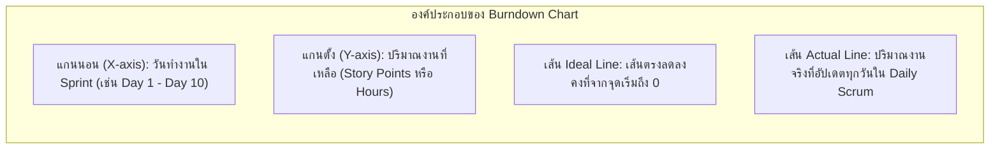

---
tags:
  - software-engineering
  - new-curriculum-68
  - scrum
  - burndown-chart
  - velocity
  - lesson-08
created: 2026-09-08
updated: 2026-09-08
curriculum: New 2568
type: lesson
---

# สไลด์ 08: Scrum Burndown Chart & Team Velocity

> [!INFO] 🏷️ ข้อมูลบทเรียน
> - **โฟลเดอร์สไลด์ต้นฉบับ:** `01_New_Slides_68/08_Scrum_Burndown_Chart.pdf`
> - **หมวดหมู่:** ⚡ หลักสูตรใหม่ 2568 (New 68 Core)
> - **เป้าหมาย:** ⭐ ข้อสอบกลางภาค (Midterm Exam) เน้นการอ่านกราฟ, เส้น Actual vs Ideal, ปัญหา Scope Creep และการคำนวณ Team Velocity

---

## 1. นิยามและส่วนประกอบของ Sprint Burndown Chart

**Sprint Burndown Chart** คือ แผนภูมิแท่งหรือเส้นที่แสดง **ปริมาณงานที่เหลืออยู่ (Remaining Effort)** เทียบกับ **เวลาที่เหลือใน Sprint** เพื่อให้ทีมประเมินได้ทุกวันว่ากำลังทำงานตามเป้าหมายของ Sprint (Sprint Goal) ทันเวลาหรือไม่

---

## 2. การวิเคราะห์สถานะของทีมจากเส้นกราฟ (Trend Analysis)

ในการสอบและการทำงานจริง กราฟ Burndown จะแสดงพฤติกรรมของทีม 4 รูปแบบหลัก:

| รูปแบบเส้นกราฟ (Pattern) | สถานะของทีม | สาเหตุและวิธีแก้ปัญหา |
|:---|:---|:---|
| **1. เส้น Actual ทาบหรือต่ำกว่าเส้น Ideal** | ✅ **On Track / Ahead of Schedule** | ทีมทำงานได้เร็วกว่าหรือตามแผนอย่างมีประสิทธิภาพ |
| **2. เส้น Actual อยู่เหนือเส้น Ideal ตลอดทาง** | ⚠️ **Behind Schedule (งานล่าช้า)** | งานมีความยากเกินคาด หรือทีมประเมินขนาดงานต่ำไป (Underestimated) |
| **3. เส้น Actual หักหัวพุ่งสูงขึ้นกะทันหัน** | 🚨 **Scope Creep / งานแทรก** | มีการเพิ่ม User Story หรือ Task ใหม่เข้ามากลางคันใน Sprint |
| **4. เส้น Actual แบนราบแล้วตกลงฮวบในวันสุดท้าย** | ⚠️ **Late Testing / Waterfall in Sprint** | นักพัฒนาเขียนโค้ดเสร็จพร้อมกันหมดแล้วรอเทสต์วันสุดท้าย เสี่ยงบั๊กรั่วไหล |

---

## 3. การคำนวณ Team Velocity และการวางแผน Sprint

### 3.1 นิยาม Team Velocity
**Velocity** คือ อัตราความเร็วในการทำงานของทีม วัดจากผลรวมของ **Story Points** ของทุก User Story ที่ **"เสร็จสมบูรณ์ตาม Definition of Done (DoD) 100%"** ภายใน 1 Sprint

$$\text{Team Velocity} = \sum (\text{Story Points of DoD Done Stories})$$

> [!CAUTION] กฎเหล็กในการคิด Velocity สำหรับข้อสอบ
> - **ไม่มีคะแนนตามสัดส่วน (No Partial Credit):** Story ที่ทำไปแล้ว 80% หรือรอเทสต์ข้อเดียว จะได้ **0 Story Points** ใน Sprint นั้น
> - Velocity นำไปใช้คาดการณ์จำนวน Sprint ที่ต้องใช้ใน Release:
> $$\text{จำนวน Sprint ที่ต้องใช้} = \left\lceil \frac{\text{Total Product Backlog Points}}{\text{Average Velocity}} \right\rceil$$

---

## 4. ตัวอย่างโจทย์คำนวณในการสอบ

**โจทย์:** ทีมมีสมาชิก 5 คน ทำ Sprint 2 สัปดาห์ (10 วันทำการ) เลือกงานเข้า Sprint ทั้งหมด 5 User Stories:
- Story A (5 pts) — Done
- Story B (8 pts) — Done
- Story C (3 pts) — Done
- Story D (5 pts) — ทำเสร็จแล้วแต่ยังไม่ผ่าน Code Review
- Story E (8 pts) — ยังไม่ได้เริ่มทำ

**คำถาม:**
1. Team Velocity ของ Sprint นี้มีค่าเท่าใด?
   - **ตอบ:** Story A (5) + Story B (8) + Story C (3) = **16 Story Points** (Story D ไม่ได้คะแนนเพราะยังไม่ผ่าน DoD)
2. หาก Product Backlog ที่เหลือมีทั้งหมด 48 Story Points ทีมต้องใช้เวลาอีกกี่ Sprint จึงจะเสร็จ?
   - **ตอบ:** $48 / 16 = \mathbf{3} \text{ Sprints}$
