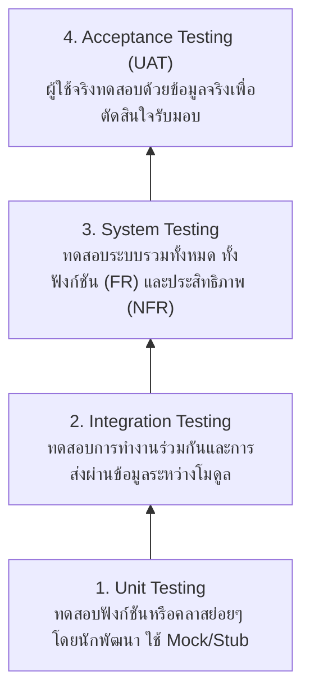

---
tags:
  - software-engineering
  - new-curriculum-68
  - testing
  - qa
  - tdd
  - black-box
  - bva
  - lesson-10
created: 2026-09-08
updated: 2026-09-08
curriculum: New 2568
type: lesson
---

# สไลด์ 10: การทดสอบซอฟต์แวร์และการประกันคุณภาพ (Week 9 Software Testing & QA)

> [!INFO] 🏷️ ข้อมูลบทเรียน
> - **โฟลเดอร์สไลด์ต้นฉบับ:** `01_New_Slides_68/10_Week9_Software_Testing_and_QA.pdf`
> - **หมวดหมู่:** ⚡ หลักสูตรใหม่ 2568 (New 68 Core)
> - **เป้าหมาย:** ⭐ ข้อสอบปลายภาค (Final Exam) เน้น V&V, 4 ระดับการทดสอบ, วงจร TDD, และเทคนิค Equivalence Partitioning & BVA

---

## 1. การทวนสอบและการรับรองความถูกต้อง (Verification & Validation: V&V)

* **Verification ("Are we building the product right?"):** ตรวจสอบว่าระบบถูกสร้างขึ้นตามสเปกและมาตรฐานวิศวกรรมหรือไม่ (ตรวจโค้ด, ตรวจแบบจำลอง, ตรวจสอบเอกสาร)
* **Validation ("Are we building the right product?"):** ตรวจสอบว่าระบบตอบโจทย์ความต้องการและการทำงานจริงของผู้ใช้หรือไม่

---

## 2. ลำดับขั้นการทดสอบ 4 ระดับ (Software Testing Hierarchy)

---

## 3. การพัฒนาด้วยการทดสอบนำ (Test-Driven Development: TDD)

วงจร **Red - Green - Refactor**:
1. 🔴 **Red:** เขียน Test Case อัตโนมัติที่ทดสอบฟีเจอร์ใหม่ แล้วรันให้ได้ผลลัพธ์ว่า **Fail** (เพราะยังไม่มีโค้ด)
2. 🟢 **Green:** เขียนโค้ดจริงเพียงเท่าที่จำเป็นที่สุดเพื่อให้ Test Case **Pass**
3. 🔵 **Refactor:** ทำความสะอาดโครงสร้างโค้ด ลบความซ้ำซ้อน โดยรันเทสต์ซ้ำเพื่อให้มั่นใจว่ายัง Pass 100%

---

## 4. เทคนิคการออกแบบ Black-Box Test Cases

### 4.1 Equivalence Partitioning (การแบ่งกลุ่มสมมูล)
แบ่งข้อมูลนำเข้าออกเป็นกลุ่มสมมูล (Partition) แล้วเลือกตัวแทนมาทดสอบกลุ่มละ 1 ค่า:
* **Valid Equivalence Classes:** กลุ่มข้อมูลที่ระบบยอมรับ
* **Invalid Equivalence Classes:** กลุ่มข้อมูลที่ระบบต้องปฏิเสธหรือแจ้ง Error

### 4.2 Boundary Value Analysis (การวิเคราะห์ค่าขอบเขต)
บั๊กในโปรแกรมมักเกิดขึ้นที่ **จุดรอยต่อขอบเขตของเงื่อนไข**:
* ตัวอย่าง: เงื่อนไขอายุ $18 \le \text{Age} \le 60$
  * ขอบเขตล่าง ($18$): ทดสอบ $17$ (ต่ำกว่าขอบ), $18$ (ที่ขอบ), $19$ (เหนือขอบ)
  * ขอบเขตบน ($60$): ทดสอบ $59$ (ต่ำกว่าขอบ), $60$ (ที่ขอบ), $61$ (เหนือขอบ)
