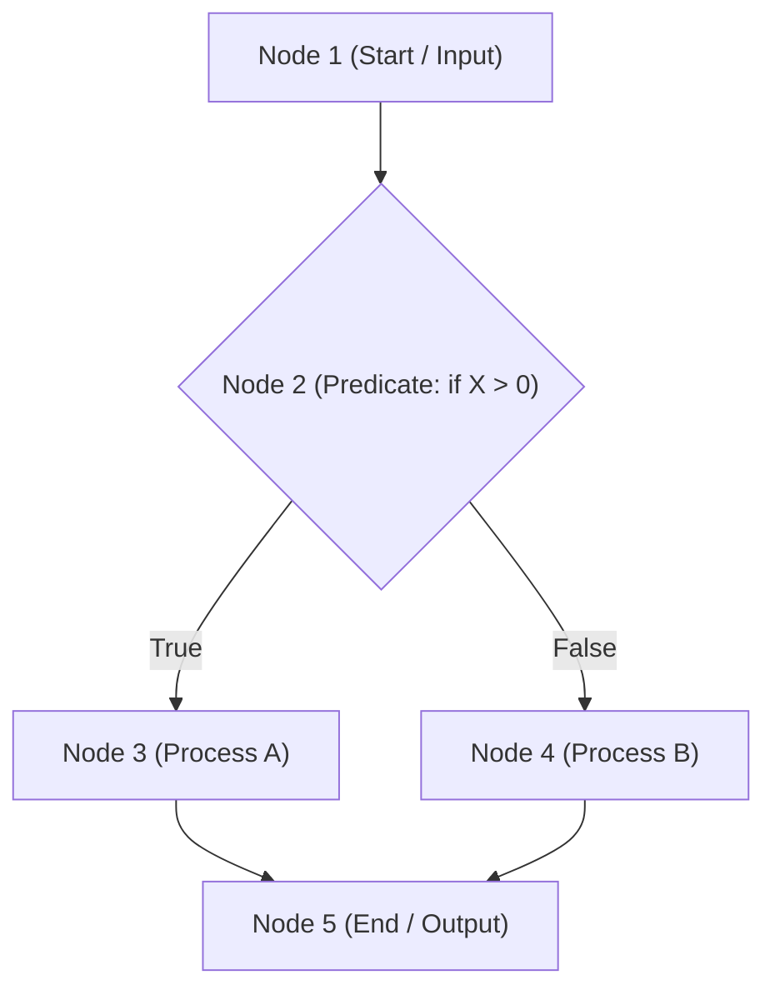

---
tags:
  - software-engineering
  - new-curriculum-68
  - white-box
  - cyclomatic-complexity
  - cfg
  - basis-path
  - lesson-11
created: 2026-09-08
updated: 2026-09-08
curriculum: New 2568
type: lesson
---

# สไลด์ 11: การวัดผลเชิงโครงสร้างและ Cyclomatic Complexity (Week 10 Testing Metrics)

> [!INFO] 🏷️ ข้อมูลบทเรียน
> - **โฟลเดอร์สไลด์ต้นฉบับ:** `01_New_Slides_68/11_Week10_Testing_Metrics_Cyclomatic.pdf`
> - **หมวดหมู่:** ⚡ หลักสูตรใหม่ 2568 (New 68 Core)
> - **เป้าหมาย:** ⭐ ข้อสอบปลายภาคข้อคำนวณ (Final Exam) เน้นการวาด Control Flow Graph, การนับ Node/Edge/Predicate Node, และการคำนวณสูตร McCabe's Cyclomatic Complexity

---

## 1. การทดสอบกล่องขาว (White-Box Testing)

การทดสอบเชิงโครงสร้าง (Structural Testing) ที่ผู้ทดสอบมองเห็นซอร์สโค้ดภายในทั้งหมด มุ่งเน้น:
* Statement Coverage (ทดสอบให้ครบทุกบรรทัดคำสั่ง)
* Branch / Decision Coverage (ทดสอบให้ครบทุกกิ่งจริง/เท็จ)
* **Basis Path Testing (การทดสอบเส้นทางอิสระพื้นฐาน)**

---

## 2. กราฟควบคุมการไหล (Control Flow Graph: CFG)

การแปลงโค้ดให้อยู่ในรูปกราฟ:
* **Node ($N$):** แทนหนึ่งหรือกลุ่มคำสั่งที่ประมวลผลตามลำดับ (Sequential statement)
* **Edge ($E$):** เส้นลูกศรเชื่อมทิศทางการทำงานจากโหนดหนึ่งไปอีกโหนดหนึ่ง
* **Predicate Node ($P$):** โหนดเงื่อนไขที่มีเส้นทางแยกออกตั้งแต่ 2 เส้นทางขึ้นไป เช่น `if`, `while`, `for`, `case`



---

## 3. สูตรคำนวณ Cyclomatic Complexity ($V(G)$)

McCabe's Cyclomatic Complexity กำหนดขอบเขตบนของ **จำนวนเส้นทางอิสระ (Linearly Independent Paths)** ที่ต้องสร้าง Test Case ให้ครอบคลุม:

### 3 วิธีในการคำนวณ:
1. **สูตรอิงเส้นและโหนด:**
   $$V(G) = E - N + 2$$
   *(เมื่อ $E$ คือ จำนวน Edges และ $N$ คือ จำนวน Nodes)*

2. **สูตรอิงโหนดเงื่อนไข (วิธีที่เร็วที่สุดในการสอบ):**
   $$V(G) = P + 1$$
   *(เมื่อ $P$ คือ จำนวน Predicate Nodes เช่น `if`, `while`, `for`, `case`)*

3. **สูตรอิงจำนวนพื้นที่ปิดและเปิด:**
   $$V(G) = \text{Number of Enclosed Regions} + 1$$

---

## 4. ตัวอย่างการคำนวณในข้อสอบจริง

**ตัวอย่างโค้ด:**
```java
public void checkEligibility(int age, boolean hasLicense) {
    if (age >= 18) {                    // Predicate 1
        if (hasLicense) {               // Predicate 2
            System.out.println("Allowed to drive");
        } else {
            System.out.println("Must get a license");
        }
    } else {
        System.out.println("Underage");
    }
}
```

**การคำนวณ:**
* มีเงื่อนไขตัดสินใจ 2 จุด (`age >= 18` และ `hasLicense`) $\rightarrow P = 2$
* คำนวณตามสูตร: $V(G) = P + 1 = 2 + 1 = \mathbf{3}$
* **สรุป:** ต้องออกแบบ Test Cases อย่างน้อย **3 ชุด (3 Basis Paths)** เพื่อทดสอบให้ครอบคลุมโค้ดนี้ 100%:
  1. Path 1: `age < 18` (Underage)
  2. Path 2: `age >= 18` และ `hasLicense = false` (Must get a license)
  3. Path 3: `age >= 18` และ `hasLicense = true` (Allowed to drive)
