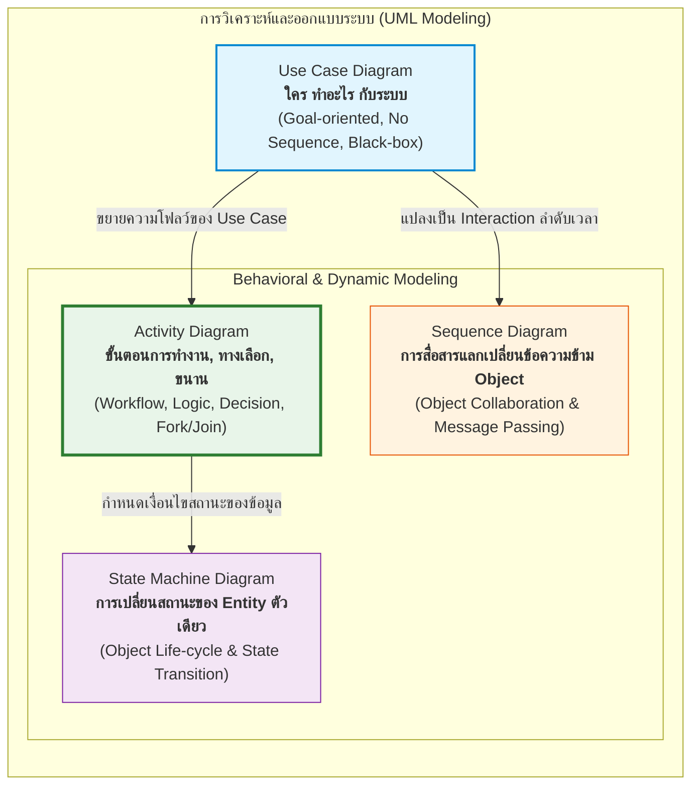

---
tags:
  - software-engineering
  - new-curriculum-68
  - uml
  - activity-diagram
  - behavioral-diagram
  - lessons
  - lecture-12
created: 2026-09-22
updated: 2026-09-22
lecture: 12
type: lecture-note
curriculum: New 2568
aliases:
  - 12_Activity_Diagrams
  - Activity_Diagrams
  - ActivityDiagram
---

# 🔄 บทเรียน: แผนภาพกิจกรรม (Activity Diagrams) & การวิเคราะห์กระบวนการทำงาน (Workflow Modeling)

> [!INFO] 🏷️ ข้อมูลบทเรียนและเอกสารอ้างอิง
> - **สไลด์บรรยายหลัก:** [`01_New_Slides_68/12_ActivityDiagram.pdf`](file:///home/few/Projects/software-engineering/01_New_Slides_68/12_ActivityDiagram.pdf) หรือ [`04_Work_and_Homework/Activity diagram/ActivityDiagram.pdf`](file:///home/few/Projects/software-engineering/04_Work_and_Homework/Activity%20diagram/ActivityDiagram.pdf) (สไลด์ทางการ 27 หน้า)
> - **โฟลเดอร์การบ้านในชั้นเรียน:** [`04_Work_and_Homework/Activity diagram/`](file:///home/few/Projects/software-engineering/04_Work_and_Homework/Activity%20diagram/) (แบบฝึกหัด ATM: Deposit, Withdraw, Transfer)
> - **คู่มือเชื่อมโยง:** [[05_Use_Case_Diagrams|Use Case Diagrams]] (ระดับภาพรวมบริการ) สู่ Activity Diagrams (ระดับขั้นตอนและ Business Logic)
> - **หมวดหมู่:** 📘 ทฤษฎีและแนวทางปฏิบัติด้าน Behavioral Modeling (UML 2.x)

---

## 🧭 แผนผังเปรียบเทียบ: จุดยืนของ Activity Diagram ใน UML

---

## 📑 สารบัญเนื้อหา (Table of Contents)
1. [นิยามและความสำคัญของ Activity Diagram (Definition & Purpose)](#1-นิยามและความสำคัญของ-activity-diagram)
2. [สัญลักษณ์มาตรฐาน UML (Notations & Semantics)](#2-สัญลักษณ์มาตรฐาน-uml)
   - 2.1 Start Point & End Point
   - 2.2 Activity State & Completion Transitions
   - 2.3 Guard Conditions & Decision / Merge Nodes
   - 2.4 Parallel Processing: Fork & Join Nodes
   - 2.5 Swimlanes / Partitions (การแบ่งเลนตามฝ่าย/ระบบ)
3. [ตัวอย่างเจาะลึกจากสไลด์บรรยาย (Slide Walkthroughs)](#3-ตัวอย่างเจาะลึกจากสไลด์บรรยาย)
   - ตัวอย่างที่ 1: Print Customer Report & จัดการ Disk Full
   - ตัวอย่างที่ 2: Login Use Case Workflow (พร้อมกรณี First Login)
   - ตัวอย่างที่ 3: Change Password Workflow
   - ตัวอย่างที่ 4: ATM System Architecture (User vs Card Controller)
4. [เฉลยเวิร์กช็อปและการบ้าน: ATM Core Operations](#4-เฉลยเวิร์กช็อปและการบ้าน-atm-core-operations)
   - 4.1 ฝากเงิน (Deposit Activity Diagram)
   - 4.2 ถอนเงิน (Withdrawal Activity Diagram)
   - 4.3 โอนเงิน (Transfer Activity Diagram)
5. [การประยุกต์ใช้: Activity Diagram ระบบยืม–คืนอุปกรณ์ห้องแล็บ (Case Study 3 Integration)](#5-การประยุกต์ใช้-activity-diagram-ระบบยืมคืนอุปกรณ์ห้องแล็บ)
6. [ข้อสอบ & กับดักที่พบบ่อย (Common Pitfalls)](#6-ข้อสอบ--กับดักที่พบบ่อย)

---

## 1. นิยามและความสำคัญของ Activity Diagram

*📄 อ้างอิงสไลด์หน้า 2*

> [!NOTE] 💡 คำจำกัดความตามมาตรฐาน (Martin Fowler & Craig Larman)
> **Activity Diagram** คือ แผนภาพพฤติกรรม (Behavioral Diagram) ชนิดหนึ่งใน UML ที่จำลอง **ลำดับขั้นตอนการทำงาน (Procedure / Workflow)** ของระบบหรือผู้ใช้งาน โดยแสดงกิจกรรมที่เกิดขึ้น, จุดตัดสินใจ (Decisions), เงื่อนไข (Guards), และการทำงานพร้อมกันแบบคู่ขนาน (Parallel / Concurrency)

### เมื่อใดควรใช้ และเมื่อใดไม่ควรใช้?
* ✅ **ใช้เมื่อ:**
  * ต้องการเข้าใจกระบวนการทำงานของธุรกิจ (Understanding Business Work-Flow)
  * ต้องการวิเคราะห์ขั้นตอนและโฟลว์ภายใน Use Case (Analyzing Single or Tied Use Cases)
  * ต้องการอธิบายอัลกอริทึมหรือการทำงานที่ซับซ้อนที่มีเงื่อนไข If-Else หรือ Fork-Join
* ❌ **ไม่ควรใช้เมื่อ:**
  * ต้องการวิเคราะห์การสื่อสารระหว่าง Objects (Object Collaboration) $\rightarrow$ *ให้ใช้ Sequence Diagram หรือ Collaboration Diagram แทน*
  * ต้องการวิเคราะห์การเปลี่ยนสถานะของวัตถุตัวใดตัวหนึ่ง (Object Life Cycle) $\rightarrow$ *ให้ใช้ State Machine Diagram แทน*

---

## 2. สัญลักษณ์มาตรฐาน UML (Notations & Semantics)

*📄 อ้างอิงสไลด์หน้า 3 - 21*

| สัญลักษณ์ | ชื่อเรียก (Name) | รูปร่าง (Shape) | ความหมายและกฎการใช้งาน (Semantics) |
|:---:|:---|:---:|:---|
| ⚫ | **Initial Node / Start Point** | วงกลมทึบสีดำ | จุดเริ่มต้นของกระบวนการ ในไดอะแกรมหนึ่งควรมี 1 จุด และนิยมวางมุมซ้ายบน |
| 🔲 *(ขอบมน)* | **Activity State / Action Node** | สี่เหลี่ยมขอบมน | แสดงขั้นตอน กิจกรรม หรืองานที่กำลังทำ (เช่น "คำนวณภาษี", "ส่งอีเมล") |
| ➡️ | **Transition (Completion Transition)** | เส้นลูกศรทึบ | ลำดับการไหล เมื่อกิจกรรมต้นทางเสร็จสิ้น จะไหลไปยังกิจกรรมถัดไปโดยอัตโนมัติ |
| `[guard]` | **Guard Condition** | ข้อความในวงเล็บ `[...]` | เงื่อนไขกำกับบนเส้น Transition หากเงื่อนไขเป็นจริง (True) จึงจะผ่านเส้นทางนั้นได้ |
| 🔷 | **Decision Node** | สี่เหลี่ยมข้าวหลามตัด (1 เข้า $\rightarrow$ N ออก) | จุดตัดสินใจเลือกเส้นทางตาม Guard Conditions (ห้ามใส่ข้อความข้างใน ให้ใส่บนเส้นลูกศร) |
| 🔷 | **Merge Node** | สี่เหลี่ยมข้าวหลามตัด (N เข้า $\rightarrow$ 1 ออก) | จุดรวมเส้นทางเลือกที่แยกออกไป ให้กลับมารวมเป็นสายเดียวกัน |
| ➖ *(แถบทึบ)* | **Fork Node** | แถบเส้นทึบหนา (1 เข้า $\rightarrow$ N ออก) | จุดแยกการทำงานออกเป็นสาย **คู่ขนาน (Parallel / Concurrent)** ที่ทำพร้อมกันได้ |
| ➖ *(แถบทึบ)* | **Join Node** | แถบเส้นทึบหนา (N เข้า $\rightarrow$ 1 ออก) | จุดซิงโครไนซ์ (Synchronization Bar) ต้องรอให้ทุกสายขนานทำงานเสร็จครบก่อนจึงจะไปต่อ |
| 🔘 | **Final Node / End Point** | วงกลมทึบมีวงแหวนล้อมรอบ | จุดสิ้นสุดของโฟลว์การทำงาน |
| 🏊‍♂️ | **Swimlanes / Partitions** | แถบคอลัมน์แบ่งพื้นที่ | ใช้แบ่งแยกความรับผิดชอบของแต่ละบทบาท, แผนก, หรือระบบย่อย |

---

## 3. ตัวอย่างเจาะลึกจากสไลด์บรรยาย (Slide Walkthroughs)

### ตัวอย่างที่ 1: Print Customer Report & Guard Condition
*📄 อ้างอิงสไลด์หน้า 8, 14*
เมื่อผู้ใช้เรียก `PrintAllCustomers()` ระบบจะแสดงหน้าต่างแจ้งเตือน, สร้างไฟล์ Postscript, สั่งพิมพ์, และปิดหน้าต่างแจ้งเตือน โดยมีจุดตัดสินใจตรวจเช็คพื้นที่ดิสก์:

```mermaid
flowchart TD
    Start(( )) --> CheckDisk{ }
    CheckDisk -->|"[disk full]"| ShowFull["Show MessageBox<br/>'Disk full' on Screen"]
    CheckDisk -->|"[free disk space]"| ShowPrint["Show MessageBox<br/>'Printing' on Screen"]
    
    ShowPrint --> CreatePS["Create postscript file"]
    CreatePS --> SendPrint["^Printer.Print(file)<br/>Send postscript file to printer"]
    SendPrint --> RemoveMsg["Remove MessageBox"]
    
    ShowFull --> EndNode((( )))
    RemoveMsg --> EndNode((( )))

    style Start fill:#000
    style EndNode fill:#000,stroke:#000,stroke-width:3px
```

---

### ตัวอย่างที่ 2: Login Use Case Activity Diagram
*📄 อ้างอิงสไลด์หน้า 23*
ไดอะแกรมจำลองการเข้าสู่ระบบที่มีการตรวจสอบรหัสผ่าน, แจ้งเตือนเมื่อผิดพลาด, และเช็คกรณีเข้าสู่ระบบครั้งแรก (First Login):

```mermaid
flowchart TD
    S(( )) --> AskCred["Ask for User Name<br/>and Password"]
    AskCred --> EnterCred["Username and Password entered"]
    EnterCred --> Verify["Verify User Name<br/>and Password"]
    
    Verify --> Decision1{ }
    Decision1 -->|"[Invalid login]"| NotifyUser["Notify User"]
    NotifyUser --> RecordErr["Record Error"]
    RecordErr --> AskCred

    Decision1 -->|"[valid login]"| Decision2{ }
    Decision2 -->|"[first login]"| ChgPass["Include Change Password"]
    Decision2 -->|"[not first login]"| Welcome["Welcome User to the System"]
    ChgPass --> Welcome
    Welcome --> EndNode((( )))

    style S fill:#000
    style EndNode fill:#000,stroke:#000,stroke-width:3px
    style Decision1 fill:#fff,stroke:#333
    style Decision2 fill:#fff,stroke:#333
```

---

### ตัวอย่างที่ 3: Change Password Use Case Activity Diagram
*📄 อ้างอิงสไลด์หน้า 24*
จำลองการเปลี่ยนรหัสผ่านที่มีการตรวจสอบรหัสเดิม, ความตรงกันของรหัสใหม่ 2 ครั้ง, และการบันทึกลงฐานข้อมูล:

```mermaid
flowchart TD
    S(( )) --> AskPass["Ask for Current Password,<br/>New Password Twice"]
    AskPass --> EnterPass["Password entered"]
    EnterPass --> ValCurrent["Validate Current Password"]
    
    ValCurrent --> D1{ }
    D1 -->|"[Invalid]"| NotifyBad["Notify User"]
    NotifyBad --> RecErr1["Record Error"]
    RecErr1 --> AskPass

    D1 -->|"[Valid]"| VerMatch["Verify New Password Match"]
    VerMatch --> D2{ }
    D2 -->|"[Do not Match]"| NotifyNoMatch["Notify User"]
    NotifyNoMatch --> AskPass

    D2 -->|"[Match]"| StorePass["Store New Password"]
    StorePass --> D3{ }
    D3 -->|"[Error storing data]"| DispErr["Display Error"]
    DispErr --> RecErr2["Record Error"]
    RecErr2 --> EndNode((( )))

    D3 -->|"[Success]"| DispSuccess["Display Success Message"]
    DispSuccess --> EndNode((( )))

    style S fill:#000
    style EndNode fill:#000,stroke:#000,stroke-width:3px
```

---

## 4. เฉลยเวิร์กช็อปและการบ้าน: ATM Core Operations

*📄 อ้างอิงโจทย์ในการบ้าน `04_Work_and_Homework/Activity diagram/Screenshot 2026-02-15 182528.png`:*
> **"Do an activity diagram for deposit, WD and transfer"**

### 4.1 แผนภาพการฝากเงิน (ATM Deposit Activity Diagram)

```mermaid
flowchart TD
    StartNode(( )) --> InsertAuth["Insert ATM Card /<br/>Log in to Mobile Banking"]
    InsertAuth --> SelectDeposit["Select 'Deposit' Operation"]
    SelectDeposit --> EnterAmount["Enter Deposit Amount /<br/>Insert Cash into Deposit Slot"]
    EnterAmount --> ValidateCash{ }
    
    ValidateCash -->|"[Invalid / Unrecognized Cash]"| DispErr["Display Error Message &<br/>Return Rejected Banknotes"]
    DispErr --> ReturnCancel["Cancel or Retry Deposit"]
    ReturnCancel --> EndFailed((( )))

    ValidateCash -->|"[Valid Cash Counted]"| UpdateBal["Update Account Balance<br/>Credit Customer Account"]
    UpdateBal --> Complete["Print Receipt &<br/>Show Confirmation on Screen"]
    Complete --> EndSuccess((( )))

    style StartNode fill:#000
    style EndSuccess fill:#000,stroke:#2e7d32,stroke-width:3px
    style EndFailed fill:#000,stroke:#c62828,stroke-width:3px
    style ValidateCash fill:#fff,stroke:#333
```

---

### 4.2 แผนภาพการถอนเงิน (ATM Withdrawal Activity Diagram)

```mermaid
flowchart TD
    StartNode(( )) --> InsertAuth["Insert ATM Card /<br/>Log in to Mobile Banking"]
    InsertAuth --> SelectWD["Select 'Withdraw' Operation"]
    SelectWD --> EnterWDAmount["Enter Withdrawal Amount"]
    EnterWDAmount --> CheckBal{ }

    CheckBal -->|"[Insufficient Funds / Exceed Limit]"| DispInsuff["Display 'Insufficient Funds' /<br/>Limit Exceeded Notice"]
    DispInsuff --> EndCancel((( )))

    CheckBal -->|"[Sufficient Funds]"| DebitAcc["Debit Sender Account<br/>(Deduct Balance)"]
    DebitAcc --> DispenseCash["Dispense Cash through Slot"]
    DispenseCash --> PrintReceipt["Print Receipt / Send e-Slip"]
    PrintReceipt --> CompleteTx["Eject Card & Complete Transaction"]
    CompleteTx --> EndSuccess((( )))

    style StartNode fill:#000
    style EndSuccess fill:#000,stroke:#2e7d32,stroke-width:3px
    style EndCancel fill:#000,stroke:#c62828,stroke-width:3px
    style CheckBal fill:#fff,stroke:#333
```

---

### 4.3 แผนภาพการโอนเงิน (ATM Transfer Activity Diagram)

```mermaid
flowchart TD
    StartNode(( )) --> InsertAuth["Insert ATM Card /<br/>Log in to Mobile Banking"]
    InsertAuth --> SelectTransfer["Select 'Transfer' Operation"]
    SelectTransfer --> EnterRecipient["Enter Recipient Information<br/>(Bank, Account No., Amount)"]
    EnterRecipient --> CheckBal{ }

    CheckBal -->|"[Insufficient Funds]"| DispInsuff["Display 'Insufficient Funds'"]
    DispInsuff --> CancelEnd((( )))

    CheckBal -->|"[Sufficient Funds]"| CheckRecipient["Check & Verify Recipient Information<br/>(Account Existence & Name Match)"]
    CheckRecipient --> RecipientValid{ }

    RecipientValid -->|"[Account Not Found / Invalid]"| DispAccErr["Display 'Invalid Recipient Account'"]
    DispAccErr --> CancelEnd

    RecipientValid -->|"[Account Valid]"| ConfirmTx["Prompt User to Confirm Details"]
    ConfirmTx --> DebitSender["Debit Sender Account"]
    DebitSender --> CreditReceiver["Credit Recipient Account"]
    CreditReceiver --> PrintConf["Display Confirmation &<br/>Print Transfer Receipt"]
    PrintConf --> SuccessEnd((( )))

    style StartNode fill:#000
    style SuccessEnd fill:#000,stroke:#2e7d32,stroke-width:3px
    style CancelEnd fill:#000,stroke:#c62828,stroke-width:3px
    style CheckBal fill:#fff,stroke:#333
    style RecipientValid fill:#fff,stroke:#333
```

---

## 5. การประยุกต์ใช้: Activity Diagram ระบบยืม–คืนอุปกรณ์ห้องแล็บ

ตัวอย่างบูรณาการเชื่อมโยงกับ [[05_Case_Study_3_Lab_Equipment_Borrowing|Case Study 3 (ระบบยืม–คืนห้องปฏิบัติการ)]] เพื่อแสดงให้เห็นว่า Use Case `Reserve Equipment` แปลงเป็น Activity Diagram แบบมี Swimlanes อย่างไร:

```mermaid
flowchart TB
    subgraph MemberLane ["สมาชิก (Student / Staff)"]
        M_Start(( ))
        M_Select["เลือกอุปกรณ์ & วันเวลาที่ต้องการ"]
        M_SubmitReq["กรอกเหตุผลขออนุมัติพิเศษ"]
        M_GetSlip["รับรหัสยืนยันการจอง (Reservation ID)"]
        M_End((( )))
    end

    subgraph SystemLane ["ระบบสารสนเทศ (Core System)"]
        S_VerifyPerm["ตรวจสอบสิทธิ์สมาชิก (Include)"]
        S_CheckAvail["ตรวจสอบสถานะความพร้อมอุปกรณ์ (Include)"]
        S_CheckSpecial{อุปกรณ์พิเศษ?}
        S_CreatePending["บันทึกรายการสถานะ Pending Approval"]
        S_ConfirmReserve["บันทึกสถานะการจองสำเร็จ (Reserved)"]
    end

    subgraph OfficerLane ["เจ้าหน้าที่แล็บ (Lab Officer)"]
        O_Notify["รับการแจ้งเตือนคำขอ"]
        O_Review["พิจารณาคำขอพิเศษ"]
        O_Decision{อนุมัติหรือไม่?}
        O_Reject["ปฏิเสธคำขอและแจ้งเหตุผล"]
    end

    M_Start --> M_Select
    M_Select --> S_VerifyPerm
    S_VerifyPerm --> S_CheckAvail
    S_CheckAvail --> S_CheckSpecial
    
    S_CheckSpecial -->|"[อุปกรณ์ทั่วไป]"| S_ConfirmReserve
    S_CheckSpecial -->|"[อุปกรณ์มูลค่าสูง / เฉพาะทาง]"| M_SubmitReq
    
    M_SubmitReq --> S_CreatePending
    S_CreatePending --> O_Notify
    O_Notify --> O_Review
    O_Review --> O_Decision

    O_Decision -->|"[อนุมัติ]"| S_ConfirmReserve
    O_Decision -->|"[ไม่อนุมัติ]"| O_Reject
    O_Reject --> M_End

    S_ConfirmReserve --> M_GetSlip
    M_GetSlip --> M_End

    style M_Start fill:#000
    style M_End fill:#000,stroke:#000,stroke-width:3px
    style S_CheckSpecial fill:#fff,stroke:#333
    style O_Decision fill:#fff,stroke:#333
    style MemberLane fill:#e3f2fd,stroke:#1565c0
    style SystemLane fill:#e8f5e9,stroke:#2e7d32
    style OfficerLane fill:#fff3e0,stroke:#e65100
```

---

## 6. ข้อสอบ & กับดักที่พบบ่อย (Common Pitfalls)

> [!CAUTION] ⚠️ จุดที่มักเสียคะแนนในการวาด Activity Diagram
> 1. **ใส่ตัวหนังสือลงในสี่เหลี่ยมข้าวหลามตัด (Decision Diamond):**
>    - ใน UML สี่เหลี่ยมข้าวหลามตัด **ห้ามใส่ข้อความข้างใน** (ต่างจาก Flowchart ทั่วไป) ข้อความเงื่อนไขต้องเขียนเป็น Guard Condition ในรูป `[condition]` กำกับบนเส้นลูกศรที่พุ่งออกเท่านั้น
> 2. **สับสนระหว่าง Decision / Merge กับ Fork / Join:**
>    - **Decision / Merge (ข้าวหลามตัด):** เลือกเดินเพียง **เส้นเดียว (Alternative / OR)**
>    - **Fork / Join (แถบเส้นทึบ):** ทำงานพร้อมกัน **ทุกเส้น (Concurrency / AND)** ห้ามใช้แถบเส้นทึบมาแทนจุด If-Else!
> 3. **กฎของ Fork และ Join:**
>    - Fork มี **1 ทางเข้า $\rightarrow$ N ทางออก**
>    - Join มี **N ทางเข้า $\rightarrow$ 1 ทางออก**
>    - ห้ามต่อลูกศรเข้า Fork หลายเส้นโดยไม่ผ่าน Merge มาก่อน
> 4. **ลืมระบุ Guard Condition ให้ครบทุกทางเลือก:**
>    - เมื่อมีจุด Decision ทางแยก ต้องมี Guard กำกับครบทุกเส้น (เช่น `[Valid]` และ `[Invalid]`) มิฉะนั้นโฟลว์จะไม่สมบูรณ์

---

## 🔗 ลิงก์เชื่อมโยงเอกสารที่เกี่ยวข้อง
- 📘 [[05_Use_Case_Diagrams|Lecture 4: ทฤษฎี Use Case Diagram ฉบับสมบูรณ์]]
- 🔬 [[05_Case_Study_3_Lab_Equipment_Borrowing|Case Study 3: ระบบยืม-คืนอุปกรณ์แล็บ]]
- 📂 [โฟลเดอร์แบบฝึกหัด Activity Diagram](../../04_Work_and_Homework/Activity%20diagram/)
- 📑 [[Software Engineering Index|สารบัญใหญ่ระบบความรู้ Software Engineering]]
