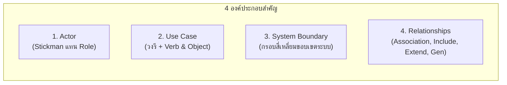
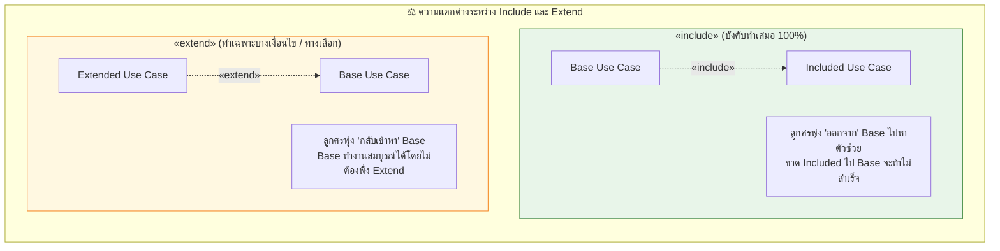
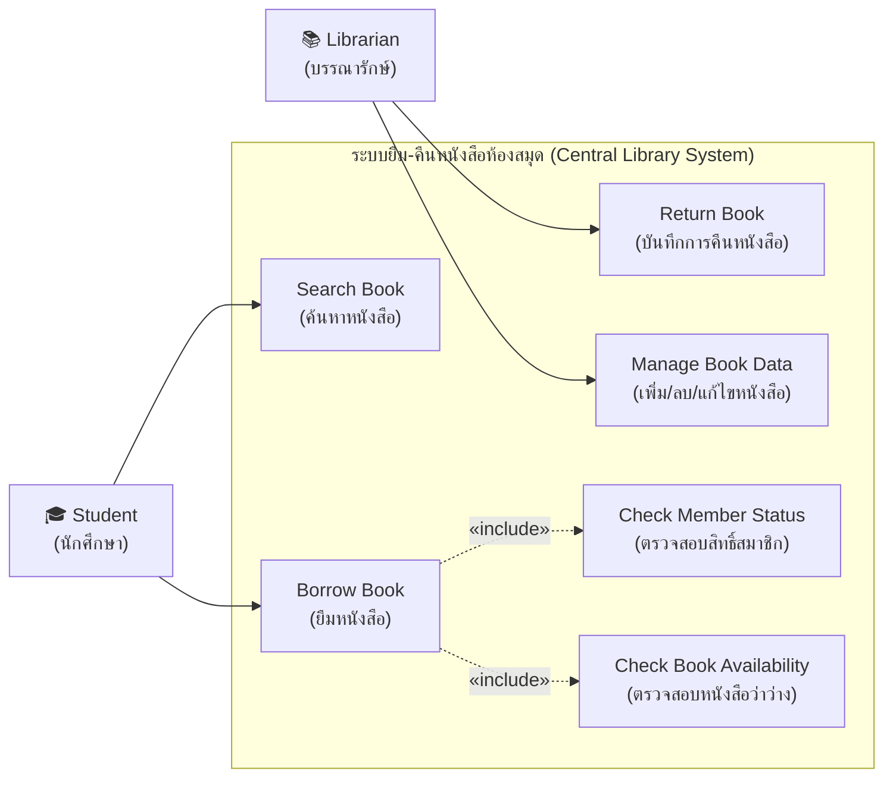

---
tags:
  - software-engineering
  - new-curriculum-68
  - lecture-recording
  - use-case
  - library-system
  - in-class-lecture
  - exam-guide
created: 2026-09-15
updated: 2026-09-15
lecture: 4
type: in-class-guide
session_date: 2026-09-15
aliases:
  - In-Class Lecture 15 Sep 2026
  - Use Case In-Class Recording Notes
---

# สรุปถอดเทปเสียงบรรยายสดในห้องเรียน: Use Case Modeling, องค์ประกอบ, Include vs Extend & กรณีศึกษาระบบห้องสมุด

> [!INFO] 🎙️ **ข้อมูลการบันทึกเสียงในชั้นเรียน (Audio Recording Metadata)**
> - **วิชา:** วิศวกรรมซอฟต์แวร์ (Software Engineering) — ภาคการศึกษา 2568
> - **วันและเวลาที่บรรยาย:** วันอังคารที่ 15 กันยายน 2569 เวลา 09:26 น. - 10:27 น.
> - **ไฟล์เสียงต้นฉบับ:** [`SE20260915_092638.aac`](file:///C:/Project/Voice/Success/SE20260915_092638.aac) (ความยาว 1 ชั่วโมง 00 นาที 27 วินาที)
> - **ผู้บรรยาย:** อาจารย์ประจำวิชาวิศวกรรมซอฟต์แวร์
> - **บทเรียนอ้างอิงใน Wiki:**
>   - 📘 บทเรียนหลัก: [[05_Use_Case_Diagrams|Lecture 4: Use Case Modeling Master Guide]]
>   - 📚 กรณีศึกษา 1: [[05_Case_Study_1_Library_System|ระบบยืม-คืนหนังสือห้องสมุด (Library System)]]
>   - 🎓 กรณีศึกษา 2: [[05_Case_Study_2_University_Registration|ระบบลงทะเบียนเรียนออนไลน์ (University Registration)]]

---

## สารบัญเนื้อหาบรรยาย (Lecture Contents)
1. [[#พาร์ทที่ 1: ปรัชญาการมองระบบ — ผู้ใช้ต้องการอะไร vs ปุ่มกดบนหน้าจอ|พาร์ทที่ 1: ปรัชญาการมองระบบ — ผู้ใช้ต้องการอะไร vs ปุ่มกด]]
2. [[#พาร์ทที่ 2: สี่องค์ประกอบหลักของ Use Case Diagram (Actor, Use Case, Boundary, Relation)|พาร์ทที่ 2: สี่องค์ประกอบหลักของ Use Case Diagram]]
3. [[#พาร์ทที่ 3: เส้นความสัมพันธ์ในแผนภาพ — จุดชี้ขาดระหว่าง «include» และ «extend»|พาร์ทที่ 3: จุดชี้ขาดระหว่าง «include» และ «extend»]]
4. [[#พาร์ทที่ 4: กรณีศึกษาที่สอนสดในห้องเรียน (ตู้ ATM, ระบบ REG, และระบบยืมคืนหนังสือ)|พาร์ทที่ 4: กรณีศึกษาที่สอนสดในห้องเรียน]]
5. [[#พาร์ทที่ 5: การบ้าน การมอบหมายงาน และกิจกรรมประชาสัมพันธ์ (IAESTE)|พาร์ทที่ 5: การบ้านและกิจกรรมท้ายคาบ]]
6. [[#พาร์ทที่ 6: Checklist จุดที่มักโดนหักคะแนนในข้อสอบ|พาร์ทที่ 6: Checklist จุดที่มักโดนหักคะแนนในข้อสอบ]]

---

## พาร์ทที่ 1: ปรัชญาการมองระบบ — ผู้ใช้ต้องการอะไร vs ปุ่มกดบนหน้าจอ

*ถอดความจากไฟล์เสียง: `SE20260915_092638.aac` (นาทีที่ 00:00 - 15:00)*

### 1.1 วัตถุประสงค์แท้จริงของ Use Case Diagram
อาจารย์เปิดประเด็นการสอนด้วยการแก้ไขความเข้าใจผิดของนักศึกษาเกี่ยวกับการตั้งชื่อ Use Case:

> [!QUOTE] **คำพูดของอาจารย์:**  
> *"Order button ปุ่ม Order ไม่เหมาะสม! เพราะว่าผู้ใช้ไม่ได้มีเป้าหมายชีวิตว่าต้องการกดปุ่ม แต่เค้าต้องการสั่งซื้อนั่นเองนะครับ... งั้น Use Case ที่เหมาะสมก็คืออาจจะเป็น Order หรือ Place Order"*

- **Goal-Oriented:** Use Case ต้องสะท้อนถึง **"เป้าหมายเชิงธุรกิจของผู้ใช้งาน" (User's Goal)**
- **User Perspective:** มองจากภายนอกว่าระบบส่งมอบผลลัพธ์อะไรให้ผู้ใช้ โดยไม่สนใจโครงสร้างโค้ดภายใน
- **Traceability (การสืบย้อนความต้องการ):** Use Case Diagram ทำหน้าที่เชื่อมโยง Requirement ID (เช่น `REQ-001`, `REQ-002`) เข้าสู่ User Story, Component Architecture, Source Code และ Test Case

---

## พาร์ทที่ 2: สี่องค์ประกอบหลักของ Use Case Diagram

### 2.1 Actor (ผู้กระทำ / บทบาท)
- **สัญลักษณ์:** รูปคนกิ่งไม้ (Stickman / Stick figure) **ห้ามเติมตา จมูก ปาก ผม หรือรองเท้า**
- **Actor = Role ไม่ใช่บุคคลเจาะจง:**
  - ❌ ห้ามใช้ชื่อคน เช่น "อาจารย์สมชาย", "User 1", "Person"
  - ✅ ต้องใช้บทบาทหน้าที่ เช่น `Student`, `Instructor`, `Bank Customer`, `Technician`
- **Human Actor vs System Actor:**
  - *Human Actor:* มนุษย์ผู้ใช้งาน
  - *System Actor:* ระบบภายนอกที่ระบบของเราต้องติดต่อด้วย เช่น `Payment Gateway`, `Email Service`, `Bank System`, เครือข่ายโทรคมนาคม (AIS Fibre)
- **Primary Actor vs Supporting Actor:**
  - *Primary Actor:* ผู้สั่งการให้ Use Case เริ่มต้นทำงาน เช่น Customer กดสั่งซื้อ
  - *Supporting Actor:* ผู้สนับสนุนให้ Use Case นั้นสำเร็จ เช่น เจ้าหน้าที่ธนาคาร หรือระบบตัดบัตรเครดิต

> [!CAUTION] **ข้อห้ามเด็ดขาดของ Actor (อาจารย์ย้ำในคลาส):**
> 1. **Database ไม่ใช่ Actor!** ฐานข้อมูลเป็นส่วนประกอบภายในระบบ อยู่ภายในกรอบ System Boundary ห้ามวาดเป็น Actor ภายนอกเด็ดขาด
> 2. **Web Server / Mobile App ไม่ใช่ Actor!**

### 2.2 Use Case (หน้าที่ของระบบ)
- **สัญลักษณ์:** **วงรี (Oval) เท่านั้น!** ห้ามวาดเป็นสี่เหลี่ยม วงกลม หรือรูปทรงบิดเบี้ยว
- **การตั้งชื่อ:** ต้องเป็น **คำกริยา + กรรม/คำนาม (Verb + Object)** เช่น `Place Order`, `Withdraw Money`, `Deposit Money`, `Generate Report`, `Login`
- **Granularity:** มองภาพระดับบริการที่ส่งมอบ ห้ามลงลึกถึง Action บนหน้าจอ เช่น "Click Button", "Input Name", "Validate Email" (สิ่งเหล่านี้ต้องไปเขียนใน Activity Diagram)

### 2.3 System Boundary (ขอบเขตของระบบ)
- **สัญลักษณ์:** กรอบสี่เหลี่ยมผืนผ้า พร้อมเขียนชื่อระบบไว้ด้านบน
- **กฎเหล็กเรื่องตำแหน่ง:**
  - **Actor ต้องอยู่นอกกรอบเสมอ**
  - **Use Case ต้องอยู่ภายในกรอบเสมอ (ห้ามกระเด็นออกมานอกกรอบ)**

---

## พาร์ทที่ 3: จุดชี้ขาดระหว่าง «include» และ «extend»

อาจารย์ได้ลงลึกถึงการแยกแยะระหว่างสองความสัมพันธ์ที่นักศึกษาสับสนบ่อยที่สุด:

### 3.1 ความสัมพันธ์แบบ «include»
- ความหมาย: Base Use Case จะทำงานสำเร็จได้ **ต้องเรียกใช้อีก Use Case หนึ่งเสมอ (ทำทุกครั้ง ขาดไม่ได้)**
- ทิศทางลูกศร: **ชี้จาก Base Use Case $\rightarrow$ Included Use Case**
- ตัวอย่างในคลาส:
  - การถอนเงิน (`Withdraw Money`) หรือโอนเงิน (`Transfer Money`) $\rightarrow$ `<<include>>` $\rightarrow$ `Login / Authentication`
  - การยืมหนังสือ (`Borrow Book`) $\rightarrow$ `<<include>>` $\rightarrow$ ตรวจสอบสิทธิ์สมาชิก (`Check Member Status`) และตรวจสอบสถานะหนังสือว่าง (`Check Book Availability`)

### 3.2 ความสัมพันธ์แบบ «extend»
- ความหมาย: พฤติกรรมเสริมที่จะ **เกิดขึ้นเฉพาะบางเงื่อนไข หรือเป็นทางเลือก (ไม่เกิดเป็นประจำ)** Base Use Case ทำงานเสร็จสิ้นได้ตามปกติโดยไม่ต้องมี Extend
- ทิศทางลูกศร: **ชี้จาก Extended Use Case $\rightarrow$ Base Use Case**
- ตัวอย่างในคลาส:
  - `Login` $\leftarrow$ `<<extend>>` $\leftarrow$ `Request OTP` (เกิดขึ้นเฉพาะเมื่อล็อกอินด้วยอุปกรณ์เครื่องใหม่)
  - `Login` $\leftarrow$ `<<extend>>` $\leftarrow$ `Change Password` (ผู้ใช้ไม่ได้เปลี่ยนรหัสผ่านทุกครั้งที่ล็อกอิน เป็นพฤติกรรมทางเลือก)
  - `Place Order` $\leftarrow$ `<<extend>>` $\leftarrow$ `Apply Discount` (เกิดขึ้นเฉพาะเมื่อผู้ใช้มีโค้ดคูปองส่วนลด)

---

## พาร์ทที่ 4: กรณีศึกษาที่สอนสดในห้องเรียน

### 4.1 กรณีศึกษา 1: ระบบตู้ ATM และระบบลงทะเบียนเรียน (REG)
- **ระบบตู้ ATM:**
  - *Actors:* `Bank Customer` (ลูกค้า), `Technician` (ช่างซ่อม/พนักงานเติมเงิน), `Bank Gateway / System` (ระบบหลังบ้านธนาคาร)
  - *Concept:* บุคคลจริง 1 คน สามารถสวมได้ 2 บทบาท (ช่างเทคนิคที่มีบัญชีธนาคาร สามารถกดเงินเป็น Customer และมาไขตู้ซ่อมเป็น Technician ได้)
- **ระบบ REG (ลงทะเบียนเรียน):**
  - *Generalization:* Actor `User` สืบทอดไปยัง `Student`, `Staff`, `Professor`
  - ทุกคนต้องใช้ Use Case `Login` เหมือนกัน แต่ข้อมูลภายในและสิทธิ์ถูกสืบทอดและแยกแยะตามบทบาท

### 4.2 กรณีศึกษา 2: ระบบยืม-คืนหนังสือห้องสมุด (Library Borrow & Return System)
*โจทย์ที่อาจารย์เขียนบนกระดานและให้นักศึกษาช่วยกันคิด:*
- **Requirement:**
  1. นักศึกษาสามารถค้นหาหนังสือ และยืมหนังสือได้
  2. เจ้าหน้าที่ห้องสมุด (บรรณารักษ์) สามารถบันทึกการคืนหนังสือ และจัดการข้อมูลหนังสือ (เพิ่ม/แก้ไข/ลบ) ได้
  3. เงื่อนไขบังคับ: ก่อนยืมหนังสือ ระบบต้องตรวจสอบสิทธิ์สมาชิกของนักศึกษา และต้องตรวจสอบว่าหนังสือเล่มนั้นว่างอยู่หรือไม่
- **Use Case Diagram ที่สมบูรณ์ตามอาจารย์เฉลย:**

---

## พาร์ทที่ 5: การบ้านและกิจกรรมท้ายคาบ

1. **การบ้านเขียน Use Case Diagram:**
   - อาจารย์แจ้งว่าจะสั่งการบ้านผ่าน **Google Classroom** ให้นักศึกษาเข้าไปรับโจทย์และวาดส่งตามกำหนด
2. **กิจกรรมโครงการ IAESTE (ฝึกงานต่างประเทศ):**
   - หลังเลิกคาบ 10:00 น. มีการบรรยายโครงการฝึกงานในต่างประเทศ IAESTE ณ **ห้อง Spark ชั้น 1**

---

## พาร์ทที่ 6: Checklist จุดที่มักโดนหักคะแนนในข้อสอบ

> [!WARNING] **ตรวจเช็กก่อนส่งงาน / เข้าห้องสอบ:**
> - [ ] Use Case วาดเป็น **วงรี** เท่านั้นหรือไม่? (ห้ามวาดวงกลมหรือสี่เหลี่ยม)
> - [ ] ชื่อ Use Case ขึ้นต้นด้วย **คำกริยา (Verb + Object)** หรือไม่? (เช่น `Place Order` ไม่ใช่ `Order Button`)
> - [ ] Actor วาดเป็น **Stickman** และเป็น **Role** หรือไม่? (ห้ามใส่ชื่อบุคคลเฉพาะเจาะจง)
> - [ ] **ไม่มี Database หรือ Internal Server เป็น Actor** อยู่ในแผนภาพใช่หรือไม่?
> - [ ] Actor ทั้งหมดอยู่ **นอกกรอบ System Boundary** และ Use Case ทั้งหมดอยู่ **ในกรอบ** ใช่หรือไม่?
> - [ ] ทิศทางลูกศร **`<<include>>` ชี้ออกจาก Base ไปหาตัวช่วย** ใช่หรือไม่?
> - [ ] ทิศทางลูกศร **`<<extend>>` ชี้จากตัวเสริมกลับมาหา Base** ใช่หรือไม่?
> - [ ] ไม่มี Actor ตัวใดลอยอยู่ในอากาศโดยไม่มีเส้นเชื่อมต่อไปยัง Use Case อย่างน้อย 1 ตัว ใช่หรือไม่?
