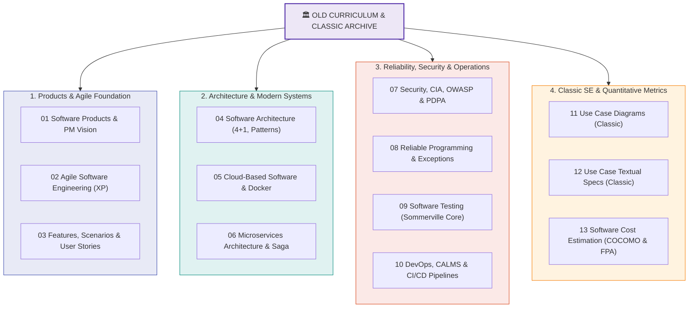
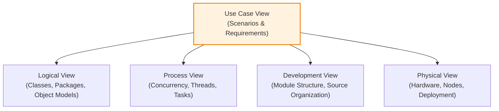
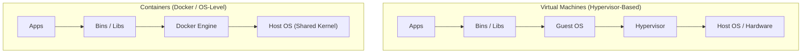

---
tags:
  - software-engineering
  - old-curriculum-classic
  - master-wiki
  - architecture
  - microservices
  - cloud
  - devops
  - cost-estimation
created: 2026-09-08
updated: 2026-09-08
curriculum: Old & Classic Textbook
type: master-wiki
---

# 🏛️ Software Engineering Master Wiki: หลักสูตรเดิมและสไลด์คลาสสิก (Old Curriculum & Classic Archive)

> [!NOTE] เอกสารสรุปหลักสูตรดั้งเดิมและสไลด์คลาสสิก (Sommerville & Classic Slides)
> สกัดและเรียบเรียงเนื้อหาจากคลังสไลด์ **`02_Old_Slides_Textbook/` (ลำดับ 01 - 13)** ครอบคลุมตำรา *Engineering Software Products* (Ian Sommerville), สไลด์คลาสสิก Use Case Diagrams/Specs, และการประมาณราคาซอฟต์แวร์ด้วย COCOMO และ Function Point Analysis (FPA)

---

## 📑 สารบัญเนื้อหา (Table of Contents)

1. [บทที่ 1: วิศวกรรมผลิตภัณฑ์ซอฟต์แวร์และวิสัยทัศน์ผลิตภัณฑ์ (Software Products & Vision)](#บทที่-1-วิศวกรรมผลิตภัณฑ์ซอฟต์แวร์และวิสัยทัศน์ผลิตภัณฑ์)
2. [บทที่ 2: เอไจล์และเทคนิค Extreme Programming (Agile SE & XP)](#บทที่-2-เอไจล์และเทคนิค-extreme-programming)
3. [บทที่ 3: สถาปัตยกรรมซอฟต์แวร์และแบบรูปสถาปัตยกรรม (Software Architecture & 4+1 Views)](#บทที่-3-สถาปัตยกรรมซอฟต์แวร์และแบบรูปสถาปัตยกรรม)
4. [บทที่ 4: ซอฟต์แวร์บนระบบคลาวด์และคอนเทนเนอร์ (Cloud-Based Software & Docker)](#บทที่-4-ซอฟต์แวร์บนระบบคลาวด์และคอนเทนเนอร์)
5. [บทที่ 5: สถาปัตยกรรมไมโครเซอร์วิส (Microservices Architecture & Saga Pattern)](#บทที่-5-สถาปัตยกรรมไมโครเซอร์วิส)
6. [บทที่ 6: ความมั่นคงปลอดภัย ความเป็นส่วนตัว และ PDPA (Security, Privacy & Compliance)](#บทที่-6-ความมั่นคงปลอดภัย-ความเป็นส่วนตัว-และ-pdpa)
7. [บทที่ 7: การเขียนโปรแกรมที่เชื่อถือได้ (Reliable Programming & Fault Tolerance)](#บทที่-7-การเขียนโปรแกรมที่เชื่อถือได้)
8. [บทที่ 8: วัฒนธรรมเดฟออปส์และกระบวนการ CI/CD (DevOps, Git & CI/CD Pipelines)](#บทที่-8-วัฒนธรรมเดฟออปส์และกระบวนการ-cicd)
9. [บทที่ 9: แบบจำลอง Use Case และสเปกข้อความคลาสสิก (Classic Use Case Modeling)](#บทที่-9-แบบจำลอง-use-case-และสเปกข้อความคลาสสิก)
10. [บทที่ 10: การประมาณการราคาและขนาดซอฟต์แวร์ (Software Cost Estimation: COCOMO & FPA)](#บทที่-10-การประมาณการราคาและขนาดซอฟต์แวร์)

---

# บทที่ 1: วิศวกรรมผลิตภัณฑ์ซอฟต์แวร์และวิสัยทัศน์ผลิตภัณฑ์

*📄 แหล่งอ้างอิง: `01_Software_Products.pdf`*

### 1.1 Project-based SE vs Product Software Engineering
* **Project-based SE:** สร้างตามสเปกและสัญญาของลูกค้าเฉพาะราย มุ่งเน้นการส่งมอบตามกำหนดเวลา งบประมาณ และขอบเขตงาน (Scope)
* **Product Software:** พัฒนาขึ้นเพื่อตอบสนองความต้องการของตลาดส่วนใหญ่ ผู้พัฒนาควบคุมทั้งทิศทาง ฟีเจอร์ และกำหนดการปล่อยเวอร์ชัน

### 1.2 แม่แบบวิสัยทัศน์ผลิตภัณฑ์ของ Moore (Moore's Product Vision Template)
$$\begin{aligned}
\text{\textbf{FOR}} &\quad [\text{target customer / กลุ่มลูกค้าเป้าหมาย}] \\
\text{\textbf{WHO}} &\quad [\text{statement of the need or opportunity / ปัญหาที่ลูกค้าเผชิญ}] \\
\text{\textbf{THE } [\text{Product Name}]} &\quad \text{is a } [\text{product category / ประเภทสินค้า}] \\
\text{\textbf{THAT}} &\quad [\text{key benefit, compelling reason to buy / จุดเด่นหลักที่แก้ปัญหา}] \\
\text{\textbf{UNLIKE}} &\quad [\text{primary competitive alternative / คู่แข่งหลักในตลาด}] \\
\text{\textbf{OUR PRODUCT}} &\quad [\text{statement of primary differentiation / ความต่างที่เหนือกว่า}]
\end{aligned}$$

### 1.3 บทบาทของ Product Manager (PM)
Product Manager อยู่กึ่งกลางระหว่าง **ธุรกิจ (Business)**, **เทคโนโลยี (Technology)** และ **ประสบการณ์ผู้ใช้ (UX)** มีปฏิสัมพันธ์ทางเทคนิค 6 ด้าน:
1. การจัดลำดับความสำคัญของฟีเจอร์ (Feature Prioritization)
2. การบริหารหนี้ทางเทคนิค (Technical Debt Management)
3. การประเมินข้อจำกัดด้านสถาปัตยกรรม (Architecture Constraints)
4. การปล่อยเวอร์ชันสู่ตลาด (Release Management)
5. การวิเคราะห์ข้อมูลการใช้งานจริง (Telemetry & Product Analytics)
6. การสื่อสารกับทีมวิศวกรรม (Engineering Alignment)

---

# บทที่ 2: เอไจล์และเทคนิค Extreme Programming

*📄 แหล่งอ้างอิง: `02_Agile_Software_Engineering.pdf` และ `03_Features_Scenarios_and_Stories.pdf`*

### 2.1 แนวทางปฏิบัติของ Extreme Programming (XP Practices)
* **Pair Programming:** การเขียนโค้ดร่วมกัน 2 คน (Driver ควบคุมคีย์บอร์ด, Navigator ตรวจสอบภาพรวมและคิดกลยุทธ์) ช่วยลดบั๊กและถ่ายทอดความรู้
* **Test-First Development (TDD):** เขียนเทสต์ก่อนเขียนโค้ดจริง
* **Refactoring:** ปรับปรุงโครงสร้างโค้ดภายในให้สะอาดโดยไม่เปลี่ยนพฤติกรรมภายนอก
* **Continuous Integration (CI):** นำโค้ดมารวมและรันบิลด์/เทสต์อัตโนมัติวันละหลายครั้ง
* **Collective Code Ownership:** ทุกคนในทีมมีสิทธิ์ปรับปรุงแก้ไขโค้ดทุกส่วน

### 2.2 Personas, Scenarios และ User Stories
* **Persona:** ตัวแทนสมมติของกลุ่มผู้ใช้จริง สร้างขึ้นจากข้อมูลวิจัย เพื่อให้ทีมเห็นภาพเป้าหมายและปัญหาของลูกค้าชัดเจน
* **User Scenario:** เรื่องเล่าหรือบริบทการใช้งานในชีวิตประจำวันของผู้ใช้เมื่อต้องเจอปัญหา
* **User Story:** ข้อกำหนดฟังก์ชันขนาดสั้น กระชับ เขียนจากมุมมองผู้ใช้

---

# บทที่ 3: สถาปัตยกรรมซอฟต์แวร์และแบบรูปสถาปัตยกรรม

*📄 แหล่งอ้างอิง: `04_Software_Architecture.pdf`*

### 3.1 แบบจำลองมุมมอง 4+1 (Kruchten's 4+1 View Model)

### 3.2 สรุปแบบรูปสถาปัตยกรรมหลัก (Architectural Patterns)
| Architectural Pattern | โครงสร้างหลัก | ข้อดี (Pros) | ข้อเสีย (Cons) | เหมาะสำหรับ |
|:---|:---|:---|:---|:---|
| **Layered (ชั้นสถาปัตยกรรม)** | แยกเป็น Presentation, Business Logic, Data Access | แยกหน้าที่ชัดเจน บำรุงรักษาง่าย | อาจเกิด Overhead ประสิทธิภาพลดลง | แอปพลิเคชันธุรกิจระดับองค์กร |
| **Repository (คลังข้อมูลรวม)** | โมดูลย่อยทั้งหมดสื่อสารผ่าน Database กลาง | จัดการข้อมูลรวมศูนย์ง่าย | คลังข้อมูลเป็นจุดคอขวดและ Single Point of Failure | IDE, ระบบสารสนเทศขนาดใหญ่ |
| **Client-Server** | Server ให้บริการ, Client เป็นผู้ร้องขอ | กระจายการประมวลผล บริหารข้อมูลจากศูนย์กลาง | เครือข่ายมีผลต่อประสิทธิภาพ | ระบบเว็บแอปพลิเคชันทั่วไป |
| **Pipe and Filter** | ข้อมูลไหลผ่านท่อประมวลผลทีละขั้นตอน | Reuse ง่าย ปรับเปลี่ยนขั้นตอนได้ยืดหยุ่น | ข้อมูลต้องแปลงไปมา สูญเสียประสิทธิภาพ | ระบบประมวลผลข้อมูล Big Data, สตรีมมิ่ง |
| **MVC (Model-View-Controller)** | แยกข้อมูล (Model), หน้าจอ (View), ควบคุม (Controller) | พัฒนา UI แยกจาก Logic ได้อย่างอิสระ | ซับซ้อนสำหรับแอปพลิเคชันขนาดเล็ก | เว็บและโมบายล์แอปสมัยใหม่ |

---

# บทที่ 4: ซอฟต์แวร์บนระบบคลาวด์และคอนเทนเนอร์

*📄 แหล่งอ้างอิง: `05_Cloud_Based_Software.pdf`*

### 4.1 รูปแบบการให้บริการคลาวด์ (Cloud Service Models)
* **IaaS (Infrastructure as a Service):** เช่าเครื่องเซิร์ฟเวอร์เสมือน เครือข่าย และสตอเรจ (เช่น AWS EC2, GCP Compute Engine) ผู้ใช้จัดการ OS และซอฟต์แวร์เอง
* **PaaS (Platform as a Service):** มีแพลตฟอร์มและรันไทม์พร้อมรันแอปพลิเคชัน (เช่น Heroku, AWS Elastic Beanstalk) ผู้ใช้จัดการเฉพาะแอปและข้อมูล
* **SaaS (Software as a Service):** ซอฟต์แวร์สำเร็จรูปพร้อมใช้งานผ่านเบราว์เซอร์ (เช่น Google Workspace, Salesforce, Microsoft 365)

### 4.2 Virtualization vs Containerization (Docker)

* **Virtual Machine:** แต่ละ VM มี Guest OS ของตัวเอง จึงใช้ทรัพยากรมาก บูตช้า (ระดับนาที)
* **Container:** แชร์內 Kernel ของ Host OS ร่วมกัน จึงเบามาก (Lightweight) เริ่มทำงานได้ในหลักวินาที

### 4.3 กลยุทธ์ Multi-tenancy สำหรับระบบ SaaS
1. **Shared Database, Shared Schema:** ลูกค้าทุกคนแชร์ฐานข้อมูลและตารางเดียวกัน แยกด้วย `tenant_id` (ต้นทุนถูกสุด แต่เสี่ยงเรื่อง Data Leak)
2. **Shared Database, Separate Schemas:** ใช้ Database เดียวกัน แต่แยก Schema หรือตารางของแต่ละผู้เช่า
3. **Separate Database per Tenant:** ลูกค้าแต่ละรายมีฐานข้อมูลแยกเด็ดขาด (ปลอดภัยสูงสุด ปรับแต่งง่าย แต่ต้นทุนและค่าบำรุงรักษาสูงสุด)

---

# บทที่ 5: สถาปัตยกรรมไมโครเซอร์วิส

*📄 แหล่งอ้างอิง: `06_Microservices_Architecture.pdf`*

### 5.1 Monolith vs Microservices Architecture
* **Monolithic Architecture:** โค้ดทั้งหมดอยู่ในโปรเจกต์เดียวกัน บิลด์และดีพลอยพร้อมกัน (Deploy together, Scale together) หากจุดใดพังอาจพังทั้งระบบ
* **Microservices Architecture:** แตกเป็นบริการย่อยๆ อิสระตามขอบเขตธุรกิจ (Bounded Context) แต่ละเซอร์วิสมีฐานข้อมูลของตัวเอง (Database per Service) สื่อสารผ่าน REST API หรือ Message Queue

### 5.2 โครงสร้างพื้นฐานสำคัญของ Microservices (Infrastructure Patterns)
* **API Gateway:** ประตูทางเข้าเดียวสำหรับ Client ทุกประเภท ทำหน้าที่ Route คำขอ, ทำ Authentication, Rate Limiting และ Caching
* **Service Discovery:** ระบบลงทะเบียนค้นหาเซอร์วิสแบบไดนามิก (เช่น Eureka, Consul)
* **Distributed Transactions & Saga Pattern:**
  * การรักษาความสอดคล้องของข้อมูลข้าม Database โดยไม่ใช้ Two-Phase Commit (2PC) ที่ล็อกระบบ
  * ใช้ **Saga:** ชุดของ Local Transactions ต่อเนื่องกัน หากขั้นตอนใดล้มเหลว ระบบจะยิง **Compensating Transactions (ธุรกรรมชดเชย)** เพื่อยกเลิกการเปลี่ยนแปลงย้อนกลับ

---

# บทที่ 6: ความมั่นคงปลอดภัย ความเป็นส่วนตัว และ PDPA

*📄 แหล่งอ้างอิง: `07_Security_and_Privacy.pdf`*

### 6.1 CIA Triad (3 เสาหลักความปลอดภัย)
1. **Confidentiality (การรักษาความลับ):** ป้องกันไม่ให้ผู้ไม่มีสิทธิ์เข้าถึงข้อมูล (ใช้การเข้ารหัสและการยืนยันตัวตน)
2. **Integrity (ความถูกต้องสมบูรณ์):** ข้อมูลต้องไม่ถูกแก้ไข ปลอมแปลง หรือทำลายโดยไม่ได้รับอนุญาต (ใช้ Hashing และ Digital Signature)
3. **Availability (ความพร้อมใช้งาน):** ระบบและข้อมูลต้องพร้อมให้บริการเมื่อผู้มีสิทธิ์ต้องการใช้งาน (ป้องกัน DoS/DDoS และทำ Backup)

### 6.2 ภัยคุกคามมาตรฐาน OWASP Top 10
* **Injection (เช่น SQL Injection):** ข้อมูล Input ของผู้ใช้ถูกนำไปรันเป็นคำสั่ง (แก้ไขโดยใช้ Parameterized Queries / ORM)
* **Broken Authentication:** ข้อผิดพลาดในการจัดการ Session และ Token
* **Sensitive Data Exposure:** ข้อมูลสำคัญไม่ได้เข้ารหัสขณะจัดเก็บ (At Rest) หรือขณะส่งผ่านเครือข่าย (In Transit)

### 6.3 พ.ร.บ. คุ้มครองข้อมูลส่วนบุคคล (PDPA) & GDPR
* **ข้อมูลส่วนบุคคล (Personal Data):** ข้อมูลที่ระบุตัวตนบุคคลธรรมดาได้ทั้งทางตรงหรือทางอ้อม
* **หลักการยินยอม (Consent):** ต้องขอความยินยอมอย่างชัดเจนและแจ้งวัตถุประสงค์ก่อนเก็บรวบรวม
* **สิทธิของเจ้าของข้อมูล (Data Subject Rights):** สิทธิขอเข้าถึง, ขอแก้ไข, ขอให้ลบ (Right to be forgotten) และขอโอนย้ายข้อมูล

---

# บทที่ 7: การเขียนโปรแกรมที่เชื่อถือได้

*📄 แหล่งอ้างอิง: `08_Reliable_Programming.pdf`*

### 7.1 เทคนิคการป้องกันความผิดพลาด (Defensive Programming)
* **Input Validation:** ไม่เชื่อใจข้อมูลนำเข้าจากภายนอก ตรวจสอบประเภท ขนาด และขอบเขตทุกครั้ง
* **Assertion:** ใช้คำสั่ง Assert เพื่อตรวจสอบสมมติฐานภายในโค้ดที่ไม่ควรเกิดขึ้นเด็ดขาด
* **Fail-Safe Defaults:** เมื่อเกิดข้อผิดพลาด ให้ระบบคืนค่าสู่สภาวะที่ปลอดภัยที่สุดเสมอ (เช่น ปิดการเข้าถึง)

### 7.2 แบบรูปการจัดการข้อยกเว้น (Exception Handling Patterns)
* ห้ามกลืน Exception (`catch (Exception e) {}` โดยไม่ทำอะไร)
* แปลง Technical Exception ระดับล่างเป็น Business Exception ที่มีความหมายก่อนส่งให้ผู้ใช้

---

# บทที่ 8: วัฒนธรรมเดฟออปส์และกระบวนการ CI/CD

*📄 แหล่งอ้างอิง: `10_DevOps_and_Code_Management.pdf`*

### 8.1 วัฒนธรรม DevOps และโมเดล CALMS
* **C - Culture:** ผสานความร่วมมือระหว่างฝ่ายพัฒนา (Dev) และฝ่ายปฏิบัติการ (Ops) ลดกำแพง Silo
* **A - Automation:** ใช้งานเครื่องมืออัตโนมัติในการทดสอบ สร้างชิ้นงาน และดีพลอย
* **L - Lean:** ลดงานสูญเปล่า ส่งมอบชิ้นงานขนาดเล็กแต่บ่อยครั้ง
* **M - Measurement:** วัดผลด้วยตัวชี้วัด เช่น Lead Time, Deployment Frequency, MTTR
* **S - Sharing:** ถ่ายทอดความรู้ ประสบการณ์ และความรับผิดชอบร่วมกัน

### 8.2 กลยุทธ์การจัดการกิ่งโค้ด (Git Branching Strategies)
* **GitFlow:** เหมาะสำหรับระบบที่มี Release Cycle ชัดเจน มีกิ่ง `main`, `develop`, `feature/*`, `release/*`, `hotfix/*`
* **Trunk-Based Development:** นักพัฒนาทุกคน Merge โค้ดเข้าสู่กิ่งหลัก (`main`/`trunk`) ทุกวันเป็นประจำ ใช้วิธี **Feature Flags / Toggles** เพื่อเปิด-ปิดฟังก์ชันใหม่

---

# บทที่ 9: แบบจำลอง Use Case และสเปกข้อความคลาสสิก

*📄 แหล่งอ้างอิง: `11_Classic_Slide_UseCase_Diagrams_usecaseDia2.pdf` และ `12_Classic_Slide_UseCase_Textual_Specs_l3.pdf`*

### 9.1 ความสัมพันธ์ใน UML Use Case Diagram
1. **Association:** เส้นตรงระหว่าง Actor และ Use Case แสดงปฏิสัมพันธ์
2. **`<<include>>`:** พฤติกรรมร่วมที่ต้องถูกเรียกใช้งานเสมอ (Mandatory inclusion) เช่น "ถอนเงิน" `<<include>>` "ตรวจสอบตัวตน"
3. **`<<extend>>`:** พฤติกรรมเสริมที่เกิดขึ้นภายใต้เงื่อนไขพิเศษเท่านั้น (Optional / Conditional) เช่น "ขอใบเสร็จ" `<<extend>>` "ถอนเงิน"
4. **Generalization:** การสืบทอดคุณสมบัติของ Actor หรือ Use Case จากแม่สู่ลูก

### 9.2 โครงสร้างตารางสเปกข้อความ Use Case (Textual Use Case Specification)
| ส่วนประกอบ (Component) | คำอธิบายและรายละเอียด |
|:---|:---|
| **Use Case Name** | ชื่อ Use Case ขึ้นต้นด้วยคำกริยา เช่น "ถอนเงินสด (Withdraw Cash)" |
| **Actors** | ผู้ใช้หลัก (Primary) และผู้ใช้ร่วม (Secondary) |
| **Preconditions** | เงื่อนไขบังคับก่อนเริ่ม Use Case (เช่น เสียบบัตร ATM และป้อนรหัสถูกต้อง) |
| **Postconditions** | ผลลัพธ์เมื่อทำงานสำเร็จ (เช่น ผู้ใช้ได้รับเงิน และยอดเงินถูกหัก) |
| **Basic Flow** | ลำดับขั้นตอนการทำงานปกติทีละก้าวตั้งแต่ต้นจนจบ |
| **Alternative / Exception Flows** | ลำดับขั้นตอนเมื่อเกิดความผิดพลาด (เช่น เงินในตู้ไม่พอ, กด PIN ผิด) |

---

# บทที่ 10: การประมาณการราคาและขนาดซอฟต์แวร์

*📄 แหล่งอ้างอิง: `13_Classic_Slide_Cost_Estimation_se_chapter4.pdf`*

### 10.1 แบบจำลองทางสถิติและประวัติศาสตร์ (Historical Models)
* **LaBolle Model:** โมเดลการประมาณการยุคแรก
* **Wolverton Model:** การประมาณการ 3 แบบ (Top-down, Analogy/Similarity, Bottom-up)
* **Walston & Felix Model:**
$$E = 5.2 \times (\text{KDSI})^{0.91}$$
*(เมื่อ $E$ คือ ความพยายามหน่วย Person-Months และ $\text{KDSI}$ คือ ขนาดโค้ดหน่วยพันบรรทัด)*

### 10.2 แบบจำลอง COCOMO (Constructive Cost Model)
ของ Barry Boehm จำแนกประเภทระบบเป็น 3 ระดับ:
1. **Organic Mode:** โปรเจกต์ขนาดเล็ก ทีมงานคุ้นเคยกับงานอย่างดี
2. **Semidetached Mode:** ความซับซ้อนปานกลาง สมาชิกมีประสบการณ์ผสมผสาน
3. **Embedded Mode:** ระบบฝังตัว ข้อจำกัดฮาร์ดแวร์สูง กฎเกณฑ์เข้มงวด

สูตรคำนวณ Basic COCOMO:
$$E = a \times (\text{KLOC})^b \quad [\text{Person-Months}]$$
$$D = c \times (E)^d \quad [\text{Months (Duration)}]$$

### 10.3 การวิเคราะห์จุดฟังก์ชัน (Function Point Analysis: FPA)
โมเดลประเมินขนาดซอฟต์แวร์จากมุมมองฟังก์ชันผู้ใช้โดยไม่อิงภาษาโปรแกรม:

#### 1) 5 ประเภทฟังก์ชันข้อมูลและรายการ (5 Function Types)
* **EI (External Inputs):** ฟังก์ชันรับข้อมูลเข้าเพื่อปรับปรุงระบบ (เช่น แบบฟอร์มกรอกข้อมูล)
* **EO (External Outputs):** ฟังก์ชันส่งออกข้อมูลที่มีการคำนวณหรือประมวลผล (เช่น รายงานสรุป)
* **EQ (External Inquiries):** ฟังก์ชันค้นหาและดึงข้อมูลมาแสดงโดยไม่มีการคำนวณ
* **ILF (Internal Logical Files):** ตารางหรือกลุ่มข้อมูลที่จัดเก็บและบำรุงรักษาอยู่ภายในระบบ
* **EIF (External Interface Files):** กลุ่มข้อมูลที่อ้างอิงจากระบบภายนอก (อ่านอย่างเดียว)

#### 2) การคำนวณ Unadjusted Function Points (UFP)
$$UFP = \sum (\text{Count of component} \times \text{Complexity Weight})$$

#### 3) การปรับแต่งด้วย 14 ปัจจัยสภาพแวดล้อม (14 GSCs)
ประเมินผลกระทบแต่ละข้อด้วยคะแนน Degree of Influence ($DI$) ตั้งแต่ $0$ ถึง $5$:
$$\text{Total DI} = \sum_{i=1}^{14} DI_i \quad (0 \le \text{Total DI} \le 70)$$
$$\text{Value Adjustment Factor (VAF)} = 0.65 + (0.01 \times \text{Total DI})$$

#### 4) สูตรคำนวณ Final Function Point (FP)
$$FP = UFP \times VAF$$

#### 5) การแปลง Function Point เป็นบรรทัดโค้ด (LOC Conversion)
$$\text{Estimated LOC} = FP \times \text{Language Factor}$$
*(ตัวอย่างปัจจัยภาษา: Java $\approx 53$, C++ $\approx 53$, C $\approx 128$, HTML $\approx 42$)*
