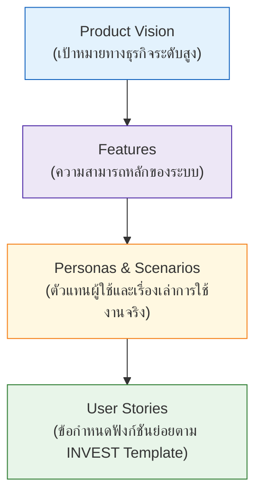

---
tags:
  - software-engineering
  - old-curriculum-classic
  - features
  - scenarios
  - personas
  - user-stories
  - lesson-03
created: 2026-09-08
updated: 2026-09-08
curriculum: Old & Classic Textbook
type: lesson
---

# สไลด์ 03: Features, Scenarios and User Stories

> [!INFO] 🏷️ ข้อมูลบทเรียน
> - **โฟลเดอร์สไลด์ต้นฉบับ:** `02_Old_Slides_Textbook/03_Features_Scenarios_and_Stories.pdf`
> - **หมวดหมู่:** 🏛️ หลักสูตรเดิมและตำรามาตรฐาน (Old & Classic Textbook)
> - **เป้าหมาย:** 📚 การแตกฟีเจอร์, การสร้าง Personas, การเขียน Scenarios และ User Stories

---

## 1. ลำดับขั้นจาก Vision สู่ User Stories

---

## 2. Personas และ Scenarios
* **Persona:** บุคลิกลักษณะสมมติของกลุ่มผู้ใช้เป้าหมาย เช่น "สมชาย เจ้าของร้านขายของชำ อายุ 45 ปี ต้องการระบบสั่งของที่ไม่ซับซ้อน"
* **Scenario:** เรื่องเล่าจำลองสถานการณ์การใช้งานเพื่อบรรลุเป้าหมายหนึ่งๆ ในชีวิตประจำวัน

---

## 3. รูปแบบการเขียน User Story
$$\text{"As a } [\text{ผู้ใช้ประเภทใด}], \text{ I want } [\text{ต้องการทำอะไร}] \text{ so that } [\text{เพื่อประโยชน์อะไร}]."$$
* ควบคู่กับ **Acceptance Criteria** เพื่อเป็นเกณฑ์ตัดสินการเสร็จสมบูรณ์
