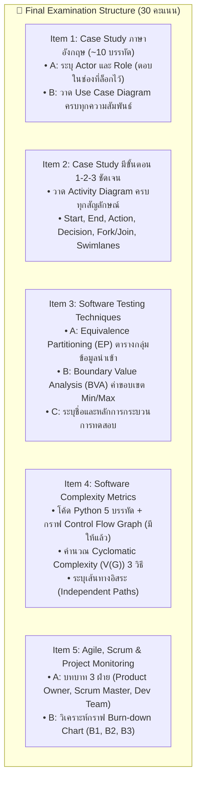
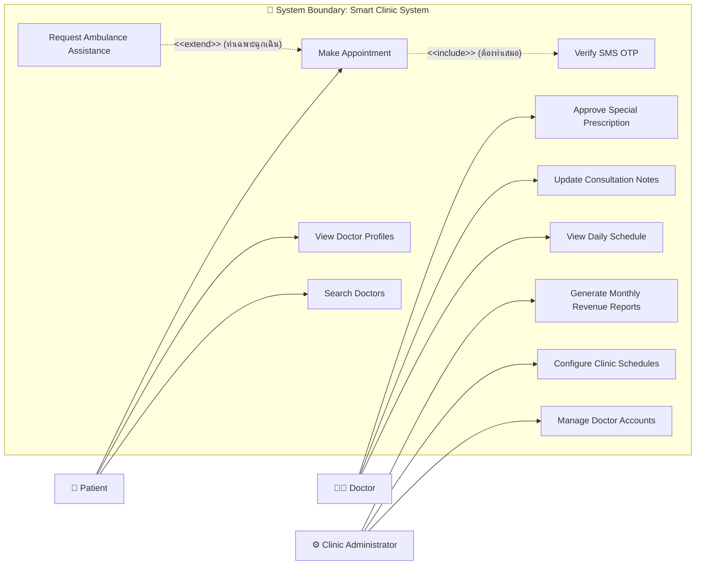
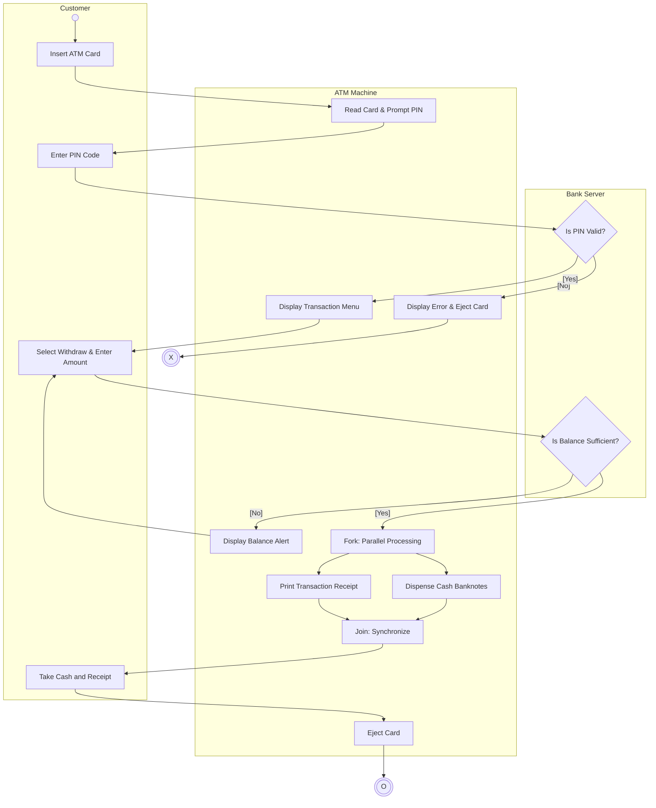

# 🎯 คู่มือเตรียมสอบปลายภาควิชาวิศวกรรมซอฟต์แวร์ 5 ข้อใหญ่ (Final Exam Master Guide & 100% Leaks)

> **วิชา:** วิศวกรรมซอฟต์แวร์ (Software Engineering)  
> **หลักสูตร:** เทคโนโลยีสารสนเทศ ภาคเรียนที่ 1/2569  
> **สัดส่วนคะแนน:** 30 คะแนนเต็ม (จากคะแนนรวม 100 คะแนน)  
> **รูปแบบการสอบ:** **Open Book** (เปิดตำรา เอกสาร ชีทสรุปได้ 100%) + **นำพจนานุกรม (Dictionary) เข้าได้**  
> **เวลาสอบ:** 3 ชั่วโมงเต็ม (เวลาทำจริงประมาณ 1.5 - 2 ชั่วโมง)  
> **ภาษาที่ใช้ในข้อสอบ:** ภาษาอังกฤษระดับพื้นฐาน (Simple Sentences เช่น "This is a dog. I want to fly.")

---

## 🧭 1. กฎเหล็กและกลยุทธ์การทำข้อสอบ (Exam Rules & Tactical Strategies)

1. **การจำกัดพื้นที่ตอบ (Scope-Locked Answering):**
   - อาจารย์ล็อกช่องตอบไว้พอดีกับคำตอบที่ถูกต้อง เช่น ในข้อ 1 Part A มีช่องให้ตอบ 4 ช่อง แสดงว่า **มี Actor เพียง 4 ตัวเท่านั้น**
   - **ห้ามตอบขาด และห้ามตอบเกิน:** ห้ามเขียนตอบเพิ่มนอกกรอบสี่เหลี่ยม หรือเขียนลงด้านหลังกระดาษ เพราะอาจารย์ตรวจตามช่องที่ล็อกไว้เท่านั้น
2. **การตอบภาษาอังกฤษ vs ภาษาไทย:**
   - ตัวบทบรรยาย Case Study เป็นภาษาอังกฤษ สามารถ **คัดลอก (Copy) ประโยคบทบาทหน้าที่จากโจทย์มาตอบได้โดยตรง** เพื่อความกระชับและถูกต้องตามหลักไวยากรณ์
   - หากเขียนภาษาอังกฤษไม่คล่อง สามารถเขียนคำอธิบายภาษาไทยควบคู่ได้ อาจารย์อ่านและตรวจให้คะแนนได้ทั้งสองภาษา
3. **เกณฑ์การตัดเกรด (Criterion-Referenced Grading):**
   - รายวิชานี้ **ตัดเกรดอิงเกณฑ์** ไม่ได้ตัดอิงกลุ่ม:
     - **Grade A:** $80 - 100$ คะแนน
     - **Grade B+:** $75 - 79$ คะแนน
     - **Grade B:** $70 - 74$ คะแนน
     - **Grade C+:** $65 - 69$ คะแนน
     - **Grade C:** $60 - 64$ คะแนน
     - **Grade D+:** $55 - 59$ คะแนน
     - **Grade D:** $50 - 54$ คะแนน
     - **Grade F:** ต่ำกว่า $50$ คะแนน
   - *สัดส่วนคะแนนทั้งเทอม:* กลางภาค 20 + ปลายภาค 30 + เช็คชื่อ/การมีส่วนร่วม 20 + การบ้าน 30 = 100 คะแนนเต็ม

---

## 🏛️ 2. แผนที่โครงสร้างข้อสอบ 5 ข้อใหญ่ (5 Exam Items Master Scope)



---

## 📚 3. เจาะลึกทฤษฎีและข้อสอบรั่วรายข้อ (In-Depth Technical Mastery)

---

### ข้อที่ 1: Case Study การวิเคราะห์ Actor และสร้าง Use Case Diagram

#### กฎและทฤษฎีที่ต้องจำ:
1. **Actor (ผู้กระทำ):**
   - คือ **บทบาท (Role)** ที่มีปฏิสัมพันธ์กับระบบ ไม่ใช่บุคคลคนใดคนหนึ่ง
   - สามารถเป็น **มนุษย์ (Human Actor)** หรือ **ระบบภายนอก (External System Actor)** เช่น ธนาคาร, Payment Gateway, SMS Gateway
   - **กฎเหล็ก:** ห้ามนำฐานข้อมูลภายใน (Database) หรือเซิร์ฟเวอร์ภายในระบบมาเป็น Actor เด็ดขาด!
2. **ความสัมพันธ์ใน Use Case Diagram:**
   - **Association (เส้นตรงทึบ):** เชื่อมระหว่าง Actor กับ Use Case แสดงว่ามีปฏิสัมพันธ์กัน
   - **Generalization (เส้นตรงหัวลูกศรสามเหลี่ยมโปร่ง $\triangle$):** ชี้จากคลาสลูกไปหาคลาสแม่ เช่น `Student` และ `Staff` สืบทอดมาจาก `Member`
   - **`<<include>>` (เส้นประหัวลูกศรเปิด $\dashrightarrow$):**
     - ใช้เมื่อ Use Case หลัก **ต้องเรียกใช้ Use Case รองเสมอ ขาดไม่ได้** มิฉะนั้นงานจะไม่สำเร็จ
     - **ทิศทางหัวลูกศร:** พุ่งจาก **Base Use Case $\rightarrow$ Included Use Case**
     - *ตัวอย่าง:* การจองอุปกรณ์ (`Reserve Equipment`) ต้องตรวจสอบสิทธิ์ (`Verify Eligibility`) เสมอ
   - **`<<extend>>` (เส้นประหัวลูกศรเปิด $\dashrightarrow$):**
     - ใช้เมื่อ Use Case รองเข้ามาช่วยเสริม **เฉพาะในกรณีพิเศษ หรือเงื่อนไขที่กำหนดเท่านั้น**
     - **ทิศทางหัวลูกศร:** พุ่งจาก **Extension Use Case $\rightarrow$ Base Use Case**
     - *ตัวอย่าง:* การยืมของมูลค่าสูง (`Request Approval`) เข้ามาขยายการจอง (`Reserve Equipment`) เมื่อราคาสินค้าเกินเกณฑ์

---

### ข้อที่ 2: Case Study การเขียน Activity Diagram

#### กฎและสัญลักษณ์ UML Activity Diagram:
1. **Initial Node (จุดเริ่มต้น):** วงกลมทึบสีดำ $\bullet$ (มีจุดเดียวต่อหนึ่ง Flow)
2. **Activity / Action State:** สี่เหลี่ยมมุมมน ระบุกิริยาอาการที่ระบบหรือผู้ใช้กระทำ
3. **Control Flow:** เส้นตรงหัวลูกศรทึบ แสดงลำดับขั้นตอนการดำเนินงาน
4. **Decision & Merge Node:** สี่เหลี่ยมข้าวหลามตัด ($\diamond$)
   - **Decision:** รับ 1 เส้นเข้า แตกออก 2 เส้นขึ้นไป โดย **ต้องมี Guard Condition ในวงเล็บก้ามปู `[...]`** กำกับทุกเส้นทางที่แตกกิ่ง (เช่น `[Password Valid]` และ `[Password Invalid]`)
   - **Merge:** รวมหลายเส้นทางกลับมาเป็นเส้นทางเดียว
5. **Fork & Join Node (แถบหนาสีดำทึบ):**
   - **Fork:** 1 เส้นเข้า แตกออกเป็นหลายเส้นขนาน ทำงานพร้อมกัน (Concurrency)
   - **Join:** รอทุกเส้นขนานทำงานเสร็จครบถ้วน ก่อนส่งต่อ 1 เส้นออกไปขั้นตอนถัดไป
6. **Swimlanes (Partitions):** ตีตารางแบ่งแนวตั้งหรือแนวนอนตามความรับผิดชอบของ Actor หรือโมดูลระบบ
7. **Activity Final Node (จุดสิ้นสุด):** วงกลมทึบที่มีวงแหวนล้อมรอบ $\odot$

---

### ข้อที่ 3: เทคนิคการออกแบบชุดทดสอบ (Equivalence Partitioning & Boundary Value Analysis)

#### 1. Equivalence Partitioning (EP)
* **หลักการ:** แบ่งโดเมนของข้อมูลนำเข้าออกเป็นกลุ่มสมมูล โดยสมมติว่าถ้าข้อมูลตัวแทนตัวหนึ่งในกลุ่มผ่าน ทุกตัวในกลุ่มนั้นก็ต้องผ่าน
* **ประเภทกลุ่ม:**
  - **Valid Equivalence Class:** กลุ่มข้อมูลที่อยู่ในช่วงที่ระบบยอมรับ
  - **Invalid Equivalence Class:** กลุ่มข้อมูลที่อยู่นอกช่วง หรือผิดประเภทที่ระบบต้องปฏิเสธ
* **ตัวอย่างโจทย์ห้องเรียน (ระบบโอนเงิน $100 \le Amount \le 500$ บาท):**
  - Group 1 (Invalid): $Amount < 100$ (ค่าทดสอบตัวแทน: $50$)
  - Group 2 (Valid): $100 \le Amount \le 500$ (ค่าทดสอบตัวแทน: $300$)
  - Group 3 (Invalid): $Amount > 500$ (ค่าทดสอบตัวแทน: $600$)

#### 2. Boundary Value Analysis (BVA)
* **หลักการ:** บั๊กของโปรแกรมมักเกิดขึ้นที่บริเวณขอบเขต (Boundary) เสมอ (เช่น การเขียนเงื่อนไข `<` แทน `<=`)
* **เกณฑ์ 2-Point / 3-Point Boundary:**
  - ขอบล่าง (Lower Boundary = 100): ทดสอบ **$Min - 1$ ($99$), $Min$ ($100$), $Min + 1$ ($101$)**
  - ขอบบน (Upper Boundary = 500): ทดสอบ **$Max - 1$ ($499$), $Max$ ($500$), $Max + 1$ ($501$)**

---

### ข้อที่ 4: การวัดความซับซ้อนของซอฟต์แวร์ (Cyclomatic Complexity - $V(G)$)

* **โจทย์ในห้องสอบ:** มีโค้ดภาษา Python สั้นๆ 5-6 บรรทัด และมีรูป **Control Flow Graph (CFG) วาดมาให้แล้ว ไม่ต้องวาดเอง!**
* **สูตรการคำนวณ 3 วิธีที่ต้องเขียนแสดงวิธีทำ:**
  1. **วิธีที่ 1 (Edges & Nodes):**
     $$V(G) = E - N + 2P$$
     *(เมื่อ $E$ คือจำนวนเส้น Edge, $N$ คือจำนวน Node, และ $P = 1$ สำหรับโปรแกรมเดี่ยว)*
  2. **วิธีที่ 2 (Bounded Regions):**
     $$V(G) = R_{\text{closed}} + 1_{\text{open}}$$
     *(จำนวนพื้นที่ปิดที่ล้อมรอบด้วยเส้นทาง + 1 พื้นที่เปิดรอบนอก)*
  3. **วิธีที่ 3 (Predicate Nodes):**
     $$V(G) = P + 1$$
     *(เมื่อ $P$ คือจำนวนโหนดเงื่อนไขตัดสินใจ เช่น `if`, `while`)*
* **Independent Paths (เส้นทางอิสระ):**
  - จำนวนเส้นทางอิสระทั้งหมดในโปรแกรมจะเท่ากับค่า $V(G)$ เสมอ
  - เส้นทางอิสระคือเส้นทางที่เดินทางจาก Start ถึง End โดยต้องมี Edge ใหม่อย่างน้อย 1 เส้นที่ไม่เคยปรากฏในเส้นทางอื่น

---

### ข้อที่ 5: การบริหารโครงการ Agile / Scrum & กราฟ Burn-down Chart

#### 1. บทบาทใน Scrum Framework (Scrum Roles - 3 Roles)
| บทบาท (Role) | ความรับผิดชอบหลัก | สิ่งที่ทำในโครงการ |
| :--- | :--- | :--- |
| **Product Owner (PO)** | รับผิดชอบความคุ้มค่าทางธุรกิจ (Business Value) และวิสัยทัศน์ของผลิตภัณฑ์ | จัดการและเรียงลำดับความสำคัญของ Product Backlog, สื่อสารกับลูกค้า/Stakeholders |
| **Scrum Master (SM)** | โค้ชและผู้นำเชิงรับใช้ (Servant Leader) ขจัดอุปสรรคกีดขวาง (Impediments) | ดูแลให้ทีมปฏิบัติตามแนวคิด Scrum, จัดประชุม (Daily Scrum, Sprint Review, Retrospective) |
| **Development Team** | ทีมข้ามสายงาน (Cross-Functional) และบริหารตนเอง (Self-Organizing) | วิเคราะห์ ออกแบบ เขียนโค้ด ทดสอบ และส่งมอบชิ้นงานที่เสร็จสมบูรณ์ (Increment) |

#### 2. การวิเคราะห์กราฟ Burn-down Chart
* **แกนตั้ง (Y-axis):** ปริมาณงานที่เหลือ (Remaining Effort) มีหน่วยเป็น Story Points หรือ Hours
* **แกนนอน (X-axis):** ระยะเวลาใน Sprint (Timeline in Days)
* **Ideal Effort Line:** เส้นตรงลาดลงจากมุมซ้ายบนลงสู่มุมขวาล่างที่ 0 แสดงอัตราการทำงานที่สมบูรณ์แบบในอุดมคติ
* **Actual Effort Line:** เส้นแสดงงานที่เหลืออยู่จริงของทีม:
  - **อยู่เหนือเส้น Ideal Line:** ทีมทำงาน **ล่าช้ากว่าแผน (Behind Schedule)** งานเหลือน้อยลงช้ากว่าที่คาดการณ์
  - **อยู่ใต้เส้น Ideal Line:** ทีมทำงาน **เร็วกว่าแผน (Ahead of Schedule)** เคลียร์งานได้เร็วกว่าที่คาด
  - **เส้นขนานแนวนอน (Flat line):** ทีมกำลังติดปัญหาคอขวด (Blocker / Impediment) งานไม่คืบหน้า
  - **เส้นกระดกพุ่งขึ้น (Upward spike):** มีการเพิ่ม Scope งานใหม่เข้ามาในระหว่าง Sprint

---

## 📝 4. ชุดข้อสอบจำลองเสมือนจริง 5 ข้อใหญ่ (Master Mock Examination)

---

### [ITEM 1] Case Study: Smart Clinic Appointment System (7 คะแนน)

#### Background Context (Simple English Scenario):
> "Smart Clinic wants to build a new online appointment web application. 
> Patients can search for doctors by specialty, view doctor profiles, and make appointments. 
> To make an appointment, the system must always verify patient identity via SMS OTP. 
> If a patient requires emergency ambulance dispatch, the patient can request ambulance assistance during booking. 
> Doctors can log into the clinic portal to view their daily schedule, update consultation notes, and approve special prescription requests. 
> Clinic Administrators manage doctor accounts, configure clinic schedules, and generate monthly revenue reports."

#### Question 1.A: Actor & Role Identification (3 คะแนน)
*Instructions: Identify exactly 3 primary/secondary actors and write their role descriptions. Do not exceed the provided boxes.*

```text
Box 1: Actor Name: [ Patient ]
       Role: [ Search doctors, view doctor profiles, make appointments, and request ambulance assistance ]

Box 2: Actor Name: [ Doctor ]
       Role: [ View daily schedule, update consultation notes, and approve special prescription requests ]

Box 3: Actor Name: [ Clinic Administrator ]
       Role: [ Manage doctor accounts, configure clinic schedules, and generate monthly revenue reports ]
```

#### Question 1.B: Use Case Diagram Construction (4 คะแนน)
*Instructions: Draw a complete Use Case Diagram for the Smart Clinic system including System Boundary, Actors, Use Cases, Association, `<<include>>`, and `<<extend>>`.*



---

### [ITEM 2] Case Study: Cash Withdrawal at ATM (5 คะแนน)

#### Step-by-Step Scenario:
> 1. Customer inserts ATM card into ATM machine.
> 2. ATM machine reads card and prompts for PIN code.
> 3. Customer enters 6-digit PIN code.
> 4. Bank Server verifies PIN code:
>    - If PIN is invalid, ATM machine displays error and ejects card (Transaction terminates).
>    - If PIN is valid, ATM machine displays transaction menu.
> 5. Customer selects "Withdraw Cash" and enters withdrawal amount.
> 6. Bank Server checks account balance:
>    - If balance is insufficient, ATM machine displays alert and asks customer to re-enter amount.
>    - If balance is sufficient, two actions happen concurrently:
>      a. Cash Dispenser dispenses cash banknotes.
>      b. Printer prints transaction receipt.
> 7. Customer takes cash and receipt, ATM machine ejects card, and the process completes.

#### Solution: Activity Diagram with Swimlanes and Fork/Join



---

### [ITEM 3] Software Testing: EP & BVA (6 คะแนน)

#### Problem Statement:
> ระบบสมัครสมาชิกฟิตเนส กำหนดให้ผู้สมัครต้องมีอายุระหว่าง **18 ถึง 65 ปี** ($18 \le \text{Age} \le 65$)  
> - ผู้ที่มีอายุต่ำกว่า 18 ปี ต้องแสดงข้อความ `"Underage: Parental consent required"`
> - ผู้ที่มีอายุ 18 ถึง 65 ปี ระบบอนุมัติ `"Membership Approved"`
> - ผู้ที่มีอายุเกิน 65 ปี ต้องแสดงข้อความ `"Senior Program: Medical certificate required"`

#### 3.A: Equivalence Partitioning (EP) Table (2 คะแนน)
| Partition Type | Input Condition (Age) | Representative Test Value | Expected System Output |
| :--- | :--- | :---: | :--- |
| **Invalid Class 1** | $\text{Age} < 18$ | $15$ | `"Underage: Parental consent required"` |
| **Valid Class** | $18 \le \text{Age} \le 65$ | $35$ | `"Membership Approved"` |
| **Invalid Class 2** | $\text{Age} > 65$ | $72$ | `"Senior Program: Medical certificate required"` |

#### 3.B: Boundary Value Analysis (BVA) Table (2 คะแนน)
| Boundary Point | Test Value (Age) | Class Boundary Category | Expected Result |
| :---: | :---: | :--- | :--- |
| **Min - 1** | $17$ | Just below lower bound | `"Underage: Parental consent required"` |
| **Min** | $18$ | Exactly lower bound | `"Membership Approved"` |
| **Min + 1** | $19$ | Just above lower bound | `"Membership Approved"` |
| **Max - 1** | $64$ | Just below upper bound | `"Membership Approved"` |
| **Max** | $65$ | Exactly upper bound | `"Membership Approved"` |
| **Max + 1** | $66$ | Just above upper bound | `"Senior Program: Medical certificate required"` |

#### 3.C: Methodology Definition (2 คะแนน)
* **คำถาม:** จงระบุชื่อกระบวนการทดสอบทั้งสองว่าจัดเป็นเทคนิคประเภทใด และหลักการแตกต่างกันอย่างไร?
* **คำตอบ:** จัดเป็นเทคนิคการทดสอบแบบ **Black-Box Testing (การทดสอบกล่องดำ)**
  - *Equivalence Partitioning (EP):* เน้นการแบ่งกลุ่มข้อมูลนำเข้าเพื่อลดจำนวน Test Case ให้ครอบคลุมทุกพฤติกรรม
  - *Boundary Value Analysis (BVA):* เน้นการตรวจสอบจุดรอยต่อขอบเขต เพื่อดักจับข้อผิดพลาดที่มักเกิดจากเงื่อนไขทางคณิตศาสตร์ ($\le, <, \ge, >$)

---

### [ITEM 4] Software Complexity: Cyclomatic Complexity (6 คะแนน)

#### Given Python Source Code:
```python
def check_order(amount, is_vip):
    discount = 0.0                      # Node 1
    if amount >= 1000:                  # Node 2 (Predicate)
        if is_vip:                      # Node 3 (Predicate)
            discount = 0.20             # Node 4
        else:
            discount = 0.10             # Node 5
    else:
        discount = 0.05                 # Node 6
    return discount                     # Node 7
```

#### Control Flow Graph (CFG):
```text
           (1)
            |
           (2) <--- Predicate (amount >= 1000)
          /   \
       [Yes]   [No]
        /       \
      (3)       (6)
     /   \       |
   [Yes] [No]    |
   /       \     |
 (4)       (5)   |
   \       /     |
    \     /      |
     \   /       |
      \ /        |
      (7) <------+
```

* **Metrics Counts:**
  - Nodes ($N$) = $7$ โหนด ($1, 2, 3, 4, 5, 6, 7$)
  - Edges ($E$) = $8$ เส้นเชื่อม ($(1,2), (2,3), (2,6), (3,4), (3,5), (4,7), (5,7), (6,7)$)
  - Predicate Nodes ($P$) = $2$ โหนด (โหนด 2 และ โหนด 3)
  - Enclosed Regions ($R$) = $2$ พื้นที่ปิด ($R_1, R_2$)

#### 4.A: แสดงวิธีคำนวณ Cyclomatic Complexity ($V(G)$) ทั้ง 3 วิธี (3 คะแนน)
1. **Method 1 (Formula: $E - N + 2P$):**
   $$V(G) = 8 - 7 + 2(1) = 1 + 2 = \mathbf{3}$$
2. **Method 2 (Regions: $R + 1$):**
   $$V(G) = 2 \text{ (Closed Regions)} + 1 \text{ (Outer Open Region)} = \mathbf{3}$$
3. **Method 3 (Predicate Nodes: $P + 1$):**
   $$V(G) = 2 \text{ (Decision Nodes)} + 1 = \mathbf{3}$$

#### 4.B: ระบุเส้นทางอิสระ (Independent Paths) ทั้งหมด (3 คะแนน)
เนื่องจาก $V(G) = 3$ จึงมีเส้นทางอิสระทั้งหมด **3 เส้นทาง**:
* **Path 1:** $1 \rightarrow 2 \rightarrow 6 \rightarrow 7$ (กรณี $Amount < 1000$)
* **Path 2:** $1 \rightarrow 2 \rightarrow 3 \rightarrow 5 \rightarrow 7$ (กรณี $Amount \ge 1000$ และไม่เป็น VIP)
* **Path 3:** $1 \rightarrow 2 \rightarrow 3 \rightarrow 4 \rightarrow 7$ (กรณี $Amount \ge 1000$ และเป็น VIP)

---

### [ITEM 5] Agile / Scrum Roles & Burn-down Chart (6 คะแนน)

#### 5.A: Scrum Roles Matching (3 คะแนน)
*จับคู่ข้อความสถานการณ์ใน Case Study สั้นๆ เข้ากับบทบาทใน Scrum:*

| สถานการณ์ที่กำหนดในโจทย์ | บทบาทที่รับผิดชอบ (Scrum Role) |
| :--- | :---: |
| 1. จัดเรียงลำดับความสำคัญของฟีเจอร์ใน Product Backlog และตัดสินใจรับมอบงาน | **Product Owner (PO)** |
| 2. ช่วยขจัดปัญหาอุปสรรคในการประสานงานระหว่างทีม และคอยควบคุมพิธีกรรม Scrum | **Scrum Master (SM)** |
| 3. นำ Task ใน Sprint Backlog ไปลงมือเขียนโค้ด ทำ Unit Test และส่งมอบชิ้นงาน | **Development Team** |

#### 5.B: Burn-down Chart Analysis (3 คะแนน)

```text
Story Points
 40 |* (Ideal Line: เส้นประ)
    | \
 30 |  \   *---* (Actual Line: เส้นทึบ)
    |   \ /     \
 20 |    *       *
    |     \       \
 10 |      \       *
    |       \       \
  0 +--------\-------*------- Timeline (Days)
    Day 1   Day 3   Day 5   Day 7   Day 10
```

* **คำถาม B.1:** ในช่วง **Day 3 ถึง Day 5** เส้น Actual Line ขนานเป็นแนวนอนและอยู่เหนือเส้น Ideal Line บ่งชี้ถึงสถานการณ์ใด?  
  *ตอบ:* บ่งชี้ว่าทีมกำลังประสบปัญหา **งานล่าช้ากว่ากำหนด (Behind Schedule)** และอาจติดปัญหาคอขวด (Blocker/Impediment) หรืองานติดขัด ทำให้ไม่มีงานที่สามารถส่งมอบและลด Story Points ลงได้ในระหว่าง 2 วันนี้
* **คำถาม B.2:** เมื่อสิ้นสุด **Day 10** เส้น Actual Line ตัดลงมาแตะที่จุด 0 พอดี บ่งชี้ถึงผลลัพธ์ของ Sprint อย่างไร?  
  *ตอบ:* บ่งชี้ว่า **ทีมสามารถส่งมอบงานได้เสร็จสิ้นสมบูรณ์ตามเป้าหมายของ Sprint (Sprint Goal Achieved)** ได้ทันเวลาก่อนหมดรอบ Sprint
* **คำถาม B.3:** หากในวันที่ 4 มีเส้นกราฟกระดกพุ่งขึ้นจาก 25 เป็น 35 Story Points เกิดจากสาเหตุใด?  
  *ตอบ:* เกิดจาก **การเพิ่มขอบเขตของงาน (Scope Creep / Added Scope)** หรือทีมค้นพบว่ามี Task ย่อยเพิ่มเติมที่มีความซับซ้อนเกินกว่าการประเมินเบื้องต้น

---
*เอกสารนี้ถูกรวบรวมและสังเคราะห์ขึ้นตามการบรรยายของผู้สอนวิชาวิศวกรรมซอฟต์แวร์ เพื่อใช้เป็นคู่มืออ่านสอบและแนวข้อสอบรั่ว 100% ประจำภาคเรียนที่ 1/2569*
