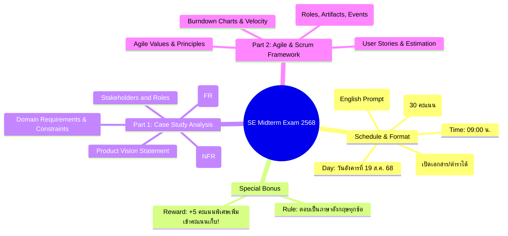
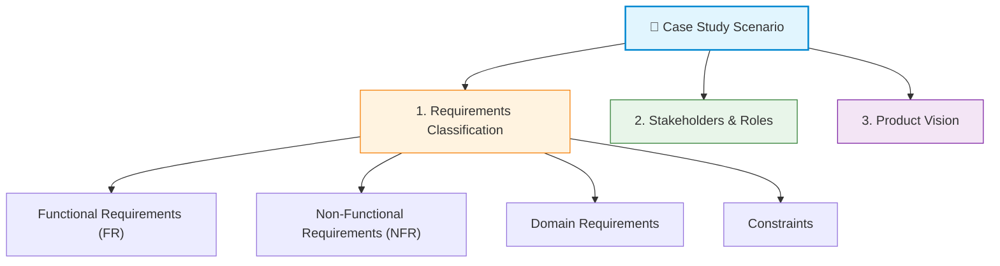
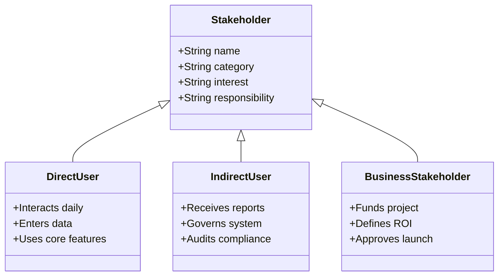
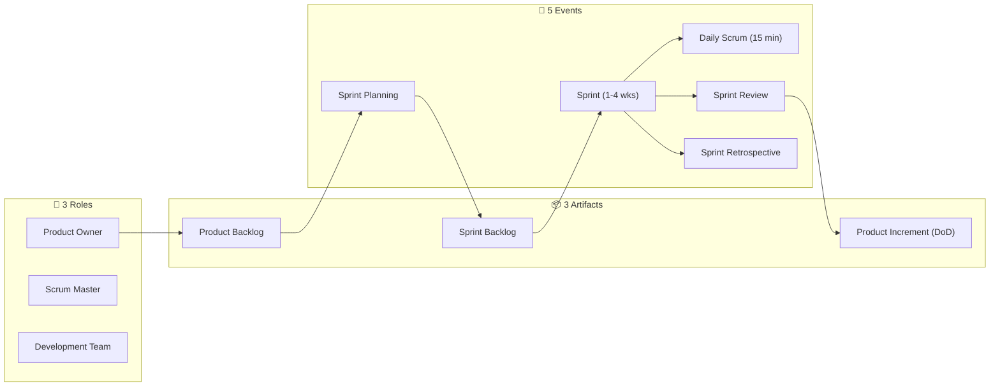
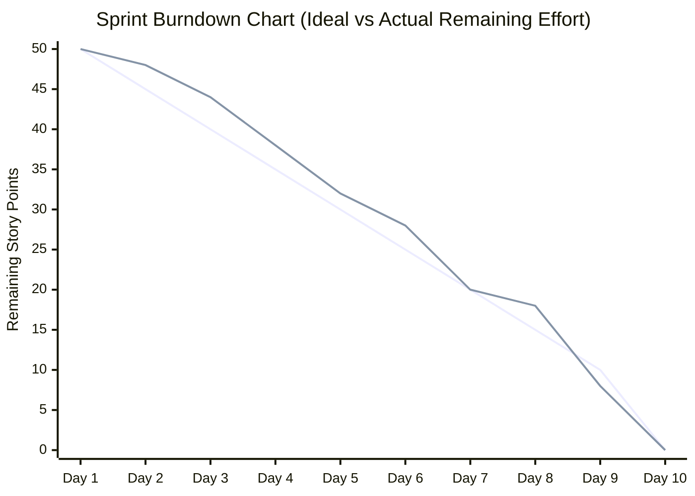

---
tags:
  - software-engineering
  - midterm
  - exam-guide
  - new-curriculum-68
  - open-book
  - english-bonus
  - agile-scrum
  - requirements-engineering
created: 2026-09-09
updated: 2026-09-09
type: exam-guide
---

# 🎯 SE Midterm Exam Scope, Strategy & English Bonus Guide (ปี 68)

> **วิชา:** Software Engineering (หลักสูตรปี 2568)  
> **อ้างอิงประกาศทางการ:** ประกาศแนวทางการสอบกลางภาคจากอาจารย์ผู้สอน (`mid.png`)  
> **รูปแบบการสอบ:** **Open Book (เปิดตำราได้)** | โจทย์เป็นภาษาอังกฤษ | 5 ข้อ 30 คะแนน  
> **⭐ สิทธิพิเศษคะแนนโบนัส:** หากตอบเป็นภาษาอังกฤษครบทุกข้อ **เพิ่มคะแนนเก็บพิเศษทันที 5 คะแนน! (+5 English Bonus)**

---

## 📌 สรุปประกาศการสอบกลางภาค (Exam Official Rules)

> [!IMPORTANT] กฎกติกาและยุทธศาสตร์การทำข้อสอบ
> 1. **โจทย์ข้อสอบเป็นภาษาอังกฤษ:** ข้อสอบทั้งหมด 5 ข้อเขียนด้วยภาษาอังกฤษ
> 2. **ตอบภาษาไทยได้ แต่เสียโอกาส 5 คะแนน:** สามารถตอบเป็นภาษาไทยได้โดยไม่หักคะแนน แต่ **หากตอบเป็นภาษาอังกฤษครบทุกข้อ จะได้รับคะแนนโบนัส +5 คะแนนเต็ม** ซึ่งมีผลต่อเกรดอย่างมีนัยสำคัญ
> 3. **ขอบเขตเนื้อหา:** ทุกอย่างอยู่ในเอกสารประกอบการสอนของหลักสูตรใหม่ปี 68 โดยนำมาประยุกต์ร่วมกับ Case Study ที่โจทย์กำหนดให้

---

## 🧭 พาร์ทที่ 1: การวิเคราะห์ Case Study (Case Study Analysis Framework)

ในข้อสอบพาร์ทนี้ อาจารย์จะให้โจทย์บรรยายสถานการณ์ (Case Study) ของระบบซอฟต์แวร์ระบบหนึ่งมา (เช่น ระบบโรงพยาบาล EasyClinic, ระบบร้านอาหาร PizzaFriend, หรือระบบ IoT Smart System) แล้วให้วิเคราะห์แยกแยะองค์ประกอบ:

---

### 1.1 การจำแนกประเภทความต้องการ (Requirements Classification)

ในการเขียนตอบภาษาอังกฤษ ให้ใช้โครงสร้างประโยคมาตรฐาน (Standard Sentence Templates):

#### 1. Functional Requirements (FR - ความต้องการเชิงหน้าที่)
* **นิยาม:** สิ่งที่ระบบต้องทำได้ (What the system should do), บริการที่ระบบต้องมี, และปฏิกิริยาของระบบเมื่อได้รับ Input ที่ระบุ
* **English Writing Pattern:**
  * `The system shall allow <actor/user> to <action> <specific entity/data>.`
  * `The system shall automatically <action> when <event/trigger> occurs.`
* **Examples:**
  * *Example 1:* "The system shall allow patients to book appointments with doctors online."
  * *Example 2:* "The system shall generate daily sales and transaction reports for branch managers."
  * *Example 3:* "The system shall send an automated SMS confirmation to the user upon successful payment."

#### 2. Non-Functional Requirements (NFR - ความต้องการที่ไม่ใช่เชิงหน้าที่ / คุณภาพ)
* **นิยาม:** คุณสมบัติด้านคุณภาพและข้อจำกัดของบริการ (Quality attributes & system constraints) เช่น ความเร็ว ความเสถียร ความปลอดภัย
* **English Writing Pattern:**
  * `The system shall <quality metric> under <operating condition>.`
  * `The system shall achieve <performance measure> with <boundary/limit>.`
* **Common Categories with Ready-to-Use English:**
  * **Performance / Response Time:** "The system shall respond to user search queries within 2 seconds under a normal load of 1,000 concurrent users."
  * **Reliability / Availability:** "The system shall maintain 99.9% uptime and availability, with scheduled maintenance limited to off-peak hours."
  * **Security & Privacy:** "All sensitive user credentials and payment information shall be encrypted using AES-256 both in transit and at rest."
  * **Usability:** "The user interface shall be designed so that new operators can complete standard order entry without errors after less than 1 hour of training."

#### 3. Domain Requirements (ความต้องการเฉพาะด้าน / กฎของโดเมน)
* **นิยาม:** ข้อกำหนดที่มาจากธรรมชาติของโดเมนงานนั้นๆ (Domain specifics, physics, laws, professional standards) ซึ่งหากไม่ทำตาม ระบบจะไม่ถูกต้องในเชิงวิชาชีพ
* **English Writing Pattern:**
  * `In accordance with <domain regulation/standard>, the system shall <mandated rule>.`
  * `Due to <physical/domain limitation>, the system shall <constraint>.`
* **Examples:**
  * *Medical Domain:* "In accordance with medical data privacy laws (e.g., HIPAA/PDPA), patient prescription histories must be strictly confidential and accessible only to licensed attending physicians."
  * *Financial/Banking Domain:* "According to central banking clearing standards, all money transfers exceeding $10,000 must undergo automated anti-money laundering (AML) verification."
  * *Aviation/Railway Domain:* "Due to braking physics, the train deceleration algorithm shall ensure a minimum safe headway distance proportional to the current velocity."

#### 4. Constraints (ข้อจำกัดในการพัฒนาและใช้งาน)
* **นิยาม:** ข้อจำกัดที่ถูกกำหนดไว้ล่วงหน้าจากปัจจัยภายนอก เช่น เทคโนโลยี งบประมาณ เวลา หรือกฎหมาย
* **English Writing Pattern:**
  * `The system must be implemented using <specific technology/framework>.`
  * `The system is restricted to operate on <hardware/infrastructure platform>.`
* **Examples:**
  * *Platform Constraint:* "The client application must run on iOS 16+ and Android 12+ mobile operating systems."
  * *Deployment Constraint:* "The application must be deployed on an on-premise private cloud infrastructure due to corporate data sovereignty policies."

---

### 1.2 ผู้มีส่วนได้ส่วนเสียและบทบาท (Stakeholders and Roles)

| Stakeholder Role | Definition in English | Key Interests & Responsibilities |
|:---|:---|:---|
| **End User / Customer** | Direct user who interacts with the system to fulfill their daily tasks. | Easy-to-use interface, fast response time, accurate task completion. |
| **System Administrator** | Technical personnel responsible for configuring, maintaining, and monitoring the system. | System uptime, backup/restore procedures, user access management, logging. |
| **Business Owner / Sponsor** | Executive or client funding the software project. | Return on Investment (ROI), timely delivery within budget, business goal alignment. |
| **Domain Expert / Specialist** | Subject matter expert (e.g., Chief Doctor, Chief Accountant) providing business rules. | Ensuring business logic, compliance, and professional standards are strictly followed. |
| **Auditor / Compliance Officer** | Internal or external regulator inspecting legal compliance and governance. | Data privacy (PDPA/GDPR), transaction audit trails, regulatory reporting. |

---

### 1.3 แม่แบบวิสัยทัศน์ผลิตภัณฑ์ (Product Vision Statement Template)

อาจารย์มักจะให้เขียน **Product Vision Statement** ตามกรอบมาตรฐานของ Geoffrey Moore:

> [!TIP] Product Vision Statement Template (ท่องจำสำหรับสอบ)
> **"For** `[target customer]`  
> **who** `[statement of the need or opportunity]`,  
> **the** `[product name]` **is a** `[product category]`  
> **that** `[key benefit, compelling reason to buy]`.  
> **Unlike** `[primary competitive alternative]`,  
> **our product** `[statement of primary differentiation]`."

#### ตัวอย่างการเขียนตอบจริง (Real Exam Examples):
* **กรณีศึกษา EasyClinic (Healthcare System):**
  > *"**For** private clinic practitioners and nurses **who** struggle with manual paper records and slow patient queues, **the** EasyClinic System **is an** integrated cloud clinic management platform **that** automates patient appointments, electronic health records (EHR), and prescription billing in a single unified screen. **Unlike** conventional disconnected desktop software, **our product** provides real-time mobile sync and automated LINE appointment reminders with zero on-premise server maintenance."*
* **กรณีศึกษา PizzaFriend (Food Delivery & Order System):**
  > *"**For** local pizzeria owners and hungry diners **who** need fast, error-free customized pizza ordering, **the** PizzaFriend App **is an** interactive online ordering and delivery tracking system **that** enables visual custom pizza toppings and real-time GPS delivery updates. **Unlike** generic third-party delivery platforms with exorbitant 30% commission fees, **our product** charges zero commission fees while offering direct customer loyalty rewards."*

---

## ⚡ พาร์ทที่ 2: กรอบการทำงาน Agile & Scrum (Agile & Scrum Framework)

ข้อสอบข้อที่ 2 หรือคำถามประยุกต์จะเจาะลึกกระบวนการทำงานแบบ Agile และ Scrum Framework ซึ่งนักศึกษาต้องอธิบายองค์ประกอบ กิจกรรม บทบาท และเครื่องมือวัดผลให้ชัดเจน:

---

### 2.1 ค่านิยมและหลักการของ Agile (Agile Manifesto 4 Core Values)

หากโจทย์ถามถึงความแตกต่างระหว่าง Plan-Driven (Waterfall) กับ Agile ให้ตอบโดยอ้างอิง **4 ค่านิยมหลักของ Agile Manifesto**:

1. **Individuals and interactions** over processes and tools *(เน้นปฏิสัมพันธ์ระหว่างผู้คนมากกว่ากระบวนการและเครื่องมือ)*
2. **Working software** over comprehensive documentation *(เน้นซอฟต์แวร์ที่ใช้งานได้จริงมากกว่าเอกสารที่ละเอียดเกินจำเป็น)*
3. **Customer collaboration** over contract negotiation *(เน้นการร่วมมือกับลูกค้าอย่างใกล้ชิดมากกว่าการยึดติดกับสัญญาที่ตายตัว)*
4. **Responding to change** over following a plan *(เน้นการตอบสนองต่อการเปลี่ยนแปลงมากกว่าการทำตามแผนการเดิม)*

---

### 2.2 โครงสร้าง Scrum Framework: 3 บทบาท, 3 ชิ้นงาน, 5 กิจกรรม (Scrum 3-3-5)

#### 👥 3 บทบาทหลักใน Scrum (3 Scrum Roles)
1. **Product Owner (PO):**
   * *Responsibility:* เป็นตัวแทนของลูกค้าและผู้มีส่วนได้ส่วนเสีย (Voice of Customer), มีอำนาจสูงสุดในการจัดลำดับความสำคัญ (Prioritization) ของงานใน Product Backlog เพื่อสร้างคุณค่าทางธุรกิจสูงสุด (Maximizing Business Value)
2. **Scrum Master (SM):**
   * *Responsibility:* โค้ชและผู้นำแบบรับใช้ (Servant Leader) ที่คอยดูแลให้ทีมเข้าใจและปฏิบัติตามหลักการ Scrum, ขจัดอุปสรรคขัดขวางการทำงานของทีม (Removing Impediments), และปกป้องทีมจากการแทรกแซงภายนอก
3. **Development Team (Cross-Functional & Self-Organizing Team):**
   * *Responsibility:* ทีมผู้เชี่ยวชาญ (นักพัฒนา, Tester, UI/UX) ที่มีทักษะครบถ้วนในการสร้างชิ้นงานที่พร้อมใช้งานจริง (Potentially Shippable Increment) ในแต่ละ Sprint โดยบริหารจัดการตัวเองโดยไม่มีหัวหน้าคอยสั่งการ

#### 📦 3 ผลผลิตหลักใน Scrum (3 Scrum Artifacts)
1. **Product Backlog:** รายการความต้องการและฟีเจอร์ทั้งหมดของผลิตภัณฑ์ที่เรียงลำดับความสำคัญแล้ว (Prioritized list of requirements/User Stories) ดูแลโดย PO
2. **Sprint Backlog:** ชุดของงานที่ทีมตกลงจะทำให้เสร็จใน Sprint ปัจจุบัน พร้อมแผนงานย่อยทางเทคนิคที่ต้องลงมือทำ
3. **Increment (Definition of Done - DoD):** ซอฟต์แวร์ส่วนที่พัฒนาเสร็จสิ้นใน Sprint นั้น ที่ผ่านเกณฑ์คุณภาพ DoD (เช่น ผ่านการ Review, ผ่านการทดสอบ Unit Test, Deploy ขึ้น Staging) และพร้อมส่งมอบให้ลูกค้าใช้งานได้ทันที

#### 🔄 5 เหตุการณ์สำคัญใน Scrum (5 Scrum Events)
1. **The Sprint:** กรอบเวลาที่ตายตัว (Time-box) มักมีระยะเวลา 1 ถึง 4 สัปดาห์ ซึ่งเป็นภาชนะบรรจุกิจกรรมทั้งหมด
2. **Sprint Planning:** กิจกรรมต้น Sprint ที่ PO และ Dev Team มาตกลงกันว่า "Sprint นี้จะทำอะไร (What)" และ "จะทำอย่างไรให้สำเร็จ (How)"
3. **Daily Scrum (Standup Meeting):** การประชุมสั้น 15 นาทีทุกเช้า ยืนคุยเพื่อตอบ 3 คำถาม:
   * เมื่อวานฉันทำอะไรเสร็จไปแล้วบ้าง? (What did I do yesterday?)
   * วันนี้ฉันจะทำอะไรต่อไป? (What will I do today?)
   * มีอุปสรรคหรือปัญหาอะไรขัดขวางอยู่หรือไม่? (Are there any impediments?)
4. **Sprint Review:** กิจกรรมท้าย Sprint ที่ทีมนำซอฟต์แวร์ที่ทำเสร็จมาสาธิต (Demo) ให้ PO และ Stakeholders ดู เพื่อขอ Feedback
5. **Sprint Retrospective:** กิจกรรมสะท้อนการทำงานของทีมหลังจาก Review เสร็จ โดยเน้นตอบคำถาม: "ทีมเรามีอะไรที่ดีแล้ว?", "มีอะไรที่ควรปรับปรุง?", และ "จะลงมือแก้ปัญหาอย่างไรใน Sprint ถัดไป?"

---

### 2.3 การเขียน User Story และการประเมินขนาดงาน (User Stories & Estimation)

* **User Story Format:**
  > `"As a <type of user>, I want <some goal>, so that <some reason/benefit>."`
  * *Example:* "As a patient, I want to cancel my appointment at least 24 hours in advance, so that other patients can book the open slot and I avoid cancellation penalties."
* **Acceptance Criteria (Given-When-Then):**
  * `Given` a booked appointment tomorrow at 10:00 AM,
  * `When` the patient clicks "Cancel Appointment",
  * `Then` the status changes to "Cancelled" and the time slot becomes available for booking.
* **Estimation Techniques:**
  * **Story Points:** การประเมินขนาดความยากเชิงเปรียบเทียบ (Relative Effort & Complexity) โดยใช้ชุดตัวเลขฟีโบนัชชี (Fibonacci Sequence: 1, 2, 3, 5, 8, 13, 21)
  * **Planning Poker:** เกมไพ่ประเมินคะแนนที่สมาชิกทุกคนใน Dev Team โชว์คะแนนพร้อมกันเพื่อป้องกันอคติ (Anchoring Bias) หากคะแนนต่างกันมาก ให้คนที่ให้ต่ำสุดและสูงสุดอภิปรายเหตุผลแล้วโหวตใหม่

---

### 2.4 การวัดและติดตามความก้าวหน้า (Sprint Burndown Chart & Velocity)

* **Sprint Burndown Chart:** แผนภูมิแสดง **"ปริมาณงานที่เหลืออยู่ (Remaining Effort ในแกน Y)"** เทียบกับ **"เวลาในแต่ละวันของ Sprint (แกน X)"**
  * *Ideal Line:* เส้นประตรงในอุดมคติที่ลดลงอย่างสม่ำเสมอจนถึง 0 ในวันสุดท้าย
  * *Actual Line:* เส้นการทำงานจริง หากเส้นจริงอยู่ **เหนือ** เส้น Ideal แปลว่า **งานล่าช้ากว่าแผน (Behind Schedule)** หากอยู่ **ใต้** แปลว่า **งานเสร็จไวกว่าแผน (Ahead of Schedule)**
* **Team Velocity:** ปริมาณ Story Points รวมที่ทีมทำเสร็จสิ้นสมบูรณ์ (ตามเกณฑ์ DoD) ภายในหนึ่ง Sprint ใช้สำหรับพยากรณ์ความสามารถในการรับงานใน Sprint ถัดไป

---

## 📝 คลังประโยคสำเร็จรูปสำหรับกวาดคะแนนโบนัสภาษาอังกฤษ (+5 Bonus Sentence Starters)

ท่องจำและนำกลุ่มประโยคเหล่านี้ไปเขียนตอบในห้องสอบ เพื่อการันตีการเขียนภาษาอังกฤษที่ถูกต้องตามหลักวิศวกรรมซอฟต์แวร์สากล:

### 1. หมวดอธิบายความต้องการ (Requirements Formulation)
* *"The system shall provide an intuitive dashboard enabling administrators to monitor real-time transaction logs."*
* *"To ensure robust cybersecurity, the authentication subsystem must enforce multi-factor authentication (MFA) for all administrative accounts."*
* *"The maximum allowable database query latency shall not exceed 1.5 seconds during peak traffic hours."*
* *"A fundamental domain constraint arises from medical ethics regulations, requiring informed patient consent before any diagnostic data is uploaded to cloud repositories."*

### 2. หมวดอธิบาย Stakeholders
* *"The primary stakeholder of the system is the clinical staff, who require reliable, error-free prescription entry to eliminate medical malpractice."*
* *"The secondary stakeholder includes financial auditors who do not interact with daily medical operations, but rely on exported financial ledgers for regulatory compliance."*

### 3. หมวดอธิบาย Agile & Scrum
* *"Adopting the Scrum framework facilitates iterative development, allowing the team to deliver an incremental, potentially shippable product every two-week Sprint."*
* *"The Product Owner holds single-point accountability for the business value, continuously refining and prioritizing the Product Backlog based on real customer feedback."*
* *"The Daily Scrum serves as a 15-minute synchronization event to inspect progress toward the Sprint Goal and immediately identify impediments."*
* *"Unlike the Waterfall model which defers testing to late stages, Agile integrates continuous testing throughout every iteration, drastically reducing regression risk."*

---

# References
- **Exam Notice:** [[mid.png]] (Exam date: Tuesday 19 Aug 2568, 09:00 AM, Open Book, English prompt, 5 questions, 30 pts, +5 bonus)
- **Comprehensive Subject Wiki:** [[01_New_Wiki_68/Midterm_68/SE-Midterm-Wiki-68|SE-Midterm-Wiki-68]]
- **Master Curriculum Hub:** [[Software Engineering Index]]
- **Practice Guides:** [[Practice-ReqEng-Methodology-Guide]]
