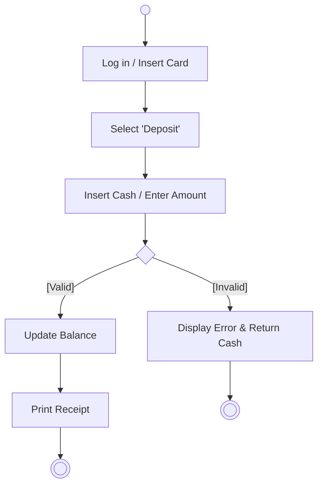
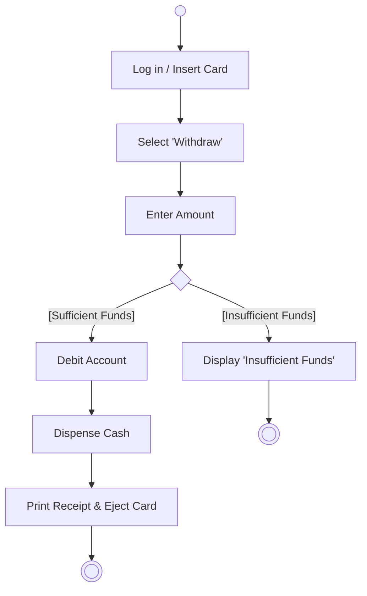
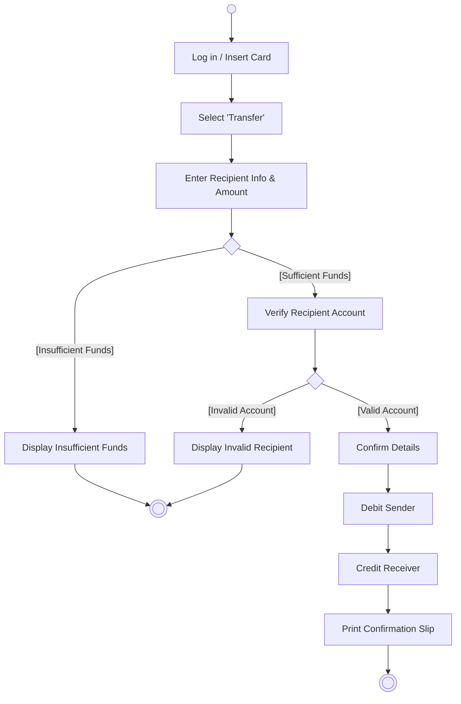

---
tags:
  - software-engineering
  - workshops
  - activity-diagram
  - atm
  - behavioral-modeling
created: 2026-09-22
updated: 2026-09-22
type: workshop-guide
curriculum: New 2568 / Workshop Suite
aliases:
  - Activity_Diagram_Workshop
---

# 🔄 เวิร์กช็อป & การบ้าน: แผนภาพกิจกรรม ATM (Activity Diagram Workshop)

> [!INFO] 🏷️ ข้อมูลเวิร์กช็อปและเอกสารอ้างอิง
> - **สไลด์บรรยายหลัก:** [`04_Work_and_Homework/Activity diagram/ActivityDiagram.pdf`](file:///home/few/Projects/software-engineering/04_Work_and_Homework/Activity%20diagram/ActivityDiagram.pdf) หรือ [`01_New_Slides_68/12_ActivityDiagram.pdf`](file:///home/few/Projects/software-engineering/01_New_Slides_68/12_ActivityDiagram.pdf) (สไลด์ 27 หน้า)
> - **เอกสารเฉลยละเอียดสำหรับการบ้าน:** [`04_Work_and_Homework/Activity diagram/Activity_Diagram_Solutions.md`](../../04_Work_and_Homework/Activity%20diagram/Activity_Diagram_Solutions.md)
> - **บทเรียน Wiki ฉบับสมบูรณ์:** [[12_Activity_Diagrams|Lecture 12: Activity Diagrams & Workflows]]
> - **โจทย์ที่ได้รับมอบหมาย:** ทำ Activity Diagram สำหรับ **Deposit (ฝากเงิน)**, **WD / Withdraw (ถอนเงิน)** และ **Transfer (โอนเงิน)**

---

## 🎯 สรุปผลงานไดอะแกรมทั้ง 3 ฟังก์ชัน

### 1. การฝากเงิน (Deposit Workflow)

### 2. การถอนเงิน (Withdrawal Workflow)

### 3. การโอนเงิน (Transfer Workflow)

---

## 🔗 นำทางสู่บทเรียนที่เกี่ยวข้อง
- 📘 [[12_Activity_Diagrams|อ่านบทเรียนทฤษฎี Activity Diagram เต็มรูปแบบ]]
- 📂 [`04_Work_and_Homework/Activity diagram/`](file:///home/few/Projects/software-engineering/04_Work_and_Homework/Activity%20diagram/) — โฟลเดอร์งานและภาพสเก็ตช์
- 🌐 [[Software Engineering Index|สารบัญใหญ่ระบบ Wiki]]
