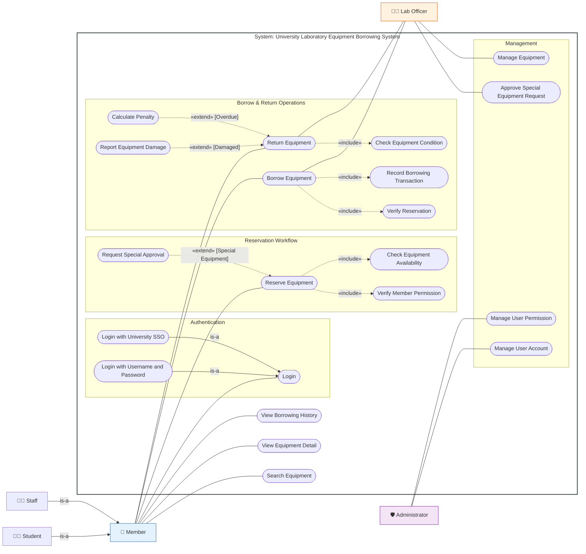

---
tags:
  - software-engineering
  - workshops
  - use-case
  - lab-equipment
  - case-study-3
created: 2026-09-22
updated: 2026-09-22
type: workshop-guide
curriculum: New 2568 / Workshop Suite
aliases:
  - Lab_Equipment_Borrowing_Workshop
---

# 🔬 เวิร์กช็อป Use Case: ระบบยืม–คืนอุปกรณ์ห้องปฏิบัติการ (Lab Equipment Borrowing Workshop)

> [!INFO] 🏷️ ข้อมูลเวิร์กช็อปและโจทย์ปฏิบัติการ
> - **สไลด์ต้นฉบับ Workshop:** `04_Work_and_Homework/Use_Case_Diagram_Workshop/Lab_Equipment_Borrowing_System_Case_Study.pdf` (หรือ `casestudy-usecase.pdf`)
> - **เอกสารเฉลยละเอียดสำหรับส่งงาน:** [`04_Work_and_Homework/Use_Case_Diagram_Workshop/Lab_Equipment_Borrowing_System_Solution.md`](../../04_Work_and_Homework/Use_Case_Diagram_Workshop/Lab_Equipment_Borrowing_System_Solution.md)
> - **บทเรียน Wiki ฉบับเต็ม:** [[05_Case_Study_3_Lab_Equipment_Borrowing|Case Study 3: Laboratory Equipment Borrowing System Full Guide]]
> - **หมวดหมู่:** 🔧 เวิร์กช็อปกรณีศึกษาขั้นสูง (ครบครัน: Actor/Use Case Generalization, `<<include>>`, `<<extend>>`)

---

## 🧭 แผนภาพสรุปภาพรวม (Quick Reference Diagram)

---

## 🎯 สรุปจุดตัดคะแนนสำคัญ (Key Grading Criteria)

1. **การจำแนกประเภท Actor (Generalization):**
   - มี Super Actor: `Member`
   - มี Sub-Actors: `Student` และ `Staff` ที่สืบทอดมาจาก `Member`
2. **การระบุ Use Case แบบ Generalization:**
   - `Login` เป็นแม่ของ `Login with University SSO` และ `Login with Username and Password`
3. **การใช้ Include อย่างแม่นยำ (สิ่งที่ต้องทำเสมอ):**
   - จอง $\rightarrow$ `Verify Member Permission` และ `Check Equipment Availability`
   - ยืม $\rightarrow$ `Verify Reservation` และ `Record Borrowing Transaction`
   - คืน $\rightarrow$ `Check Equipment Condition`
4. **การใช้ Extend พร้อม Extension Point & Guard (สิ่งที่ทำเมื่อมีเงื่อนไข):**
   - `Request Special Approval` $\rightarrow$ `Reserve Equipment` `[อุปกรณ์มูลค่าสูง / ต้องขออนุมัติพิเศษ]`
   - `Calculate Penalty` $\rightarrow$ `Return Equipment` `[คืนอุปกรณ์ล่าช้า]`
   - `Report Equipment Damage` $\rightarrow$ `Return Equipment` `[ตรวจพบอุปกรณ์เสียหาย]`
5. **การกำหนดขอบเขตระบบ (System Boundary):**
   - Use Cases ทุกตัวอยู่ในขอบเขต Actor ทุกตัวอยู่นอกขอบเขต

---

## 🔗 นำทางสู่บทเรียนที่เกี่ยวข้อง
- 📘 [[05_Case_Study_3_Lab_Equipment_Borrowing|อ่านบทเรียนและสเปกฉบับเต็ม]]
- 📚 [[05_Case_Study_1_Library_System|เวิร์กช็อปก่อนหน้า: Case Study 1 ระบบห้องสมุด]]
- 🎓 [[05_Case_Study_2_University_Registration|เวิร์กช็อปก่อนหน้า: Case Study 2 ระบบลงทะเบียนเรียน]]
- 🌐 [[Software Engineering Index|สารบัญใหญ่ระบบ Wiki]]
