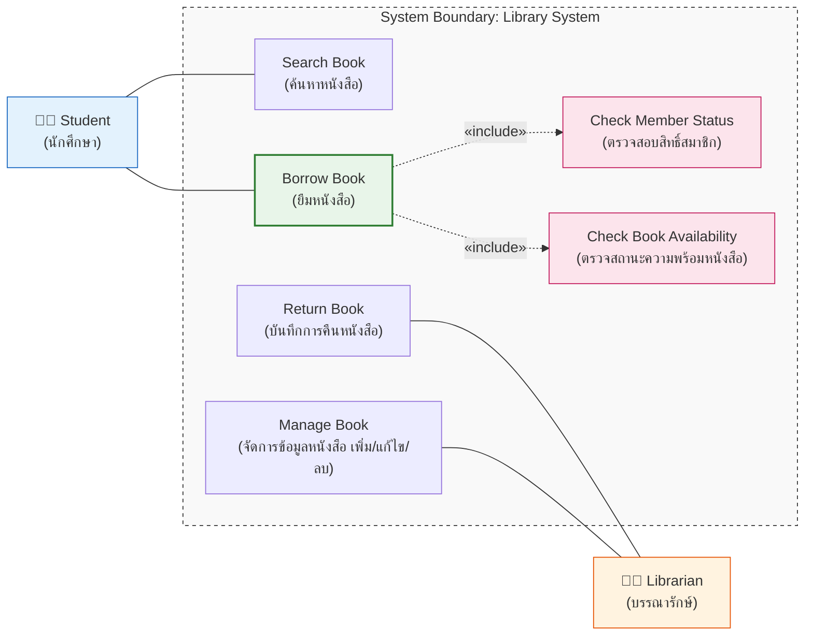
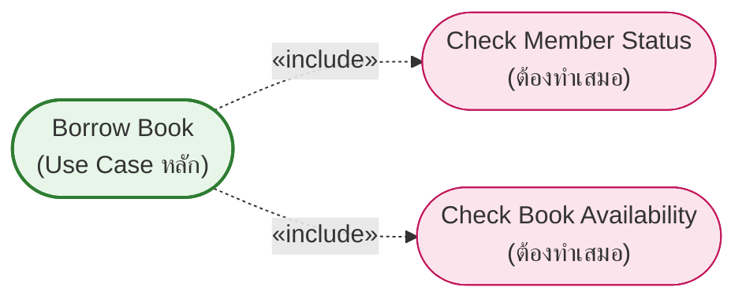
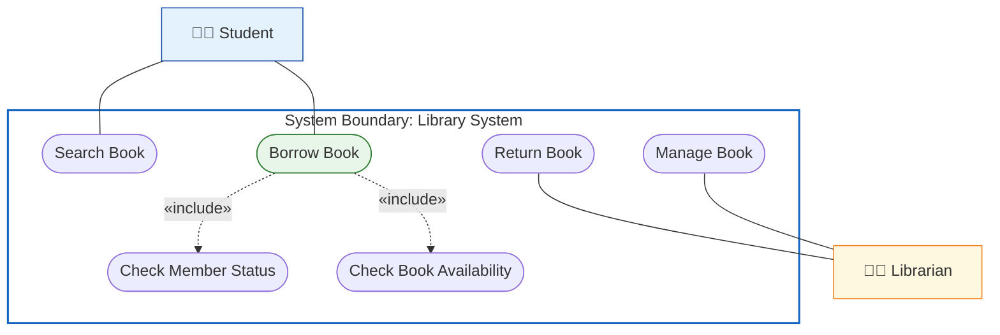
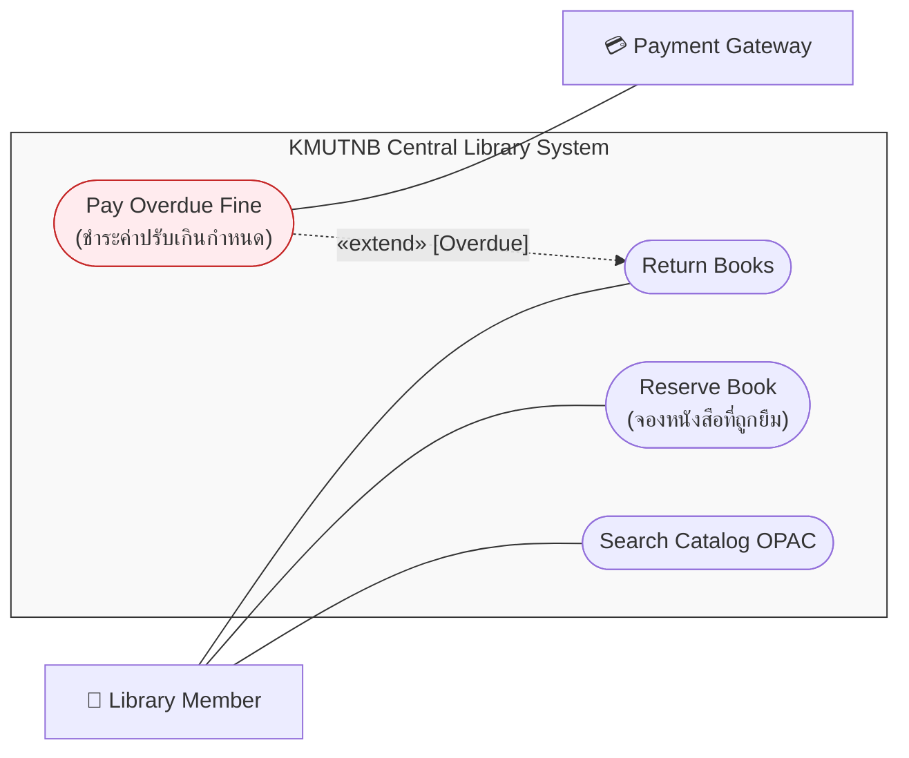

---
tags:
  - software-engineering
  - workshops
  - use-case
  - library
  - case-study-1
created: 2026-09-08
updated: 2026-09-15
type: workshop-guide
curriculum: New 2568 / Workshop Suite
---

# 🛠️ เวิร์กช็อป Use Case: ระบบยืม-คืนหนังสือห้องสมุด (Library Borrow-Return System)

> [!INFO] 🏷️ ข้อมูลเวิร์กช็อปและกรณีศึกษา
> - **สไลด์ต้นฉบับ Workshop:** `04_Work_and_Homework/Use_Case_Diagram_Workshop/Library_Borrow_Return_System_Case_Study.pdf` (สไลด์ชุด 5 หน้า)
> - **คู่มือทฤษฎีหลัก:** [[Use_Case_Diagram_Master_Guide|Use Case Diagram Master Guide]]
> - **โฟลเดอร์การบ้านในชั้นเรียน:** `04_Work_and_Homework/Homework use case diagram _ Write a use case diagram for KMUTNB central library_/`
> - **หมวดหมู่:** 🔧 เวิร์กช็อปภาคปฏิบัติและกรณีศึกษา (Case Study 1 - พื้นฐาน Actor, Use Case & Include)

---

## 📑 สารบัญเนื้อหา (Table of Contents)
1. [โจทย์ของระบบและเงื่อนไขสำคัญ (Requirements & Constraints)](#1-โจทย์ของระบบและเงื่อนไขสำคัญ)
2. [ขั้นตอนที่ 1: การวิเคราะห์และระบุ Actors (Actor Identification)](#2-ขั้นตอนที่-1-การวิเคราะห์และระบุ-actors)
3. [ขั้นตอนที่ 2: การสกัด Use Cases จากความต้องการ (Use Case Identification)](#3-ขั้นตอนที่-2-การสกัด-use-cases-จากความต้องการ)
4. [ขั้นตอนที่ 3: การวิเคราะห์ Relationship ทำไมต้องใช้ `<<include>>`](#4-ขั้นตอนที่-3-การวิเคราะห์-relationship-ทำไมต้องใช้-include)
5. [ขั้นตอนที่ 4: สรุปเป็น Use Case Diagram ฉบับสมบูรณ์](#5-ขั้นตอนที่-4-สรุปเป็น-use-case-diagram-ฉบับสมบูรณ์)
6. [ส่วนต่อขยาย: การประยุกต์สู่ระบบห้องสมุดกลาง มจพ. (KMUTNB Central Library Extension)](#6-ส่วนต่อขยาย-การประยุกต์สู่ระบบห้องสมุดกลาง-มจพ)

---

## 1. โจทย์ของระบบและเงื่อนไขสำคัญ

*📄 อ้างอิงสไลด์หน้า 1/5*

มหาวิทยาลัยต้องการพัฒนา **"ระบบยืม-คืนหนังสือห้องสมุด"** สำหรับอำนวยความสะดวกแก่นักศึกษาและบุคลากร:
* **ความต้องการด้านฟังก์ชัน (Requirements):**
  1. นักศึกษาสามารถค้นหาหนังสือและยืมหนังสือได้
  2. เจ้าหน้าที่ห้องสมุด (บรรณารักษ์) สามารถบันทึกการคืนหนังสือได้
  3. เจ้าหน้าที่ห้องสมุดสามารถเพิ่ม แก้ไข และลบข้อมูลหนังสือในระบบได้
* **กฎเกณฑ์ทางธุรกิจและความสัมพันธ์ (Business Rules):**
  * **ก่อนที่นักศึกษาจะยืมหนังสือได้ ระบบต้องทำสิ่งต่อไปนี้เสมอ:**
    1. ตรวจสอบสถานะสมาชิกภาพและสิทธิ์ของผู้ยืมว่ายังไม่หมดอายุหรือถูกระงับสิทธิ์ (`Check Member Status`)
    2. ตรวจสอบสถานะความพร้อมของหนังสือเล่มนั้นในคลังว่าไม่ถูกยืมไปโดยผู้อื่นและไม่ติดสถานะซ่อมบำรุง (`Check Book Availability`)
  * ดังนั้นทั้งสองเงื่อนไขนี้จึงเป็น **`<<include>>`** ของ Use Case การยืมหนังสือ

---

## 2. ขั้นตอนที่ 1: การวิเคราะห์และระบุ Actors

*📄 อ้างอิงสไลด์หน้า 2/5*

| ผู้ใช้งาน (Actor) | บทบาทและหน้าที่ (Role & Responsibility) | ประเภท Actor |
|:---|:---|:---:|
| **Student (นักศึกษา)** | ค้นหาหนังสือ และดำเนินรายการขอยืมหนังสือจากห้องสมุด | Primary Actor |
| **Librarian (เจ้าหน้าที่บรรณารักษ์)** | รับคืนหนังสือจากผู้ยืม และดูแลจัดการข้อมูลหนังสือในระบบ | Primary / Administrative Actor |

---

## 3. ขั้นตอนที่ 2: การสกัด Use Cases จากความต้องการ

*📄 อ้างอิงสไลด์หน้า 3/5*

### 3.1 รายการ Use Cases ที่ได้
1. 🔍 **`Search Book` (ค้นหาหนังสือ):** ค้นหาหนังสือจากชื่อเรื่อง, ชื่อผู้แต่ง, หมวดหมู่ หรือเลข ISBN
2. 📦 **`Borrow Book` (ยืมหนังสือ):** ดำเนินการยืมหนังสือออกจากห้องสมุด
3. 📥 **`Return Book` (คืนหนังสือ):** บันทึกการรับหนังสือคืนเข้าสู่ชั้นวาง
4. ⚙️ **`Manage Book` (จัดการข้อมูลหนังสือ):** บริหารรายการหนังสือในระบบ (เพิ่มรายการใหม่, แก้ไขข้อมูลบรรณานุกรม, ลบรายการที่ชำรุด/สูญหาย)
5. 👤 **`Check Member Status` (ตรวจสอบสถานะสมาชิก):** ตรวจสอบสิทธิ์การยืมและสถานะบัญชีผู้ใช้
6. 📖 **`Check Book Availability` (ตรวจสอบความพร้อมของหนังสือ):** ตรวจสอบสถานะของหนังสือว่าพร้อมให้ยืมหรือไม่

### 3.2 การจับคู่ Actor กับ Use Case
* **Student (นักศึกษา):**
  * `Search Book`
  * `Borrow Book`
* **Librarian (บรรณารักษ์):**
  * `Return Book`
  * `Manage Book`
* **Use Case พฤติกรรมสนับสนุน (Supporting Behavior):**
  * `Check Member Status` และ `Check Book Availability` มีความสัมพันธ์ตรงกับ `Borrow Book`

---

## 4. ขั้นตอนที่ 3: การวิเคราะห์ Relationship ทำไมต้องใช้ `<<include>>`

*📄 อ้างอิงสไลด์หน้า 4/5*

### 4.1 เหตุผลที่เลือกใช้ `<<include>>`
1. **เป็นขั้นตอนบังคับที่ต้องทำทุกครั้ง (Mandatory Step):** ในการยืมหนังสือ การทำรายการจะสำเร็จไม่ได้เลยหากไม่มีการตรวจสถานะสมาชิกภาพ และตรวจว่าหนังสือเล่มนั้นยังอยู่บนชั้นวางจริงหรือไม่
2. **เป็นพฤติกรรมร่วมที่สามารถใช้ซ้ำได้ (Reusable Behavior):** ฟังก์ชันการตรวจสถานะสมาชิก (`Check Member Status`) อาจถูกนำไปใช้ในบริการอื่นได้อีก เช่น การจองห้องค้นคว้า หรือการใช้บริการคอมพิวเตอร์
3. **ทิศทางของลูกศร:** ชี้จาก Base Use Case (`Borrow Book`) พุ่งไปยัง Included Use Case เสมอ

### 4.2 ทำไมในกรณีนี้จึง "ไม่จำเป็นต้องใช้ `<<extend>>`"?
> [!NOTE] ข้อสังเกตสำคัญ
> ในขอบเขตเริ่มต้นนี้ ทั้ง `Check Member Status` และ `Check Book Availability` เป็น **เงื่อนไขบังคับที่ต้องเกิดขึ้นในทุกรอบของการยืม** ไม่ใช่ทางเลือกเสริม (Optional) และไม่ใช่เหตุการณ์ที่นานๆ เกิดขึ้นครั้งตามเงื่อนไขพิเศษ จึงไม่จัดว่าเป็น `<<extend>>`

---

## 5. ขั้นตอนที่ 4: สรุปเป็น Use Case Diagram ฉบับสมบูรณ์

*📄 อ้างอิงสไลด์หน้า 5/5*

### ตารางสรุปความสัมพันธ์ (Relationship Matrix)
| ลำดับ | ความสัมพันธ์ | จาก (From) | ถึง (To) | ความหมาย / วัตถุประสงค์ |
|:---:|:---:|:---|:---|:---|
| **1** | **Association** | `Student` | `Search Book` | นักศึกษาค้นหาหนังสือด้วยตนเอง |
| **2** | **Association** | `Student` | `Borrow Book` | นักศึกษาทำรายการขอยืมหนังสือ |
| **3** | **`<<include>>`** | `Borrow Book` | `Check Member Status` | ต้องตรวจสิทธิ์และสถานะบัตรสมาชิกทุกครั้งก่อนยืม |
| **4** | **`<<include>>`** | `Borrow Book` | `Check Book Availability` | ต้องตรวจว่าหนังสือพร้อมให้ยืมหรือไม่ทุกครั้ง |
| **5** | **Association** | `Librarian` | `Return Book` | บรรณารักษ์รับและบันทึกการคืนหนังสือเข้าสู่ระบบ |
| **6** | **Association** | `Librarian` | `Manage Book` | บรรณารักษ์เพิ่ม/ลบ/แก้ไขข้อมูลหนังสือในคลัง |

---

## 6. ส่วนต่อขยาย: การประยุกต์สู่ระบบห้องสมุดกลาง มจพ. (KMUTNB Central Library Extension)

*📄 แหล่งอ้างอิง: การบ้าน `04_Work_and_Homework/Homework use case diagram _ Write a use case diagram for KMUTNB central library_/`*

เมื่อขยายขอบเขตระบบห้องสมุดจริงของมหาวิทยาลัย จะมีกรณีการใช้งานเพิ่มเติมดังนี้:

1. **`<<extend>> Pay Overdue Fine`:** เมื่อคืนหนังสือ (`Return Books`) หากตรวจพบว่าคืนเกินกำหนดเวลา ระบบจะขยายการทำงานไปยัง Use Case ชำระค่าปรับ โดยเชื่อมต่อไปยัง `Payment Gateway` ภายนอก
2. **`Reserve Book`:** สมาชิกสามารถจองหนังสือเล่มที่กำลังถูกยืมอยู่ได้ เมื่อหนังสือเล่มนั้นถูกคืน ระบบจะแจ้งเตือนอัตโนมัติ
3. **Public OPAC:** การค้นหาหนังสือ (`Search Catalog`) เปิดให้บุคคลทั่วไปสืบค้นได้โดยไม่ต้องล็อกอิน

---

## 🔗 เอกสารที่เกี่ยวข้อง
- 📘 [[05_Use_Case_Diagrams|05_Use_Case_Diagrams (ทฤษฎีเต็ม 32 หน้า)]]
- 🎓 [[05_Case_Study_2_University_Registration|05_Case_Study_2_University_Registration (ระบบลงทะเบียนเรียนออนไลน์)]]
- 🏢 [[ATM_and_Elevator_Workshop|Workshop: Use Case ระบบ ATM และระบบลิฟต์]]
- 🌐 [[Software Engineering Index|กลับสู่หน้ารวมดัชนี Software Engineering Wiki]]
