---
tags:
  - software-engineering
  - introduction
  - software-products
  - ethics
  - case-studies
  - lecture-1
created: 2026-08-03
updated: 2026-08-03
lecture: 1
type: lecture
---

# Lecture 1: Introduction to Software Engineering, Products & Ethics

> [!SUMMARY] ภาพรวมบทเรียน
> บทเรียนนี้สรุปเนื้อหาอย่างละเอียดจากสไลด์ **New slide/Ch1 Introduction.pdf**, **1. Software Products.pdf** และตำราอ้างอิง **Ian Sommerville (Ch 1 & 3)** ครอบคลุม 10 หัวข้อหลัก:
> 1. [[#1. นิยามและภาพรวมของวิศวกรรมซอฟต์แวร์ (What is Software Engineering)]]
> 2. [[#2. คุณลักษณะ 4 ประการของซอฟต์แวร์ที่ดี (Essential Attributes of Good Software)]]
> 3. [[#3. กิจกรรมพื้นฐาน 4 ประการในกระบวนการซอฟต์แวร์ (Software Process Activities)]]
> 4. [[#4. ประเภทของระบบซอฟต์แวร์ 7 มิติ (Application Types)]]
> 5. [[#5. วิศวกรรมซอฟต์แวร์แบบอิงโครงการ vs แบบผลิตภัณฑ์ (Project-based vs Product SE)]]
> 6. [[#6. รูปแบบการประมวลผลของซอฟต์แวร์ (Software Execution Models)]]
> 7. [[#7. วิสัยทัศน์ผลิตภัณฑ์และแม่แบบ Moore's Vision Template]]
> 8. [[#8. การบริหารผลิตภัณฑ์ซอฟต์แวร์ และบทบาทของ Product Manager (PM)]]
> 9. [[#9. กรณีศึกษาระบบจริง 4 ระบบ (Case Studies)]]
> 10. [[#10. จริยธรรมและข้อตกลงวิชาชีพ ACM/IEEE Code of Ethics]]

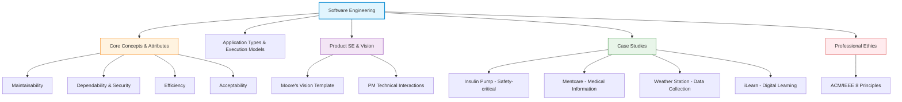

---

# 1. นิยามและภาพรวมของวิศวกรรมซอฟต์แวร์ (What is Software Engineering)

*📄 Slides 1-7 (Ch1 Introduction)*

> [!DEFINITION] Software Engineering (วิศวกรรมซอฟต์แวร์)
> **Software Engineering** คือ สาขาวิชาวิศวกรรมศาสตร์ (Engineering Discipline) ที่มุ่งเน้น **ทุกแง่มุมของการผลิตซอฟต์แวร์** (All aspects of software production) ตั้งแต่ระยะเริ่มต้นของการกำหนดข้อกำหนดระบบ (Specification) การออกแบบและพัฒนา (Design & Implementation) การตรวจสอบความถูกต้อง (Validation) ไปจนถึงการดูแลรักษาและปรับปรุงระบบหลังจากนำไปใช้งานจริง (Evolution)

## 1.1 ความสำคัญทางเศรษฐกิจและสังคม
*📄 Slide 3*
- **พึ่งพาซอฟต์แวร์เป็นหลัก**: เศรษฐกิจของประเทศที่พัฒนาแล้วทั้งหมดต้องพึ่งพาระบบซอฟต์แวร์ อุปกรณ์ เครื่องมือ อุตสาหกรรม การแพทย์ และโครงสร้างพื้นฐานถูกควบคุมด้วยซอฟต์แวร์
- **มูลค่าทางเศรษฐกิจ**: ค่าใช้จ่ายด้านซอฟต์แวร์คิดเป็นสัดส่วนสำคัญของผลิตภัณฑ์รวมในประเทศ (GNP) ในทุกประเทศที่พัฒนาแล้ว

## 1.2 ต้นทุนของซอฟต์แวร์ (Software Costs)
*📄 Slide 4*
- **ต้นทุนซอฟต์แวร์สูงกว่าฮาร์ดแวร์**: ต้นทุนซอฟต์แวร์บนระบบคอมพิวเตอร์มักจะมีมูลค่าสูงกว่าต้นทุนอุปกรณ์ฮาร์ดแวร์
- **ค่าบำรุงรักษาสูงกว่าค่าพัฒนา**: สำหรับระบบที่มีอายุการใช้งานยาวนาน (Long-life systems) **ค่าใช้จ่ายในการดูแลรักษาและปรับปรุง (Maintenance costs) มักจะสูงเป็นหลายเท่าของค่าใช้จ่ายในการพัฒนาแรกเริ่ม (Development costs)**
- **วิศวกรรมซอฟต์แวร์มุ่งเน้นความคุ้มค่า (Cost-effective)**: วัตถุประสงค์คือผลิตซอฟต์แวร์ที่มีคุณภาพสูงด้วยวิธีที่ประหยัดและคุ้มค่าที่สุด

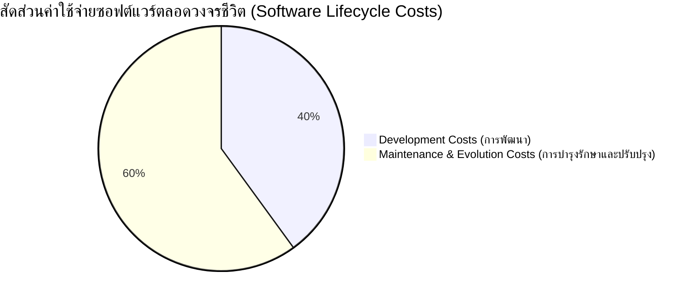

## 1.3 สาเหตุของความล้มเหลวในโครงการซอฟต์แวร์ (Software Project Failure)
*📄 Slide 5*
1. **ความซับซ้อนของระบบที่เพิ่มขึ้น (Increasing system complexity)**: เมื่อมีเทคนิคใหม่ ซอฟต์แวร์ใหญ่ขึ้นและซับซ้อนขึ้น ความต้องการก็เปลี่ยนไป รวดเร็วขึ้น และซับซ้อนขึ้นอย่างไม่จบสิ้น
2. **การล้มเหลวในการใช้ใช้วิธีวิศวกรรมซอฟต์แวร์ (Failure to use SE methods)**: บริษัทจำนวนมากเขียนโปรแกรมโดยไม่ใช้ระเบียบวิธีทางวิศวกรรมซอฟต์แวร์ ทำให้ซอฟต์แวร์มีราคาแพงและขาดความน่าเชื่อถือ

## 1.4 การเปรียบเทียบคำถามที่พบบ่อย (FAQs about Software Engineering)
*📄 Slides 7-8*

| คำถาม (Question) | คำตอบเชิงวิศวกรรม (Answer) |
| :--- | :--- |
| **What is software?** | โปรแกรมคอมพิวเตอร์และเอกสารประกอบที่เกี่ยวข้อง (Documentation) พัฒนาเพื่อลูกค้ารายเฉพาะ หรือตลาดทั่วไป |
| **What is software engineering?** | สาขาวิชาวิศวกรรมที่เกี่ยวข้องกับทุกแง่มุมของการผลิตซอฟต์แวร์ |
| **Difference: SE vs Computer Science?** | **Computer Science** เน้นทฤษฎีและพื้นฐานทางคณิตศาสตร์/อัลกอริทึม<br>**Software Engineering** เน้นการปฏิบัติจริงในการสร้างและส่งมอบซอฟต์แวร์ที่มีประโยชน์ |
| **Difference: SE vs System Engineering?** | **System Engineering** สนใจทุกแง่มุมของระบบฮาร์ดแวร์ ซอฟต์แวร์ และกระบวนการ<br>**Software Engineering** เป็นส่วนหนึ่งของ System Engineering |
| **Key Challenges facing SE?** | การรับมือความหลากหลาย (Heterogeneity), ความต้องการส่งมอบที่เร็วขึ้น (Reduced delivery times), และการสร้างซอฟต์แวร์ที่ไว้วางใจได้ (Trustworthy software) |

---

# 2. คุณลักษณะ 4 ประการของซอฟต์แวร์ที่ดี (Essential Attributes of Good Software)

*📄 Slide 11 (Ch1 Introduction)*

> [!IMPORTANT] คุณลักษณะสำคัญ 4 ประการของซอฟต์แวร์ระดับมืออาชีพ
> ซอฟต์แวร์ที่ดีต้องไม่ได้มีเพียงแค่ฟังก์ชันการทำงานที่ถูกต้อง แต่ต้องมีคุณลักษณะ 4 ด้านต่อไปนี้:

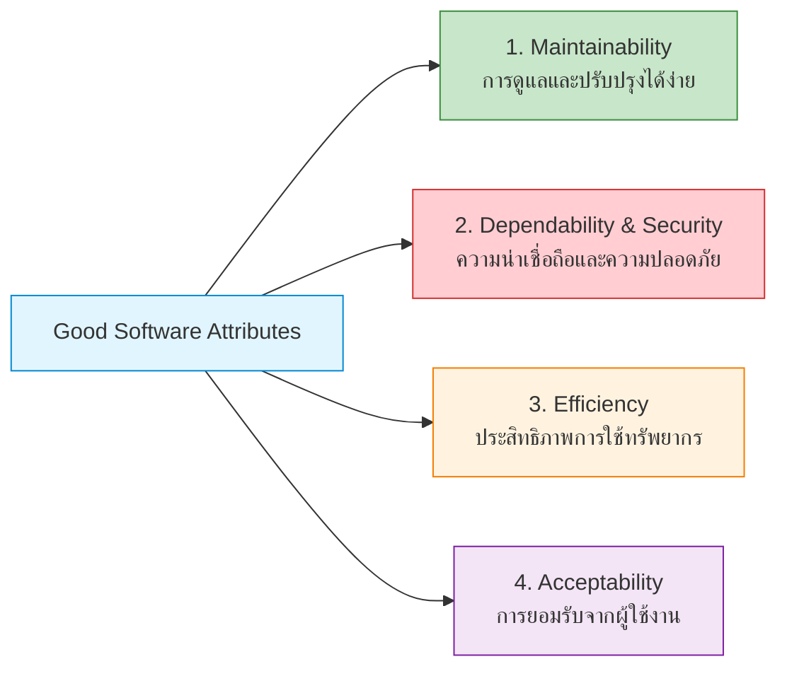

1. **Maintainability (ความสามารถในการดูแลรักษาและพัฒนาต่อ)**:
   - ซอฟต์แวร์ควรเขียนขึ้นในลักษณะที่สามารถปรับเปลี่ยน (Evolve) เพื่อตอบสนองความต้องการของลูกค้าที่เปลี่ยนแปลงไปได้ตลอดเวลา
2. **Dependability and Security (ความน่าเชื่อถือและความปลอดภัย)**:
   - ซอฟต์แวร์ต้องไม่ก่อให้เกิดความเสียหายทางกายภาพหรือทางเศรษฐกิจหากระบบล้มเหลว (Reliability, Safety)
   - ผู้ใช้ที่มีเจตนาร้าย (Malicious users) ไม่สามารถเข้าถึงหรือทำลายระบบได้ (Security)
3. **Efficiency (ประสิทธิภาพในการทำงาน)**:
   - ซอฟต์แวร์ต้องไม่ใช้ทรัพยากรระบบสิ้นเปลือง เช่น Memory, CPU cycles, Network bandwidth
   - ครอบคลุมการตอบสนองที่รวดเร็ว (Responsiveness) และระยะเวลาประมวลผล
4. **Acceptability (การยอมรับจากผู้ใช้)**:
   - ซอฟต์แวร์ต้องเข้าใจง่าย ใช้งานสะดวก (Usable) และเข้ากันได้กับระบบอื่นที่ผู้ใช้งานใช้อยู่ (Compatible)

---

# 3. กิจกรรมพื้นฐาน 4 ประการในกระบวนการซอฟต์แวร์ (Software Process Activities)

*📄 Slide 14 (Ch1 Introduction)*

ไม่ว่าจะใช้โมเดลการพัฒนาแบบใด (Waterfall, Agile, Spiral) กิจกรรมพื้นฐาน 4 ประการนี้จะต้องเกิดขึ้นเสมอ:

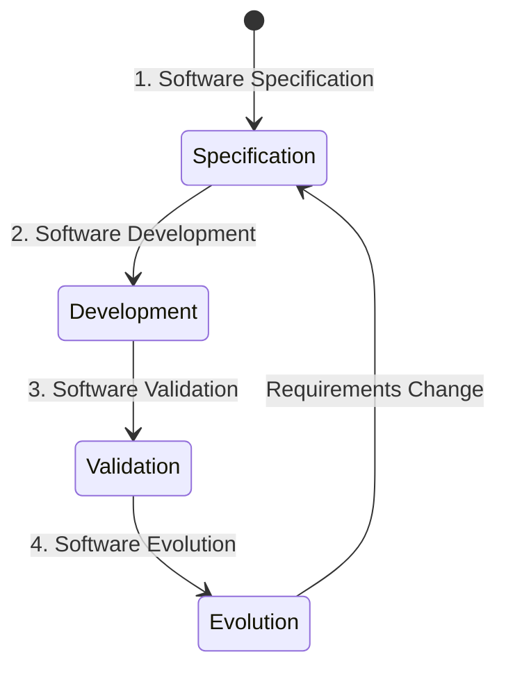

1. **Software Specification (การกำหนดข้อกำหนดความต้องการ)**:
   - วิศวกรและลูกค้าร่วมกันกำหนดฟังก์ชันการทำงานของซอฟต์แวร์ และข้อจำกัดในการดำเนินงาน (Constraints)
2. **Software Development (การออกแบบและสร้างซอฟต์แวร์)**:
   - ออกแบบสถาปัตยกรรม โครงสร้างข้อมูล อัลกอริทึม และเขียนโค้ดโปรแกรม
3. **Software Validation (การตรวจสอบความถูกต้องของซอฟต์แวร์)**:
   - ตรวจสอบและทดสอบระบบเพื่อแน่ใจว่าซอฟต์แวร์ทำงานตรงตามข้อกำหนดและสิ่งที่ลูกค้าต้องการ
4. **Software Evolution (การปรับเปลี่ยนและวิวัฒนาการซอฟต์แวร์)**:
   - แก้ไขและปรับปรุงซอฟต์แวร์เดิมตามความต้องการใหม่ของลูกค้าและสภาวะตลาดที่เปลี่ยนแปลง

---

# 4. ประเภทของระบบซอฟต์แวร์ 7 มิติ (Application Types)

*📄 Slides 18-20 (Ch1 Introduction)*

เนื่องจากไม่มีเทคนิควิศวกรรมซอฟต์แวร์ใดที่ใช้ได้กับทุกระบบ การเลือกใช้วิธีการจึงขึ้นอยู่กับประเภทของแอปพลิเคชัน:

1. **Stand-alone Applications**: โปรแกรมที่ทำงานบนเครื่องท้องถิ่น (Local PC) มีฟังก์ชันครบถ้วนในตัวเอง ไม่ต้องเชื่อมต่อเครือข่าย (เช่น โปรแกรมแต่งภาพ, CAD)
2. **Interactive Transaction-based Applications**: แอปพลิเคชันที่ทำงานบน Server รหัสไกล ผู้ใช้เข้าถึงผ่าน Terminals หรือ Web/Mobile (เช่น E-commerce, Internet Banking)
3. **Embedded Control Systems**: ระบบซอฟต์แวร์ควบคุมอุปกรณ์ฮาร์ดแวร์ (มีจำนวนปริมาณมากที่สุดในโลก เช่น ระบบเบรก ABS, ควบคุมไมโครเวฟ, Insulin Pump)
4. **Batch Processing Systems**: ระบบประมวลผลข้อมูลจำนวนมากในคราวเดียว (เช่น ระบบคิดเงินเดือน, ระบบออกใบแจ้งหนี้ประจำเดือน)
5. **Entertainment Systems**: ระบบเพื่อการบันเทิงและการใช้งานส่วนบุคคล (เช่น เกมคอมพิวเตอร์)
6. **Systems for Modeling and Simulation**: ระบบจำลองสถานการณ์หรือกระบวนการทางวิทยาศาสตร์และวิศวกรรม
7. **Data Collection Systems**: ระบบเก็บข้อมูลจากเซ็นเซอร์ในสิ่งแวดล้อมและส่งไปประมวลผล (เช่น Wilderness Weather Station)
8. **Systems of Systems**: ระบบขนาดใหญ่ที่เกิดจากการประกอบกันของระบบซอฟต์แวร์ย่อยหลายๆ ระบบ

---

# 5. วิศวกรรมซอฟต์แวร์แบบอิงโครงการ vs แบบผลิตภัณฑ์ (Project-based vs Product SE)

*📄 Slides 3-7 (1. Software Products.pdf)*

ในการพัฒนาซอฟต์แวร์จริง มีจุดเริ่มต้นและกระบวนการตัดสินใจที่แตกต่างกันอย่างสิ้นเชิง 2 รูปแบบ:

```mermaid
graph TD
    subgraph Project_Based ["1. Project-based Software Engineering (แบบอิงโครงการ)"]
        P_Customer["Customer (ผู้ว่าจ้าง)"] -->|1. มีปัญหา/ความต้องการ| P_Req["Requirements Document"]
        P_Req -->|2. ว่าจ้างพัฒนา| P_Dev["Software Developer"]
        P_Dev -->|3. ส่งมอบซอฟต์แวร์| P_SW["Custom Software"]
        P_SW -->|4. แก้ปัญหาให้| P_Customer
    end

    subgraph Product_Based ["2. Product Software Engineering (แบบผลิตภัณฑ์)"]
        PR_Dev["Software Company (ผู้พัฒนา)"] -->|1. ค้นพบโอกาสทางธุรกิจ| PR_Opp["Business Opportunity"]
        PR_Opp -->|2. กำหนดฟีเจอร์| PR_Feat["Product Features"]
        PR_Feat -->|3. สร้างเป็นผลิตภัณฑ์| PR_SW["Software Product"]
        PR_SW -->|4. วางขายในตลาด| PR_Users["General Customers / Market"]
    end
```

### ตารางเปรียบเทียบ Project-based vs Product SE

| มิติเปรียบเทียบ | Project-based Software Engineering | Product Software Engineering |
| :--- | :--- | :--- |
| **จุดเริ่มต้น (Starting Point)** | ความต้องการเฉพาะของลูกค้า (Client Requirements) | โอกาสทางธุรกิจในตลาด (Business Opportunity) |
| **ผู้เป็นเจ้าของข้อกำหนด** | ลูกค้า/ผู้ว่าจ้าง (Customer owns requirements) | บริษัทผู้พัฒนา (Software company owns specs) |
| **กลุ่มเป้าหมาย (Target)** | ลูกค้ารายเฉพาะ (Specific client) | ผู้ใช้ทั่วไปในตลาด (General market/users) |
| **การตัดสินใจฟีเจอร์** | ลูกค้าตัดสินใจว่าต้องการฟีเจอร์ใดบ้าง | ผู้พัฒนาตัดสินใจเองว่าจะใส่/ตัดฟีเจอร์ใด |
| **อายุการใช้งานระบบ** | ยาวนาน (10 ปีขึ้นไป) ต้องดูแลต่อเนื่อง | ขึ้นอยู่กับวงจรชีวิตผลิตภัณฑ์และการแข่งขัน |

---

# 6. รูปแบบการประมวลผลของซอฟต์แวร์ (Software Execution Models)

*📄 Slides 9-10 (1. Software Products.pdf)*

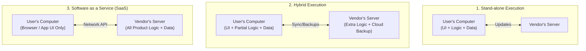

1. **Stand-alone Execution**: ซอฟต์แวร์และข้อมูลทั้งหมดประมวลผลอยู่บนเครื่องผู้ใช้ (Client) Server มีหน้าที่ส่งเพียงแค่การอัปเดตเวอร์ชัน
2. **Hybrid Execution**: ฟังก์ชันหลักทำงานบนเครื่องผู้ใช้ แต่ฟังก์ชันเสริม เช่น การ Sync ข้อมูล การ Backup บน Cloud ทำงานบน Server ผู้พัฒนา
3. **Software as a Service (SaaS)**: ฟังก์ชันและการจัดเก็บข้อมูลทั้งหมดอยู่ที่ Server ผู้พัฒนา ผู้ใช้เข้าถึงผ่าน Web Browser หรือ Mobile App เท่านั้น (ชำระค่าบริการตามการใช้งาน Subscription/Pay-per-use)

---

# 7. วิสัยทัศน์ผลิตภัณฑ์และแม่แบบ Moore's Vision Template

*📄 Slides 12-16 (1. Software Products.pdf)*

> [!DEFINITION] Product Vision (วิสัยทัศน์ผลิตภัณฑ์)
> **Product Vision** คือ ข้อความสรุปสั้นๆ ที่กำหนดแก่นแท้ของผลิตภัณฑ์ เพื่อตอบคำถามพื้นฐาน 3 ข้อ:
> 1. ซอฟต์แวร์ที่จะสร้างคืออะไร? (What is the product?)
> 2. ใครคือลูกค้าและผู้ใช้กลุ่มเป้าหมาย? (Who are the target customers?)
> 3. ทำไมลูกค้าถึงควรซื้อ/ใช้ผลิตภัณฑ์นี้? (Why should customers buy it?)

## 7.1 แม่แบบ Moore's Vision Template
*📄 Slide 13*

```text
FOR         [กลุ่มลูกค้าเป้าหมาย]
WHO         [ปัญหาหรือความต้องการของลูกค้า]
THE         [ชื่อผลิตภัณฑ์] IS A [ประเภทของผลิตภัณฑ์]
THAT        [ประโยชน์หลักและจุดขายที่มัดใจ]
UNLIKE      [คู่แข่งหลักในท้องตลาด]
OUR PRODUCT [จุดเด่นที่แตกต่างอย่างชัดเจน]
```

### ตัวอย่างการเขียน Moore's Vision Template (ระบบ iLearn)
*📄 Slide 16*

> **FOR** ครูและนักการศึกษา  
> **WHO** ต้องการวิธีช่วยให้นักเรียนเข้าถึงแหล่งเรียนรู้และแอปพลิเคชันบนเว็บ  
> **THE** iLearn System **IS A** สภาพแวดล้อมการเรียนรู้แบบเปิด (Open Learning Environment)  
> **THAT** ช่วยให้ครูสามารถกำหนดและจัดสรรทรัพยากรการเรียนรู้ตามรายวิชาและชั้นเรียนได้เองอย่างสะดวก  
> **UNLIKE** ระบบ VLE เดิมๆ เช่น Moodle ที่เน้นการบริหารจัดการเอกสารและงานธุรการ  
> **OUR PRODUCT** มุ่งเน้นกระบวนการเรียนรู้ตามวัยและวิชา โดยรวบรวมวิดีโอ การจำลอง และสื่อการสอนออนไลน์ได้อย่างอิสระ

---

# 8. การบริหารผลิตภัณฑ์ซอฟต์แวร์ และบทบาทของ Product Manager (PM)

*📄 Slides 17-22 (1. Software Products.pdf)*

Product Manager (PM) ทำหน้าที่เป็นจุดเชื่อมต่อ (Interface) ระหว่าง **ความต้องการทางธุรกิจ (Business Needs)**, **ข้อจำกัดทางเทคโนโลยี (Technology Constraints)** และ **ประสบการณ์ผู้ใช้ (Customer Experience)**

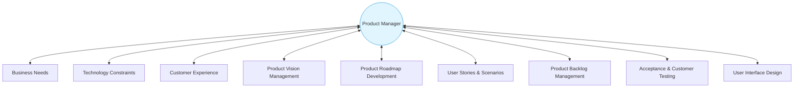

### ความรับผิดชอบทางเทคนิค 6 ด้านของ PM:
1. **Product Vision Management**: ดูแลและป้องกันไม่ให้ทิศทางผลิตภัณฑ์ออกนอกกรอบ (Prevent Vision Drift)
2. **Product Roadmap Development**: วางแผนการปล่อยเวอร์ชัน (Release plan) และการตลาด
3. **User Story & Scenario Development**: แปลงวิสัยทัศน์เป็นเรื่องราวการใช้งานจริงของผู้ใช้
4. **Product Backlog Management**: จัดเรียงลำดับความสำคัญของฟีเจอร์ที่จะพัฒนา (Prioritization)
5. **Acceptance Testing & Customer Testing**: ร่วมวางแผนการทดสอบเพื่อให้แน่ใจว่าตรงใจผู้ใช้
6. **User Interface Design**: รับบทบาทเป็นผู้ใช้แทน (Surrogate User) ตรวจสอบความยากง่ายของ UI

---

# 9. กรณีศึกษาระบบจริง 4 ระบบ (Case Studies)

*📄 Slides 36-55 (Ch1 Introduction)*

## 9.1 Personal Insulin Pump (ระบบควบคุมปั๊มอินซูลินส่วนบุคคล)
- **ประเภทระบบ**: Embedded Safety-Critical Control System
- **หน้าที่**: วัดระดับน้ำตาลในเลือดด้วย Sensor ประมวลผลอัตราการเปลี่ยนแปลง และส่งสัญญาณไปสั่งงาน Micro-pump ให้ฉีดอินซูลินในปริมาณที่ถูกต้อง
- **ความสำคัญเรื่อง Safety**: น้ำตาลในเลือดต่ำเกินไปส่งผลให้สมองสั่งการผิดพลาด ช็อก คอมา หรือเสียชีวิต ส่วนน้ำตาลสูงเกินไปในระยะยาวส่งผลเสียต่อตาและไต

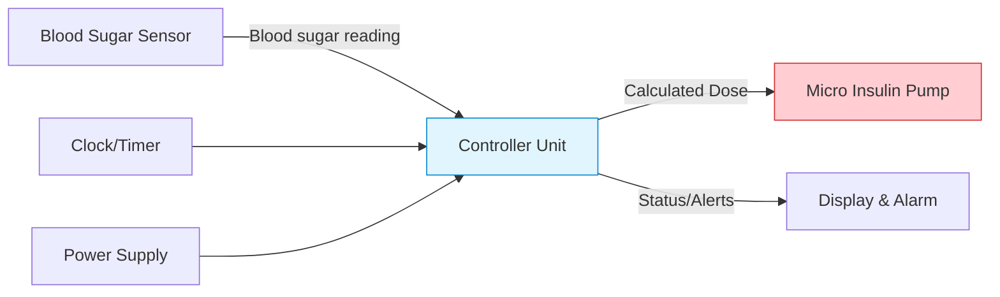

## 9.2 Mentcare (ระบบจัดการข้อมูลผู้ป่วยสุขภาพจิต)
- **ประเภทระบบ**: Medical Information System / Distributed Transaction System
- **ลักษณะการทำงาน**: ใช้ฐานข้อมูลกลาง (Centralized DB) แต่ถูกออกแบบให้รองรับการทำงานแบบ Offline บน PC สำหรับคลินิกชุมชนที่ไม่มีอินเทอร์เน็ต เมื่อเชื่อมต่อเครือข่ายได้จะSync ข้อมูลกลับ
- **ความกังวลหลัก (Key Concerns)**:
  - **Privacy**: ข้อมูลผู้ป่วยต้องเป็นความลับขั้นสูงสุด ไม่เปิดเผยแก่ผู้ไม่มีส่วนเกี่ยวข้อง
  - **Safety**: ต้องมีระบบแจ้งเตือนแพทย์เกี่ยวกับผู้ป่วยที่มีแนวโน้มทำร้ายตัวเองหรือผู้อื่น

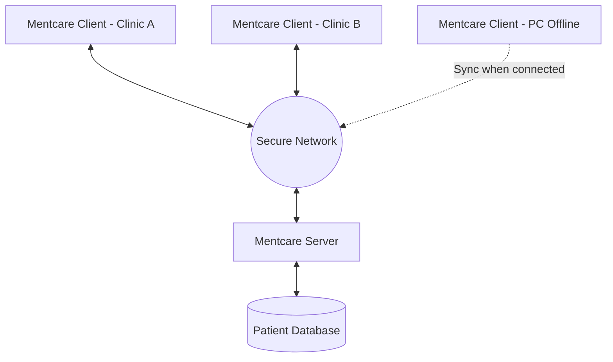

## 9.3 Wilderness Weather Station (สถานีตรวจวัดอากาศพื้นที่ห่างไกล)
- **ประเภทระบบ**: Data Collection & Monitoring System
- **องค์ประกอบระบบ**:

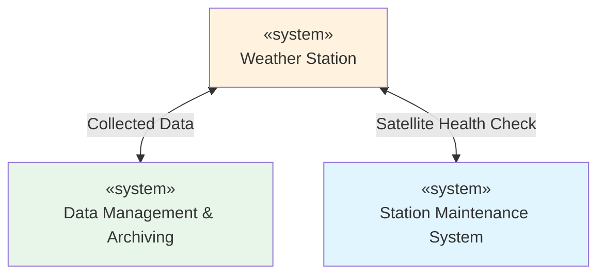

- **ฟังก์ชันเพิ่มเติม**:
  - บริหารจัดการพลังงานแบตเตอรี่และโซลาร์เซลล์ ปิดเครื่องกำเนิดไฟฟ้าเมื่อมีพายุแรง
  - รองรับการปรับเปลี่ยนซอฟต์แวร์ผ่านดาวเทียม (Dynamic Reconfiguration)

## 9.4 iLearn (แวดล้อมการเรียนรู้ดิจิทัล)
- **ประเภทระบบ**: Service-Oriented Web-based Learning System
- **สถาปัตยกรรม (Architecture)**:

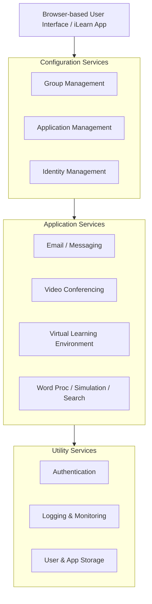

---

# 10. จริยธรรมและข้อตกลงวิชาชีพ ACM/IEEE Code of Ethics

*📄 Slides 26-33 (Ch1 Introduction)*

วิศวกรซอฟต์แวร์ต้องมีพฤติกรรมที่ซื่อสัตย์ มีความรับผิดชอบ และปฏิบัติตามจริยธรรมวิชาชีพ **ACM/IEEE Code of Ethics** ซึ่งประกอบด้วยหลักการ 8 ประการ:

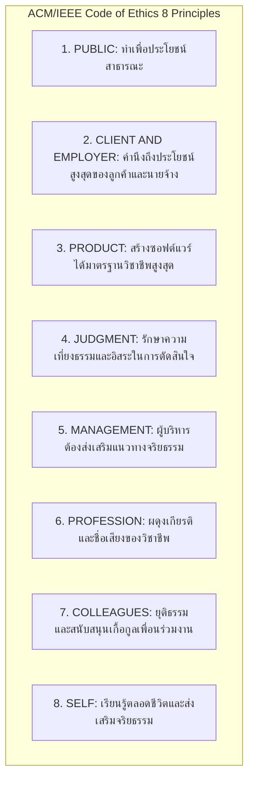

> [!WARNING] ตัวอย่างข้อขัดแย้งทางจริยธรรม (Ethical Dilemmas)
> 1. นายจ้างสั่งให้ปล่อยระบบ Safety-critical ทั้งที่ยังทดสอบระบบไม่เสร็จ
> 2. การถูกสั่งให้พัฒนาซอฟต์แวร์สำหรับอาวุธสงครามหรือระบบนิวเคลียร์
> 3. การปกปิดข้อผิดพลาดของซอฟต์แวร์ที่อาจส่งผลเสียต่อข้อมูลส่วนบุคคลของผู้ใช้
