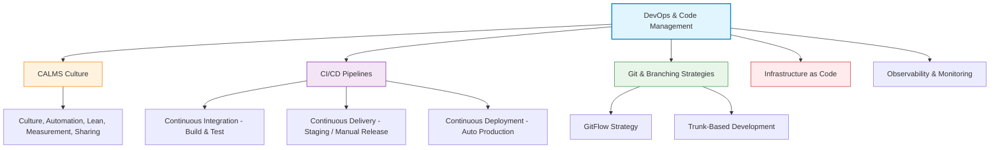
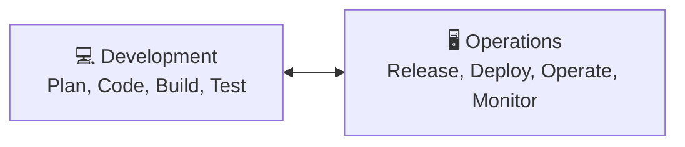
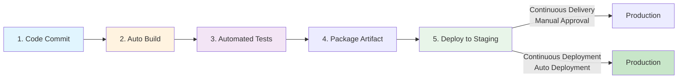
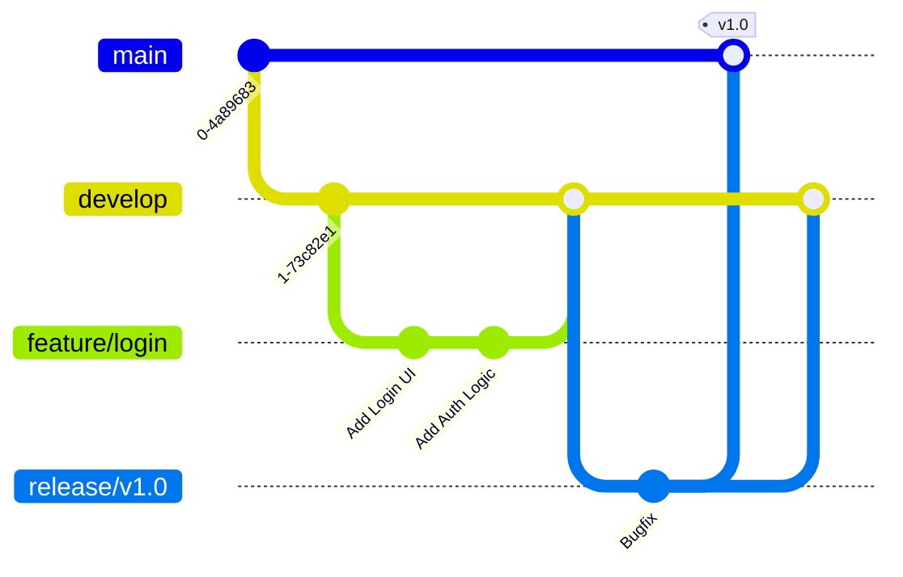
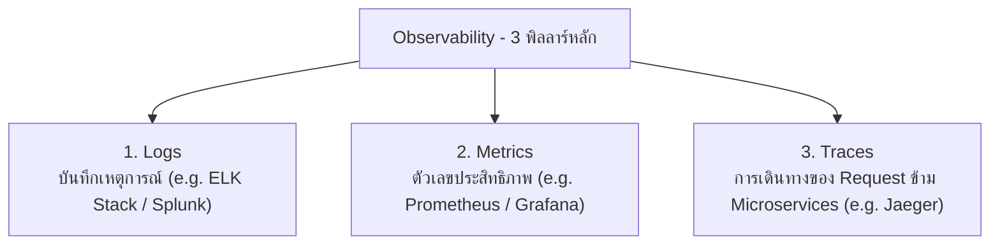

---
tags:
  - software-engineering
  - devops
  - ci-cd
  - git
  - gitflow
  - iac
  - monitoring
  - lecture-10
created: 2026-08-03
updated: 2026-08-03
lecture: 10
type: lecture
---

# Lecture 10: DevOps, CI/CD & Code Management

> [!SUMMARY] ภาพรวมบทเรียน
> บทเรียนนี้สรุปเนื้อหาอย่างละเอียดจากสไลด์ **10. DevOps and Code Management.pdf** ครอบคลุม 5 หัวข้อหลัก:
> 1. [[#1. วัฒนธรรม DevOps และกรอบการทำงาน CALMS Model]]
> 2. [[#2. ท่อลำเลียงส่งมอบอัตโนมัติ (CI/CD Pipelines)]]
> 3. [[#3. การบริหารซอร์สโค้ดและยุทธศาสตร์ Branching (GitFlow vs Trunk-Based)]]
> 4. [[#4. โครงสร้างพื้นฐานในรูปแบบโค้ด (Infrastructure as Code: IaC)]]
> 5. [[#5. การสังเกตการณ์และการตรวจวัดระบบ (Monitoring & Observability)]]

---

# 1. วัฒนธรรม DevOps และกรอบการทำงาน CALMS Model

*📄 Slides 1-8 (10. DevOps and Code Management.pdf)*

> [!DEFINITION] DevOps (เดฟออปส์)
> **DevOps** คือ วัฒนธรรม ปรัชญา และชุดของแนวปฏิบัติที่ทลายกำแพงกั้นระหว่าง **ฝ่ายพัฒนาซอฟต์แวร์ (Development - Dev)** และ **ฝ่ายดูแลระบบปฏิบัติการ (IT Operations - Ops)** เพื่อให้สามารถส่งมอบซอฟต์แวร์ที่มีคุณภาพสูงได้อย่างรวดเร็วและต่อเนื่อง

## 1.1 กรอบความคิด CALMS Model
*📄 Slide 6 (10. DevOps and Code Management.pdf)*

- **C - Culture (วัฒนธรรม)**: สร้างความร่วมมือและรับผิดชอบร่วมกันระหว่างทีม Dev และ Ops
- **A - Automation (อัตโนมัติ)**: ลดงานที่ต้องทำด้วยมือ เปลี่ยนกระบวนการ Build, Test, และ Deploy เป็นอัตโนมัติ
- **L - Lean (ความกระชับ)**: ลดความสูญเสียและขั้นตอนธุรการที่ไม่จำเป็นเพื่อส่งมอบงานเร็วขึ้น
- **M - Measurement (การวัดผล)**: วัดผลประสิทธิภาพระบบและกระบวนการด้วยข้อมูลเชิงตัวเลข
- **S - Sharing (การแบ่งปัน)**: แบ่งปันความรู้ เครื่องมือ และความรับผิดชอบร่วมกันทั้งองค์กร

---

# 2. ท่อลำเลียงส่งมอบอัตโนมัติ (CI/CD Pipelines)

*📄 Slides 9-18 (10. DevOps and Code Management.pdf)*

1. **Continuous Integration (CI)**:
   - ทุกครั้งที่นักพัฒนา Commit โค้ดเข้าส่วนกลาง ระบบจะทำการ **Build โค้ด และ รัน Automated Tests อัตโนมัติ** ทันที เพื่อตรวจพบข้อผิดพลาดให้เร็วที่สุด
2. **Continuous Delivery (CD)**:
   - ซอฟต์แวร์ที่ผ่านการทดสอบในขั้นตอน CI จะถูกสร้างเป็น Package และส่งต่อไปยังสภาพแวดล้อมทดสอบ (Staging) อัตโนมัติ พร้อมสำหรับการกดส่งมอบไปยัง Production ด้วยตนเอง
3. **Continuous Deployment (CD)**:
   - ซอฟต์แวร์ที่ผ่านการทดสอบทั้งหมดจะถูก **Deploy ขึ้น Production จริงอัตโนมัติทันที** โดยไม่ต้องใช้มนุษย์มากดอนุมัติ

---

# 3. การบริหารซอร์สโค้ดและยุทธศาสตร์ Branching (GitFlow vs Trunk-Based)

*📄 Slides 19-28 (10. DevOps and Code Management.pdf)*

## 3.1 GitFlow Branching Model
- เหมาะสำหรับโครงการขนาดใหญ่ มีรอบการปล่อยเวอร์ชันชัดเจน (Scheduled Releases)

- **Main / Master**: สาขาสำหรับโค้ดที่อยู่บน Production เท่านั้น
- **Develop**: สาขาหลักสำหรับการพัฒนาฟีเจอร์ประจำรอบ
- **Feature Branches**: สาขาย่อยที่แยกไปพัฒนาแต่ละฟีเจอร์ แล้ว Merge กลับเข้า Develop
- **Release Branches**: สาขาสำหรับเตรียมตัวออกเวอร์ชันใหม่ ทำการทดสอบขั้นสุดท้าย
- **Hotfix Branches**: สาขาด่วนสำหรับแก้ Bug บน Production แล้ว Merge กลับทั้ง Main และ Develop

## 3.2 Trunk-Based Development
- ทุกคน Commit โค้ดเข้าสู่สาขาหลัก (`main` / `trunk`) วันละหลายๆ ครั้ง โดยใช้ **Feature Toggles / Feature Flags** ในการเปิด/ปิดฟีเจอร์ที่ยังสร้างไม่เสร็จ เหมาะสำหรับทีมที่ทำ Continuous Deployment

---

# 4. โครงสร้างพื้นฐานในรูปแบบโค้ด (Infrastructure as Code: IaC)

*📄 Slides 29-34 (10. DevOps and Code Management.pdf)*

> [!DEFINITION] Infrastructure as Code (IaC)
> **IaC** คือ แนวทางการบริหารจัดการและจัดเตรียมทรัพยากรคอมพิวเตอร์ (Servers, Networks, Databases) ด้วย **ไฟล์การตั้งค่าแบบโค้ด (Configuration Files)** แทนการเข้าไปคลิกตั้งค่าด้วยมือทางหน้าจอคอนโซล

### ประโยชน์ของ IaC:
- **Consistency**: สภาพแวดล้อมในการทำงาน (Development, Staging, Production) เหมือนกันทุกประการ ป้องกันปัญหา "Works on my machine"
- **Version Control**: สามารถจัดเก็บไฟล์ IaC ลงใน Git เพื่อดูประวัติการเปลี่ยนแปลงและ Rollback ได้ง่าย
- **Speed & Automation**: สามารถสร้าง Server ใหม่ทั้งชุดได้ภายในไม่กี่วินาทีด้วยสคริปต์ (เช่น Terraform, Ansible)

---

# 5. การสังเกตการณ์และการตรวจวัดระบบ (Monitoring & Observability)

*📄 Slides 35-40 (10. DevOps and Code Management.pdf)*

- **Metrics**: ติดตามสถานะของทรัพยากร (CPU %, Memory Usage, Request Rate, Error Rate, Response Latency)
- **Centralized Logging**: รวม Log จาก Server และ Containers ทั้งหมดมาไว้ที่ศูนย์กลางเพื่อค้นหาต้นเหตุของปัญหาเมื่อเกิด Error
- **Alerting**: ระบบส่งการแจ้งเตือนอัตโนมัติ (เช่น ทาง Slack, Email, PagerDuty) เมื่อเกิดสิ่งผิดปกติในระบบ Production
