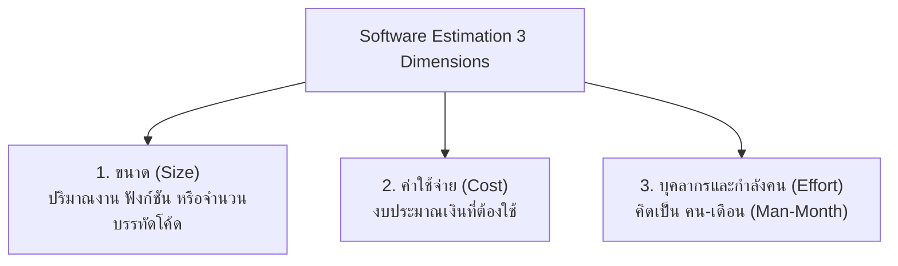
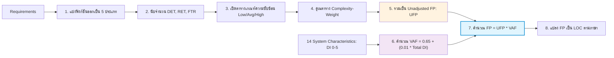

---
tags:
  - software-engineering
  - cost-estimation
  - function-point
  - ufp
  - vaf
  - cocomo
  - loc
  - dsi
  - productivity
  - lecture-11
created: 2026-08-03
updated: 2026-08-03
lecture: 11
type: lecture
---

# Lecture 11: Software Cost Estimation & Metrics

> [!SUMMARY] ภาพรวมบทเรียน
> บทเรียนนี้สรุปเนื้อหาอย่างละเอียดจากสไลด์ **se_chapter4.pdf** และแบบฝึกหัดใน **work/Sw cost estimation** ครอบคลุม 6 หัวข้อหลัก:
> 1. [[#1. พื้นฐานการประมาณการซอฟต์แวร์ (Software Estimation Foundations)]]
> 2. [[#2. การวัดขนาดด้วย Lines of Code (LOC) และ DSI]]
> 3. [[#3. โมเดลการประมาณการต้นทุน (LaBolle, Wolverton, Walston-Felix, COCOMO)]]
> 4. [[#4. การประเมินซอฟต์แวร์ด้วยวิธีกระทบฟังก์ชัน (Function Point Analysis: FPA)]]
> 5. [[#5. ตารางถ่วงน้ำหนักความซับซ้อนและการคำนวณ UFP, VAF และ FP]]
> 6. [[#6. การแปลง Function Point เป็น LOC การวัด Productivity และตัวอย่างโจทย์คำนวณพร้อมเฉลย]]

```mermaid
flowchart TD
    EST[Software Cost Estimation] --> METRICS[Size Metrics: LOC & DSI]
    EST --> MODELS[Mathematical Estimation Models]
    EST --> FPA[Function Point Analysis]
    EST --> PROD[Productivity & Language Translation]

    MODELS --> M1[LaBolle Model]
    MODELS --> M2[Wolverton Model - Top-down / Bottom-up]
    MODELS --> M3["Walston & Felix Model - E = 5.2*(KDSI)^0.91"]
    MODELS --> M4[COCOMO Model - Basic, Intermediate, Advanced]

    FPA --> F1[5 Function Types: EI, EO, EQ, ILF, EIF]
    FPA --> F2[Complexity Evaluation: DET, RET, FTR]
    FPA --> F3[Unadjusted Function Point - UFP]
    FPA --> F4[14 System Characteristics - Total DI]
    FPA --> F5["VAF Formula = 0.65 + (0.01 * Total DI)"]
    FPA --> F6["Final FP Formula = UFP * VAF"]

    PROD --> Trans[SLOC per FP Translation]
    PROD --> ProductivityFormula["Productivity = Output Size / Effort"]

    style EST fill:#e1f5fe,stroke:#0288d1,stroke-width:2px
    style MODELS fill:#fff3e0,stroke:#f57c00
    style FPA fill:#f3e5f5,stroke:#7b1fa2
    style PROD fill:#e8f5e9,stroke:#388e3c
```

---

# 1. พื้นฐานการประมาณการซอฟต์แวร์ (Software Estimation Foundations)

*📄 Slides 1-4 (se_chapter4.pdf)*

การประมาณการซอฟต์แวร์เป็นขั้นตอนที่สำคัญที่สุดในการวางแผนงานโครงการ เนื่องจากแผนงานและงบประมาณจะขึ้นอยู่กับสิ่งที่ต้องการจัดสร้าง 3 มิติหลัก:

## 1.1 ประเภทของการวัดซอฟต์แวร์
*📄 Slide 3 (se_chapter4.pdf)*
1. **การวัดในเชิงปริมาณ (Software Quantitative)**: ขนาดโปรแกรม (Size), กำลังคน (Effort), ระยะเวลาตามตารางงาน (Schedule Duration), จำนวนจุดบกพร่องที่แก้ไข (Defect Removal), ค่าแรงบุคลากร (Labor costs)
2. **การวัดเชิงคุณภาพ (Software Qualitative)**: แนวปฏิบัติทางซอฟต์แวร์ (Software Practices), ความเชี่ยวชาญของบุคลากร (Staff Expertise), ความซับซ้อน (Complexity), ศักยภาพองค์กร (Capability Profile)

---

# 2. การวัดขนาดด้วย Lines of Code (LOC) และ DSI

*📄 Slides 8-9 (se_chapter4.pdf)*

## 2.1 นิยามของ DSI (Delivered Source Instruction)
- **DSI** คือ การนับคำสั่งของซอฟต์แวร์ที่ส่งมอบจริง (คิดเป็นหน่วย **KDSI = Kilo DSI = 1,000 บรรทัดคำสั่ง**)

> [!IMPORTANT] กฎและเงื่อนไขการนับ DSI
> - **นับเฉพาะบรรทัดที่เป็น Source Code ที่ส่งมอบจริง** (ไม่นับส่วนโค้ดที่ใช้ทดสอบ หรือส่วนงานรองรับอื่นๆ)
> - **นับเฉพาะบรรทัดที่พัฒนาโดยบุคลากร** (ไม่นับส่วนที่ระบบ Code Generator สร้างขึ้นมาให้อัตโนมัติ)
> - ถือว่า **1 คำสั่งสั่งงาน = 1 Line of Code (LOC)**
> - **นับส่วนของการประกาศค่า (Declaration)** ถือเป็นส่วนของ Instruction
> - **ไม่นับส่วนขยายความ คำอธิบาย หรือ Comment**

---

# 3. โมเดลการประมาณการต้นทุน (LaBolle, Wolverton, Walston-Felix, COCOMO)

*📄 Slides 5-10 (se_chapter4.pdf)*

## 3.1 วิธีของ LaBolle
*📄 Slides 5-6*  
เน้นเทคนิคทางคณิตศาสตร์ โดยคิดราคาจากปัจจัยอย่างน้อย 1 วิธี:
- **ราคาต่อหน่วย (Unit Cost)**: เช่น ราคาต่อคำสั่ง, ต่อโปรแกรมย่อย, ต่อโมดูล
- **เปอร์เซ็นต์จากราคารวม**: เช่น ให้ราคาโปรแกรมคอมพิวเตอร์เป็น $X\%$ ของค่าพัฒนาทั้งหมด
- **การเปรียบเทียบจำเพาะ**: ราคา = ราคาโปรแกรมเดิม + ราคาพัฒนาความต้องการใหม่
- **สูตรคำนวณทั่วไปของ LaBolle**:

$$\text{Cost }(C) = K_1 X + K_2 Y + K_3 Z$$

โดยที่ $X =$ จำนวนหน้าจอ, $Y =$ จำนวนชิ้นโปรแกรม, $Z =$ จำนวนข้อมูล, และ $K_1, K_2, K_3$ คือค่าคงที่ถ่วงน้ำหนัก

## 3.2 วิธีของ Wolverton
*📄 Slide 7*  
เสนอเทคนิคจัดโมเดลประมาณราคา 3 ลักษณะ:
1. **Top-down**: ยึดราคารวมของโครงการที่เคยทำมาในอดีตเป็นหลัก แล้วปรับตามความคิดเห็นผู้เชี่ยวชาญ
2. **Similarity & Difference**: เปรียบเทียบความเหมือนและความแตกต่างระหว่างโปรแกรมใหม่กับโปรแกรมในโครงการเก่า
3. **Bottom-up**: แบ่งงานออกเป็นชิ้นย่อยที่สุดจนเห็นภาพชัดเจน ประเมินราคาชิ้นย่อยแล้วเอามารวมกันเป็นราคารวมโครงการ (นิยมใช้มากในงานรัฐบาล)

## 3.3 วิธีของ Walston และ Felix (1977)
*📄 Slide 8*  
รวบรวมข้อมูลจากโครงการจริงในอดีต สรุปเป็นสมการคณิตศาสตร์:

$$\text{Effort }(E) = 5.2 \times (\text{KDSI})^{0.91}$$

- หน่วยของ $E =$ คน-เดือน (Man-Month)
- $\text{KDSI} = 1,000$ บรรทัดของ Delivered Source Instruction

## 3.4 โมเดล COCOMO (Constructive Cost Model) ของ Boehm (1981)
*📄 Slide 10*  
วิเคราะห์ข้อมูลจาก 63 โครงการ คำนวณ Effort ในหน่วยคน-เดือน แบ่งเป็น 3 ระดับ:
1. **Basic COCOMO Model**: ใช้ค่าคงที่ค่าเดียว คำนวณตามขนาด Lines of Code (LOC)
2. **Intermediate COCOMO Model**: คำนวณ Effort จากขนาดโปรแกรม ร่วมกับปัจจัยแวดล้อม 15 ปัจจัย (Cost Drivers)
3. **Advanced COCOMO Model**: รวมปัจจัยที่มีผลกระทบทุกขั้นตอน (วิเคราะห์, ออกแบบ, พัฒนา, ทดสอบ)

---

# 4. การประเมินซอฟต์แวร์ด้วยวิธีกระทบฟังก์ชัน (Function Point Analysis: FPA)

*📄 Slides 11-20 (se_chapter4.pdf)*

> [!DEFINITION] Function Point (FP)
> **Function Point** คือ วิธีวัดขนาดของซอฟต์แวร์จากมุมมองความต้องการของผู้ใช้ โดยนับจำนวนฟังก์ชันการทำงานของโปรแกรม ช่วยแก้ปัญหาความแตกต่างของภาษาโปรแกรมมิ่งที่ใช้เขียน

## 4.1 ฟังก์ชันการทำงาน 5 ประเภทหลัก (5 Function Types)
*📄 Slides 14-15*

1. **External Input (EI)**: ข้อมูลที่รับเข้ามาในระบบเพื่อนำไปอัปเดตข้อมูลภายใน (เช่น เพิ่ม ลบ แก้ไข ข้อมูล)
2. **External Output (EO)**: ข้อมูลที่เป็นผลลัพธ์จากการประมวลผลส่งออกนอกระบบ (เช่น รายงานสรุป, ใบเสร็จ)
3. **External Inquiry (EQ)**: กระบวนการดึงข้อมูลและแสดงผลแก่ผู้ใช้โดยไม่มีการคำนวณซับซ้อนหรืออัปเดตข้อมูล (เช่น การ Query ดูสถานะ)
4. **Internal Logical Files (ILF)**: แฟ้มข้อมูลหลักที่จัดเก็บอยู่ภายในระบบตลอดช่วงอายุระบบ (เช่น ตารางข้อมูลลูกค้า, ตารางสินค้า)
5. **External Interface Files (EIF)**: แฟ้มข้อมูลของระบบอื่นที่นำมาใช้อ้างอิงร่วมกัน แต่ถูกดูแลรักษาโดยระบบอื่น (เช่น ตารางอัตราแลกเปลี่ยนเงินของธนาคาร)

## 4.2 องค์ประกอบวัดความซับซ้อน (DET, RET, FTR)
*📄 Slide 16*
- **DET (Data Element Type)**: จำนวนฟิลด์ข้อมูลที่ไม่ซ้ำกัน
- **RET (Record Element Type)**: จำนวนเรคคอร์ด/ตารางย่อยภายใน ILF/EIF
- **FTR (File Type Reference)**: จำนวนไฟล์/ตารางที่ถูกอ้างอิงในการทำรายการ transaction

---

# 5. ตารางถ่วงน้ำหนักความซับซ้อนและการคำนวณ UFP, VAF และ FP

*📄 Slides 17-24 (se_chapter4.pdf)*

## 5.1 ตารางเกณฑ์ระดับความซับซ้อน (Complexity Levels)
*📄 Slide 18*

### 1) สำหรับ ILF และ EIF (นับจาก RETs และ DETs)

| Record Elements (RETs) | 1 - 19 Data Elements (DETs) | 20 - 50 Data Elements (DETs) | 51+ Data Elements (DETs) |
| :---: | :---: | :---: | :---: |
| **1** | Low | Low | Average |
| **2 - 5** | Low | Average | High |
| **6+** | Average | High | High |

### 2) สำหรับ EO และ EQ (นับจาก File Types และ DETs)

| File Types (FTRs) | 1 - 5 Data Elements (DETs) | 6 - 19 Data Elements (DETs) | 20+ Data Elements (DETs) |
| :---: | :---: | :---: | :---: |
| **0 or 1** | Low | Low | Average |
| **2 - 3** | Low | Average | High |
| **4+** | Average | High | High |

### 3) สำหรับ EI (นับจาก File Types และ DETs)

| File Types (FTRs) | 1 - 4 Data Elements (DETs) | 5 - 15 Data Elements (DETs) | 16+ Data Elements (DETs) |
| :---: | :---: | :---: | :---: |
| **0 or 1** | Low | Low | Average |
| **2 - 3** | Low | Average | High |
| **3+** | Average | High | High |

---

## 5.2 ตารางถ่วงน้ำหนักความซับซ้อน (Complexity-Weight Table)
*📄 Slide 19*

| Function Type (ประเภทฟังก์ชัน) | Low (ความซับซ้อนต่ำ) | Average (ความซับซ้อนปานกลาง) | High (ความซับซ้อนสูง) |
| :--- | :---: | :---: | :---: |
| **1. Internal Logical File (ILF)** | 7 | **10** | 15 |
| **2. External Interface Files (EIF)** | 5 | **7** | 10 |
| **3. External Input (EI)** | 3 | **4** | 6 |
| **4. External Output (EO)** | 4 | **5** | 7 |
| **5. External Inquiry (EQ)** | 3 | **4** | 6 |

---

## 5.3 ปัจจัยคุณลักษณะของระบบ 14 ปัจจัย (14 General System Characteristics: GSCs) และ VAF
*📄 Slides 21-24*

ประเมินผลกระทบ 14 ปัจจัย โดยให้คะแนนระดับอิทธิพล **Degree of Influence (DI)** ตั้งแต่ **0 ถึง 5**:
- `0` = Not Present (ไม่มีผล)
- `1` = Incidental Influence (ผลน้อยมาก)
- `2` = Moderate Influence (ผลปานกลางเล็กน้อย)
- `3` = Average Influence (ผลปานกลาง)
- `4` = Significant Influence (ผลค่อนข้างมาก)
- `5` = Strong Influence (ผลมากที่สุด)

### รายชื่อ 14 ปัจจัย GSCs:
1. Data Communication (การติดต่อสื่อสารข้อมูล)
2. Distributed Data Processing (การประมวลผลแบบกระจาย)
3. Performance (ประสิทธิภาพความเร็ว)
4. Heavily Used Configuration (การใช้งานคอนฟิกหนัก)
5. Transaction Rate (ปริมาณรายการข้อมูล)
6. Online Data Entry (การป้อนข้อมูลออนไลน์)
7. End-user Efficiency (ประสิทธิภาพการใช้งานของผู้ใช้)
8. Online Update (การปรับปรุงข้อมูลออนไลน์)
9. Complex Processing (ความซับซ้อนของการประมวลผล)
10. Reusability (การนำไปใช้ซ้ำได้)
11. Installation Ease (ความง่ายในการติดตั้ง)
12. Operational Ease (ความง่ายในการดำเนินงาน)
13. Multiple Sites (การใช้งานหลายไซต์)
14. Facilitate Change (รองรับการเปลี่ยนแปลง)

### สูตรคำนวณ VAF และ FP:

$$\text{Total DI} = \sum_{i=1}^{14} \text{DI}_i$$

$$\text{VAF} = 0.65 + (0.01 \times \text{Total DI})$$

$$\text{FP} = \text{UFP} \times \text{VAF}$$

---

# 6. การแปลง Function Point เป็น LOC การวัด Productivity และตัวอย่างโจทย์คำนวณพร้อมเฉลย

*📄 Slides 25-31 (se_chapter4.pdf)*

## 6.1 ตารางเปรียบเทียบค่า FP เพื่อแปลงเป็น LOC (Source Lines of Code per FP)
*📄 Slide 25 (Source: Capers Jones, 1996)*

| Programming Language (ภาษาโปรแกรม) | SLOC / FP (จำนวนบรรทัดต่อ 1 FP) |
| :--- | :---: |
| **HTML 3.0** | 15 |
| **Perl** | 27 |
| **Visual C++** | 34 |
| **Access** | 38 |
| **Java** | **53** |
| **C++** | **55** |
| **C** | **128** |

## 6.2 การคำนวณ Productivity (ประสิทธิผลในการผลิตงาน)
*📄 Slide 30*

$$\text{Productivity} = \frac{\text{Output Size (LOC or Function Point)}}{\text{Effort (Man-Month)}}$$

---

## 6.3 ตัวอย่างโจทย์คำนวณการหาค่า FP และ LOC พร้อมวิธีทำอย่างละเอียด

### 📘 โจทย์ตัวอย่างที่ 1 (จาก Slide 26-29)
กำหนด Use Case ของระบบสั่งซื้อสินค้า ดังนี้:
- `Check Order Status`: ชนิด **EQ**, DETs = 17, FTRs = 1
- `Add Order`: ชนิด **EI**, DETs = 17, FTRs = 1
- `Initiate Change Request`: ชนิด **EI**, DETs = 12, FTRs = 1
- `Order Notification`: ชนิด **EQ**, DETs = 15, FTRs = 1
- `Report`: ชนิด **EQ**, DETs = 6, FTRs = 1
- `Order File`: ชนิด **ILF**, DETs = 17, RETs = 1
- กำหนด Total Degree of Influence ($\text{Total DI}$) $= 17$
- จงคำนวณหา UFP, VAF, FP และประเมินจำนวน LOC หากพัฒนาด้วยภาษา **Java**

#### ✏️ วิธีทำอย่างละเอียด:

**ขั้นตอนที่ 1: หาความซับซ้อนและค่าถ่วงน้ำหนักของแต่ละฟังก์ชัน (UFP)**

| Item | Type | DETs | FTRs/RETs | ความซับซ้อน (Complexity) | Weight Value |
| :--- | :---: | :---: | :---: | :---: | :---: |
| **Check Order Status** | EQ | 17 | 1 | Low | $1 \times 3 = 3$ |
| **Add Order** | EI | 17 | 1 | Average | $1 \times 4 = 4$ |
| **Initiate Change Request** | EI | 12 | 1 | Low | $1 \times 3 = 3$ |
| **Order Notification** | EQ | 15 | 1 | Low | $1 \times 3 = 3$ |
| **Report** | EQ | 6 | 1 | Low | $1 \times 3 = 3$ |
| **Order File** | ILF | 17 | 1 | Low | $1 \times 7 = 7$ |
| **รวม UFP** | | | | | **23 FP** |

**ขั้นตอนที่ 2: คำนวณหา VAF**

$$\text{VAF} = 0.65 + (0.01 \times \text{Total DI}) = 0.65 + (0.01 \times 17) = 0.65 + 0.17 = 0.82$$

**ขั้นตอนที่ 3: คำนวณหา FP รวม**

$$\text{FP} = \text{UFP} \times \text{VAF} = 23 \times 0.82 = 18.86 \text{ FP}$$

**ขั้นตอนที่ 4: แปลงเป็น LOC สำหรับภาษา Java ($\text{SLOC/FP} = 53$)**

$$\text{LOC} = 18.86 \times 53 = 999.58 \approx 1,000 \text{ LOC}$$

---

### 📘 โจทย์แบบฝึกหัดที่ 2 (จาก Slide 31 - แบบฝึกหัดในห้องเรียน)
จงคำนวณหา UFP, VAF, FP และประเมินจำนวน LOC หากพัฒนาด้วยภาษา **C++** ($\text{SLOC/FP} = 55$) จากข้อมูลต่อไปนี้:

| Item | Type | DETs | RETs/FTRs | Complexity (?) | Value (?) |
| :---: | :---: | :---: | :---: | :---: | :---: |
| **1** | EI | 20 | 2 | ? | ? |
| **2** | EQ | 15 | 1 | ? | ? |
| **3** | ILF | 10 | 2 | ? | ? |
| **4** | EI | 20 | 3 | ? | ? |
| **5** | EIF | 5 | 1 | ? | ? |
| **6** | EQ | 12 | 2 | ? | ? |

กำหนด $\text{Total Degree of Influence (Total DI)} = 20$

#### ✏️ เฉลยวิธีทำอย่างละเอียด:

**ขั้นตอนที่ 1: วิเคราะห์ระดับความซับซ้อนและหาค่า Weight Value**
1. **Item 1 (EI: DETs=20, FTRs=2)**: ตาราง EI (FTRs 2-3, DETs 16+) $\rightarrow$ **High** (ตัวคูณ = 6) $\rightarrow$ Value $= 6$
2. **Item 2 (EQ: DETs=15, FTRs=1)**: ตาราง EQ (FTRs 0-1, DETs 6-19) $\rightarrow$ **Low** (ตัวคูณ = 3) $\rightarrow$ Value $= 3$
3. **Item 3 (ILF: DETs=10, RETs=2)**: ตาราง ILF (RETs 2-5, DETs 1-19) $\rightarrow$ **Low** (ตัวคูณ = 7) $\rightarrow$ Value $= 7$
4. **Item 4 (EI: DETs=20, FTRs=3)**: ตาราง EI (FTRs 3+, DETs 16+) $\rightarrow$ **High** (ตัวคูณ = 6) $\rightarrow$ Value $= 6$
5. **Item 5 (EIF: DETs=5, RETs=1)**: ตาราง EIF (RETs 1, DETs 1-19) $\rightarrow$ **Low** (ตัวคูณ = 5) $\rightarrow$ Value $= 5$
6. **Item 6 (EQ: DETs=12, FTRs=2)**: ตาราง EQ (FTRs 2-3, DETs 6-19) $\rightarrow$ **Average** (ตัวคูณ = 4) $\rightarrow$ Value $= 4$

**สรุป UFP**:

$$\text{UFP} = 6 + 3 + 7 + 6 + 5 + 4 = 31 \text{ FP}$$

**ขั้นตอนที่ 2: คำนวณ VAF**

$$\text{VAF} = 0.65 + (0.01 \times 20) = 0.65 + 0.20 = 0.85$$

**ขั้นตอนที่ 3: คำนวณ FP รวม**

$$\text{FP} = \text{UFP} \times \text{VAF} = 31 \times 0.85 = 26.35 \text{ FP}$$

**ขั้นตอนที่ 4: คำนวณ LOC สำหรับภาษา C++ ($\text{SLOC/FP} = 55$)**

$$\text{LOC} = 26.35 \times 55 = 1,449.25 \approx 1,450 \text{ LOC}$$
