---
tags:
  - software-engineering
  - software-processes
  - waterfall
  - agile
  - prototyping
  - process-improvement
  - cmmi
  - lecture-2
created: 2026-08-03
updated: 2026-08-03
lecture: 2
type: lecture
---

# Lecture 2: Software Processes & Process Improvement

> [!SUMMARY] ภาพรวมบทเรียน
> บทเรียนนี้สรุปเนื้อหาอย่างละเอียดจากสไลด์ **New slide/Ch2 SW Processes.pdf** และ **Ian Sommerville (Ch 2)** ครอบคลุม 6 หัวข้อหลัก:
> 1. [[#1. นิยามของกระบวนการซอฟต์แวร์ (Software Process Definition)]]
> 2. [[#2. โมเดลกระบวนการซอฟต์แวร์หลัก 3 รูปแบบ (Software Process Models)]]
> 3. [[#3. กิจกรรมในกระบวนการซอฟต์แวร์ (Process Activities)]]
> 4. [[#4. การรับมือกับความเปลี่ยนแปลง (Coping with Change & Prototyping)]]
> 5. [[#5. การส่งมอบซอฟต์แวร์แบบเพิ่มขึ้น (Incremental Delivery)]]
> 6. [[#6. การปรับปรุงกระบวนการและโมเดลความวุฒิภาวะ (Process Improvement & SEI CMMI)]]

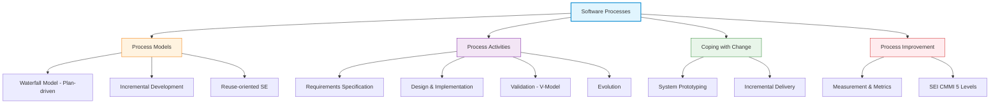

---

# 1. นิยามของกระบวนการซอฟต์แวร์ (Software Process Definition)

*📄 Slides 1-5 (Ch2 SW Processes)*

> [!DEFINITION] Software Process (กระบวนการซอฟต์แวร์)
> **Software Process** คือ ชุดของกิจกรรมที่มีโครงสร้างชัดเจน (Structured set of activities) ซึ่งจำเป็นต้องใช้ในการพัฒนา سیستمซอฟต์แวร์
> **Software Process Model** คือ ตัวแทนเชิงนามธรรม (Abstract representation) ของกระบวนการ โดยนำเสนอรายละเอียดของกระบวนการจากมุมมองเฉพาะด้าน

## 1.1 องค์ประกอบของการอธิบายกระบวนการ (Process Descriptions)
*📄 Slide 4*
- **Activities (กิจกรรม)**: ลำดับขั้นตอนการทำงาน เช่น การกำหนด Data Model, การออกแบบ User Interface
- **Products (ผลผลิต/ชิ้นงาน)**: ผลลัพธ์ที่ได้จากกิจกรรม เช่น เอกสาร Requirements, โค้ดโปรแกรม, คู่มือการใช้งาน
- **Roles (บทบาท)**: ความรับผิดชอบของผู้เกี่ยวข้องในกระบวนการ เช่น System Analyst, Architect, Developer, Tester
- **Pre- and Post-conditions (เงื่อนไขก่อนและหลัง)**: เงื่อนไขที่เป็นจริงก่อนและหลังจากกิจกรรมนั้นๆ จะถูกดำเนินการ

## 1.2 เปรียบเทียบ Plan-driven vs Agile Processes
*📄 Slide 5*

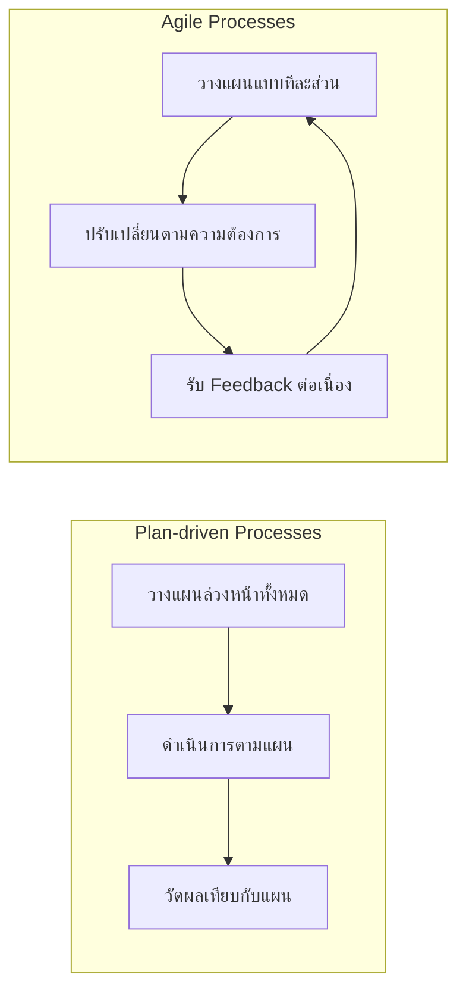

| มิติเปรียบเทียบ | Plan-driven Processes | Agile Processes |
| :--- | :--- | :--- |
| **การวางแผน (Planning)** | วางแผนทุกกิจกรรมล่วงหน้าอย่างครบถ้วน | วางแผนแบบย่อย ทีละรอบ (Incremental Planning) |
| **การรับมือการเปลี่ยนแปลง** | เปลี่ยนแปลงยาก มีค่าใช้จ่าย Rework สูง | รองรับและปรับเปลี่ยนตามความต้องการลูกค้าได้ง่าย |
| **การวัดความก้าวหน้า** | วัดเทียบกับแผนงานที่กำหนดไว้ล่วงหน้า | วัดจากซอฟต์แวร์ที่ทำงานได้จริง (Working Software) |
| **เอกสาร (Documentation)** | เน้นเอกสารครอบคลุมทุกขั้นตอน | เน้นเอกสารที่จำเป็นและโค้ดที่ทำงานได้จริง |

---

# 2. โมเดลกระบวนการซอฟต์แวร์หลัก 3 รูปแบบ (Software Process Models)

*📄 Slides 6-18 (Ch2 SW Processes)*

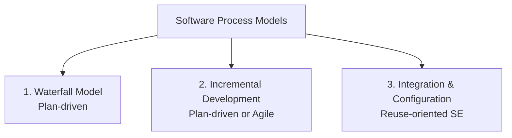

## 2.1 The Waterfall Model (โมเดลน้ำตก)
*📄 Slides 8-10*

เป็นกระบวนการแบบ Plan-driven ที่แบ่งขั้นตอนออกเป็นระยะๆ อย่างเด็ดขาด โดยต้องทำระยะหนึ่งให้เสร็จสมบูรณ์ก่อนจึงจะข้ามไประยะถัดไปได้

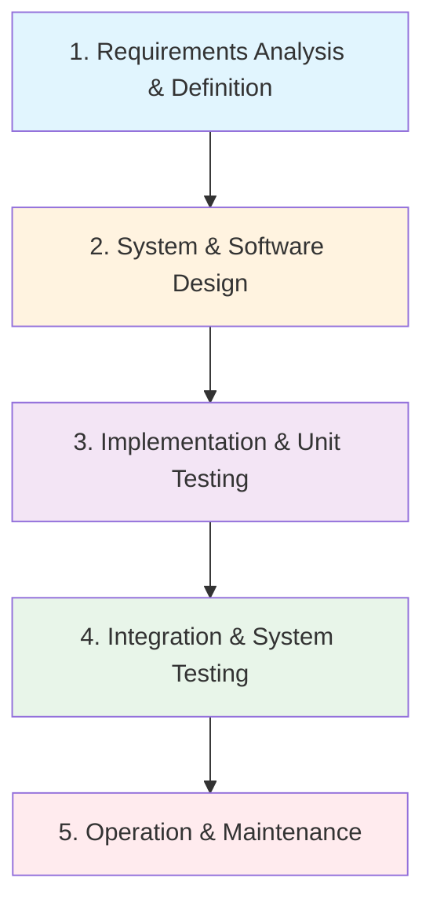

### ขั้นตอนทั้ง 5 ของ Waterfall Model:
1. **Requirements Analysis & Definition**: รวบรวมความต้องการ ข้อจำกัด และกำหนดเป้าหมายระบบ
2. **System & Software Design**: กำหนดสถาปัตยกรรมระบบ โครงสร้างฮาร์ดแวร์และซอฟต์แวร์
3. **Implementation & Unit Testing**: แปลงแบบเป็นโปรแกรมและทดสอบแต่ละยูนิต
4. **Integration & System Testing**: รวมโมดูลย่อยเข้าด้วยกันและทดสอบระบบในภาพรวม
5. **Operation & Maintenance**: ติดตั้งให้ใช้งานจริง และแก้ไขข้อผิดพลาดที่พบหลังการใช้งาน

> [!WARNING] ข้อจำกัดหลักของ Waterfall Model
> **ความยากลำบากในการรองรับความเปลี่ยนแปลง (Difficulty of accommodating change)** หากมีความต้องการเปลี่ยนแปลงเกิดขึ้นระหว่างทาง การย้อนกลับไปแก้ไขระยะแรกๆ จะมีค่าใช้จ่ายสูงมาก เหมาะสำหรับระบบขนาดใหญ่ที่มีความต้องการนิ่งและเข้าใจชัดเจนตั้งแต่แรกเท่านั้น

## 2.2 Incremental Development (การพัฒนาแบบเพิ่มขึ้นทีละส่วน)
*📄 Slides 11-13*

กิจกรรม Specification, Development และ Validation จะถูกทำควบคู่ขนานกันไป (Interleaved) เพื่อสร้างซอฟต์แวร์เป็นเวอร์ชันย่อยๆ

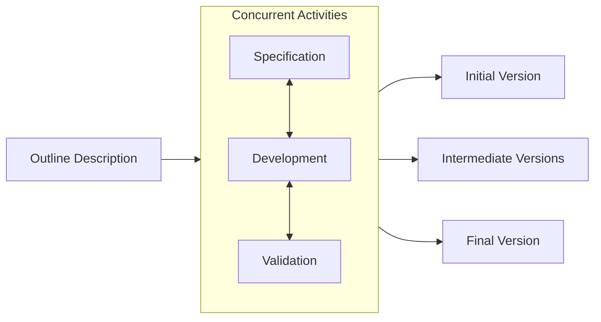

### ข้อดีของ Incremental Development:
1. **ลดต้นทุนการเปลี่ยนแปลง (Reduced cost of change)**: การแก้ไขความต้องการใช้เอกสารและวิเคราะห์ใหม่น้อยกว่า Waterfall
2. **ได้รับ Feedback จากผู้ใช้เร็วขึ้น**: ผู้ใช้ได้เห็นตัวอย่างซอฟต์แวร์ที่ทำงานได้จริงในแต่ละรอบ
3. **ส่งมอบซอฟต์แวร์ได้รวดเร็ว (Rapid delivery)**: ลูกค้าได้เริ่มใช้งานฟังก์ชันสำคัญก่อน

### ข้อเสียของ Incremental Development:
1. **มองไม่เห็นกระบวนการในภาพรวม (Process is not visible)**: ผู้บริหารติดตามความก้าวหน้ายากเพราะไม่คุ้มที่จะทำเอกสารทุกเวอร์ชัน
2. **โครงสร้างระบบเสื่อมสภาพ (System structure degrades)**: หากไม่มีการทำ Refactoring โครงสร้างโค้ดจะเน่าเสียและการแก้ไขในอนาคตจะแพงขึ้น

## 2.3 Integration and Configuration (Reuse-oriented SE)
*📄 Slides 14-18*

มุ่งเน้นการนำส่วนประกอบซอฟต์แวร์ที่มีอยู่แล้ว (COTS - Commercial-off-the-shelf หรือ Web Services) มาประกอบและปรับแต่ง (Configure)

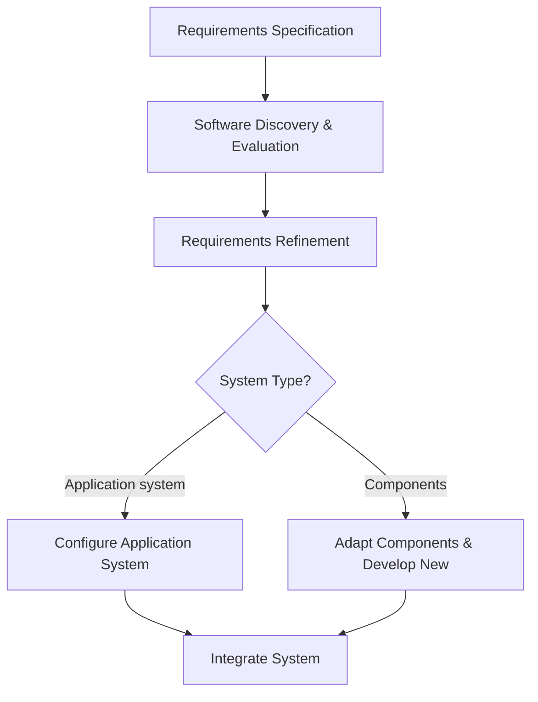

---

# 3. กิจกรรมในกระบวนการซอฟต์แวร์ (Process Activities)

*📄 Slides 19-32 (Ch2 SW Processes)*

## 3.1 Requirements Engineering Process (กระบวนการวิศวกรรมความต้องการ)
*📄 Slides 21-22*

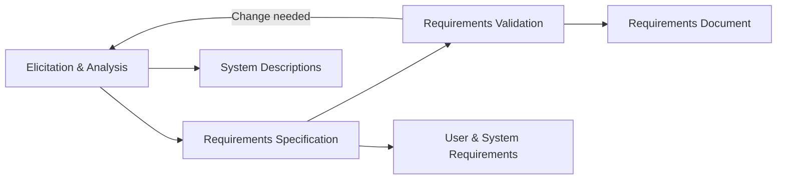

## 3.2 Software Design and Implementation (การออกแบบและการ 구현)
*📄 Slides 23-26*

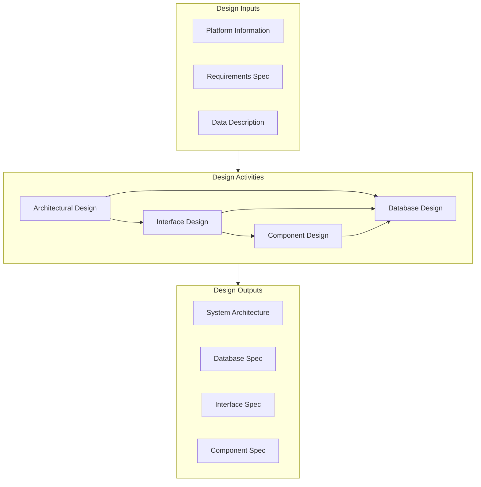

## 3.3 Software Validation & The V-Model (การตรวจสอบความถูกต้อง)
*📄 Slides 27-30*

การตรวจสอบว่าระบบทำงานตรงตามข้อกำหนดและตรงกับความต้องการของลูกค้าหรือไม่ (V & V: Verification and Validation)

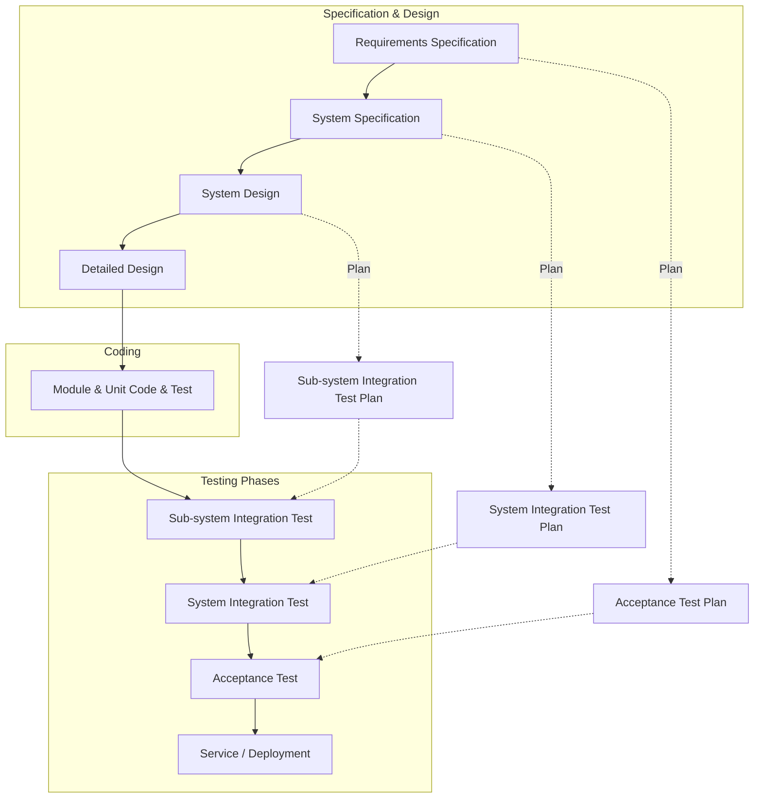

## 3.4 Software Evolution (วิวัฒนาการซอฟต์แวร์)
*📄 Slides 31-32*

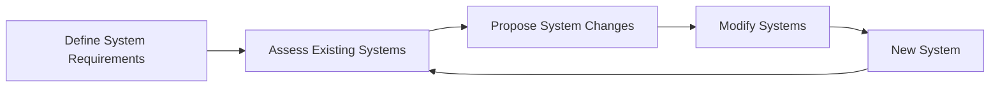

---

# 4. การรับมือกับความเปลี่ยนแปลง (Coping with Change & Prototyping)

*📄 Slides 33-41 (Ch2 SW Processes)*

ความเปลี่ยนแปลงเป็นสิ่งที่หลีกเลี่ยงไม่ได้ในโครงการซอฟต์แวร์ขนาดใหญ่ การรับมือมี 2 กลยุทธ์:
1. **Change Anticipation (การคาดการณ์ความเปลี่ยนแปลง)**: กระบวนการรวมกิจกรรมที่คาดเดาความเปลี่ยนแปลงก่อนเกิด Rework ใหญ่ เช่น การทำ Prototype
2. **Change Tolerance (การรองรับความเปลี่ยนแปลง)**: ออกแบบกระบวนการให้ปรับเปลี่ยนได้ด้วยต้นทุนต่ำ เช่น การทำ Incremental Development

## 4.1 System Prototyping (การทำโปรโตไทป์ระบบ)
*📄 Slides 37-41*

> [!DEFINITION] System Prototype
> **System Prototype** คือ เวอร์ชันแรกเริ่มของระบบที่ถูกสร้างขึ้นอย่างรวดเร็ว เพื่อสาธิตแนวคิด ลองทางเลือกในการออกแบบ และรวบรวมความต้องการที่แท้จริงของผู้ใช้

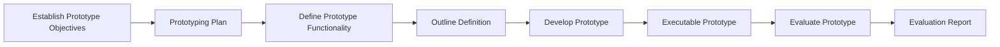

### ประโยชน์ของ Prototyping:
- เพิ่ม Usability ของระบบ
- ตรงตามความต้องการที่แท้จริงของผู้ใช้
- เพิ่มคุณภาพการออกแบบและการดูแลรักษา
- ลดความพยายามในการพัฒนาในระยะยาว

> [!CAUTION] Throw-away Prototypes
> **Prototypes ควรถูกทิ้ง (Discarded) หลังจากประเมินเสร็จ** ไม่ควรนำมาเป็นฐานในการสร้างระบบจริง เนื่องจากไม่ได้ออกแบบรองรับ Non-functional requirements (Security, Performance) ขาดเอกสาร และโครงสร้างเน่าเสียจากการเร่งสร้าง

---

# 5. การส่งมอบซอฟต์แวร์แบบเพิ่มขึ้น (Incremental Delivery)

*📄 Slides 42-46 (Ch2 SW Processes)*

เป็นการแตกการพัฒนาและการส่งมอบระบบออกเป็นส่วนๆ (Increments) โดยจัดลำดับความสำคัญตามความต้องการของลูกค้า ฟังก์ชันที่มีความสำคัญสูงสุดจะถูกสร้างและส่งมอบให้ผู้ใช้ใช้งานจริงก่อน

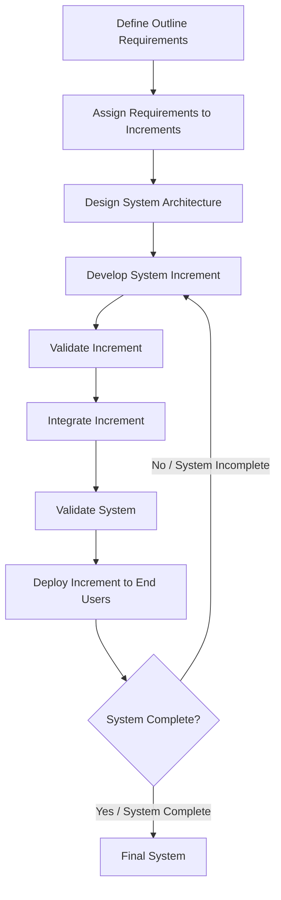

---

# 6. การปรับปรุงกระบวนการและโมเดลความวุฒิภาวะ (Process Improvement & SEI CMMI)

*📄 Slides 47-58 (Ch2 SW Processes)*

## 6.1 Process Improvement Cycle
*📄 Slides 48-53*

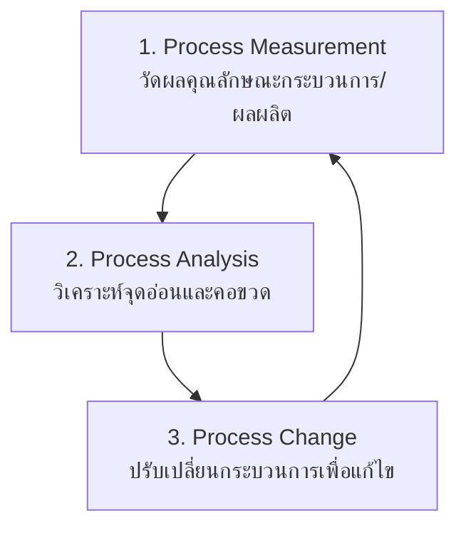

## 6.2 SEI Capability Maturity Model (CMMI 5 ระดับ)
*📄 Slides 54-55*

ประเมินความวุฒิภาวะขององค์กรในการบริหารจัดการกระบวนการซอฟต์แวร์ 5 ระดับ:

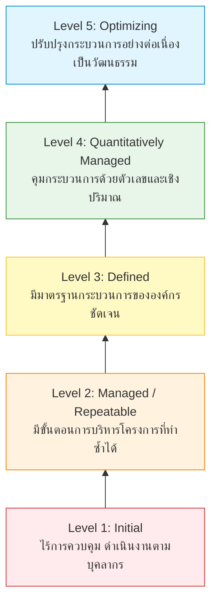

1. **Level 1 Initial (เริ่มต้น)**: กระบวนการโกลาหล ไร้การควบคุม ความสำเร็จขึ้นอยู่กับความสามารถเฉพาะตัวบุคคล
2. **Level 2 Managed / Repeatable (จัดการได้/ทำซ้ำได้)**: มีการวางแผนและติดตามโครงการ สามารถทำซ้ำสำเร็จในโครงการที่คล้ายกันได้
3. **Level 3 Defined (กำหนดไว้ชัดเจน)**: มีกระบวนการมาตรฐานและยุทธศาสตร์ขององค์กรที่บันทึกเป็นลายลักษณ์อักษร
4. **Level 4 Quantitatively Managed (จัดการเชิงปริมาณ)**: มีการวัดผลกระบวนการและคุณภาพซอฟต์แวร์ด้วยตัวเลขเชิงปริมาณ
5. **Level 5 Optimizing (ปรับปรุงสู่ความเป็นเลิศ)**: มีกระบวนการปรับปรุงองค์กรอย่างต่อเนื่องโดยใช้ข้อมูลป้อนกลับและการนวัตกรรม
