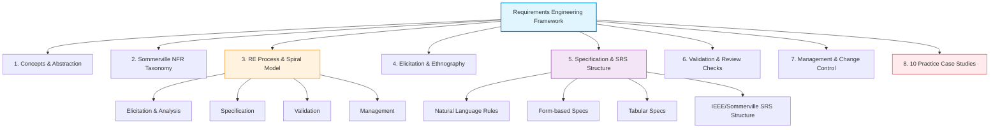
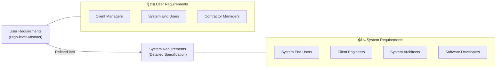
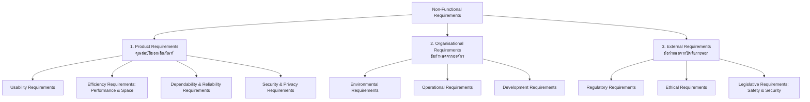
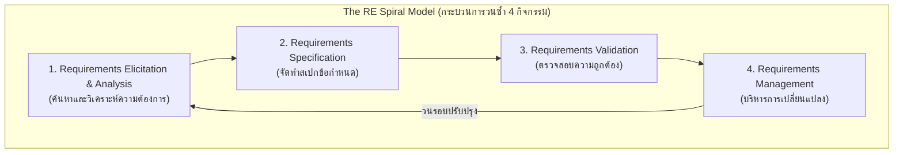
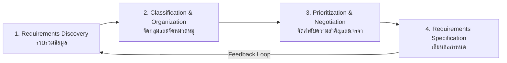
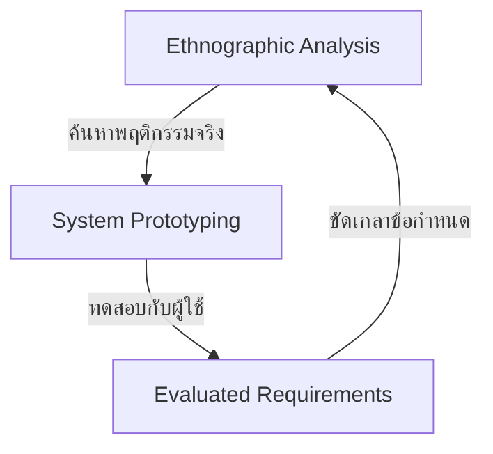
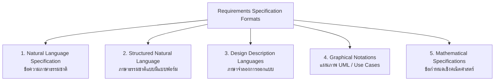
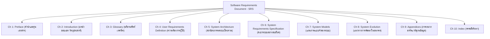
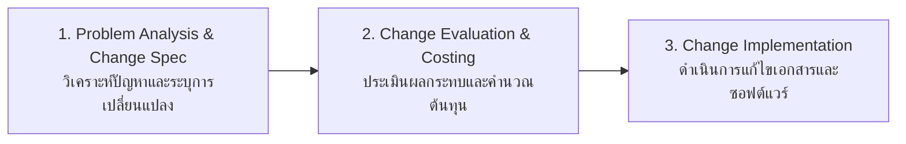

---
tags:
  - software-engineering
  - requirements-engineering
  - elicitation
  - specification
  - validation
  - change-management
  - stakeholders
  - case-studies
  - lecture-3
created: 2026-08-03
updated: 2026-08-11
lecture: 3
type: lecture
---

# Lecture 3: Requirements Engineering, Elicitation, Specification & Case Studies

> [!SUMMARY] ภาพรวมบทเรียนและคลังความรู้ฉบับสมบูรณ์ (Master Mega-Guide)
> บทเรียนนี้สรุปและสังเคราะห์เนื้อหาอย่างละเอียดจาก **Lecture-010925.pdf**, **Lecture2.pdf**, **Lecture3.pdf**, **Ch4 Req Eng.pdf** (Ian Sommerville Ch 4 Official Slides) และ **Practice-ReqEng.pdf** (ชุดโจทย์และกรณีศึกษาปฏิบัติการ) ครอบคลุม 8 มิติสำคัญของวิศวกรรมความต้องการ:
> 1. [[#1. แนวคิดพื้นฐานและระดับความ abstraกต์ของความต้องการ (Fundamental RE Concepts & Abstraction)]]
> 2. [[#2. จำแนกประเภท Non-Functional Requirements เชิงลึก (Sommerville NFR Taxonomy)]]
> 3. [[#3. กระบวนการวิศวกรรมความต้องการแบบเกลียวสว่าน (The RE Process & Spiral Model)]]
> 4. [[#4. เทคนิคการเก็บรวบรวมความต้องการและการวิเคราะห์ (Elicitation Techniques & Ethnography)]]
> 5. [[#5. การทำสเปกข้อกำหนดและการจัดทำเอกสาร SRS (Requirements Specification & SRS Document)]]
> 6. [[#6. การตรวจสอบความถูกต้องและความสมบูรณ์ (Requirements Validation & Review Checks)]]
> 7. [[#7. การบริหารการเปลี่ยนแปลงและการติดตามความต้องการ (Requirements Management & Change Control)]]
> 8. [[#8. 10 กรณีศึกษาระบบจริงและการวิเคราะห์โจทย์ปฏิบัติการ (10 Real-World Case Studies & Exercises)]]

---

# 1. แนวคิดพื้นฐานและระดับความ абстраกต์ของความต้องการ (Fundamental RE Concepts & Abstraction)

*📄 Slides 1-12 (Ch4 Req Eng.pdf) & Lecture-010925.pdf*

> [!DEFINITION] Requirements Engineering (วิศวกรรมความต้องการ)
> **Requirements Engineering (RE)** คือ กระบวนการค้นหา (Establishing), สรุปวิเคราะห์, จัดทำข้อกำหนด (Documenting) และดูแลรักษาบริการ (Services) ที่ลูกค้าต้องการจากระบบ รวมถึงข้อจำกัด (Constraints) ต่างๆ ที่ระบบต้องดำเนินงานภายใต้เงื่อนไขนั้น

## 1.1 ระดับความ абстраกต์ของความต้องการ (Requirements Abstraction - Davis)
ความต้องการซอฟต์แวร์มีระดับความรายละเอียดแตกต่างกันตามเป้าหมายและการนำไปใช้งาน:
- **High-level Abstract Statement**: คำแถลงระดับสูงสำหรับประกาศประกวดราคาหรือสร้างสัญญาจ้าง เพื่อให้ผู้รับจ้างเปิดกว้างเสนอแนวทางทางเทคโนโลยี
- **Detailed System Specification**: คำอธิบายทางเทคนิคอย่างละเอียดเพื่อใช้ในการออกแบบและพัฒนาระบบจริง

### ตารางเปรียบเทียบประเภทและกลุ่มผู้อ่านข้อกำหนด (Target Readers Matrix)

| ประเภทความต้องการ (Type) | คำนิยาม (Definition) | รูปแบบที่ใช้ (Format) | กลุ่มผู้อ่านเป้าหมาย (Target Readers) |
| :--- | :--- | :--- | :--- |
| **User Requirements (ความต้องการของผู้ใช้)** | คำแถลงภาษาธรรมชาติพร้อมไดอะแกรมระบุว่าระบบต้องให้บริการอะไรและมีข้อจำกัดอะไรบ้าง | ภาษาธรรมชาติ (Natural language), Diagram ระดับสูง | - ผู้บริหารฝ่ายลูกค้า (Client Managers) - ผู้ใช้ปลายทาง (System End Users) - ผู้จัดการโครงการฝั่งผู้รับจ้าง (Contractor Managers) - สถาปนิกซอฟต์แวร์ (System Architects) |
| **System Requirements (ความต้องการของระบบ)** | เอกสารระบุฟังก์ชันการทำงาน บริการ และข้อจำกัดทางเทคนิคอย่างละเอียด จัดทำเป็นสัญญารับจ้าง | เอกสารข้อกำหนดที่มีโครงสร้าง (Structured Docs), System Models | - ผู้ใช้ปลายทาง (System End Users) - วิศวกรฝ่ายลูกค้า (Client Engineers) - สถาปนิกซอฟต์แวร์ (System Architects) - นักพัฒนาซอฟต์แวร์ (Software Developers) |

## 1.2 Agile Methods กับ Requirements Engineering
- ในแนวทาง **Agile** การเขียนเอกสารความต้องการซอฟต์แวร์อย่างละเอียดล่วงหน้าถือเป็นสิ่งสิ้นเปลือง (Waste of time) เนื่องจากความต้องการเปลี่ยนแปลงตลอดเวลา
- Agile ใช้เทคนิค **User Stories** หรือ **Scenarios** เขียนลงบน Card/Backlog และทำความเข้าใจผ่านการสื่อสารในทีม (Interactive Discussion)
- อย่างไรก็ตาม สำหรับระบบขนาดใหญ่ (Large Scale), ระบบที่มีความเสี่ยงสูง (Safety-Critical), หรือระบบที่ต้องจ้างเอาต์ซอร์ส (Outsourcing Contract) การจัดทำเอกสาร System Requirements ยังคงจำเป็นอย่างยิ่ง

---

# 2. จำแนกประเภท Non-Functional Requirements เชิงลึก (Sommerville NFR Taxonomy)

*📄 Slides 13-28 (Ch4 Req Eng.pdf) & Lecture2.pdf*

Non-Functional Requirements (NFR) กำหนดคุณสมบัติและข้อจำกัดของระบบโดยรวม (System Properties & Constraints) หากระบบไม่บรรลุ NFR อาจทำให้ระบบใช้งานไม่ได้โดยสิ้นเชิง (System Unusable)

## 2.1 รายละเอียดการจำแนก NFR 3 สายหลัก (Sommerville Classification)

1. **Product Requirements (ความต้องการด้านผลิตภัณฑ์)**:
   - **Usability**: ความง่ายในการใช้งาน เช่น หน้าจอต้องแสดงผลชัดเจน ผู้ใช้ใหม่สั่งซื้อเสร็จใน 5 นาที
   - **Efficiency**: ประสิทธิภาพแบ่งเป็น **Performance** (เวลาตอบสนอง $< 2$ วินาที) และ **Space** (ขนาดหน่วยความจำ)
   - **Dependability & Reliability**: ความน่าเชื่อถือ เช่น Service Uptime $\ge 99.9\%$
   - **Security**: ความปลอดภัยข้อมูล เช่น เข้ารหัสด้วย AES-256 / SSL/TLS

2. **Organisational Requirements (ความต้องการด้านองค์กร)**:
   - **Environmental**: สภาพแวดล้อมการทำงานของระบบ เช่น ต้องทำงานบนระบบโฮสติ้งภายในประเทศไทย
   - **Operational**: กระบวนการปฏิบัติงาน เช่น ต้องทำระบบสำรองข้อมูล (Backup) ทุกวันเวลา 02:00 น.
   - **Development**: ภาษาและเครื่องมือพัฒนา เช่น ต้องใช้ PHP Laravel Framework หรือ Flutter

3. **External Requirements (ความต้องการด้านปัจจัยภายนอก)**:
   - **Regulatory**: ข้อบังคับทางกฎหมาย เช่น ปฏิบัติตาม พ.ร.บ. คุ้มครองข้อมูลส่วนบุคคล (PDPA) หรือ HIPAA
   - **Ethical**: จริยธรรมการใช้งาน เช่น ระบบจะไม่ยินยอมให้เปิดเผยประวัติสุขภาพแก่บุคคลภายนอก
   - **Legislative / Safety**: ความปลอดภัยต่อชีวิตและทรัพย์สิน เช่น การจ่ายยาของ Insulin Pump ต้องมีระบบฮาร์ดแวร์ตัดไฟฉุกเฉิน Safety Cutoff

## 2.2 ปัญหาความไม่ชัดเจนและความสมบูรณ์ (Imprecision, Completeness & Consistency)
- **Requirements Imprecision (ความกำกวม)**: เกิดขึ้นเมื่อเขียนด้วยคำคลุมเครือ เช่น "ระบบต้องค้นหาได้รวดเร็ว" หรือ "ใช้งานง่าย" ซึ่งวัดผลไม่ได้
- **Non-functional Goals vs Testable Requirements**:
  - *Goal (กำกวม)*: "ระบบต้องใช้งานง่ายและแสดงผลรวดเร็ว"
  - *Testable Metric (วัดผลได้จริง)*: "ผู้ใช้ที่ผ่านการอบรม 30 นาที สามารถสั่งซื้อสินค้าเสร็จได้ภายในเวลาไม่เกิน 5 นาที และปุ่มกดมีขนาดไม่น้อยกว่า $44 \times 44$ pt"
- **Requirements Completeness & Consistency**:
  - **Complete**: รวมความต้องการของผู้ใช้และระบบทั้งหมดไว้ครบถ้วน
  - **Consistent**: ข้อกำหนดแต่ละข้อต้องไม่ขัดแย้งกันเอง (ในความเป็นจริงทำได้ยากในระบบขนาดใหญ่)

---

# 3. กระบวนการวิศวกรรมความต้องการแบบเกลียวสว่าน (The RE Process & Spiral Model)

*📄 Slides 29-36 (Ch4 Req Eng.pdf)*

กระบวนการวิศวกรรมความต้องการไม่ใช่การทำงานรอบเดียวเสร็จ (Linear) แต่เป็นกระบวนการวนซ้ำ (Iterative Process) ที่พัฒนาความเข้าใจลึกซึ้งขึ้นเรื่อยๆ แสดงด้วย **Spiral Model of RE**:

## 3.1 4 ขั้นตอนในวงรอบ Elicitation & Analysis Process Cycle

1. **Requirements Discovery**: ปฏิสัมพันธ์กับ Stakeholders เพื่อค้นหาความต้องการของระบบเดิมและระบบใหม่
2. **Classification & Organization**: จัดหมวดหมู่ความต้องการ แยกแยะความต้องการที่เกี่ยวข้องกัน และจัดกลุ่มตามระบบย่อย
3. **Prioritization & Negotiation**: จัดลำดับความสำคัญของความต้องการ และเจรจาต่อรองเมื่อเกิดข้อขัดแย้งระหว่าง Stakeholders
4. **Requirements Specification**: บันทึกความต้องการลงในเอกสารอย่างเป็นทางการเพื่อนำไปใช้ในวงรอบถัดไป

## 3.2 ปัญหาหลักในการเก็บรวบรวมความต้องการ (Problems of Elicitation)
- **Stakeholders ไม่รู้ความต้องการที่แท้จริงของตนเอง**: ทราบเพียงปัญหาเฉพาะหน้า แต่มองไม่ออกว่าซอฟต์แวร์ช่วยได้อย่างไร
- **การใช้ศัพท์เฉพาะทาง (Domain Jargon)**: Stakeholders อธิบายด้วยศัพท์ทางธุรกิจหรือโดเมนเฉพาะ ทำให้วิศวกรซอฟต์แวร์ไม่เข้าใจ
- **ความต้องการที่ขัดแย้งกัน (Conflicting Requirements)**: Stakeholders แต่ละกลุ่มมีเป้าหมายขัดแย้งกัน
- **ปัจจัยทางการเมืองและการเมืองในองค์กร (Organizational Politics)**: มีผลกระทบต่อความยินยอมในการให้ข้อมูล
- **สภาพแวดล้อมเปลี่ยนแปลง (Dynamic Environment)**: ความต้องการเปลี่ยนระหว่างกระบวนการวิเคราะห์

---

# 4. เทคนิคการเก็บรวบรวมความต้องการและการวิเคราะห์ (Elicitation Techniques & Ethnography)

*📄 Slides 37-48 (Ch4 Req Eng.pdf) & Lecture3.pdf*

## 4.1 เปรียบเทียบ 6 เทคนิคพื้นฐานการเก็บรวบรวมความต้องการ

| เทคนิค (Technique) | คำอธิบาย (Description) | ข้อดี (Pros) | ข้อเสีย (Cons) | บริบทที่เหมาะสม (When to use) |
| :--- | :--- | :--- | :--- | :--- |
| **1. Interviews** | สัมภาษณ์แบบเปิด (Open-ended) หรือแบบปิด (Closed) 1-on-1 | ได้ข้อมูลเชิงลึก ลงรายละเอียด เจาะลึกความต้องการซ่อนเร้น | ใช้เวลานาน ได้ข้อมูลเอนเอียงหากผู้สัมภาษณ์ไม่ชำนาญ | เก็บข้อมูลจากผู้บริหาร เจ้าของธุรกิจ หรือ Key Users |
| **2. Questionnaires** | แบบสอบถามมีโครงสร้าง ส่งให้กลุ่มตัวอย่างตอบจำนวนมาก | สเกลง่าย (Scalable) ต้นทุนต่ำ วิเคราะห์สถิติง่าย | ซักถามเพิ่มเติมไม่ได้ หากออกแบบคำถามแย่จะได้ข้อมูลผิด | สำรวจความพึงพอใจและฟีเจอร์จาก End Users กลุ่มใหญ่ |
| **3. Workshops / Focus Groups** | การประชุมร่วมกันของ Stakeholders จากหลายฝ่าย | สร้างความเห็นพ้อง (Consensus) เคลียร์ความขัดแย้งรวดเร็ว | ผู้มีอำนาจสูงอาจข่มความคิดเห็นผู้อื่น ต้องมี Facilitator | ตกลงขอบเขตโครงการและเคลียร์ความต้องการที่ขัดแย้งกัน |
| **4. Brainstorming** | เซสชันเปิดกว้างให้ระดมความคิดเห็นโดยไม่มีการตัดสินในทันที | กระตุ้นความคิดสร้างสรรค์ เกิดนวัตกรรมและฟีเจอร์ใหม่ | ไอเดียอาจไม่สมจริง (Unrealistic) ต้องนำมากรองภายหลัง | เริ่มต้นโครงการใหม่ที่ต้องการสร้างจุดเด่นหรือนวัตกรรม |
| **5. Observation / Ethnography** | สังเกตการณ์ผู้ใช้ทำงานจริงในสภาพแวดล้อมการทำงาน | ค้นพบ Unspoken Needs และวิธีแก้ปัญหาเฉพาะหน้า (Workarounds) | ใช้เวลานาน พฤติกรรมผู้ใช้อาจเปลี่ยนเมื่อรู้ว่าถูกสังเกต | กระบวนการทำงานซับซ้อนที่ผู้ใช้พรรณนาเป็นคำพูดไม่ได้ |
| **6. Document Analysis** | ตรวจสอบเอกสาร รายงาน รูปแบบฟอร์ม คู่มือ หรือระบบเดิม | ได้กฎระเบียบ กฎหมาย และโครงสร้างข้อมูลดั้งเดิม | ข้อมูลในเอกสารอาจไม่อัปเดต ขาดContext การใช้งานจริง | ก่อนลงพื้นที่สัมภาษณ์ เพื่อศึกษารากฐานของระบบเดิม |

## 4.2 Ethnography & Focused Ethnography เชิงลึก
- **Ethnography**: เทคนิคทางสังคมศาสตร์ โดยวิเคราะห์และสังเกตพฤติกรรมผู้ใช้ในสภาพแวดล้อมจริง
- **ข้อดีเฉพาะ**: ช่วยให้เข้าใจวัฒนธรรมองค์กร กระบวนการทำงานจริงที่ต่างจากคู่มือปฏิบัติงาน (Derived from how people actually work vs how process definitions say they work)
- **Focused Ethnography**: สังเกตการณ์แบบมุ่งเน้นระยะสั้น ร่วมกับการใช้ **Prototyping** (เช่น กรณีศึกษาการวิเคราะห์ระบบควบคุมการจราจรทางอากาศ Air Traffic Control)

## 4.3 Scenarios & User Stories (กรณีศึกษา iLearn Scenario)
Scenarios ช่วยแปลงความคิดเป็นตัวอย่างการใช้งานจริงในชีวิตประจำวัน (Real-life Examples):
- **โครงสร้างของ Scenario**:
  1. ข้อสันนิษฐานเริ่มต้น (Initial Assumptions)
  2. ลำดับเหตุการณ์ปกติ (Normal Flow of Events)
  3. สิ่งที่อาจผิดพลาดและข้อขัดข้อง (What can go wrong & Exceptions)
  4. ข้อมูลกิจกรรมอื่นที่เกิดพร้อมกัน (Concurrent Activities)
  5. สถานะเมื่อจบกิจกรรม (System State on Completion)

> [!EXAMPLE] กรณีศึกษา iLearn - Uploading Photos Scenario
> - **Initial Assumption**: ครูผู้สอนและนักเรียนมีรูปถ่ายดิจิทัลพร้อมอัปโหลดเข้าสู่ระบบเรียนรู้
> - **Normal Flow**: เลือกไฟล์รูปภาพ เลือกอัลบั้มเป้าหมาย กดปุ่ม Upload ระบบย่อขนาดรูปอัตโนมัติ แสดงภาพตัวอย่าง (Thumbnail) และส่งการแจ้งเตือนผู้คุมห้องเรียน (Moderator)
> - **What can go wrong (Exception)**: 
>   - ไม่มี Moderator รับผิดชอบโครงการ -> ระบบส่งอีเมลแจ้งเตือน Administrator อัตโนมัติ
>   - รูปภาพมีขนาดเกินขีดจำกัด -> ระบบบีบอัดไฟล์หรือแจ้งเตือนให้ผู้ใช้อัปโหลดใหม่

---

# 5. การทำสเปกข้อกำหนดและการจัดทำเอกสาร SRS (Requirements Specification & SRS Document)

*📄 Slides 49-69 (Ch4 Req Eng.pdf)*

## 5.1 5 รูปแบบการเขียนข้อกำหนดความต้องการระบบ (Specification Notations)

1. **Natural Language Specification**: เขียนเป็นประโยคภาษาธรรมชาติ พร้อมแผนภาพและตารางประกอบ เหมาะกับ User Requirements
2. **Structured Natural Language**: จำกัดเสรีภาพผู้เขียนโดยใช้ Template / Form มาตรฐาน (เช่น Form-based Specs)
3. **Design Description Languages**: ใช้ภาษาสไตล์โปรแกรมมิ่ง (Pseudocode/PDL) เพื่ออธิบายสถาปัตยกรรม
4. **Graphical Notations**: ใช้แผนภาพเชิงสัญลักษณ์ เช่น UML Use Case Diagrams และ Sequence Diagrams
5. **Mathematical Specifications**: อธิบายด้วยหลักตรรกศาสตร์และความสัมพันธ์เชิงคณิตศาสตร์ (ใช้ในระบบ Safety-Critical)

## 5.2 กฎและแนวทางการเขียน Natural Language Specification
- **การใช้คำกริยาช่วยอย่างเป็นระบบ**:
  - ใช้คำว่า **"shall"** สำหรับความต้องการที่บังคับต้องมี (Mandatory/Functional requirements)
  - ใช้คำว่า **"should"** สำหรับความต้องการที่พึงมีหรือปรับเปลี่ยนได้ (Desirable/Optional requirements)
- **เน้นย้ำข้อความสำคัญ**: ใช้ตัวหนา (Bold), ตัวเอียง (Italics) หรือการไฮไลต์สีเพื่อแยกแยะค่าตัวเลขและเงื่อนไข
- **หลีกเลี่ยง Jargon**: หลีกเลี่ยงศัพท์เทคนิคโปรแกรมมิ่งในระดับ User Requirements

## 5.3 Structured / Form-Based Specification (กรณีศึกษา Insulin Pump)
การเขียนข้อกำหนดระบบย่อยด้วยแบบฟอร์มมาตรฐานประกอบด้วยช่องข้อมูลสำคัญดังนี้:

| หัวข้อแบบฟอร์ม (Form Field) | รายละเอียดข้อมูล (Description) | ตัวอย่าง (Insulin Pump System Example) |
| :--- | :--- | :--- |
| **Function / Entity** | ชื่อฟังก์ชันหรือระบบย่อย | **3.2 Deliver Insulin Dose (การจ่ายโดสอินซูลิน)** |
| **Description** | คำอธิบายวัตถุประสงค์การทำงาน | คำนวณและสั่งการฮาร์ดแวร์จ่ายอินซูลินตามระดับน้ำตาลในเลือด |
| **Inputs** | ข้อมูลเข้าและแหล่งที่มา | ค่าระดับน้ำตาลในเลือดปัจจุบัน ($G_t$) จากเซ็นเซอร์, ค่าระดับน้ำตาลครั้งก่อน ($G_{t-1}$) |
| **Source** | ที่มาของ Input | เซ็นเซอร์วัดระดับน้ำตาลในเลือด (Blood Sugar Sensor) |
| **Outputs** | ข้อมูลออกและจุดหมายปลายทาง | คำสั่งควบคุมปั๊มหมุนจ่ายโดสอินซูลิน (Pump Control Signal) |
| **Destination** | ปลายทางของ Output | ชุดมอเตอร์ปั๊มอินซูลิน (Insulin Pump Actuator) |
| **Action** | ลำดับการประมวลผลและการคำนวณ | หากระดับน้ำตาลสูงขึ้น ให้คำนวณอัตราความเปลี่ยนแปลงและส่งสัญญาณหมุนปั๊ม |
| **Pre-condition** | เงื่อนไขก่อนฟังก์ชันทำงาน | ระดับน้ำตาลถูกอ่านค่าสำเร็จ และมีอินซูลินเหลือในหลอดฉีด |
| **Post-condition** | สถานะระบบหลังฟังก์ชันทำงานสำเร็จ | อินซูลินถูกจ่ายเรียบร้อย บันทึกประวัติการจ่ายยาลง Memory |
| **Side Effects** | ผลกระทบข้างเคียงที่อาจเกิดขึ้น | แบตเตอรี่ลดลงเล็กน้อย, เกิดการสะสมโดสอินซูลินในร่างกาย |

## 5.4 Tabular Specification (การเขียนสเปกแบบตาราง)
ใช้เสริมภาษาธรรมชาติเมื่อต้องกำหนดเงื่อนไขและผลลัพธ์หลายกรณี (Condition-Action Matrix):

| Condition (เงื่อนไขระดับน้ำตาลในเลือด) | Action (การดำเนินการของระบบ) |
| :--- | :--- |
| $Sugar < CompSugar$ | $Dose = 0$ (ไม่จ่ายอินซูลิน) |
| $Sugar = CompSugar$ | $Dose = 0$ (ระดับน้ำตาลคงที่) |
| $Sugar > CompSugar \text{ and } (Sugar - CompSugar) < MinimumDose$ | $Dose = MinimumDose$ |
| $Sugar > CompSugar \text{ and } (Sugar - CompSugar) \ge MinimumDose$ | $Dose = (Sugar - CompSugar) / Rate$ |

## 5.5 โครงสร้างเอกสารข้อกำหนดความต้องการซอฟต์แวร์ (SRS IEEE Standard / Sommerville 10 Chapters)

### กลุ่มผู้ใช้งานเอกสาร SRS (Users of SRS Document)
1. **System Customers**: ตรวจสอบความถูกต้องและลงนามอนุมัติขอบเขตสัญญา
2. **Managers**: วางแผนการประเมินราคา จัดทำงบประมาณ และบริหารตารางเวลา
3. **System Engineers**: นำความต้องการไปออกแบบสถาปัตยกรรมและโครงสร้างซอฟต์แวร์
4. **System Test Engineers**: นำไปสร้างกรณีทดสอบระบบ (System Test Cases / Acceptance Tests)
5. **System Maintenance Engineers**: ใช้ทำความเข้าใจระบบเมื่อต้องแก้ไขหรือปรับปรุงในอนาคต

---

# 6. การตรวจสอบความถูกต้องและความสมบูรณ์ (Requirements Validation & Review Checks)

*📄 Slides 70-75 (Ch4 Req Eng.pdf)*

Requirements Validation คือกระบวนการพิสูจน์ว่าความต้องการที่ระบุในเอกสารเป็นสิ่งที่ลูกค้าและผู้ใช้ต้องการจริงหรือไม่ (Demonstrating that requirements define the system that the customer really wants) เนื่องจาก **ต้นทุนในการแก้ไขข้อผิดพลาดของ Requirements ภายหลังการส่งมอบสูงกว่าการแก้ในระยะเริ่มต้นหลายร้อยเท่า**

## 6.1 5 การตรวจสอบความถูกต้องหลัก (Core Requirements Validation Checks)
1. **Validity Checks (ความถูกต้องตรงตามวัตถุประสงค์)**: ฟังก์ชันที่กำหนดช่วยสนับสนุนงานของลูกค้าได้ดีที่สุดจริงหรือไม่
2. **Consistency Checks (ความสอดคล้องกัน)**: ไม่มีข้อกำหนดใดขัดแย้งกันเองในเอกสาร
3. **Completeness Checks (ความสมบูรณ์ครอบคลุม)**: รวมฟังก์ชันและข้อจำกัดที่จำเป็นทั้งหมดไว้ครบถ้วน
4. **Realism Checks (ความจริงแท้และเป็นไปได้)**: สามารถพัฒนาได้จริงภายใต้เทคโนโลยี งบประมาณ และเวลาที่มีอยู่
5. **Verifiability Checks (ความสามารถในการทดสอบได้)**: เขียนในลักษณะที่สามารถสร้างชุดทดสอบเพื่อพิสูจน์ได้จริง

## 6.2 เทคนิคการตรวจสอบความถูกต้อง 3 เทคนิค
- **Requirements Reviews**: การตรวจทานเอกสารแบบแมนนวลอย่างเป็นระบบโดยทีมวิศวกรและ Stakeholders
- **Prototyping**: สร้างระบบต้นแบบให้ผู้ใช้ทดสอบใช้งานจริง
- **Test-case Generation**: ทดลองเขียน TestCase จากเอกสาร หากเขียนยาก แสดงว่า Requirement นั้นกำกวม

## 6.3 Checklist สำหรับการประชุมตรวจทาน (Review Checks Checklist)
- **Verifiability**: ข้อกำหนดนี้ทดสอบได้หรือไม่?
- **Comprehensibility**: ผู้ใช้เข้าใจข้อความนี้ตรงกันหรือไม่?
- **Traceability**: สามารถสืบย้อนกลับไปยังที่มาของความต้องการนี้ได้หรือไม่?
- **Adaptability**: ข้อกำหนดนี้รองรับการเปลี่ยนแปลงในอนาคตได้ง่ายเพียงใด?

---

# 7. การบริหารการเปลี่ยนแปลงและการติดตามความต้องการ (Requirements Management & Change Control)

*📄 Slides 76-88 (Ch4 Req Eng.pdf)*

## 7.1 ธรรมชาติของการเปลี่ยนแปลงความต้องการ (Enduring vs Volatile Requirements)
- **Enduring Requirements**: ความต้องการที่คงที่ มักเป็น Core Business Logic ของโดเมนนั้นๆ (เช่น ระบบสั่งซื้อต้องคิดภาษีมูลค่าเพิ่ม)
- **Volatile Requirements**: ความต้องการที่เปลี่ยนแปลงตลอดเวลาตามสภาพแวดล้อม แบ่งเป็น 4 กลุ่ม:
  1. *Mutable Requirements*: เปลี่ยนตามสภาพแวดล้อมทางธุรกิจ
  2. *Emergent Requirements*: เกิดขึ้นใหม่เมื่อผู้ใช้เริ่มเข้าใจระบบ
  3. *Consequential Requirements*: เกิดขึ้นจากผลกระทบของการติดตั้งระบบใหม่
  4. *Compatibility Requirements*: เปลี่ยนแปลงตามระบบภายนอกหรือฮาร์ดแวร์ใหม่

## 7.2 นโยบายการติดตามความต้องการ (Traceability Management Policies)
การติดตามความต้องการช่วยให้วิเคราะห์ผลกระทบเมื่อเกิดการเปลี่ยนแปลง (Impact Analysis) แบ่งออกเป็น 3 มิติ:
- **Source Traceability**: เชื่อมโยงความต้องการกลับไปยัง Stakeholders หรือเอกสารต้นทาง
- **Requirement Traceability**: เชื่อมโยงความต้องการที่เกี่ยวข้องกันเอง
- **Design Traceability**: เชื่อมโยงความต้องการไปยังโมดูลการออกแบบและซอร์สโค้ด

## 7.3 กระบวนการควบคุมการเปลี่ยนแปลงความต้องการ 3 ขั้นตอน (Requirements Change Management)

1. **Problem Analysis & Change Specification**: ตรวจสอบปัญหาที่แจ้งเข้ามา และระบุข้อเสนอการเปลี่ยนแปลงอย่างชัดเจน
2. **Change Evaluation & Costing**: ประเมินผลกระทบต่อโมดูลอื่น ตลอดจนต้นทุนและเวลาที่ต้องใช้ในการแก้ไข
3. **Change Implementation**: ดำเนินการปรับปรุงเอกสาร SRS, Code และ Test Cases ตามข้อตกลง

---

# 8. 10 กรณีศึกษาระบบจริงและการวิเคราะห์โจทย์ปฏิบัติการ (10 Real-World Case Studies & Exercises)

*📄 สังเคราะห์จาก Practice-ReqEng.pdf, Ch4 Req Eng.pdf, Lecture-010925.pdf & Lecture3.pdf*

---

## 8.1 Case Study 1: FreshMart (E-commerce Website)
*📄 Practice-ReqEng.pdf (Pages 1-2)*

- **ภาพรวม**: เว็บไซต์สั่งซื้อผักสด ผลไม้ และของใช้ประจำวันในกรุงเทพฯ ของคุณสุพรรษา
- **1. Functional Requirements**:
  - ลงทะเบียนและเข้าสู่ระบบด้วยอีเมลและรหัสผ่าน
  - แสดงรายการสินค้าแบ่งตามหมวดหมู่ชัดเจน (ผัก, ผลไม้, เบเกอรี่)
  - เพิ่ม แก้ไข และลบสินค้าในตะกร้าสินค้า
  - คำนวณและแสดงราคารวมในตะกร้า
  - เลือกรอบเวลาจัดส่ง (Delivery Time Slots)
  - รองรับการชำระเงินออนไลน์ผ่าน บัตรเครดิต, บัตรเดบิต และ Mobile Banking
  - ส่งอีเมลยืนยันการสั่งซื้อพร้อมรายละเอียดการจัดส่งอัตโนมัติ
- **2. Non-Functional Requirements**:
  - *Usability*: ออกแบบง่าย สั่งซื้อเสร็จในเวลา $< 10$ นาทีสำหรับผู้ใช้ใหม่, รองรับ Mobile และ Desktop (Responsive)
  - *Performance*: ตอบสนองการค้นหา/เพิ่มสินค้าภายใน 3 วินาที, รองรับ 500 Concurrent Users
  - *Reliability*: Service Uptime $\ge 99.9\%$ ช่วง peak hours
  - *Security*: เข้ารหัสข้อมูลด้วย SSL/TLS, ทำระบบ Backup ข้อมูลทุกวันเวลา 02:00 น.
- **3. Domain Requirements**:
  - ปฏิบัติตาม พ.ร.บ. คุ้มครองข้อมูลส่วนบุคคล (PDPA) ของประเทศไทย
  - รองรับการแสดงผล 2 ภาษา (ไทย และ อังกฤษ)
- **4. Constraints**:
  - พัฒนาด้วย Laravel PHP Framework
  - โฮสติ้งบน Linux Server ของผู้ให้บริการในไทย
  - งบประมาณไม่เกิน 200,000 บาท
  - พัฒนาเสร็จสิ้นและเปิดใช้งานภายใน 3 เดือน

---

## 8.2 Case Study 2: KMUTNB University Cafeteria App
*📄 Practice-ReqEng.pdf (Pages 2-3)*

- **ภาพรวม**: แอปมือถือสั่งอาหารสำหรับนักศึกษามหาวิทยาลัยเทคโนโลยีพระจอมเกล้าพระนครเหนือ (มจพ.)
- **1. Functional Requirements**:
  - อนุญาตให้นักศึกษาเข้าสู่ระบบด้วยอีเมลมหาวิทยาลัย (`@kmutnb.ac.th`)
  - ดูเมนูอาหาร เลือกรายการ และเพิ่มลงในตะกร้า
  - คำนวณราคารวมและแสดงสรุปรายการอาหารก่อนชำระเงิน
  - ชำระเงินผ่าน Mobile Banking หรือ Digital Wallet
  - ส่งสัญญาณแจ้งเตือนเจ้าหน้าที่โรงอาหารทันทีเมื่อมีออเดอร์ใหม่
  - แสดงเวลารับอาหารโดยประมาณ (Estimated Pickup Time) ให้เห็นชัดเจน
- **2. Non-Functional Requirements**:
  - *Performance*: รองรับผู้ใช้พร้อมกันอย่างน้อย 1,000 คนโดยระบบไม่ช้าหรือล่ม
  - *Security*: ป้องกันข้อมูลส่วนบุคคลตามนโยบายความเป็นส่วนตัวของมหาวิทยาลัย
  - *Usability*: ใช้งานง่าย นักเรียนรู้การใช้งานเบื้องต้นได้รวดเร็ว
- **3. Domain Requirements**:
  - เชื่อมต่อกับระบบบัญชีผู้ใช้งาน (Authentication System) ของมหาวิทยาลัย
  - ปฏิบัติตามนโยบายความเป็นส่วนตัวของข้อมูล (Data Privacy Policy) ของ มจพ.
- **4. Constraints**:
  - รองรับระบบปฏิบัติการทั้ง Android และ iOS
  - พัฒนาและติดตั้งเสร็จสิ้นภายใน 2 เดือน

---

## 8.3 Case Study 3: PizzaFriend (Ploy's Pizza Ordering App)
*📄 Practice-ReqEng.pdf (Pages 4-6)*

- **ภาพรวม**: แอปสั่งพิซซ่าออนไลน์ร้านคุณพลอย แก้ปัญหาคิวยาวช่วงพักเที่ยง
- **1. Functional Requirements**:
  - ลงทะเบียนและเข้าสู่ระบบด้วยอีเมลและรหัสผ่าน
  - แสดงเมนูพิซซ่า พร้อมรูปภาพและราคา
  - เลือกขนาด แป้ง และท็อปปิ้งของพิซซ่าลงในตะกร้า
  - คำนวณราคาและแสดงสรุปรายการสั่งซื้อ
  - รองรับการชำระเงินผ่าน Mobile Banking และบัตรเครดิต
  - ออกใบเสร็จยืนยันการสั่งซื้อทางอีเมลทันทีหลังชำระเงิน
  - ออกรายงานยอดขายประจำวัน (Daily Sales Report) และรายงานสินค้าขายดีสำหรับผู้บริหารร้าน
- **2. Non-Functional Requirements**:
  - *Usability*: ผู้ใช้ใหม่สั่งพิซซ่าครั้งแรกเสร็จสิ้นภายใน 5 นาที
  - *Performance*: โหลดเมนูและตอบสนองภายใน 2 วินาที, รองรับผู้ใช้พร้อมกัน 300 คน
  - *Security*: ปฏิบัติตามกฎหมาย PDPA, เข้ารหัสข้อมูลธุรกรรมการเงินทุกครั้ง
- **3. Domain Requirements**:
  - วิเคราะห์และจัดทำรายงานเมนูยอดนิยมเพื่อบริหารสต็อกและวางแผนโปรโมชัน
- **4. Constraints**:
  - พัฒนาด้วยภาษา Flutter (Single codebase สำหรับ Android/iOS)
  - พัฒนาเสร็จพร้อมเปิดใช้งานภายใน 3 เดือน

---

## 8.4 Case Study 4: ReadSmart (Online Bookstore - Stakeholder Analysis)
*📄 Practice-ReqEng.pdf (Pages 6-7)*

- **ภาพรวม**: ร้านขายหนังสือพิมพ์และ e-book ออนไลน์
- **ตารางวิเคราะห์และบทบาทของ Stakeholders (Stakeholder Roles Matrix)**:

| Stakeholder | ประเภท (Type) | บทบาทและความรับผิดชอบในระบบ (Role & Responsibility) |
| :--- | :--- | :--- |
| **1. Customer (End User)** | Internal/External | ค้นหา ซื้อ ดาวน์โหลด อ่าน e-book เขียนรีวิว ให้ข้อติชมด้าน Usability |
| **2. Store Manager** | Internal | จัดการสต็อกสินค้า ตั้งราคา จัดโปรโมชัน ประมวลผลคำสั่งซื้อ กำหนด Business Rules |
| **3. Software Developer** | Internal | ออกแบบและเขียนโค้ดพัฒนาระบบตามข้อกำหนด รับผิดชอบความถูกต้องของฟังก์ชัน |
| **4. UX/UI Designer** | Internal | ออกแบบ Interface บนเว็บและมือถือ ให้ระบบใช้งานง่ายและมี UI สวยงาม |
| **5. Payment Service Provider** | External | ให้บริการ Gateway เชื่อมต่อการชำระเงินออนไลน์ ปลอดภัยตามมาตรฐานการเงิน |

---

## 8.5 Case Study 5: EasyClinic (Appointment Booking System)
*📄 Practice-ReqEng.pdf (Pages 7-8)*

- **ภาพรวม**: ระบบจองคิวออนไลน์คลินิกเอกชน ป้องกันปัญหาผู้ป่วยจองคิวแล้วไม่มาตามนัด (No-show)
- **1. Stakeholders & Roles**:
  - *Patients*: ลงทะเบียน ค้นหาแพทย์ จองคิว และรับการแจ้งเตือน
  - *Doctors*: เข้าดู Dashboard ตารางนัด และปรับเปลี่ยนเวลาตรวจ
  - *Clinic Staff*: ดูรายการจอง อัปเดตสถานะผู้ป่วย ("Arrived", "No-show")
  - *Clinic Owner*: ดูรายงานสรุปการบริการและสถิติตามแผนก
  - *Regulators*: กำกับดูแลความปลอดภัยข้อมูลสุขภาพ (HIPAA / กระทรวงสาธารณสุข)
- **2. Functional Requirements**:
  - ลงทะเบียนผู้ใช้ด้วยเบอร์โทรศัพท์หรือเลขบัตรประชาชน
  - เลือกแพทย์เฉพาะทาง เลือกวันและเวลานัดหมายผ่านเว็บ/แอป
  - ส่ง SMS และอีเมลแจ้งเตือนอัตโนมัติก่อนถึงวันนัด 1 วัน และก่อนถึงเวลานัด 1 ชั่วโมง
  - มี Dashboard ให้แพทย์ดูและปรับตารางนัดหมาย
  - มีระบบให้เจ้าหน้าที่คลินิกดูคิวและอัปเดตสถานะ ("Arrived", "No-show")
  - สร้างรายงานการเข้ารับบริการรายวัน และสถิติผู้ป่วยแยกตามแผนกและช่วงเวลา
- **3. Non-Functional Requirements**:
  - *Security*: เข้ารหัสข้อมูลสุขภาพตามมาตรฐาน HIPAA หรือแนวทางกระทรวงสาธารณสุข
  - *Usability*: ใช้งานง่ายระดับ Senior-friendly (ผู้สูงอายุใช้ได้โดยไม่ต้องฝึกลิขิต/อบรม)
- **4. Domain Requirements & Constraints**:
  - รองรับการใช้งานผ่าน Web Browser และ มือถือ Android/iOS
  - พัฒนาและเปิดใช้งานเสร็จสิ้นภายใน 3 เดือน (ก่อนฤดูระบาดของไข้หวัดใหญ่)

---

## 8.6 Case Study 6: Mentcare System (Mental Health Patient Care)
*📄 Ch4 Req Eng.pdf (Slides 9-11, 16, 22)*

- **ภาพรวม**: ระบบสารสนเทศการดูแลผู้ป่วยสุขภาพจิตในคลินิกเฉพาะทาง
- **Stakeholder Analysis**:
  - *Patients*: ผู้ป่วยที่บันทึกข้อมูลในระบบ
  - *Doctors*: แพทย์ประเมินและรักษาผู้ป่วย
  - *Nurses / Medical Receptionists*: เจ้าหน้าที่นัดหมายและลงทะเบียน
  - *Medical Ethics Manager*: ผู้จัดการจริยธรรมดูแลการเข้าถึงข้อมูลผู้ป่วย
  - *Health Authority Managers*: ผู้บริหารประเมินสถิติและงบประมาณ
- **Functional Requirements**:
  - ผู้ใช้สามารถค้นหารายชื่อวันนัดหมายของทุกคลินิกได้
  - ระบบต้องสร้างรายงานประจำวันของผู้ป่วยที่เข้ารับการตรวจในแต่ละวัน
- **Non-Functional Requirements (Product vs External)**:
  - *Product*: ระบบต้องมีเวลาตอบสนองไม่เกิน 2 วินาทีเมื่อค้นหาข้อมูลผู้ป่วย
  - *Ethical/External*: ระบบต้องปิดกั้นไม่ให้เจ้าหน้าที่เห็นชื่อผู้ป่วยในรายงานสถิติทั่วไป เพื่อคุ้มครองความเป็นส่วนตัว

---

## 8.7 Case Study 7: Automated Insulin Pump System
*📄 Ch4 Req Eng.pdf (Slides 56-62)*

- **ภาพรวม**: ระบบซอฟต์แวร์ควบคุมการจ่ายยาอินซูลินอัตโนมัติสำหรับผู้ป่วยเบาหวาน
- **Functional & Safety Requirements**:
  - ระบบต้องวัดระดับน้ำตาลในเลือดทุกๆ 10 นาที และคำนวณปริมาณอินซูลินที่ต้องจ่าย
  - ระบบต้องตรวจสอบว่าสวิทช์จ่ายยาและฮาร์ดแวร์ทำงานปกติก่อนจ่ายยาเสมอ
  - หากระบบตรวจพบความผิดปกติของเซ็นเซอร์ ให้ส่งเสียงเตือนบี๊บ (Beep Alarm) และหยุดจ่ายยา
- **Structured Specification Format**:
  - มีการกำหนด Input, Output, Pre-condition, Post-condition และ Side Effects ชัดเจน
  - มีตารางเปรียบเทียบเงื่อนไขระดับน้ำตาล (Tabular Computation Matrix)

---

## 8.8 Case Study 8: iLearn Educational Platform
*📄 Ch4 Req Eng.pdf (Slides 45-48)*

- **ภาพรวม**: แพลตฟอร์มระบบการเรียนรู้ออนไลน์สำหรับโรงเรียนประถมศึกษาในสกอตแลนด์
- **Scenario Analysis (Photo Sharing Project)**:
  - คุณครู Jack ให้นักเรียนลงพื้นที่ถ่ายภาพอุตสาหกรรมประมงและอัปโหลดขึ้นระบบ iLearn
  - **Exception Flow handling**: หากในระบบไม่มี Moderator ประจำโครงการ ระบบจะจัดส่งอีเมลแจ้งเตือนไปยังฝ่ายปกครองกลางทันที

---

## 8.9 Case Study 9: BookNest (Mobile Library App)
*📄 สรุปจาก Lecture3.pdf*

- **ภาพรวม**: แอปมือถือสำหรับยืม อ่าน และจอง e-book สมาชิกห้องสมุด Chaya Public Library
- **Requirements Breakdown**:
  - *Functional*: ลงทะเบียนด้วยเลขบัตรประชาชน, ค้นหาหนังสือ, แนะนำหนังสือตามประวัติ, ยืม 14 วัน, คืน/ต่ออายุ, จองคิวเมื่อหนังสือหมด, อ่านพร้อม TTS และคั่นหน้า
  - *Non-Functional*: โหลดหน้าจอ $< 2$ วินาที, Concurrent Users $\ge 1,000$, AES-256 Encryption, Uptime $\ge 99.5\%$
  - *Constraints*: React Native, Android/iOS, งบประมาณ 350,000 บาท, พัฒนาเสร็จใน 4 เดือน

---

## 8.10 Case Study 10: ParkEasy & StudyMate
*📄 สรุปจาก Lecture3.pdf*

- **ParkEasy (Smart Parking)**:
  - ระบบจองที่จอดรถอัจฉริยะเทศบาลเมืองจันทบุรี เชื่อมต่อเซ็นเซอร์ IoT
  - Stakeholders: Citizens (Drivers), Parking Officers, Private Lot Managers, Municipality Authority, Sensor Vendors
- **StudyMate (Study Group Finder)**:
  - แอปหาเพื่อนกลุ่มติวตามรายวิชาของมหาวิทยาลัย
  - วิเคราะห์ด้วย **Moore's Vision Template**: FOR, WHO, OUR PRODUCT, THAT, UNLIKE, OUR PRODUCT.
