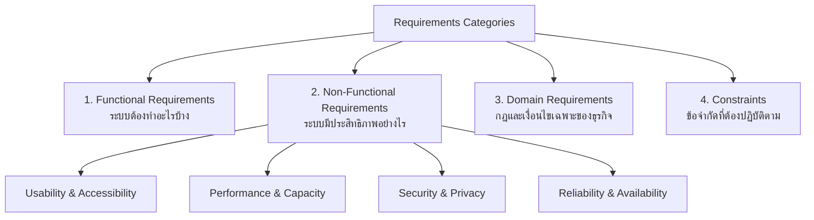
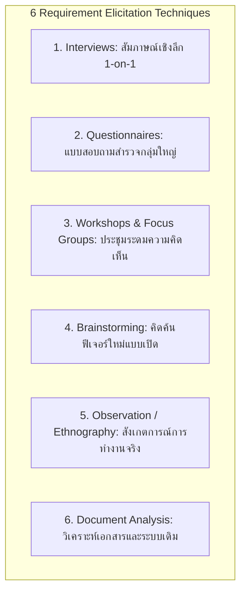
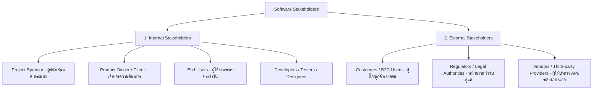

---
tags:
  - software-engineering
  - requirements-engineering
  - elicitation
  - stakeholders
  - case-studies
  - lecture-3
created: 2026-08-03
updated: 2026-08-03
lecture: 3
type: lecture
---

# Lecture 3: Requirements Engineering, Elicitation & Case Studies

> [!SUMMARY] ภาพรวมบทเรียน
> บทเรียนนี้สรุปเนื้อหาอย่างละเอียดจาก **Lecture-010925.pdf**, **Lecture2.pdf**, **Lecture3.pdf** และตำราอ้างอิง **Ian Sommerville (Ch 4)** ครอบคลุม 4 ส่วนหลัก:
> 1. [[#1. ประเภทของความต้องการซอฟต์แวร์ (Types of Requirements)]]
> 2. [[#2. เทคนิคการเก็บรวบรวมความต้องการ 6 เทคนิค (Requirement Elicitation Techniques)]]
> 3. [[#3. การวิเคราะห์และจำแนกผู้มีส่วนได้ส่วนเสีย (Stakeholder Analysis)]]
> 4. [[#4. 8 กรณีศึกษาระบบจริงและการวิเคราะห์ความต้องการ (8 Real-world Case Studies)]]

```mermaid
flowchart TD
    RE[Requirements Engineering] --> TYPES[Requirement Types]
    RE --> ELICIT[6 Elicitation Techniques]
    RE --> STAKE[Stakeholder Analysis]
    RE --> CASES[8 Case Studies]

    TYPES --> T1[Functional Requirements]
    TYPES --> T2[Non-Functional Requirements]
    TYPES --> T3[Domain Requirements]
    TYPES --> T4[Constraints]

    ELICIT --> E1[Interviews & Questionnaires]
    ELICIT --> E2[Workshops & Focus Groups]
    ELICIT --> E3[Brainstorming]
    ELICIT --> E4[Observation / Ethnography]
    ELICIT --> E5[Document Analysis]

    CASES --> C1[BookNest, ParkEasy, StudyMate]
    CASES --> C2[FreshMart, KMUTNB Cafeteria, PizzaFriend]
    CASES --> C3[ReadSmart, EasyClinic]

    style RE fill:#e1f5fe,stroke:#0288d1,stroke-width:2px
    style TYPES fill:#fff3e0,stroke:#f57c00
    style ELICIT fill:#f3e5f5,stroke:#7b1fa2
    style STAKE fill:#e8f5e9,stroke:#388e3c
    style CASES fill:#ffebee,stroke:#d32f2f
```

---

# 1. ประเภทของความต้องการซอฟต์แวร์ (Types of Requirements)

*📄 Slides 1-4 (Lecture-010925.pdf & Lecture2.pdf)*

การวิเคราะห์ความต้องการแบ่งออกเป็น 4 ประเภทหลักตามข้อกำหนดวิศวกรรมซอฟต์แวร์:

## 1.1 Functional Requirements (ความต้องการเชิงหน้าที่)
- กำหนดบริการหรือฟังก์ชันการทำงานที่ระบบ**ต้องมี** (What the system should do)
- ตอบสนองต่อ Input เฉพาะเจาะจง และระบุว่าระบบต้องทำงานอย่างไรในแต่ละสถานการณ์
- **ตัวอย่าง**: "ระบบต้องอนุญาตให้นักศึกษาสมัครสมาชิกด้วยเลขบัตรประชาชนหรือรหัสประจำตัวผู้ใช้ได้", "ระบบต้องคำนวณยอดเงินรวมในตะกร้าสินค้า"

## 1.2 Non-Functional Requirements (ความต้องการเชิงคุณลักษณะ/คุณภาพ)
- กำหนดคุณสมบัติและข้อจำกัดของบริการที่ระบบให้บริการ (How well the system should perform)
- ครอบคลุมหลายมิติ:
  - **Usability (การใช้งานง่าย)**: ตัวอย่าง "หน้าจอต้องออกแบบให้ผู้สูงอายุใช้งานได้ง่าย ปุ่มกดขนาดใหญ่", "ผู้ใช้ใหม่สามารถทำรายการสั่งซื้อเสร็จใน 5 นาที"
  - **Performance (ประสิทธิภาพ)**: ตัวอย่าง "แต่ละหน้าจอต้องโหลดเสร็จภายในไม่เกิน 2 วินาที", "รองรับผู้ใช้พร้อมกันอย่างน้อย 1,000 คนในช่วงเวลาหนาแน่น"
  - **Security & Privacy (ความปลอดภัย)**: ตัวอย่าง "เข้ารหัสข้อมูลส่วนบุคคลด้วย AES-256 at rest และใช้ TLS 1.2+ ในการรับส่งข้อมูล", "ปฏิบัติตาม พ.ร.บ. คุ้มครองข้อมูลส่วนบุคคล (PDPA)"
  - **Reliability & Availability (ความน่าเชื่อถือ)**: ตัวอย่าง "ระบบต้องมี Service Uptime ไม่น้อยกว่า 99.5% ต่อเดือน"

## 1.3 Domain Requirements (ความต้องการเชิงโดเมนธุรกิจ)
- ข้อกำหนดที่มาจากข้อบังคับ กฎหมาย หรือนโยบายเฉพาะของธุรกิจนั้นๆ (Business rules & policies)
- **ตัวอย่าง**: "ระยะเวลาการยืมหนังสืออิเล็กทรอนิกส์กำหนดไว้ที่ 14 วันต่อเล่ม", "การจองคิวใช้ระบบคิวแบบมาก่อนได้ก่อน (FIFO)"

## 1.4 Constraints (ข้อจำกัดระบบ)
- ข้อจำกัดแข็ง (Hard limits/mandates) ที่โครงการต้องปฏิบัติตามอย่างเคร่งครัด
- **ตัวอย่าง**: "ต้องพัฒนาด้วย Flutter Framework เพื่อรองรับทั้ง Android และ iOS", "งบประมาณไม่เกิน 350,000 บาท และพัฒนาเสร็จใน 4 เดือน"

---

# 2. เทคนิคการเก็บรวบรวมความต้องการ 6 เทคนิค (Requirement Elicitation Techniques)

*📄 Slides 1-5 (Lecture3.pdf)*

| เทคนิค (Technique) | คำอธิบาย (Description) | ข้อดี (Pros) | ข้อเสีย (Cons) | สถานการณ์ที่ควรใช้ (When to use) |
| :--- | :--- | :--- | :--- | :--- |
| **1. Interviews** | สัมภาษณ์เดี่ยวหรือกลุ่มย่อยเพื่อเก็บข้อมูลเชิงลึกจาก Stakeholders หลัก | ซักถามเพิ่มเติม ซักซ้อมความเข้าใจ และค้นพบความต้องการที่ไม่เคยคิดมาก่อนได้ดี | ใช้เวลานาน อาจได้ข้อมูลเอนเอียงหากผู้สัมภาษณ์ไม่ชำนาญ | เมื่อต้องการข้อมูลเชิงลึกจากผู้บริหารหรือผู้ใช้งานหลัก |
| **2. Questionnaires** | แบบสอบถามมีโครงสร้าง (มักใช้ Likert Scale 1-5) ส่งให้ผู้ตอบจำนวนมาก | รองรับผู้ตอบจำนวนมาก (Scalable) วิเคราะห์สถิติง่าย | ไม่สามารถซักถามเพิ่มเติมได้ คำถามที่ออกแบบไม่ดีอาจได้ผลลัพธ์ผิดเพี้ยน | เมื่อต้องการยืนยันความต้องการกับกลุ่มผู้ใช้ขนาดใหญ่ |
| **3. Workshops & Focus Groups** | การประชุมร่วมกันของ Stakeholders หลายฝ่ายเพื่อหารือและสรุปข้อตกลง | สร้างความเห็นพ้อง (Consensus) เคลียร์ข้อขัดแย้งระหว่างแผนกได้รวดเร็ว | ต้องอาศัยวิทยากร (Facilitator) ที่มีทักษะสูง อาจถูกครอบงำโดยผู้นำกลุ่ม | เมื่อต้องการปรับความเข้าใจที่ขัดแย้งกันของแต่ละฝ่าย |
| **4. Brainstorming** | เซสชันสร้างสรรค์เปิดกว้างให้เสนอไอเดียให้มากที่สุดในเวลาสั้นๆ | กระตุ้นความคิดสร้างสรรค์ เกิดฟีเจอร์ใหม่ๆ รวดเร็ว | อาจได้ไอเดียที่ไม่สมจริง (Unrealistic) ต้องมีขั้นตอนกรองภายหลัง | ระยะเริ่มต้นโครงการที่ต้องการนวัตกรรมและไอเดียแปลกใหม่ |
| **5. Observation (Ethnography)** | นักวิเคราะห์ลงพื้นที่สังเกตผู้ใช้ทำงานจริงในสภาพแวดล้อมจริง | ค้นพบ Unspoken needs, Pain points และวิธีแก้ไขปัญหาเฉพาะหน้า (Workarounds) | ใช้เวลานาน พฤติกรรมผู้ใช้อาจเปลี่ยนไปเมื่อรู้ตัวว่าถูกสังเกต | เมื่อผู้ใช้ไม่สามารถอธิบายกระบวนการทำงานออกมาเป็นคำพูดได้ |
| **6. Document Analysis** | ตรวจสอบเอกสาร รายงาน คู่มือ ฟอร์ม หรือระบบเดิมที่มีอยู่ | ได้ข้อมูลประวัติศาสตร์ ข้อกำหนดทางกฎหมาย และ Baseline ก่อนคุยกับผู้ใช้ | ข้อมูลอาจไม่อัปเดตหรือล้าสมัย ขาด Context ในการตีความ | ระยะเริ่มต้นก่อนลงพื้นที่สัมภาษณ์ผู้ใช้จริง |

---

# 3. การวิเคราะห์และจำแนกผู้มีส่วนได้ส่วนเสีย (Stakeholder Analysis)

*📄 Slides 4-5 (Lecture-010925.pdf) & Slides 7-8 (Lecture2.pdf)*

> [!DEFINITION] Stakeholders (ผู้มีส่วนได้ส่วนเสีย)
> **Stakeholders** คือ บุคคลหรือกลุ่มบุคคลที่มีส่วนเกี่ยวข้องโดยตรงหรือโดยอ้อม หรือได้รับผลกระทบจากการพัฒนาระบบซอฟต์แวร์

---

# 4. 8 กรณีศึกษาระบบจริงและการวิเคราะห์ความต้องการ (8 Real-world Case Studies)

*📄 Complete Breakdown from Lecture-010925.pdf, Lecture2.pdf, & Lecture3.pdf*

## 4.1 Case Study 1: BookNest (Mobile Library App)
- **ภาพรวม**: แอปมือถือสำหรับสมาชิกห้องสมุด Chaya Public Library ยืม อ่าน และจอง e-book ออนไลน์
- **Functional Requirements**:
  1. ลงทะเบียนและเข้าสู่ระบบด้วยเลขบัตรประชาชนหรือเลขบัตรห้องสมุด
  2. ค้นหา e-book ตามชื่อเรื่อง ผู้แต่ง หรือคีย์เวิร์ด
  3. แสดงรายละเอียดหนังสือ และระบบแนะนำหนังสือตามประวัติการอ่าน
  4. ยืม e-book (กำหนด 14 วัน) คืนหนังสือ และต่ออายุการยืม
  5. จองหนังสือที่ถูกยืมหมด และแจ้งเตือนอัตโนมัติเมื่อคิวว่าง
  6. อ่าน e-book พร้อมคั่นหน้า (Bookmark), โน้ตส่วนตัว และอ่านเสียงด้วย Text-to-Speech (TTS)
  7. ให้คะแนน (Rating) และเขียนรีวิว
- **Non-Functional Requirements**:
  - โหลดหน้าจอ $< 2$ วินาที, รองรับผู้ใช้พร้อมกัน $\ge 1,000$ คน
  - ปฏิบัติตาม พ.ร.บ. PDPA, เข้ารหัสข้อมูลด้วย AES-256
  - Uptime $\ge 99.5\%$ ประจำเดือน
- **Constraints**: พัฒนาด้วย React Native, รองรับ Android/iOS, งบไม่เกิน 350,000 บาท, เสร็จใน 4 เดือน

## 4.2 Case Study 2: ParkEasy (Smart Parking App)
- **ภาพรวม**: ระบบที่จอดรถอัจฉริยะเทศบาลเมืองจันทบุรี เชื่อมต่อเซ็นเซอร์ที่จอดรถ แสดงสถานะแบบ Real-time และจองที่จอด
- **Stakeholder Analysis**:
  - **Citizens / Drivers (Primary End Users)**: ค้นหาที่จอด จอง จ่ายเงินผ่าน QR Code / Mobile Banking
  - **Parking Officers (City Staff)**: มอนิเตอร์ที่จอดผ่าน Web Dashboard บังคับใช้กฎระเบียบ
  - **Private Parking Lot Managers**: จัดการพื้นที่และปรับราคาที่จอดห้าง/โรงพยาบาล
  - **Chanthaburi Municipality (Secondary)**: เจ้าของโครงการ ลดปัญหาจราจรติดขัด
  - **Payment Service Providers & Sensor Vendors (External)**: ระบบชำระเงินและสัญญาณเซ็นเซอร์ IoT

## 4.3 Case Study 3: StudyMate (Study Group Finder App)
- **การวิเคราะห์ด้วย Moore's Vision Template**:
  - **FOR**: นักศึกษามหาวิทยาลัยที่อ่านหนังสือคนเดียวแล้วไม่เข้าใจ
  - **WHO**: ต้องการค้นหาและตั้งกลุ่มติวหนังสือเพื่อเตรียมสอบ
  - **OUR PRODUCT**: StudyMate - Mobile App สำหรับสร้างและทำงานร่วมกันในกลุ่มติว
  - **THAT**: ช่วยค้นหาเพื่อนติวรายวิชา แชต นัดหมายเวลา และแชร์เอกสาร
  - **UNLIKE**: กลุ่ม LINE หรือ Facebook ที่จัดระเบียบยากและไม่ได้ผูกกับรายวิชา
  - **OUR PRODUCT**: ออกแบบมาเพื่อการเรียนโดยเฉพาะ ผูกกับรายวิชาของมหาวิทยาลัย รองรับ Android/iOS

## 4.4 Case Study 4: FreshMart (E-commerce Website)
- **ภาพรวม**: เว็บไซต์สั่งซื้อผักสด ผลไม้ และของใช้ประจำวันในกรุงเทพฯ ของคุณสุพรรษา
- **Requirements Summary**:
  - **Functional**: สมัครสมาชิก/เข้าสู่ระบบ, แยกหมวดหมู่สินค้าชัดเจน, คำนวณราคาในตะกร้า, เลือกรอบเวลาจัดส่ง (Time slots), ชำระเงินออนไลน์, ส่งอีเมลยืนยันการสั่งซื้อ
  - **Non-Functional**: สั่งซื้อเสร็จใน 10 นาที (Usability), ตอบสนองใน 3 วินาที, รองรับ 500 Concurrent Users, SSL/TLS Encryption, Backup ข้อมูลทุกวัน เวลา 02:00 น.
  - **Constraints**: พัฒนาด้วย Laravel PHP Framework, โฮสติ้ง Linux ในไทย, งบไม่เกิน 200,000 บาท, เสร็จใน 3 เดือน

## 4.5 Case Study 5: KMUTNB University Cafeteria
- **ภาพรวม**: แอปสั่งอาหารโรงอาหาร มจพ. สำหรับนักศึกษา
- **Requirements Summary**:
  - **Functional**: ล็อกอินด้วยอีเมลมหาวิทยาลัย (`@kmutnb.ac.th`), ดูเมนู เลือกอาหาร คำนวณราคารวม, ชำระเงินผ่าน Mobile Banking/Digital Wallet, แจ้งเตือนร้านค้าทันทีเมื่อมีออเดอร์ใหม่, แสดงเวลารับอาหารโดยประมาณ
  - **Non-Functional**: รองรับผู้ใช้พร้อมกัน 1,000 คนช่วงเที่ยงโดยไม่ช้า, ปฏิบัติตามนโยบายความเป็นส่วนตัว มจพ.
  - **Constraints**: รองรับ Android/iOS, พัฒนาพร้อมใช้ใน 2 เดือน

## 4.6 Case Study 6: PizzaFriend (Ploy's Pizza Ordering App)
- **ภาพรวม**: แอปสั่งพิซซ่าออนไลน์ร้านคุณพลอย แก้ปัญหาคิวยาวช่วงพักเที่ยง
- **Requirements Breakdown**:
  - **Functional**: ลงทะเบียน/ล็อกอินอีเมล, เลือกแป้ง ขนาดยาง และท็อปปิ้ง, คำนวณราคา, ชำระเงินโอน/บัตรเครดิต, ออกใบเสร็จทางอีเมล, ทำรายงานยอดขายประจำวันและสินค้าขายดี
  - **Non-Functional**: สั่งซื้อครั้งแรกเสร็จใน 5 นาที, โหลดเมนูไม่เกิน 2 วินาที, รองรับ 300 คนพร้อมกัน, เก็บข้อมูลตามกฎหมาย PDPA และเข้ารหัสธุรกรรมเงิน
  - **Constraints**: เขียนด้วยภาษา Flutter (Single codebase Android/iOS), พัฒนาเสร็จใน 3 เดือน

## 4.7 Case Study 7: ReadSmart (Online Bookstore)
- **ภาพรวม**: ร้านขายหนังสือเล่มและ e-book ออนไลน์
- **Stakeholders & Roles**:
  - **Customer**: ค้นหา ซื้อ ดาวน์โหลด อ่าน และรีวิวหนังสือ
  - **Store Manager**: จัดการสต็อก ตั้งราคา จัดโปรโมชัน ประมวลผลคำสั่งซื้อ
  - **UX/UI Designer**: ออกแบบหน้าตาเว็บและแอปให้ใช้งานง่าย
  - **Payment Provider**: เชื่องต่อระบบชำระเงินปลอดภัย

## 4.8 Case Study 8: EasyClinic (Appointment Booking System)
- **ภาพรวม**: ระบบจองคิวคลินิกเอกชนป้องกันผู้ป่วยโทรจองแล้วไม่มาตามนัด
- **Requirements Summary**:
  - **Functional**: ลงทะเบียนด้วยเบอร์โทร/เลขบัตรประชาชน, เลือกแพทย์เฉพาะทางและเวลานัด, แจ้งเตือน SMS และอีเมลล่วงหน้า 1 วันและ 1 ชั่วโมง, Dashboard สำหรับแพทย์ดูและปรับตาราง, ออกรายงานสถิติผู้ป่วยรายวัน
  - **Non-Functional**: เข้ารหัสข้อมูลสุขภาพตามมาตรฐาน HIPAA / กระทรวงสาธารณสุข, Senior-friendly (ผู้สูงอายุใช้ได้โดยไม่ต้องอบรม)
  - **Constraints**: ทำงานบน Web Browser, Android และ iOS, พัฒนาเสร็จใน 3 เดือนก่อนฤดูไข้หวัดใหญ่
