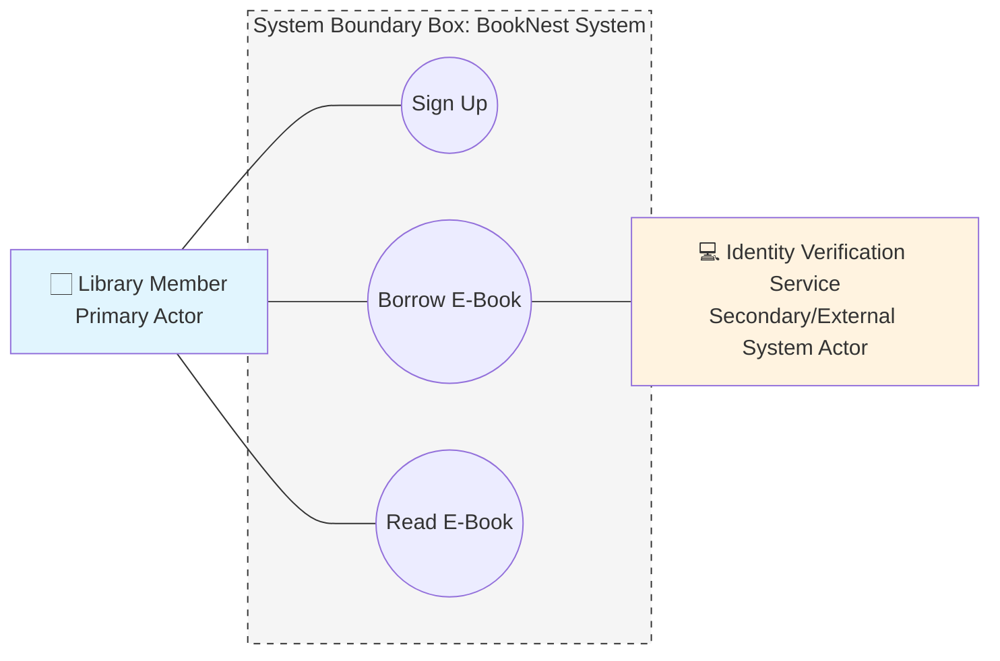
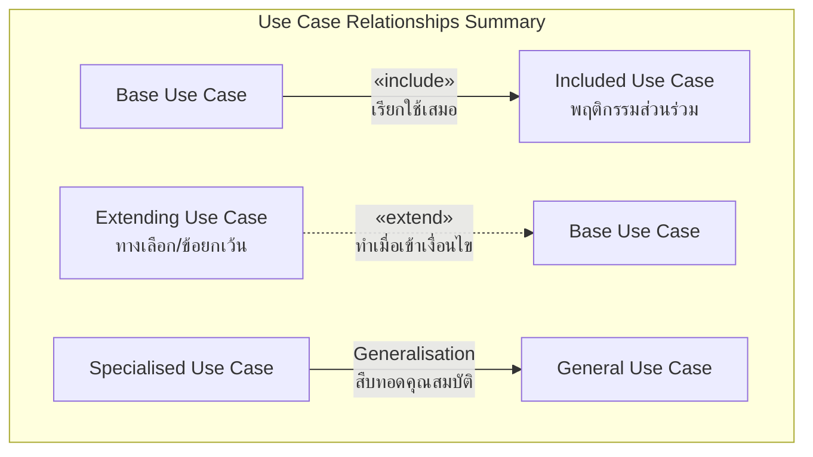
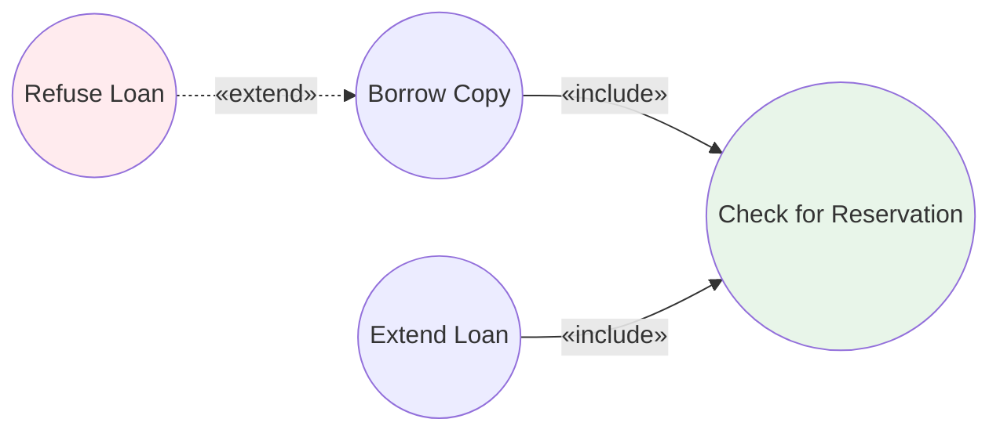
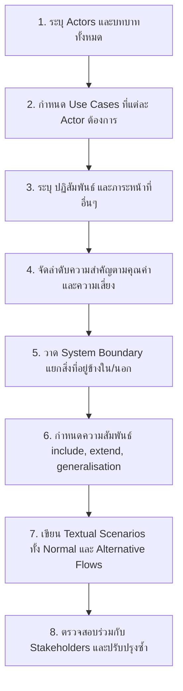
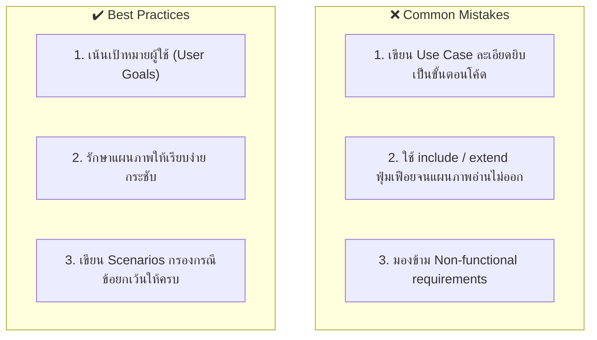

---
tags:
  - software-engineering
  - uml
  - use-case
  - textual-use-case
  - scenarios
  - lecture-4
created: 2026-08-03
updated: 2026-08-03
lecture: 4
type: lecture
---

# Lecture 4: Use Case Modeling & Textual Specifications

> [!SUMMARY] ภาพรวมบทเรียน
> บทเรียนนี้สรุปเนื้อหาอย่างละเอียดจากสไลด์ **usecaseDia-2.pdf**, **Lecture-010925.pdf** และแบบฝึกหัดในโฟลเดอร์ **work/** (Library, ATM, Elevator) ครอบคลุม 6 หัวข้อหลัก:
> 1. [[#1. นิยามและจุดประสงค์ของ Use Case Diagram (What is a Use-Case Diagram)]]
> 2. [[#2. สัญลักษณ์และสถาปัตยกรรม (Actors, Use Cases & System Boundary)]]
> 3. [[#3. ประเภทความสัมพันธ์ใน Use Case (Relationships: Include, Extend, Generalisation)]]
> 4. [[#4. ขั้นตอนการเขียน Use Case Diagram 8 ขั้นตอน (How to Draw)]]
> 5. [[#5. ความแตกต่างระหว่าง Scenarios กับ Use Cases]]
> 6. [[#6. แม่แบบและตารางสเปกภาษาเขียน (14 Detailed Textual Use Case Specifications)]]
> 7. [[#7. ข้อผิดพลาดที่พบบ่อยและแนวปฏิบัติที่ดีที่สุด (Common Mistakes & Best Practices)]]

```mermaid
flowchart TD
    UCM[Use Case Modeling] --> NOTATION[Notations & Boundaries]
    UCM --> REL[Relationships]
    UCM --> SPEC[Textual Specifications]
    UCM --> EXAMPLES[Worked Examples]

    NOTATION --> Actor[Actors - Human / External Systems]
    NOTATION --> UC[Use Cases - Oval Tasks]
    NOTATION --> SB[System Boundary - Rectangular Box]

    REL --> Assoc[Association - Solid Line]
    REL --> Inc["Include - <<include>>"]
    REL --> Ext["Extend - <<extend>>"]
    REL --> Gen["Generalisation - Triangle Arrow"]

    SPEC --> TableTemplate[6-Section Table Format]
    SPEC --> BookNest14[14 BookNest Use Cases]

    EXAMPLES --> Ex1[Library Management System]
    EXAMPLES --> Ex2[ATM Banking System]
    EXAMPLES --> Ex3[Elevator Control System]

    style UCM fill:#e1f5fe,stroke:#0288d1,stroke-width:2px
    style NOTATION fill:#fff3e0,stroke:#f57c00
    style REL fill:#f3e5f5,stroke:#7b1fa2
    style SPEC fill:#e8f5e9,stroke:#388e3c
    style EXAMPLES fill:#ffebee,stroke:#d32f2f
```

---

# 1. นิยามและจุดประสงค์ของ Use Case Diagram (What is a Use-Case Diagram)

*📄 Slides 1-4 (usecaseDia-2.pdf)*

> [!DEFINITION] Use Case Diagram (แผนภาพกรณีการใช้งาน)
> **Use Case Diagram** คือ แผนภาพในภาษา UML ที่ทำหน้าที่บันทึกและพรรณนา **พฤติกรรมของระบบจากมุมมองของผู้ใช้ (User's point of view)** โดยแสดงปฏิสัมพันธ์ระหว่างระบบกับผู้ใช้งานภายนอกหรือระบบอื่น โดยมุ่งเน้นว่า **"ระบบต้องทำอะไร" (What system must do)** ไม่ใช่ "ระบบถูกสร้างอย่างไร" (Not how it will be implemented)

## 1.1 วัตถุประสงค์และประโยชน์ (Purpose & Benefits)
- **กำหนดขอบเขตระบบ (System Boundaries)**: แยกแยะชัดเจนว่าสิ่งใดอยู่ภายในระบบ และสิ่งใดเป็นองค์ประกอบภายนอก
- **สื่อสารกับ Stakeholders**: สื่อสารด้วยภาพอย่างง่ายที่ผู้ใช้และลูกค้าที่ไม่ใช่คน IT สามารถเข้าใจร่วมกันได้ง่าย
- **เป็นฐานสำหรับการวางแผนและทดสอบ**: นำไปใช้จัดกลุ่มและวางแผนการพัฒนาในแต่ละรอบ (Iteration planning) รวมถึงเป็นฐานในการสร้าง Test Cases

---

# 2. สัญลักษณ์และสถาปัตยกรรม (Actors, Use Cases & System Boundary)

*📄 Slides 5-6 (usecaseDia-2.pdf)*

1. **Actor (ผู้กระทำ/บทบาท)**:
   - สัญลักษณ์: รูปคน (Stick figure)
   - นิยาม: บทบาท (Role) ที่คนหรือระบบภายนอกเล่นกับระบบ ไม่ใช่บุคคลรายเจาะจง
   - **Primary Actor**: ผู้เริ่มต้นทำรายการเพื่อบรรลุเป้าหมาย (อยู่ด้านซ้ายของแผนภาพ)
   - **Secondary / Supporting Actor**: ระบบหรืออุปกรณ์ภายนอกที่คอยให้บริการสนับสนุน (อยู่ด้านขวา)
2. **Use Case (กรณีการใช้งาน)**:
   - สัญลักษณ์: วงรี (Oval) พร้อมชื่อใช้กริยา + นาม (เช่น `Borrow E-book`, `Pay Fine`)
   - นิยาม: ลำดับการทำงานที่ส่งผลลัพธ์ที่สังเกตได้และมีมูลค่าแก่ Actor
3. **System Boundary (ขอบเขตระบบ)**:
   - สัญลักษณ์: กรอบสี่เหลี่ยมผืนผ้า ล้อมรอบ Use Cases ทั้งหมด และมีชื่อระบบอยู่ด้านบน
   - สื่อความหมาย: สิ่งที่อยู่ในกรอบคือสิ่งที่ระบบต้องสร้าง สิ่งนอกกรอบคือ Actors
4. **Communication Link (เส้นเชื่อมต่อปฏิสัมพันธ์)**:
   - สัญลักษณ์: เส้นตรงไม่มีหัวลูกศร (Undirected solid line) เชื่อมระหว่าง Actor กับ Use Case

---

# 3. ประเภทความสัมพันธ์ใน Use Case (Relationships: Include, Extend, Generalisation)

*📄 Slide 7 (usecaseDia-2.pdf)*

| ประเภทความสัมพันธ์ | สัญลักษณ์ | ทิศทางของหัวลูกศร | ความหมายและการใช้งาน |
| :--- | :--- | :--- | :--- |
| **Association** | เส้นตรงไม่มีลูกศร (`—`) | ไม่มี | แสดงว่า Actor มีส่วนร่วมใน Use Case นั้นๆ |
| **Include (`<<include>>`)** | เส้นประพร้อมลูกศร | **ชี้จาก Base Use Case ไปยัง Included Use Case** | แยกพฤติกรรมที่เป็นส่วนร่วม (Common behavior) ที่**ต้องทำเสมอ**ในทุก Scenario ออกมาเป็น Use Case ย่อย |
| **Extend (`<<extend>>`)** | เส้นประพร้อมลูกศร | **ชี้จาก Extending Use Case กลับมายัง Base Use Case** | แยกพฤติกรรมที่เป็นทางเลือก (Optional) หรือข้อยกเว้น (Exception) ซึ่งจะทำงาน**เฉพาะเมื่อเข้าเงื่อนไข (Extension Point)** เท่านั้น |
| **Generalisation** | เส้นตรงหัวลูกศรสามเหลี่ยมโปร่ง | **ชี้จาก Element ย่อย (Child) ไปยัง Element หลัก (Parent)** | แสดงการสืบทอดคุณสมบัติ (Inheritance) ของ Use Case หรือ Actor ที่มีความเฉพาะเจาะจงขึ้น |

### ตัวอย่างเปรียบเทียบ Include vs Extend (ระบบห้องสมุด)
*📄 Slide 11 (usecaseDia-2.pdf)*

- `Borrow Copy` และ `Extend Loan` **ต้องทำการตรวจเช็กการจองเสมอ** $\rightarrow$ ใช้ `<<include>>`
- `Refuse Loan` จะทำงานเฉพาะเมื่อยืมเกินสิทธิ์หรือมีค้างส่ง $\rightarrow$ ใช้ `<<extend>>`

---

# 4. ขั้นตอนการเขียน Use Case Diagram 8 ขั้นตอน (How to Draw)

*📄 Slide 8 (usecaseDia-2.pdf)*

---

# 5. ความแตกต่างระหว่าง Scenarios กับ Use Cases

*📄 Slide 9 (usecaseDia-2.pdf)*

> [!NOTE] ความสัมพันธ์ระหว่าง Scenario กับ Use Case
> - **Use Case**: รวบรวม **ทุก Scenarios** ที่รังสรรค์ขึ้นเพื่อบรรลุเป้าหมายเดียวกันของผู้ใช้
> - **Scenario**: คือ **ตัวอย่างเหตุการณ์ครั้งเดียว (Single instance/path)** ของการทำงานใน Use Case นั้นๆ

### ตัวอย่าง: Use Case "Borrowing a Book"
- **Scenario 1 (Successful Borrowing - Normal Flow)**:
  1. ผู้ใช้ร้องขอยืมหนังสือ
  2. ระบบตรวจสอบสิทธิ์และสถานะการจอง
  3. ระบบทำเรื่องยืมและมอบหนังสือให้ผู้ใช้
- **Scenario 2 (Refusal - Alternative Flow)**:
  1. ผู้ใช้ร้องขอยืมหนังสือ
  2. ระบบตรวจสอบสิทธิ์ พบว่ายืมหนังสือเกินจำนวนที่กำหนด
  3. ระบบปฏิเสธการยืมและแสดงข้อความแจ้งเตือน

---

# 6. แม่แบบและตารางสเปกภาษาเขียน (14 Detailed Textual Use Case Specifications)

*📄 Slides 9-15 (Lecture-010925.pdf)*

การเขียนสเปก Use Case ภาษาเขียนระดับมาตรฐานวิศวกรรมซอฟต์แวร์ ใช้รูปแบบตาราง 6 ส่วน:

| หัวข้อสเปก | รายละเอียด |
| :--- | :--- |
| **Use Case Name** | ชื่อของกรณีการใช้งาน (กริยา + นาม) |
| **Summary** | สรุปภาพรวมการทำงานและเป้าหมายอย่างสั้น |
| **Actors** | รายชื่อ Primary และ Secondary Actors ที่เกี่ยวข้อง |
| **Preconditions** | เงื่อนไขล่วงวันที่ต้องเป็นจริงก่อนเริ่มทำรายการ |
| **Basic Sequence (Normal Flow)** | ลำดับขั้นตอนการทำงานปกติทีละขั้นตอน (1, 2, 3...) |
| **Exceptions (Alternative Flows)** | ข้อผิดพลาด สถานการณ์ยกเว้น และวิธีแก้ไข |
| **Postconditions** | สถานะของระบบและข้อมูลหลังจากทำรายการสำเร็จ |

---

## สเปก Use Case ภาษาเขียน 14 ข้อสมบูรณ์จากระบบ BookNest

### 1. Sign Up (สมัครสมาชิก)
- **Summary**: ผู้ใช้ใหม่ลงทะเบียนเพื่อสร้างบัญชีผู้ใช้ BookNest
- **Actors**: Library Member, ID/Library Card Verification Service (External)
- **Preconditions**: ติดตั้งแอปแล้ว และอุปกรณ์เชื่อมต่ออินเทอร์เน็ตได้
- **Basic Sequence**:
  1. ผู้ใช้กดปุ่ม "Sign Up"
  2. ผู้ใช้กรอกเลขบัตรประชาชน หรือเลขบัตรห้องสมุด พร้อมข้อมูลส่วนตัว
  3. แอปส่งข้อมูลไปตรวจสอบความถูกต้องที่ ID Verification Service
  4. เมื่อตรวจสอบผ่าน แอปสร้างบัญชีผู้ใช้ใหม่
  5. แอปแสดงข้อความสำเร็จและล็อกอินให้อัตโนมัติ
- **Exceptions**:
  - *Step 3*: หากเลขบัตรไม่ถูกต้องหรือซ้ำ ระบบแสดงข้อความแจ้งเตือนให้แก้ไข
- **Postconditions**: บัญชีถูกสร้างสำเร็จและผู้ใช้เข้าสู่ระบบพร้อมใช้งาน

### 2. Log In (เข้าสู่ระบบ)
- **Summary**: สมาชิกเดิมเข้าสู่ระบบ BookNest
- **Actors**: Library Member, Verification Service
- **Preconditions**: ผู้ใช้สมัครสมาชิกเรียบร้อยแล้ว
- **Basic Sequence**:
  1. ผู้ใช้กดปุ่ม "Log In" และกรอกข้อมูลประจำตัว (เช่น PIN/Password)
  2. ระบบตรวจสอบข้อมูล credentials
  3. เมื่อถูกต้อง ระบบอนุญาตให้เข้าถึงหน้าหลัก
- **Exceptions**: กรอก รหัสผ่านผิด ระบบแจ้งเตือนให้ลองใหม่ หากผิดเกิน 5 ครั้ง บัญชีถูกล็อก
- **Postconditions**: ผู้ใช้ผ่านการยืนยันตัวตนและรีไดเรกต์เข้าสู่หน้าหลัก

### 3. Search E-books (ค้นหาหนังสือ)
- **Summary**: ค้นหาหนังสืออิเล็กทรอนิกส์ในแคตตาล็อกห้องสมุด
- **Actors**: Library Member
- **Preconditions**: เข้าสู่ระบบเรียบร้อย
- **Basic Sequence**:
  1. กรอกคีย์เวิร์ด ชื่อเรื่อง หรือผู้แต่ง
  2. แอปสอบถามฐานข้อมูลและแสดงรายการหนังสือพร้อมสถานะว่าง/ไม่ว่าง
- **Exceptions**: ไม่พบข้อมูล แสดงข้อความแนะนำการค้นหาใหม่
- **Postconditions**: รายการหนังสือค้นพบแสดงบนหน้าจอ

### 4. View Book Details (ดูรายละเอียดหนังสือ)
- **Summary**: แสดงรายละเอียดเชิงลึกของ e-book ที่เลือก
- **Actors**: Library Member
- **Basic Sequence**: เลือกหนังสือจากรายการ $\rightarrow$ แสดงชื่อ ผู้แต่ง เรื่องย่อ ปก และปุ่มยืม/จอง
- **Postconditions**: ข้อมูลหนังสือแสดงบนหน้าจอพร้อมให้กดทำรายการถัดไป

### 5. View Recommendations (ดูหนังสือแนะนำ)
- **Summary**: แสดงรายการหนังสือแนะนำส่วนบุคคลตามประวัติการอ่าน
- **Actors**: Library Member
- **Basic Sequence**: กดหน้า "Recommendations" $\rightarrow$ ระบบวิเคราะห์ประวัติและแสดงรายการหนังสือที่น่าสนใจ
- **Exceptions**: หากเป็นผู้ใช้ใหม่ที่ยังไม่มีประวัติ ระบบแสดงหนังสือยอดนิยมแทน

### 6. Borrow E-book (ยืมหนังสืออิเล็กทรอนิกส์)
- **Summary**: ทำการยืม e-book ที่ว่างเป็นเวลา 14 วัน
- **Actors**: Library Member, ID Verification Service, E-book DRM Provider
- **Basic Sequence**:
  1. กดปุ่ม "Borrow" ในหน้ารายละเอียดหนังสือ
  2. ระบบยืนยันสิทธิ์สมาชิกและขอ License จาก DRM Provider
  3. หนังสือปรากฏในหน้า "My Loans" พร้อมกำหนดวันคืน 14 วัน
  4. แอปเปิดให้ดาวน์โหลดอ่านแบบ Offline ได้
- **Exceptions**: License หมด ให้สิทธิ์เลือกกดจองคิว (Reserve) แทน

### 7. Return E-book (คืนหนังสือ)
- **Summary**: คืนหนังสือที่ยืมก่อนหรือเมื่อถึงกำหนด
- **Actors**: Library Member, DRM Provider
- **Basic Sequence**: เลือกหนังสือใน "My Loans" $\rightarrow$ กด "Return" $\rightarrow$ ระบบยกเลิกสิทธิ์อ่านและคืน License ให้ DRM
- **Postconditions**: สถานะยืมปิดลง หนังสือถูกนำออกจากเครื่อง

### 8. Renew Loan (ต่ออายุการยืม)
- **Summary**: ขยายระยะเวลาการยืมออกไปอีก 14 วัน
- **Actors**: Library Member, DRM Provider
- **Basic Sequence**: กด "Renew" $\rightarrow$ ตรวจสอบว่าไม่มีผู้ใช้อื่นจองคิวไว้ $\rightarrow$ ขยายวันคืนออกไปอีก 14 วัน
- **Exceptions**: มีคนจองคิวต่อ ไม่อนุญาตให้ต่ออายุ ต้องคืนตามกำหนดเดิม

### 9. Reserve (Hold) E-book (จองหนังสือ)
- **Summary**: เข้าคิวจองหนังสือที่ปัจจุบันถูกยืมหมดแล้ว
- **Actors**: Library Member, Push Notification Service
- **Basic Sequence**: กด "Reserve" $\rightarrow$ ตรวจสอบสถานะ $\rightarrow$ นำเข้าคิวจองแบบ FIFO $\rightarrow$ แสดงลำดับคิวและเวลาคอยโดยประมาณ
- **Postconditions**: รายการจองถูกบันทึกพร้อม Timestamp

### 10. Notify Availability (แจ้งเตือนหนังสือพร้อมยืม)
- **Summary**: แจ้งเตือนผู้จองเมื่อหนังสือที่จองไว้ว่างลง
- **Actors**: Push Notification Service, Library Member
- **Basic Sequence**: ระบบตรวจพบหนังสือคืน $\rightarrow$ ส่ง Push Notification ถึงผู้จองคิวแรก $\rightarrow$ ผู้ใช้กดปุ่มยืมทันที
- **Postconditions**: ผู้ใช้ได้รับแจ้งเตือนและเข้าสู่ขั้นตอนยืมหนังสือ

### 11. Read E-book (อ่านหนังสือ)
- **Summary**: เปิดอ่าน e-book ภายในแอปพลิเคชัน
- **Actors**: Library Member, Text-to-Speech Engine
- **Basic Sequence**: เปิดหนังสือ $\rightarrow$ อ่าน คั่นหน้า (Bookmark), เขียนโน้ตส่วนตัว (Personal Note) หรือเปิดฟังเสียงอ่าน (TTS)
- **Relationships**: `<<include>>` Bookmark Page, `<<include>>` Add Note, `<<include>>` TTS Engine

### 12. Rate Book (ให้คะแนนหนังสือ)
- **Summary**: ให้คะแนนดาว (1-5 ดาว) หนังสือที่อ่านจบแล้ว
- **Basic Sequence**: เลือกดาว 1-5 $\rightarrow$ บันทึกและคำนวณคะแนนเฉลี่ยใหม่

### 13. Write Review (เขียนรีวิวหนังสือ)
- **Summary**: เขียนบทความรีวิวความคิดเห็นต่อหนังสือ
- **Basic Sequence**: กรอกหัวข้อและข้อความรีวิว $\rightarrow$ ตรวจสอบคำสุภาพ $\rightarrow$ เผยแพร่ให้ผู้ใช้อื่นอ่าน

### 14. Change Language (เปลี่ยนภาษาใช้งาน)
- **Summary**: สลับภาษาของอินเทอร์เฟซระหว่าง ไทย/อังกฤษ
- **Basic Sequence**: เลือกตั้งค่าภาษา $\rightarrow$ โหลด UI Strings ภาษาที่เลือกทันที

---

# 7. ข้อผิดพลาดที่พบบ่อยและแนวปฏิบัติที่ดีที่สุด (Common Mistakes & Best Practices)

*📄 Slide 12 (usecaseDia-2.pdf)*

### สรุปแนวปฏิบัติที่ดีที่สุด (Best Practices Summary):
1. **เน้นคุณค่าของผู้ใช้**: ชื่อ Use Case ต้องเป็นกริยาที่ผู้ใช้ได้ประโยชน์ (เช่น `Borrow Book` ไม่ใช่ `Press Button`)
2. **ใช้ `<<include>>` และ `<<extend>>` อย่างพอดี**: หากไม่จำเป็น ไม่ต้องแยก Use Case ให้ซับซ้อนเกินไป
3. **เขียนรายละเอียดในตาราง Textual Specification**: แผนภาพควรเรียบง่าย ส่วนรายละเอียดขั้นตอนให้ใส่ไว้ในตารางภาษาเขียน
