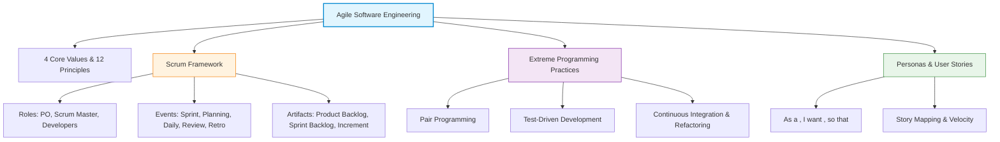
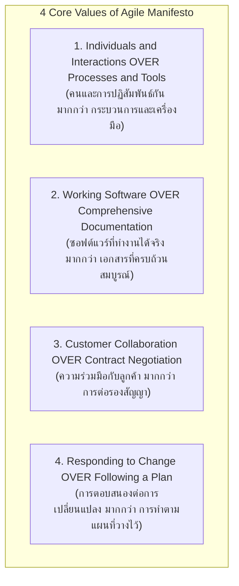
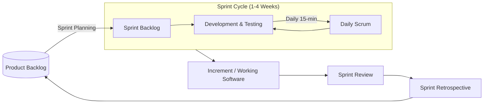
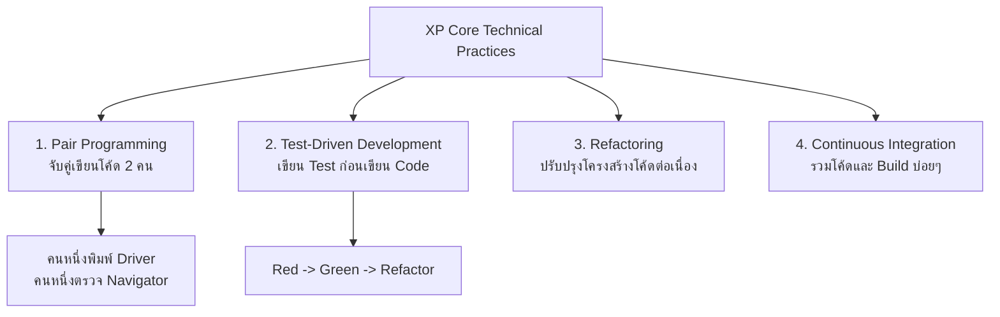
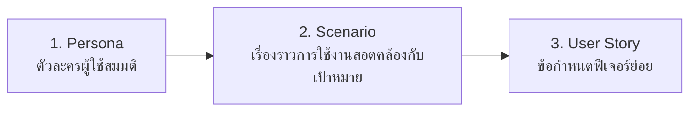
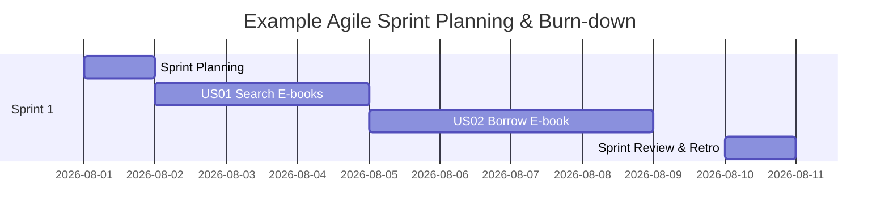

---
tags:
  - software-engineering
  - agile
  - scrum
  - xp
  - user-stories
  - personas
  - sprint
  - lecture-5
created: 2026-08-03
updated: 2026-08-03
lecture: 5
type: lecture
---

# Lecture 5: Agile Software Engineering & Scrum Framework

> [!SUMMARY] ภาพรวมบทเรียน
> บทเรียนนี้สรุปเนื้อหาอย่างละเอียดจากสไลด์ **2. Agile Software Engineering.pdf**, **3. Features, scenarios and stories.pdf** และเอกสารเชิงปฏิบัติการ **Scrum Framework Workshop** ครอบคลุม 6 หัวข้อหลัก:
> 1. [[#1. ปรัชญาเอไจล์และคำประกาศ Agile Manifesto (Agile Philosophy & Manifesto)]]
> 2. [[#2. โครงร่างการทำงานแบบ Scrum (The Scrum Framework)]]
> 3. [[#3. แนวปฏิบัติการพัฒนาแบบ Extreme Programming (XP Practices)]]
> 4. [[#4. การสร้าง Personas, Scenarios และ User Stories]]
> 5. [[#5. เกณฑ์การยอมรับ (Acceptance Criteria) และ Definition of Done (DoD)]]
> 6. [[#6. การวางแผน Story Mapping และการวัดความเร็วทีม (Velocity Estimation)]]



---

# 1. ปรัชญาเอไจล์และคำประกาศ Agile Manifesto (Agile Philosophy & Manifesto)

*📄 Slides 1-10 (2. Agile Software Engineering.pdf)*

> [!DEFINITION] Agile Software Development
> **Agile Software Development** คือ ระเบียบวิธีพัฒนาซอฟต์แวร์ที่มุ่งเน้นการส่งมอบซอฟต์แวร์ที่ทำงานได้จริงอย่างรวดเร็ว ปรับเปลี่ยนตามความต้องการของลูกค้าได้ตลอดเวลา และเน้นการสื่อสารความร่วมมือระหว่างคนในทีมมากกว่าการทำตามกระบวนการและเอกสารที่ตายตัว

## 1.1 ค่านิยมหลัก 4 ประการ (4 Core Values of Agile Manifesto)
*📄 Slide 4 (2. Agile Software Engineering.pdf)*



## 1.2 สรุปหลักการ 12 ประการของ Agile (12 Agile Principles)
1. ความสำคัญสูงสุดคือการสร้างความพึงพอใจให้ลูกค้าผ่านการส่งมอบซอฟต์แวร์ที่มีคุณค่าอย่างรวดเร็วและต่อเนื่อง
2. ยินดีรับความต้องการที่เปลี่ยนแปลง แม้จะอยู่ในระยะท้ายของการพัฒนา
3. ส่งมอบซอฟต์แวร์ที่ทำงานได้จริงอย่างสม่ำเสมอ (สัปดาห์ถึงสองสามเดือน)
4. ฝ่ายธุรกิจและนักพัฒนาต้องทำงานร่วมกันเป็นประจำทุกวัน
5. สร้างโครงการรอบตัวบุคคลที่มีแรงจูงใจ ให้สภาพแวดล้อมและการสนับสนุนที่ต้องการ
6. วิธีสื่อสารที่มีประสิทธิภาพสูงสุดคือการพูดคุยแบบเผชิญหน้า (Face-to-face conversation)
7. ซอฟต์แวร์ที่ทำงานได้จริงเป็นตัววัดความก้าวหน้าที่หลัก
8. กระบวนการเอไจล์สนับสนุนการพัฒนาที่ยั่งยืน (Sustainable development)
9. ใส่ใจในความเลิศทางเทคนิคและการออกแบบที่ดีอย่างต่อเนื่อง
10. เรียบง่าย (Simplicity) – ศิลปะแห่งการเพิ่มปริมาณงานที่ไม่จำเป็นต้องทำให้น้อยที่สุด
11. สถาปัตยกรรม ข้อกำหนด และการออกแบบที่ดีที่สุดมาจากทีมที่บริหารจัดการตนเองได้ (Self-organizing teams)
12. ทีมทบทวนการทำงานเป็นระยะๆ เพื่อปรับปรุงประสิทธิภาพให้ดียิ่งขึ้น

---

# 2. โครงร่างการทำงานแบบ Scrum (The Scrum Framework)

*📄 Slides 11-25 (2. Agile Software Engineering.pdf) & Workshop Materials*

Scrum เป็นโครงร่าง (Framework) แบบ Agile ที่นิยมใช้มากที่สุดในโลกสำหรับการจัดการงานซอฟต์แวร์ที่มีความซับซ้อน โดยแบ่งการทำงานเป็นรอบสั้นๆ เรียกว่า **Sprint** (ปกติ 1-4 สัปดาห์)



## 2.1 บทบาทหลัก 3 บทบาทใน Scrum (Scrum Roles)
1. **Product Owner (PO)**:
   - เป็นตัวแทนของฝ่ายธุรกิจและลูกค้า
   - รับผิดชอบในการกำหนดทิศทางผลิตภัณฑ์ สร้างและจัดเรียงลำดับความสำคัญของ **Product Backlog**
   - ตัดสินใจว่าฟีเจอร์ใดควรทำก่อน/หลัง และตรวจรับงานชิ้นงาน
2. **Scrum Master (SM)**:
   - รับบทบาทเป็นผู้ขจัดอุปสรรค (Facilitator / Servant Leader)
   - คอยช่วยให้ทีมเข้าใจและปฏิบัติตามหลักการ Scrum
   - ปกป้องทีมจากสิ่งรบกวนภายนอกและช่วยแก้ไขปัญหาที่เป็นอุปสรรค (Impediments)
3. **Development Team (Developers)**:
   - ทีมงานข้ามสายงาน (Cross-functional team) ประกอบด้วย นักพัฒนา, UI/UX, Tester (ปกติ 3-9 คน)
   - บริหารจัดการการทำงานด้วยตนเอง (Self-organizing) ร่วมกันประมาณการและแปลง Backlog เป็นโค้ดที่ทำงานได้จริง

## 2.2 กิจกรรม 5 ประการใน Scrum (Scrum Events)
1. **Sprint**: กรอบเวลาคงที่ (Time-boxed) ไม่เกิน 1 เดือน ที่ทีมสร้างชิ้นงานที่พร้อมใช้งาน
2. **Sprint Planning**: ประชุมวางแผนช่วงเริ่มต้น Sprint โดย PO เสนอ Backlog ทีมเลือกว่าจะทำอะไรได้บ้างในรอบนี้ และสร้าง **Sprint Backlog**
3. **Daily Scrum (Stand-up Meeting)**: ประชุมสั้นๆ ไม่เกิน 15 นาทีทุกเช้า สมาชิกตอบ 3 คำถาม:
   - *เมื่อวานทำอะไรเสร็จบ้าง?*
   - *วันนี้จะทำอะไรต่อ?*
   - *มีอุปสรรคอะไรขัดขวางหรือไม่?*
4. **Sprint Review**: ประชุมสาธิตชิ้นงาน (Demo) เมื่อจบ Sprint ให้ Stakeholders และลูกค้าดู เพื่อรับ Feedback
5. **Sprint Retrospective**: ประชุมทบทวนภายในทีมหลังจบ Sprint เพื่อหาข้อดี ข้อเสีย และสิ่งที่ต้องปรับปรุงในกระบวนการทำงานรอบถัดไป

## 2.3 ผลผลิต 3 ประการใน Scrum (Scrum Artifacts)
1. **Product Backlog**: รายการความต้องการและฟีเจอร์ทั้งหมดของระบบที่ถูกจัดลำดับความสำคัญไว้
2. **Sprint Backlog**: รายการ User Stories และ Tasks ที่ทีมสัญญาว่าจะทำให้เสร็จใน Sprint ปัจจุบัน
3. **Increment**: ชิ้นงานซอฟต์แวร์ที่เสร็จสมบูรณ์ พร้อมส่งมอบ และผ่านเกณฑ์ Definition of Done (DoD)

---

# 3. แนวปฏิบัติการพัฒนาแบบ Extreme Programming (XP Practices)

*📄 Slides 26-32 (2. Agile Software Engineering.pdf)*

Extreme Programming (XP) เป็นระเบียบวิธีเอไจล์ที่มุ่งเน้นการยกระดับคุณภาพของโค้ดและการปฏิบัติงานทางเทคนิค (Technical Practices):



1. **Pair Programming (การจับคู่เขียนโปรแกรม)**:
   - นักพัฒนา 2 คนทำงานร่วมกันที่คอมพิวเตอร์เครื่องเดียว คนหนึ่งเป็น **Driver** (คนพิมพ์โค้ด) อีกคนเป็น **Navigator** (คนตรวจเช็กและมองภาพรวม)
   - ช่วยลด Bug ในโค้ด กระจายความรู้ในทีม (Knowledge sharing) และเพิ่มคุณภาพงาน
2. **Test-Driven Development (TDD)**:
   - เขียน Automated Test Case ให้ล้มเหลวก่อน (Red) แล้วจึงเขียนโค้ดขั้นต่ำให้ผ่าน (Green) จากนั้นจึงทำการปรับปรุงโค้ด (Refactor)
3. **Refactoring (การปรับโครงสร้างโค้ด)**:
   - การปรับปรุงโครงสร้างภายในของโค้ดให้สะอาด อ่านง่าย Maintain ได้ง่าย โดย**ไม่เปลี่ยนแปลงพฤติกรรมภายนอกของระบบ**
4. **Continuous Integration (CI)**:
   - รวมโค้ดของทุกคนเข้าสู่ Main Branch วันละหลายๆ ครั้ง และรัน Automated Tests ทันที

---

# 4. การสร้าง Personas, Scenarios และ User Stories

*📄 Slides 1-20 (3. Features, scenarios and stories.pdf)*

ในการพัฒนาแบบ Agile ความต้องการจะไม่ถูกเขียนเป็นเอกสาร SRS หนาๆ แต่จะถูกย่อยเป็นเรื่องราวจากมุมมองผู้ใช้



## 4.1 Persona (ตัวละครสมมติ)
- การสร้างตัวแทนสมมติของผู้ใช้กลุ่มเป้าหมาย เพื่อให้ทีมเข้าใจบริบท พฤติกรรม ข้อจำกัด และความต้องการของผู้ใช้จริง
- **ตัวอย่าง Persona**: *"คุณสมชาย อายุ 62 ขวบ เป็นเกษตรกรเกษียณอายุ สายตาไม่ดี ไม่คุ้นเคยกับเทคโนโลยี ต้องการแอปจองคิวที่มีตัวอักษรขนาดใหญ่และปุ่มกดชัดเจน"*

## 4.2 User Story Template (รูปแบบยูสเซอร์สตอรี)
*📄 Slide 12 (3. Features, scenarios and stories.pdf)*

> [!NOTE] สแนปชอตแม่แบบ User Story
> **As a** `<type of user/role>`  
> **I want** `<some goal/feature>`  
> **So that** `<some reason/benefit>`  

### ตัวอย่าง User Stories จากระบบ BookNest & FreshMart:
- **US01 (BookNest)**: *"As a library member, I want to search for e-books by keyword so that I can quickly find books relevant to my interest."*
- **US02 (FreshMart)**: *"As a first-time customer, I want to pay via QR PromptPay so that I can complete my order conveniently without entering credit card details."*
- **US03 (EasyClinic)**: *"As a patient, I want to receive SMS reminders 1 hour before my appointment so that I don't miss my scheduled clinic visit."*

---

# 5. เกณฑ์การยอมรับ (Acceptance Criteria) และ Definition of Done (DoD)

*📄 Slides 21-25 (3. Features, scenarios and stories.pdf)*

## 5.1 Acceptance Criteria (เกณฑ์การยอมรับของ Story)
- เงื่อนไขที่ใช้ตรวจสอบว่า User Story นั้นๆ ทำงานถูกต้องตามความต้องการแล้วหรือยัง มักเขียนในรูปแบบ **Given-When-Then**:

```text
GIVEN   [สถานการณ์ตั้งต้น/Precondition]
WHEN    [การกระทำของผู้ใช้/Action]
THEN    [ผลลัพธ์ที่คาดหวัง/Expected Outcome]
```

### ตัวอย่าง Acceptance Criteria (การยืมหนังสือ BookNest):
- **GIVEN** ผู้ใช้ล็อกอินแล้ว และหนังสือเล่มที่ต้องการมีสถานะ "Available"
- **WHEN** ผู้ใช้กดปุ่ม "Borrow E-book"
- **THEN** ระบบสร้างรายการยืม กำหนดวันคืนอีก 14 วัน และเพิ่มหนังสือเข้าหน้า "My Loans"

## 5.2 Definition of Done (DoD)
- ข้อตกลงร่วมกันของทั้งทีมว่า งานจะถือว่า **"เสร็จสมบูรณ์พร้อมส่งมอบ" (Done)** ได้ก็ต่อเมื่อผ่านเกณฑ์ทางเทคนิคทั้งหมด เช่น:
  - [x] โค้ดผ่านการทำ Code Review
  - [x] ผ่าน Unit Tests และ Integration Tests ทั้งหมด (Coverage > 80%)
  - [x] ปฏิบัติตามมาตรฐาน Security & PDPA
  - [x] ถูก Deploy บน Staging Environment และผ่านการทดสอบโดย PO

---

# 6. การวางแผน Story Mapping และการวัดความเร็วทีม (Velocity Estimation)

*📄 Slides 26-30 (3. Features, scenarios and stories.pdf)*



- **Story Mapping**: การนำ User Stories มาจัดเรียงตามลำดับขั้นตอนการใช้งานของผู้ใช้ (User Journey) ในแกนนอน และจัดลำดับความสำคัญในแกนตั้ง เพื่อกำหนดกรอบของ Release แต่ละเวอร์ชัน (MVP - Minimum Viable Product)
- **Story Points**: หน่วยประมาณการความซับซ้อนและความพยายามในการทำ User Story (นิยมใช้ลำดับ Fibonacci: 1, 2, 3, 5, 8, 13)
- **Velocity (ความเร็วของทีม)**: จำนวน Story Points รวมที่ทีมสามารถทำเสร็จสมบูรณ์ (Done) ได้ในหนึ่ง Sprint ใช้สำหรับวางแผนการทำงานใน Sprint ถัดไป
