---
tags:
  - software-engineering
  - software-architecture
  - architectural-patterns
  - mvc
  - microservices
  - api-gateway
  - saga-pattern
  - lecture-6
created: 2026-08-03
updated: 2026-08-03
lecture: 6
type: lecture
---

# Lecture 6: Software Architecture & Microservices

> [!SUMMARY] ภาพรวมบทเรียน
> บทเรียนนี้สรุปเนื้อหาอย่างละเอียดจากสไลด์ **4. Software Architecture.pdf**, **6. Microservices architecture.pdf** และ **Ian Sommerville (Ch 6)** ครอบคลุม 6 หัวข้อหลัก:
> 1. [[#1. ความสำคัญของสถาปัตยกรรมซอฟต์แวร์ และมุมมอง 4+1 View Model]]
> 2. [[#2. แบบรูปสถาปัตยกรรมมาตรฐาน 5 รูปแบบ (Architectural Patterns)]]
> 3. [[#3. สถาปัตยกรรมแบบ Monolith vs Microservices]]
> 4. [[#4. หลักการออกแบบและการย่อยสลายบริการ Microservices]]
> 5. [[#5. รูปแบบโครงสร้างพื้นฐานของ Microservices (Infrastructure Patterns)]]
> 6. [[#6. ธุรกรรมแบบกระจายตัวและรูปแบบ Saga Pattern (Distributed Transactions)]]

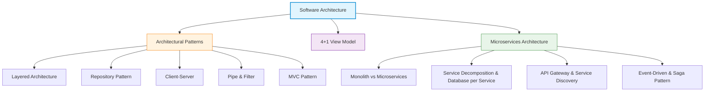

---

# 1. ความสำคัญของสถาปัตยกรรมซอฟต์แวร์ และมุมมอง 4+1 View Model

*📄 Slides 1-10 (4. Software Architecture.pdf)*

> [!DEFINITION] Software Architecture (สถาปัตยกรรมซอฟต์แวร์)
> **Software Architecture** คือ โครงสร้างระดับสูงของระบบซอฟต์แวร์ ซึ่งกำหนดองค์ประกอบหลัก (Subsystems/Modules), ความสัมพันธ์ระหว่างองค์ประกอบเหล่านั้น (Relationships), และหลักการในการออกแบบและพัฒนาเพื่อบรรลุคุณลักษณะ Non-Functional (Performance, Security, Maintainability)

## 1.1 กรอบมุมมอง 4+1 View Model
*📄 Slide 7 (4. Software Architecture.pdf)*

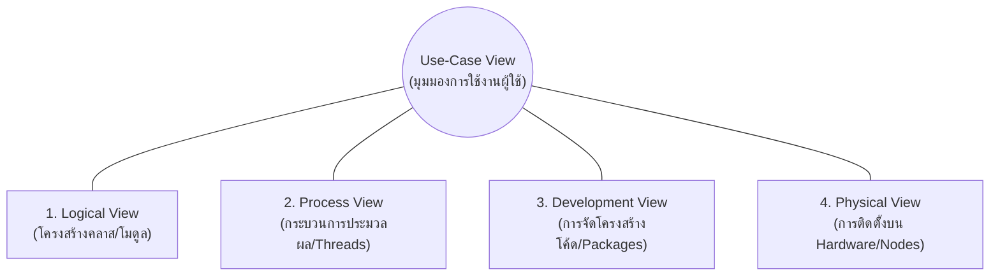

1. **Logical View**: แสดงการจัดกลุ่มฟังก์ชันและวัตถุในระบบ (Object-oriented decomposition, Class diagrams)
2. **Process View**: แสดงการทำงานขณะ Runtime, การจัดสรร Threads, Processes และการสื่อสารแบบขนาน
3. **Development View**: แสดงการจัดเก็บซอฟต์แวร์ในรูปแบบ Source code, Packages, Libraries
4. **Physical View**: แสดงการติดตั้งและกระจายซอฟต์แวร์ลงบนอุปกรณ์ฮาร์ดแวร์จริง (Deployment nodes, Servers)
5. **Use-Case View (+1)**: รวมทุกมุมมองเข้าด้วยกันผ่านกรณีการใช้งานจริงของผู้ใช้

---

# 2. แบบรูปสถาปัตยกรรมมาตรฐาน 5 รูปแบบ (Architectural Patterns)

*📄 Slides 11-25 (4. Software Architecture.pdf)*

## 2.1 Layered Architecture (สถาปัตยกรรมแบบแบ่งชั้น)
*📄 Slide 12*

แบ่งระบบออกเป็นชั้นๆ (Layers) โดยแต่ละชั้นจะให้บริการแก่ชั้นที่อยู่เหนือกว่า และเรียกใช้บริการจากชั้นที่อยู่ล่างกว่าเท่านั้น

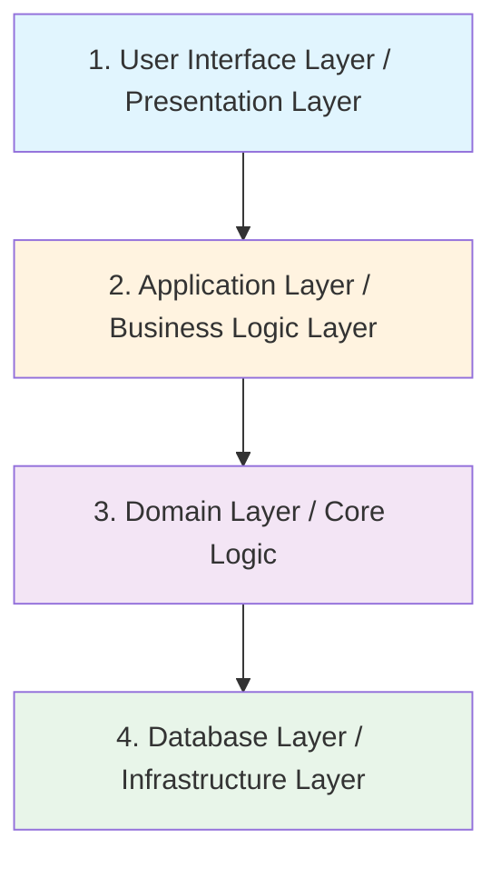

- **ข้อดี**: มีการแยกส่วน (Separation of Concerns) ชัดเจน การเปลี่ยนโครงสร้างในชั้นหนึ่งส่งผลกระทบชั้นอื่นน้อย
- **ข้อเสีย**: มี Performance Overhead จากการต้องส่งข้อมูลผ่านหลายชั้น

## 2.2 Repository Architecture (สถาปัตยกรรมแบบคลังข้อมูลศูนย์กลาง)
*📄 Slide 15*

ส่วนประกอบย่อยทั้งหมดเข้าถึงและแชร์ข้อมูลผ่านฐานข้อมูลศูนย์กลาง (Central Repository)

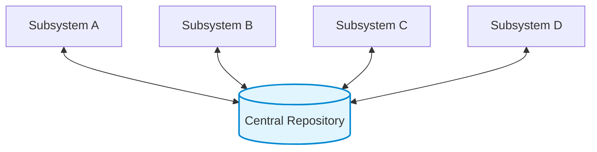

## 2.3 Client-Server Architecture (สถาปัตยกรรมแบบคลายเอนต์-เซิร์ฟเวอร์)
*📄 Slide 18*

กระจายการทำงานระหว่างผู้ให้บริการ (Server) และผู้ขอใช้บริการ (Client) ผ่านเครือข่าย

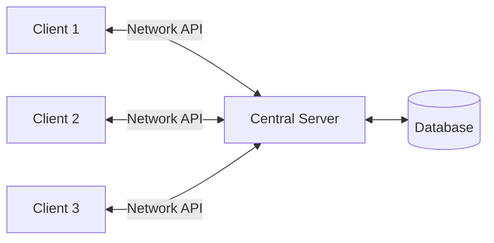

## 2.4 Pipe and Filter Architecture (สถาปัตยกรรมแบบท่อและตัวกรอง)
*📄 Slide 21*

ประมวลผลข้อมูลเป็นลำดับขั้นตอน ข้อมูลไหลจาก Filter หนึ่งไปยังอีก Filter หนึ่งผ่าน Pipe (นิยมใช้ใน Unix CLI, Data Pipeline)

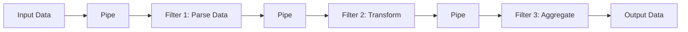

## 2.5 Model-View-Controller (MVC Pattern)
*📄 Slide 24*

แยกส่วนของข้อมูล (Model), หน้าจอแสดงผล (View), และส่วนควบคุมตรรกะ (Controller) ออกจากกัน

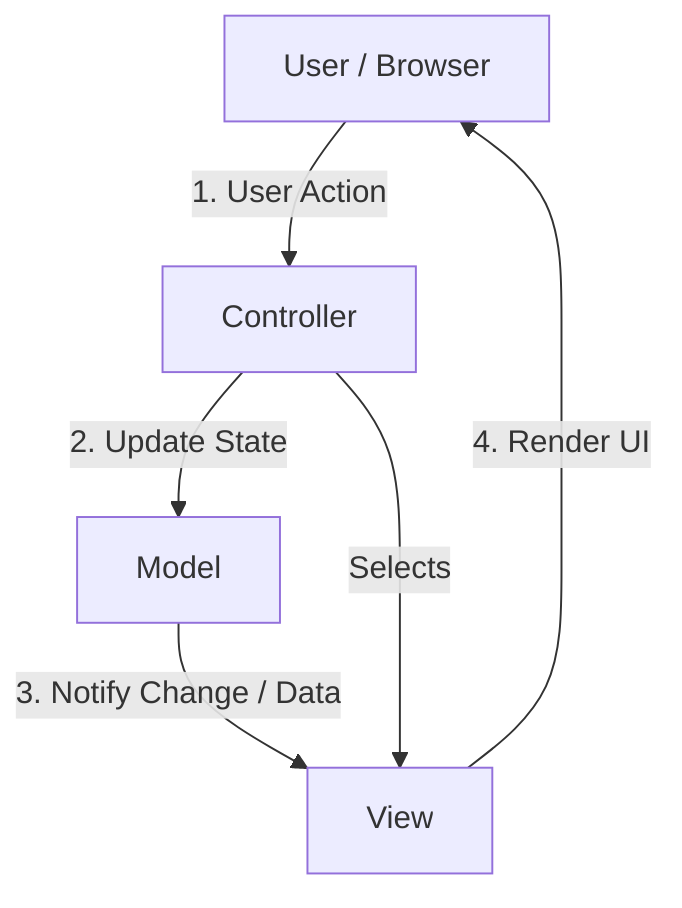

---

# 3. สถาปัตยกรรมแบบ Monolith vs Microservices

*📄 Slides 1-12 (6. Microservices architecture.pdf)*

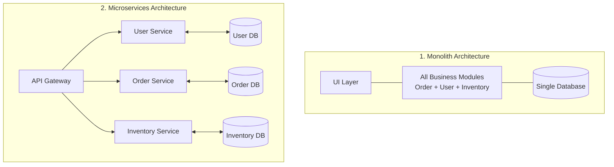

### ตารางเปรียบเทียบ Monolith vs Microservices

| มิติเปรียบเทียบ | Monolithic Architecture | Microservices Architecture |
| :--- | :--- | :--- |
| **โครงสร้างระบบ** | ซอฟต์แวร์ชิ้นเดียวขนาดใหญ่ (Single deployment unit) | บริการย่อยอิสระหลายบริการ (Multiple independent services) |
| **การจัดเก็บข้อมูล** | ใช้ฐานข้อมูลร่วมกัน (Single Shared Database) | แต่ละบริการมี DB ของตัวเอง (Database per Service) |
| **การขยายระบบ (Scalability)** | ต้องขยายทั้งระบบพร้อมกัน (Scale whole app) | ขยายเฉพาะบริการที่ภาระงานสูงได้ (Independent scaling) |
| **ความผิดพลาด (Fault Tolerance)** | หากโมดูลหนึ่งล้ม อาจทำลายทั้งระบบ | ความล้มเหลวจำกัดอยู่เฉพาะบริการนั้นๆ |
| **เทคโนโลยีที่ใช้** | ต้องใช้ Stack เดียวกันทั้งโครงการ | แต่ละบริการเลือกใช้ Tech Stack ที่เหมาะสมที่สุดได้ |
| **ความซับซ้อนในการดูแล** | พัฒนาและ Deploy ง่ายในระยะแรก | มีความซับซ้อนสูงในการบริหารจัดการเครือข่ายและระบบทดสอบ |

---

# 4. หลักการออกแบบและการย่อยสลายบริการ Microservices

*📄 Slides 13-22 (6. Microservices architecture.pdf)*

## 4.1 กลยุทธ์การย่อยสลายบริการ (Decomposition Strategies)
1. **Decompose by Business Capability**: แบ่งบริการตามฟังก์ชันทางธุรกิจ เช่น Order Management, Payment, Shipping
2. **Decompose by Subdomain (DDD)**: แบ่งบริการตาม Bounded Context ทางโดเมนธุรกิจ (Domain-Driven Design)

## 4.2 หลักการ 1 Service = 1 Database (Database per Service Pattern)
- แต่ละ Microservice ต้องเป็นเจ้าของข้อมูลและฐานข้อมูลของตนเอง ห้ามไม่ให้บริการอื่นแอบต่อเชื่อมฐานข้อมูลตรงๆ โดยไม่ผ่าน API
- ป้องกันการเกิด Coupling ระหว่างบริการ

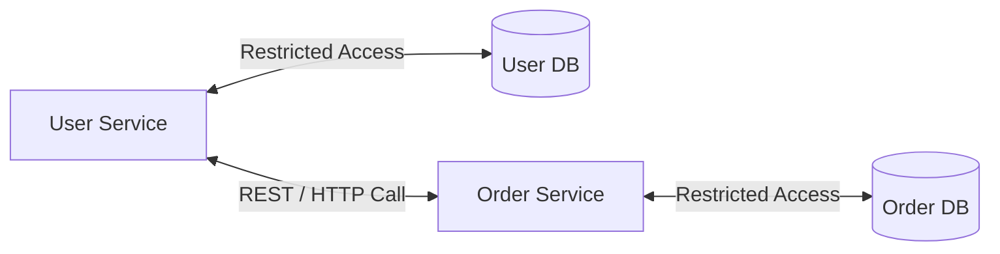

---

# 5. รูปแบบโครงสร้างพื้นฐานของ Microservices (Infrastructure Patterns)

*📄 Slides 23-35 (6. Microservices architecture.pdf)*

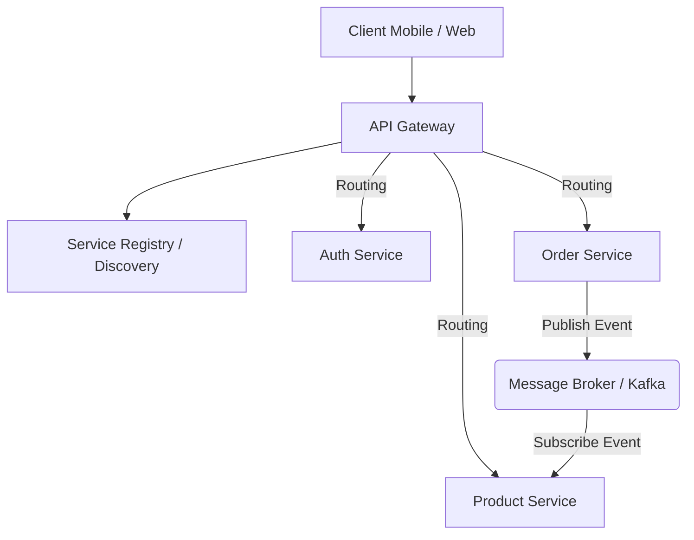

1. **API Gateway Pattern**:
   - ทำหน้าที่เป็นประตูหน้าด่าน (Single Entry Point) สำหรับการสื่อสารของ Clients
   - ทำหน้าที่ Routing, Authentication, Rate Limiting, และ SSL Termination
2. **Service Discovery Pattern**:
   - เนื่องจาก Microservices มีการขยายตัวและย้าย IP Address ตลอดเวลา ระบบ Service Registry (เช่น Eureka, Consul) จะทำหน้าที่ลงทะเบียนและค้นหาตำแหน่งที่ตั้งของบริการ
3. **Event-Driven Architecture (EDA)**:
   - สื่อสารแบบไม่พร้อมกัน (Asynchronous) ผ่าน Message Broker (เช่น Apache Kafka, RabbitMQ) ช่วยลด Coupling ระหว่างบริการ

---

# 6. ธุรกรรมแบบกระจายตัวและรูปแบบ Saga Pattern (Distributed Transactions)

*📄 Slides 36-40 (6. Microservices architecture.pdf)*

เนื่องจากแต่ละ Microservice มีฐานข้อมูลแยกกัน การทำ Transaction ข้ามหลายบริการไม่สามารถใช้ 2-Phase Commit แบบเดิมได้ จึงนิยมใช้ **Saga Pattern**

> [!DEFINITION] Saga Pattern
> **Saga Pattern** คือ ลำดับของธุรกรรมท้องถิ่น (Local Transactions) เมื่อบริการแรกทำรายการสำเร็จ จะส่ง Event ไปสะกิดให้บริการถัดไปทำรายการต่อ หากขั้นตอนใดล้มเหลว ระบบจะส่ง **Compensating Transactions** เพื่อยกเลิกรายการที่ทำไปก่อนหน้าย้อนกลับตามลำดับ

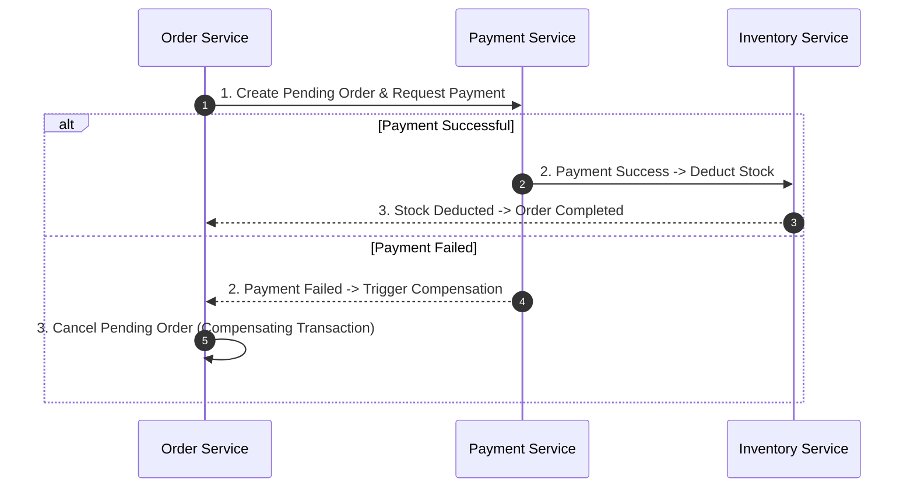
