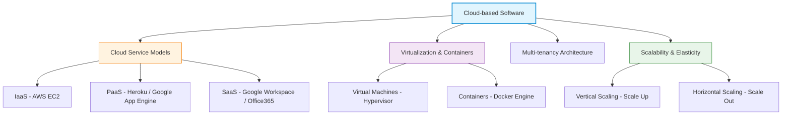
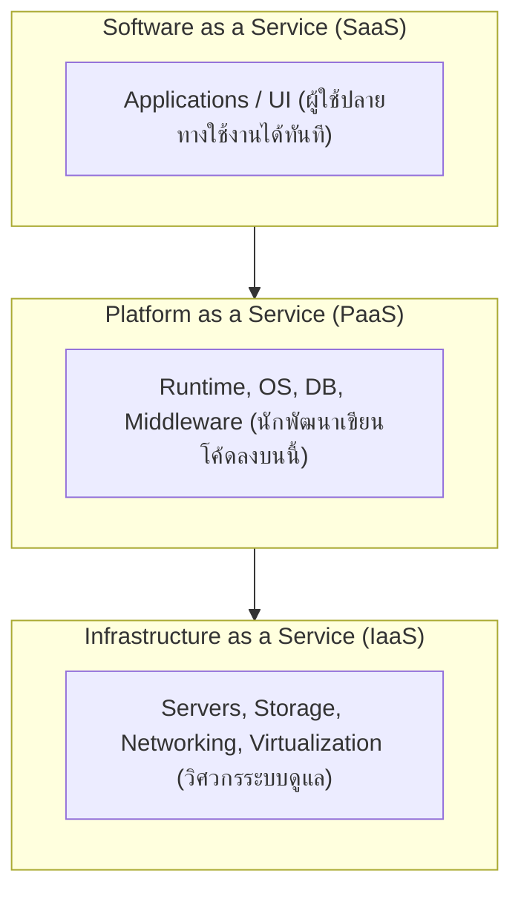
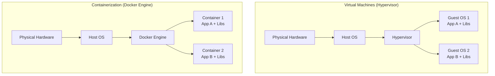
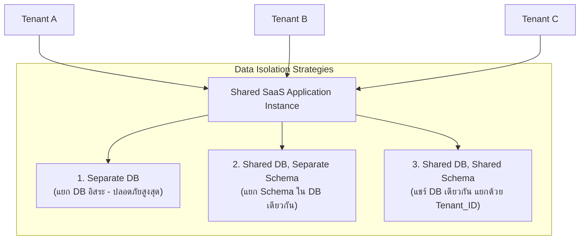
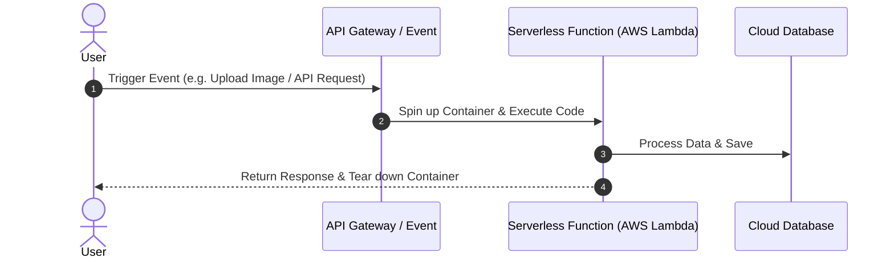
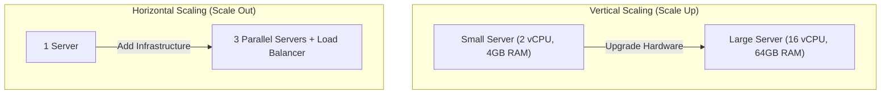

---
tags:
  - software-engineering
  - cloud-computing
  - docker
  - containers
  - multi-tenancy
  - serverless
  - scalability
  - lecture-7
created: 2026-08-03
updated: 2026-08-03
lecture: 7
type: lecture
---

# Lecture 7: Cloud-Based Software & Infrastructure

> [!SUMMARY] ภาพรวมบทเรียน
> บทเรียนนี้สรุปเนื้อหาอย่างละเอียดจากสไลด์ **5. Cloud-based software.pdf** ครอบคลุม 6 หัวข้อหลัก:
> 1. [[#1. นิยามและโมเดลการให้บริการ Cloud Computing (IaaS, PaaS, SaaS)]]
> 2. [[#2. เทคโนโลยี Virtualization vs Containerization (Docker Architecture)]]
> 3. [[#3. สถาปัตยกรรมแบบ Multi-tenancy]]
> 4. [[#4. การประมวลผลแบบ Serverless และ FaaS]]
> 5. [[#5. การขยายระบบและการยืดหยุ่นบนคลาวด์ (Scalability & Elasticity)]]
> 6. [[#6. โมเดลค่าใช้จ่ายในระบบคลาวด์ (Cloud Cost Models)]]

---

# 1. นิยามและโมเดลการให้บริการ Cloud Computing (IaaS, PaaS, SaaS)

*📄 Slides 1-12 (5. Cloud-based software.pdf)*

> [!DEFINITION] Cloud Computing (การประมวลผลกลุ่มเมฆ)
> **Cloud Computing** คือ รูปแบบการให้บริการทรัพยากรคอมพิวเตอร์ (เช่น เครือข่าย, เซิร์ฟเวอร์, หน่วยจัดเก็บข้อมูล, แอปพลิเคชัน) ผ่านอินเทอร์เน็ตแบบ On-demand โดยผู้ใช้สามารถเข้าถึงและใช้งานได้ทันที ชำระเงินตามปริมาณการใช้งานจริง (Pay-as-you-go) โดยไม่ต้องลงทุนซื้อฮาร์ดแวร์เอง

## 1.1 โมเดลการให้บริการ 3 ระดับ (Cloud Service Models)
*📄 Slides 5-8 (5. Cloud-based software.pdf)*

| โมเดลบริการ | สิ่งที่ Cloud Provider จัดหาให้ | สิ่งที่ผู้ใช้ต้องดูแลเอง | ตัวอย่างบริการ |
| :--- | :--- | :--- | :--- |
| **IaaS** | Hardware, Network, Storage, Virtualization | OS, Middleware, Runtime, Data, Application | AWS EC2, Google Compute Engine, Azure VM |
| **PaaS** | HW, Network, Storage, OS, Runtime, DB | Application Code และ Data | Heroku, Google App Engine, AWS Elastic Beanstalk |
| **SaaS** | ทั้งหมดตั้งแต่ระบบ โครงสร้าง ไปจนถึงหน้าจอแอปพลิเคชัน | การตั้งค่าผู้ใช้และข้อมูลการใช้งาน | Google Workspace, Microsoft 365, Salesforce |

---

# 2. เทคโนโลยี Virtualization vs Containerization (Docker Architecture)

*📄 Slides 13-22 (5. Cloud-based software.pdf)*

### ตารางเปรียบเทียบ Virtual Machines (VM) vs Docker Containers

| มิติเปรียบเทียบ | Virtual Machines (VMs) | Docker Containers |
| :--- | :--- | :--- |
| **สถาปัตยกรรม** | จำลองทั้งระบบรวมถึง Guest OS | แชร์ Host OS Kernel ร่วมกัน |
| **ขนาด (Size)** | ขนาดใหญ่ (เป็น GB) | ขนาดเล็กและเบา (เป็น MB) |
| **ความเร็วในการ บูต** | บูตช้า (ใช้เวลาหลายนาที) | บูตเร็วมาก (ใช้เวลาเป็นวินาที) |
| **ประสิทธิภาพ** | มี Overhead สูงจาก Guest OS | ประสิทธิภาพเกือบเท่า Native Hardware |
| **ความโดดเดี่ยว (Isolation)** | แยกตัวเด็ดขาดระดับฮาร์ดแวร์ ปลอดภัยสูง | แยกตัวระดับ Process บน OS |

---

# 3. สถาปัตยกรรมแบบ Multi-tenancy

*📄 Slides 23-28 (5. Cloud-based software.pdf)*

> [!DEFINITION] Multi-tenancy Architecture
> **Multi-tenancy** คือ สถาปัตยกรรมซอฟต์แวร์ที่อินสแตนซ์เดียวของแอปพลิเคชันให้บริการแก่ลูกค้าหลายองค์กร (Tenants) พร้อมกัน โดยข้อมูลของแต่ละ Tenant จะถูกแยกส่วนและเป็นความลับจากกันอย่างสิ้นเชิง

---

# 4. การประมวลผลแบบ Serverless และ FaaS

*📄 Slides 29-32 (5. Cloud-based software.pdf)*

- **Serverless Computing**: รูปแบบการประมวลผลที่นักพัฒนาไม่ต้องจัดการหรือสร้าง Server เอง Cloud Provider จะคอยบริหารจัดการ Scaling, Patching, และ Provisioning ให้โดยอัตโนมัติ
- **Function-as-a-Service (FaaS)**: เขียนเฉพาะฟังก์ชันโค้ดสั้นๆ (เช่น AWS Lambda, Azure Functions, Cloud Functions) โค้ดจะถูกเรียกทำงานเมื่อมี Event มากระตุ้น (Event-driven) และคิดเงินเฉพาะมิลลิวินาทีที่โค้ดทำงาน

---

# 5. การขยายระบบและการยืดหยุ่นบนคลาวด์ (Scalability & Elasticity)

*📄 Slides 33-38 (5. Cloud-based software.pdf)*

1. **Vertical Scaling (Scale Up / Scale Down)**: การเพิ่มทรัพยากร (CPU, RAM, Disk) ให้กับ Server เครื่องเดิม มีขีดจำกัดทางฮาร์ดแวร์และต้องหยุดทำงานชั่วคราว (Downtime)
2. **Horizontal Scaling (Scale Out / Scale In)**: การเพิ่มจำนวนเครื่อง Server คู่ขนานและใช้ Load Balancer กระจายงาน เป็นแนวทางหลักใน Cloud
3. **Elasticity (ความยืดหยุ่น)**: ความสามารถของระบบในการปรับเพิ่มหรือลดทรัพยากรอัตโนมัติ (Auto-scaling) ตามปริมาณ Traffic ที่เข้ามาจริง ณ เวลานั้น

---

# 6. โมเดลค่าใช้จ่ายในระบบคลาวด์ (Cloud Cost Models)

*📄 Slides 39-42 (5. Cloud-based software.pdf)*

1. **Pay-as-you-go (On-Demand)**: จ่ายตามจริงเป็นรายชั่วโมงหรือรายวินาที ไม่ต้องมีข้อผูกมัด ราคาสูงสุดต่อหน่วย เหมาะกับงานที่ไม่แน่นอน
2. **Reserved Instances**: สัญญาเช่าระยะยาว (1 ปี หรือ 3 ปี) ได้ส่วนลดราคาสูงสุด 40-70% เหมาะกับระบบหลักที่ต้องรัน 24/7
3. **Spot Instances**: การประมูลใช้เครื่องที่เหลือว่างของ Cloud Provider ราคาถูกที่สุด (ส่วนลดถึง 90%) แต่อาจถูกดึงเครื่องคืนได้ตลอดเวลา เหมาะกับงาน Batch Processing หรือ Background Task ที่หยุดชั่วคราวได้
