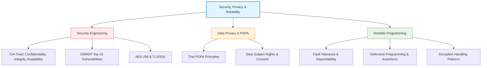
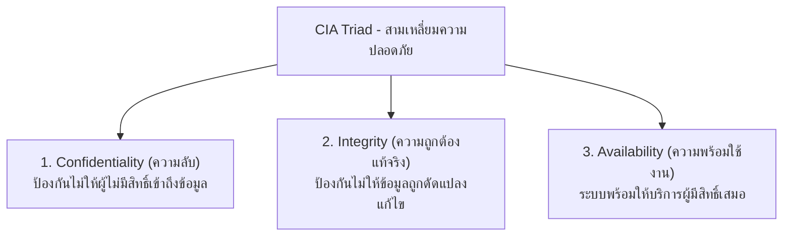
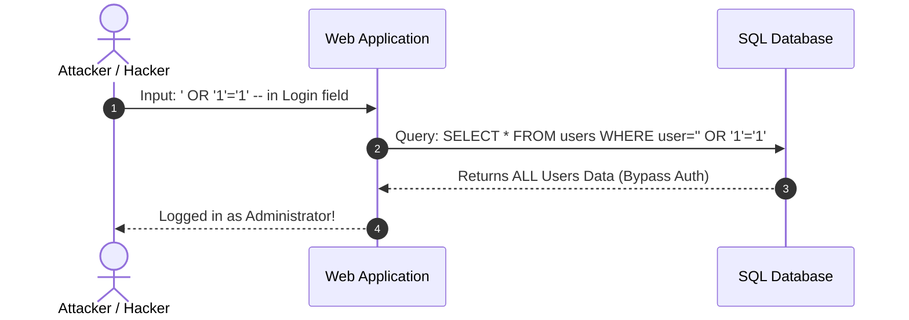
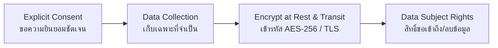

---
tags:
  - software-engineering
  - security
  - privacy
  - pdpa
  - cryptography
  - reliable-programming
  - exception-handling
  - lecture-8
created: 2026-08-03
updated: 2026-08-03
lecture: 8
type: lecture
---

# Lecture 8: Security, Privacy & Reliable Programming

> [!SUMMARY] ภาพรวมบทเรียน
> บทเรียนนี้สรุปเนื้อหาอย่างละเอียดจากสไลด์ **7. Security and Privacy.pdf** และ **8. Reliable Programming.pdf** ครอบคลุม 6 หัวข้อหลัก:
> 1. [[#1. ความปลอดภัยทางซอฟต์แวร์ และหลักการ CIA Triad (Security Engineering)]]
> 2. [[#2. การจำลองภัยคุกคาม และกลุ่มช่องโหว่ OWASP Top 10 (Threat Modeling & Vulnerabilities)]]
> 3. [[#3. กฎหมายคุ้มครองข้อมูลส่วนบุคคล (Thai PDPA & GDPR)]]
> 4. [[#4. วิทยาการรหัสสารสนเทศ (Cryptography: AES-256 & TLS)]]
> 5. [[#5. การเขียนโปรแกรมที่ทนทานและปลอดภัย (Reliable & Defensive Programming)]]
> 6. [[#6. การจัดการข้อผิดพลาดและสันนิษฐานเด็ดขาด (Exception Handling & Assertions)]]



---

# 1. ความปลอดภัยทางซอฟต์แวร์ และหลักการ CIA Triad (Security Engineering)

*📄 Slides 1-12 (7. Security and Privacy.pdf)*

> [!DEFINITION] Security Engineering (วิศวกรรมความปลอดภัย)
> **Security Engineering** คือ กระบวนการออกแบบ พัฒนา และดูแลรักษาระบบซอฟต์แวร์เพื่อป้องกันภัยคุกคามจากการโจมตี การเข้าถึงโดยไม่ได้รับอนุญาต ความเสียหาย หรือการถูกขัดขวางการทำงาน



---

# 2. การจำลองภัยคุกคาม และกลุ่มช่องโหว่ OWASP Top 10 (Threat Modeling & Vulnerabilities)

*📄 Slides 13-22 (7. Security and Privacy.pdf)*

## 2.1 สรุปช่องโหว่ OWASP Top 10 ที่พบบ่อย
1. **Broken Access Control (การควบคุมสิทธิ์บกพร่อง)**: ผู้ใช้ทั่วไปสามารถเข้าถึงหน้าหรือข้อมูลของผู้บริหารได้โดยการเปลี่ยน URL
2. **Cryptographic Failures (ความล้มเหลวทางรหัสผ่าน)**: จัดเก็บ Password เป็น Plaintext หรือใช้ Algorithm รหัสผ่านที่อ่อนแอ (เช่น MD5, SHA1)
3. **Injection Attacks (เช่น SQL Injection)**: ผู้โจมตีส่งคำสั่ง SQL แทรกใน Input field เพื่อแฮกฐานข้อมูล



> [!TIP] การป้องกัน SQL Injection
> ใช้ **Parameterized Queries / Prepared Statements** เสมอ ห้ามนำข้อความ Input จากผู้ใช้มาต่อ String ในคำสั่ง SQL โดยตรง

---

# 3. กฎหมายคุ้มครองข้อมูลส่วนบุคคล (Thai PDPA & GDPR)

*📄 Slides 23-30 (7. Security and Privacy.pdf)*

> [!IMPORTANT] พ.ร.บ. คุ้มครองข้อมูลส่วนบุคคล พ.ศ. 2562 (Thai PDPA)
> กฎหมายกำหนดให้ซอฟต์แวร์ที่เก็บข้อมูลส่วนบุคคล (Personal Data) ของประชาชนไทยต้องปฏิบัติตามหลักการคุ้มครองสิทธิ์อย่างเคร่งครัด



### สิทธิ์ของเจ้าของข้อมูลส่วนบุคคล (Data Subject Rights):
- **Right to Access**: สิทธิ์ในการขอเข้าถึงและรับสำเนาข้อมูลส่วนบุคคล
- **Right to Erasure (Right to be Forgotten)**: สิทธิ์ในการขอให้ลบหรือทำลายข้อมูลส่วนบุคคล
- **Right to Data Portability**: สิทธิ์ในการขอโอนย้ายข้อมูลไปยังระบบอื่น
- **Right to Withdraw Consent**: สิทธิ์ในการถอนความยินยอมเมื่อใดก็ได้

---

# 4. วิทยาการรหัสสารสนเทศ (Cryptography: AES-256 & TLS)

*📄 Slides 31-36 (7. Security and Privacy.pdf)*

```mermaid
graph TD
    Crypto[Cryptography in Software] --> Sym[Symmetric Encryption<br/>(สมมาตร - กุญแจดอกเดียว)]
    Crypto --> Asym[Asymmetric Encryption<br/>(อสมมาตร - กุญแจคู่ Public/Private)]

    Sym --> AES["AES-256 (นิยมใช้เก็บ Data at Rest)"]
    Asym --> RSA["RSA / ECC (นิยมใช้แลกเปลี่ยนกุญแจ/Digital Signature)"]
```

- **Data at Rest (ข้อมูลที่จัดเก็บ)**: ต้องได้รับการเข้ารหัสด้วย **AES-256** (Advanced Encryption Standard 256-bit)
- **Data in Transit (ข้อมูลที่วิ่งบนเครือข่าย)**: ต้องส่งผ่านโปรโตคอล **TLS 1.2 / TLS 1.3 (HTTPS)** เพื่อป้องกันการดักจับข้อมูล (Man-in-the-Middle Attack)

---

# 5. การเขียนโปรแกรมที่ทนทานและปลอดภัย (Reliable & Defensive Programming)

*📄 Slides 1-15 (8. Reliable Programming.pdf)*

> [!DEFINITION] Defensive Programming (การเขียนโปรแกรมเชิงป้องกัน)
> **Defensive Programming** คือ สไตล์การเขียนโค้ดที่ตั้งสมมติฐานว่า ข้อผิดพลาดสามารถเกิดขึ้นได้เสมอไม่ว่าจากผู้ใช้ เครือข่าย หรือฮาร์ดแวร์ โค้ดจึงต้องมีการตรวจสอบความถูกต้องของข้อมูล (Input Validation) และจัดการสถานการณ์ยกเว้นเพื่อไม่ให้โปรแกรมพัง (Crash)

## 5.1 หลักการของ Defensive Programming
1. **Never Trust External Inputs**: ตรวจสอบความถูกต้องของ Input ทุกตัวก่อนนำไปประมวลผล (Length, Type, Range, Null checks)
2. **Fail Safely**: หากเกิดข้อผิดพลาด ให้ระบบคืนค่าในสถานะที่ปลอดภัย (Safe state)
3. **Redundancy & Fault Tolerance**: มีระบบสำรองข้อมูลและกลไก Retry หากการเชื่อมต่อล้มเหลว

---

# 6. การจัดการข้อผิดพลาดและสันนิษฐานเด็ดขาด (Exception Handling & Assertions)

*📄 Slides 16-25 (8. Reliable Programming.pdf)*

## 6.1 Exception Handling Patterns (รูปแบบการจัดการข้อผิดพลาด)

```java
try {
    // โค้ดที่อาจเกิดข้อผิดพลาด (เช่น อ่านไฟล์ เชื่อมต่อ DB)
    File file = openFile("patient_records.dat");
    processFile(file);
} catch (FileNotFoundException e) {
    // จัดการกรณีหาไฟล์ไม่พบ แสดง log และแจ้งผู้ใช้
    logger.error("Patient record file missing", e);
    showUserFriendlyError("ไม่พบข้อมูลบันทึกผู้ป่วย กรุณาติดต่อผู้ดูแลระบบ");
} catch (IOException e) {
    logger.error("I/O failure during file reading", e);
} finally {
    // ทำความสะอาดทรัพยากรเสมอ ไม่ว่าจะเกิด Error หรือไม่
    closeResources();
}
```

## 6.2 Assertions (คำสั่งสันนิษฐานเด็ดขาด)
- ใช้สำหรับตรวจสอบความถูกต้องของเงื่อนไขภายในที่โปรแกรมเมอร์มั่นใจว่าเป็นจริงเสมอในระหว่างการพัฒนา (Development/Debugging phase)

```java
// ตรวจสอบว่าอินซูลินที่คำนวณได้ต้องไม่เกินขีดจำกัดความปลอดภัย
assert calculatedInsulinDose <= MAX_SAFE_DOSE : "Critical Error: Insulin dose exceeds safety limit!";
```
