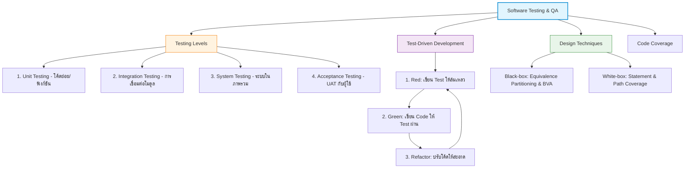
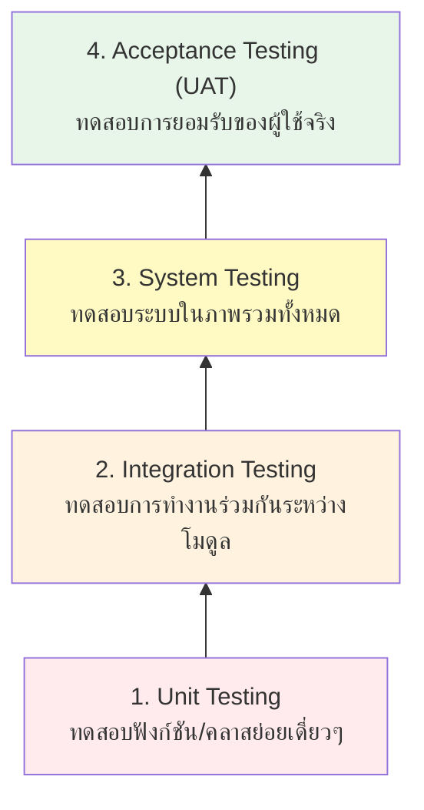
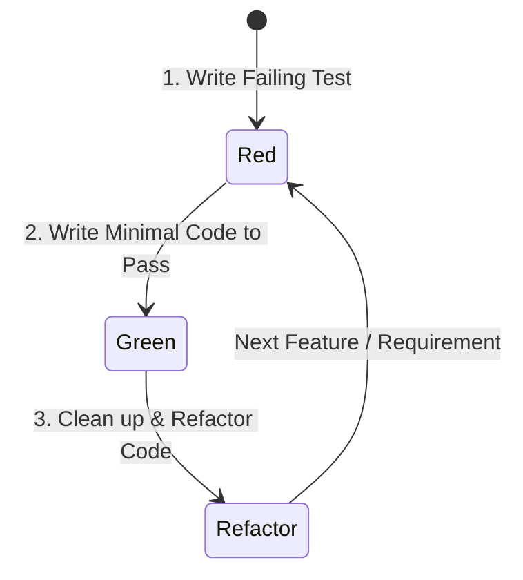
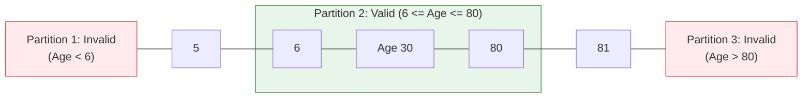

---
tags:
  - software-engineering
  - testing
  - unit-testing
  - tdd
  - black-box
  - white-box
  - boundary-value-analysis
  - lecture-9
created: 2026-08-03
updated: 2026-08-03
lecture: 9
type: lecture
---

# Lecture 9: Software Testing & Quality Assurance

> [!SUMMARY] ภาพรวมบทเรียน
> บทเรียนนี้สรุปเนื้อหาอย่างละเอียดจากสไลด์ **9. Testing.pdf** และ **Ian Sommerville (Ch 8)** ครอบคลุม 5 หัวข้อหลัก:
> 1. [[#1. ระดับของการทดสอบซอฟต์แวร์ 4 ระดับ (Software Testing Levels)]]
> 2. [[#2. การพัฒนาซอฟต์แวร์ด้วยการทดสอบนำ (Test-Driven Development: TDD)]]
> 3. [[#3. เทคนิคการออกแบบ Test Cases (Black-box vs White-box Testing)]]
> 4. [[#4. การแบ่งชั้นความทัดเทียมและการวิเคราะห์ค่าขอบเขต (Equivalence Partitioning & BVA)]]
> 5. [[#5. ตัววัดความครอบคลุมของโค้ด (Code Coverage Metrics)]]



---

# 1. ระดับของการทดสอบซอฟต์แวร์ 4 ระดับ (Software Testing Levels)

*📄 Slides 1-10 (9. Testing.pdf)*



1. **Unit Testing (การทดสอบหน่วยย่อย)**:
   - ทดสอบฟังก์ชัน วิธีการ (Method) หรือคลาสย่อยๆ เดี่ยวๆ แยกเป็นอิสระ โดยใช้ Mock/Stub แทนพึ่งพาส่วนอื่น
2. **Integration Testing (การทดสอบการรวมระบบ)**:
   - ทดสอบปฏิสัมพันธ์และการรับส่งข้อมูลระหว่างโมดูลย่อยหลายๆ โมดูลที่นำมารวมกัน
3. **System Testing (การทดสอบระบบรวม)**:
   - ทดสอบซอฟต์แวร์ทั้งระบบว่าทำงานตรงตามคุณลักษณะทั้ง Functional และ Non-Functional หรือไม่
4. **Acceptance Testing / UAT (การทดสอบยอมรับโดยผู้ใช้)**:
   - ให้ผู้ใช้หรือลูกค้าทดสอบใช้งานจริงด้วยข้อมูลจริง เพื่อตัดสินใจว่าจะเซ็นรับมอบซอฟต์แวร์หรือไม่

---

# 2. การพัฒนาซอฟต์แวร์ด้วยการทดสอบนำ (Test-Driven Development: TDD)

*📄 Slides 11-16 (9. Testing.pdf)*

> [!DEFINITION] Test-Driven Development (TDD)
> **TDD** คือ กระบวนการเขียนโค้ดซอฟต์แวร์ที่เปลี่ยนจากการเขียนโค้ดก่อนแล้วค่อยทดสอบ มาเป็น **การเขียนคำสั่งทดสอบอัตโนมัติ (Automated Test Case) ให้ล้มเหลวก่อน จากนั้นจึงเขียนโค้ดจริงเพียงเท่าที่จำเป็นเพื่อให้ทดสอบผ่าน แล้วค่อยปรับปรุงโครงสร้างโค้ดให้สะอาด**



### ประโยชน์ของ TDD:
- **Code Coverage สูง**: โค้ดทุกบรรทัดถูกสร้างขึ้นเพื่อตอบสนองการทดสอบ ทำให้มี Test Coverage เกือบ 100%
- **Regression Testing อัตโนมัติ**: เมื่อแก้ไขโค้ดในอนาคต สามารถรัน Test Suite ทั้งหมดเพื่อยืนยันว่าไม่มีฟังก์ชันเดิมพัง
- **ออกแบบดีขึ้น**: บังคับให้นักพัฒนาเขียนโค้ดแบบส่งผลกระทบต่ำ (Decoupled & Modular code)

---

# 3. เทคนิคการออกแบบ Test Cases (Black-box vs White-box Testing)

*📄 Slides 17-22 (9. Testing.pdf)*

```mermaid
graph TD
    Testing_Tech[Testing Techniques] --> BB[Black-box Testing<br/>(ทดสอบแบบกล่องดำ)]
    Testing_Tech --> WB[White-box Testing<br/>(ทดสอบแบบกล่องขาว)]

    BB --> BB1[ไม่สนใจโครงสร้างโค้ดภายใน]
    BB --> BB2[อ้างอิงจาก Specification & Requirements]
    BB --> BB3[เทคนิค: Equivalence Partitioning, BVA]

    WB --> WB1[วิเคราะห์โครงสร้างซอร์สโค้ดภายใน]
    WB --> WB2[ตรวจสอบเงื่อนไข ลูป และการประมวลผล]
    WB --> WB3[เทคนิค: Statement, Branch, Path Coverage]
```

---

# 4. การแบ่งชั้นความทัดเทียมและการวิเคราะห์ค่าขอบเขต (Equivalence Partitioning & BVA)

*📄 Slides 23-30 (9. Testing.pdf)*

> [!IMPORTANT] เทคนิคออกแบบ Test Cases ยอดนิยมสำหรับ Black-box Testing
> การทดสอบทุกค่าอินพุตที่เป็นไปได้ (Exhaustive Testing) เป็นไปไม่ได้ในทางปฏิบัติ จึงต้องใช้เทคนิควิเคราะห์ทางคณิตศาสตร์เพื่อสุ่มตัวแทนค่าอินพุตที่ครอบคลุม

## 4.1 Equivalence Partitioning (การแบ่งชั้นความทัดเทียม)
- แบ่งชุดข้อมูล Input ออกเป็นกลุ่มๆ (Partitions) ที่คาดว่าระบบจะประมวลผลและให้ผลลัพธ์ในลักษณะเดียวกัน จากนั้นเลือกตัวแทนเพียงค่าเดียวจากแต่ละกลุ่มมาทดสอบ

## 4.2 Boundary Value Analysis - BVA (การวิเคราะห์ค่าขอบเขต)
- ข้อผิดพลาดของซอฟต์แวร์มักเกิดขึ้นที่ **"ขอบเขต"** ของช่วงข้อมูล เทคนิค BVA จึงเน้นการเลือกค่าที่ขอบเขต ค่าก่อนขอบเขต และค่าหลังขอบเขต

### ตัวอย่างโจทย์: การยืมหนังสือ BookNest (อายุกำหนด 6 ถึง 80 ปี)



### ชุด Test Cases ที่ต้องสร้างจาก BVA:

| Test Case ID | Input Age | ประเภท Partition / Boundary | ผลลัพธ์ที่คาดหวัง (Expected Outcome) |
| :--- | :--- | :--- | :--- |
| **TC01** | 5 | Boundary (Invalid - Low) | Reject / แสดงข้อความอายุน้อยกว่าเกณฑ์ |
| **TC02** | 6 | Boundary (Valid Minimum) | Accept / อนุญาตให้สมัคร |
| **TC03** | 30 | Inside Valid Range (Nominal) | Accept / อนุญาตให้สมัคร |
| **TC04** | 80 | Boundary (Valid Maximum) | Accept / อนุญาตให้สมัคร |
| **TC05** | 81 | Boundary (Invalid - High) | Reject / แสดงข้อความอายุเกินเกณฑ์ |

---

# 5. ตัววัดความครอบคลุมของโค้ด (Code Coverage Metrics)

*📄 Slides 31-35 (9. Testing.pdf)*

ใช้ประเมินว่าชุด Test Cases ที่มีอยู่ได้รันผ่านโค้ดในแนวลึกมากน้อยเพียงใด:

1. **Statement Coverage**: ร้อยละของบรรทัดโค้ด (Statements) ที่ถูกรันผ่านจริงระหว่างการทดสอบ
2. **Branch / Decision Coverage**: ร้อยละของเงื่อนไขทางเลือก (`if-else`, `switch-case`) ที่ถูกทดสอบทั้งกรณีที่เป็น True และ False
3. **Path Coverage**: ร้อยละของเส้นทางการทำงานทั้งหมดที่เป็นไปได้ในอัลกอริทึมที่ถูกรันครบทุกพาร์ท
