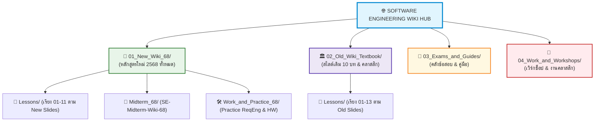

---
tags:
  - software-engineering
  - master-index
  - super-hub
  - new-curriculum-68
  - old-curriculum-classic
created: 2026-08-03
updated: 2026-09-08
type: master-index
---

# 📚 Software Engineering Master Hub: ศูนย์รวมคลังความรู้และดัชนีวิชาวิศวกรรมซอฟต์แวร์

> [!SUMMARY] ระบบคลังความรู้แยกโฟลเดอร์สอดคล้องกับสไลด์: หลักสูตรใหม่ 2568 ⚡ สไลด์เดิม 🏛️ ข้อสอบ 🎯 งาน/การบ้าน 🛠️
> สารบัญหลัก (Super Index) จัดหมวดหมู่โฟลเดอร์ใน `Wiki/` ให้ล้อตามโฟลเดอร์หลักของโปรเจกต์ (`01_New_Slides_68`, `02_Old_Slides_Textbook`, `03_Exams_and_Cheatsheets`, `04_Work_and_Homework`) โดยแยกบทเรียน งาน และ Midterm ไว้อย่างเป็นระเบียบ และรวมเนื้อหาทั้งหมดของปี 68 ไว้ใน **`01_New_Wiki_68/`** เพื่อให้อ่านเทียบกับสไลด์ได้ง่ายที่สุด

---

## 🧭 ทางลัดเปิดเอกสาร Master Wiki
* 🌟 **คู่มือสรุปภาพรวมหลักสูตรใหม่ 2568 (ฉบับสมบูรณ์):** **[[01_New_Wiki_68/00_New_Curriculum_68_Master_Wiki|00_New_Curriculum_68_Master_Wiki]]**
* 🏛️ **คู่มือสรุปภาพรวมหลักสูตรเดิมและสไลด์คลาสสิก (ฉบับสมบูรณ์):** **[[02_Old_Wiki_Textbook/00_Old_Curriculum_Master_Wiki|00_Old_Curriculum_Master_Wiki]]**
* 🎯 **สรุปเข้มข้อสอบกลางภาค 2568:** **[[01_New_Wiki_68/Midterm_68/SE-Midterm-Wiki-68|SE-Midterm-Wiki-68]]**
* 📝 **เจาะลึกแนวข้อสอบ Midterm 68 & เทคนิคคว้าคะแนนโบนัส +5:** **[[03_Exams_and_Guides/Midterm_Exam_Scope_and_Strategy_68|Midterm_Exam_Scope_and_Strategy_68]]**
* 📊 **ดัชนีตรวจความก้าวหน้าการเรียน:** **[[Progress Checklist]]**

---

# 🔄 ตารางวิเคราะห์และเปรียบเทียบ Old vs New Curriculum Matrix

ตารางนี้ช่วยให้นักศึกษาเลือกอ่านไฟล์ Wiki ให้ตรงกับสไลด์ PDF ในแต่ละโฟลเดอร์:

| หัวข้อบทเรียน | สไลด์ใหม่ (New 68) | สไลด์เดิม (Old & Classic) | ไฟล์ Wiki หลักสูตรใหม่ (`01_New_Wiki_68/`) | ไฟล์ Wiki หลักสูตรเดิม (`02_Old_Wiki_Textbook/`) | การนำไปใช้ในการสอบ |
|:---|:---|:---|:---|:---|:---|
| **บทนำ & จรรยาบรรณวิศวกร** | `01_Ch1_Introduction.pdf` | `01_Software_Products.pdf` | `Lessons/01_Ch1_Introduction.md` | `Lessons/01_Software_Products.md` | ⭐ สอบ Midterm |
| **กระบวนการพัฒนา & CMMI** | `02_Ch2_SW_Processes.pdf` `03_Ch2_Processes_Supp.pdf` | (กระจายในบทเดิม) | `Lessons/02_Ch2_SW_Processes.md` | - | ⭐ สอบ Midterm |
| **วิศวกรรมความต้องการ** | `04_Ch4_Requirements_Eng.pdf` `05_Ch4_Requirements_Cases.pdf` | (กระจายในบทเดิม) | `Lessons/04_Ch4_Requirements_Eng.md` | - | ⭐ สอบ Midterm |
| **โจทย์ฝึกซ้อม Requirements** | ⭐ `06_Practice_ReqEng.pdf` | - | `Work_and_Practice_68/06_Practice_ReqEng_Guide.md` | - | ⭐ ออกสอบ Midterm 100% |
| **Agile & Scrum Framework** | `07_Agile_and_Scrum_Framework.pdf` | `02_Agile_Software_Engineering.pdf` | `Lessons/07_Agile_and_Scrum.md` | `Lessons/02_Agile_Software_Engineering.md` | ⭐ สอบ Midterm |
| **Burndown Chart & Velocity** | ⭐ `08_Scrum_Burndown_Chart.pdf` | *(ไม่มีในสไลด์เดิม)* | `Lessons/08_Scrum_Burndown_Chart.md` | - | ⭐ ออกสอบ Midterm |
| **Features & User Stories** | - | `03_Features_Scenarios_and_Stories.pdf` | - | `Lessons/03_Features_Scenarios_and_Stories.md` | 📚 อ้างอิงการออกแบบ |
| **สถาปัตยกรรมซอฟต์แวร์** | *(สอนในโปรเจกต์)* | `04_Software_Architecture.pdf` `06_Microservices_Architecture.pdf` | - | `Lessons/04_Software_Architecture.md` `Lessons/06_Microservices_Architecture.md` | 📚 อ้างอิงสถาปัตยกรรม |
| **คลาวด์และคอนเทนเนอร์** | *(สอนในโปรเจกต์)* | `05_Cloud_Based_Software.pdf` | - | `Lessons/05_Cloud_Based_Software.md` | 📚 อ้างอิงระบบ Cloud |
| **ความปลอดภัย & Reliable** | *(สอนในโปรเจกต์)* | `07_Security_and_Privacy.pdf` `08_Reliable_Programming.pdf` | - | `Lessons/07_Security_and_Privacy.md` `Lessons/08_Reliable_Programming.md` | 📚 อ้างอิงโปรเจกต์ |
| **การทดสอบซอฟต์แวร์ & QA** | `09_Ch6_Software_Testing.pdf` `10_Week9_Software_Testing_QA.pdf` | `09_Testing.pdf` | `Lessons/09_Ch6_Software_Testing.md` `Lessons/10_Week9_Software_Testing_QA.md` | `Lessons/09_Testing.md` | ⭐ สอบ Final |
| **Cyclomatic Complexity** | ⭐ `11_Week10_Testing_Metrics.pdf` | *(ไม่มีในสไลด์เดิม)* | `Lessons/11_Week10_Testing_Metrics.md` | - | ⭐ ออกสอบ Final คำนวณ |
| **DevOps & CI/CD** | *(สอนในโปรเจกต์)* | `10_DevOps_and_Code_Management.pdf` | - | `Lessons/10_DevOps_and_Code_Management.md` | 📚 อ้างอิง Git & CI/CD |
| **Use Case Diagrams & Specs** | (ใช้ใน Workshop) | `11_Classic_Slide_UseCase_Dia.pdf` `12_Classic_Slide_UseCase_Specs.pdf` | - | `Lessons/11_Classic_Slide_UseCase_Diagrams.md` `Lessons/12_Classic_Slide_UseCase_Textual_Specs.md` | 🛠️ ทำการบ้าน Workshop |
| **Cost Estimation (COCOMO/FPA)** | (ใช้ใน Workshop) | `13_Classic_Slide_Cost_Estimation.pdf` | - | `Lessons/13_Classic_Slide_Cost_Estimation.md` | 🛠️ ทำการบ้าน Sw Cost |

---

# 🌟 โฟลเดอร์ที่ 1: `01_New_Wiki_68/` (ศูนย์รวมหลักสูตรใหม่ 2568)

รวบรวมเนื้อหาปี 2568 ทั้งหมด เรียงชื่อไฟล์ให้สอดคล้องกับ `01_New_Slides_68/`:

### 📘 สรุปภาพรวมหลักสูตรใหม่:
* **[[01_New_Wiki_68/00_New_Curriculum_68_Master_Wiki|00_New_Curriculum_68_Master_Wiki.md]]** — สรุปเนื้อหาปี 68 สไลด์ 01-11 ทั้ง Midterm & Final

### 📖 หมวดบทเรียน (Lessons/):
1. **[[01_New_Wiki_68/Lessons/01_Ch1_Introduction|01_Ch1_Introduction.md]]** — สอดคล้องกับ `01_Ch1_Introduction.pdf` (นิยาม SE, คุณลักษณะ 4 ประการ, จรรยาบรรณ 8 ข้อ)
2. **[[01_New_Wiki_68/Lessons/02_Ch2_SW_Processes|02_Ch2_SW_Processes.md]]** — สอดคล้องกับ `02_Ch2_SW_Processes.pdf` และ `03_Processes_Supp` (Waterfall, Incremental, Reuse, CMMI 5 ระดับ)
3. **[[01_New_Wiki_68/Lessons/04_Ch4_Requirements_Eng|04_Ch4_Requirements_Eng.md]]** — สอดคล้องกับ `04_Ch4` และ `05_Cases` (User vs System Req, FR/NFR, shall vs should, VCCRV)
4. **[[01_New_Wiki_68/Lessons/07_Agile_and_Scrum|07_Agile_and_Scrum.md]]** — สอดคล้องกับ `07_Agile_and_Scrum_Framework.pdf` (Agile Manifesto, Scrum Roles, Events, Artifacts, User Stories)
5. **[[01_New_Wiki_68/Lessons/08_Scrum_Burndown_Chart|08_Scrum_Burndown_Chart.md]]** — สอดคล้องกับ `08_Scrum_Burndown_Chart.pdf` (การอ่านกราฟ Actual vs Ideal, Scope Creep, การคิด Velocity)
6. **[[01_New_Wiki_68/Lessons/09_Ch6_Software_Testing|09_Ch6_Software_Testing.md]]** — สอดคล้องกับ `09_Ch6_Software_Testing.pdf` (ภาพรวมการทดสอบซอฟต์แวร์ฉบับอาจารย์)
7. **[[01_New_Wiki_68/Lessons/10_Week9_Software_Testing_QA|10_Week9_Software_Testing_QA.md]]** — สอดคล้องกับ `10_Week9_Software_Testing_and_QA.pdf` (V&V, 4 ระดับการทดสอบ, TDD, Equivalence Partitioning & BVA)
8. **[[01_New_Wiki_68/Lessons/11_Week10_Testing_Metrics|11_Week10_Testing_Metrics.md]]** — สอดคล้องกับ `11_Week10_Testing_Metrics_Cyclomatic.pdf` (Control Flow Graph, Basis Path, สูตร $V(G)=E-N+2=P+1$)

### 🎯 หมวดข้อสอบกลางภาคปี 68 (Midterm_68/):
* **[[01_New_Wiki_68/Midterm_68/SE-Midterm-Wiki-68|SE-Midterm-Wiki-68.md]]** — สรุปเตรียมสอบ Midterm 68 ครบทุกบทและบันทึกเฉลยข้อสอบ

### 🛠️ หมวดงานและแบบฝึกหัดปี 68 (Work_and_Practice_68/):
* **[[01_New_Wiki_68/Work_and_Practice_68/06_Practice_ReqEng_Guide|06_Practice_ReqEng_Guide.md]]** — สอดคล้องกับ `06_Practice_ReqEng.pdf` (คู่มือวิเคราะห์โจทย์คลินิก Mentcare และข้อกำหนด)
* **[[01_New_Wiki_68/Work_and_Practice_68/Homework_68_Solutions|Homework_68_Solutions.md]]** — เฉลยการบ้าน 1 PizzaFriend, การบ้าน 2 EasyClinic Stakeholders, การบ้านจริยธรรม 4 ด้าน และคำถามท้ายคาบ

---

# 🏛️ โฟลเดอร์ที่ 2: `02_Old_Wiki_Textbook/` (สไลด์เดิมและตำราคลาสสิก)

รวบรวมเนื้อหาสไลด์เดิม 13 ชุด และตำรา Ian Sommerville 10th Ed.:

### 📘 สรุปภาพรวมหลักสูตรเดิม:
* **[[02_Old_Wiki_Textbook/00_Old_Curriculum_Master_Wiki|00_Old_Curriculum_Master_Wiki.md]]** — สรุปภาพรวมสไลด์เดิม 13 บทครบถ้วน

### 📖 หมวดบทเรียน (Lessons/):
* **[[02_Old_Wiki_Textbook/Lessons/01_Software_Products|01_Software_Products.md]]** — สอดคล้องกับ `01_Software_Products.pdf` (Moore's Product Vision Template, PM Roles)
* **[[02_Old_Wiki_Textbook/Lessons/02_Agile_Software_Engineering|02_Agile_Software_Engineering.md]]** — สอดคล้องกับ `02_Agile_Software_Engineering.pdf` (Extreme Programming, Pair Programming)
* **[[02_Old_Wiki_Textbook/Lessons/03_Features_Scenarios_and_Stories|03_Features_Scenarios_and_Stories.md]]** — สอดคล้องกับ `03_Features_Scenarios_and_Stories.pdf` (Personas, Scenarios, User Stories)
* **[[02_Old_Wiki_Textbook/Lessons/04_Software_Architecture|04_Software_Architecture.md]]** — สอดคล้องกับ `04_Software_Architecture.pdf` (4+1 View Model, 5 Architectural Patterns)
* **[[02_Old_Wiki_Textbook/Lessons/05_Cloud_Based_Software|05_Cloud_Based_Software.md]]** — สอดคล้องกับ `05_Cloud_Based_Software.pdf` (IaaS/PaaS/SaaS, Docker vs VM, Multi-tenancy)
* **[[02_Old_Wiki_Textbook/Lessons/06_Microservices_Architecture|06_Microservices_Architecture.md]]** — สอดคล้องกับ `06_Microservices_Architecture.pdf` (Microservices, API Gateway, Saga Pattern)
* **[[02_Old_Wiki_Textbook/Lessons/07_Security_and_Privacy|07_Security_and_Privacy.md]]** — สอดคล้องกับ `07_Security_and_Privacy.pdf` (CIA Triad, OWASP Top 10, PDPA/GDPR)
* **[[02_Old_Wiki_Textbook/Lessons/08_Reliable_Programming|08_Reliable_Programming.md]]** — สอดคล้องกับ `08_Reliable_Programming.pdf` (Defensive Programming, Exception Handling)
* **[[02_Old_Wiki_Textbook/Lessons/09_Testing|09_Testing.md]]** — สอดคล้องกับ `09_Testing.pdf` (Sommerville Testing Core)
* **[[02_Old_Wiki_Textbook/Lessons/10_DevOps_and_Code_Management|10_DevOps_and_Code_Management.md]]** — สอดคล้องกับ `10_DevOps_and_Code_Management.pdf` (CALMS, GitFlow vs Trunk-Based)
* **[[02_Old_Wiki_Textbook/Lessons/11_Classic_Slide_UseCase_Diagrams|11_Classic_Slide_UseCase_Diagrams.md]]** — สอดคล้องกับ `11_Classic_Slide_UseCase_Diagrams_usecaseDia2.pdf`
* **[[02_Old_Wiki_Textbook/Lessons/12_Classic_Slide_UseCase_Textual_Specs|12_Classic_Slide_UseCase_Textual_Specs.md]]** — สอดคล้องกับ `12_Classic_Slide_UseCase_Textual_Specs_l3.pdf`
* **[[02_Old_Wiki_Textbook/Lessons/13_Classic_Slide_Cost_Estimation|13_Classic_Slide_Cost_Estimation.md]]** — สอดคล้องกับ `13_Classic_Slide_Cost_Estimation_se_chapter4.pdf` (COCOMO & FPA)

---

# 📝 โฟลเดอร์ที่ 3: `03_Exams_and_Guides/` (แนวข้อสอบและคู่มือคลาสสิก)

* **[[03_Exams_and_Guides/Midterm-Exam-Guide-Classic|Midterm-Exam-Guide-Classic.md]]** — รวมแนวข้อสอบจำลองชุด B, ชุด C และโจทย์วิเคราะห์ขั้นสูง
* 🌐 **[Exam_Hub.html](file:///home/few/Projects/software-engineering/03_Exams_and_Cheatsheets/Exam_Hub.html)** — หน้า Dashboard เปิดเว็บข้อสอบแบบ Interactive ทุกชุด

---

# 🔧 โฟลเดอร์ที่ 4: `04_Work_and_Workshops/` (เวิร์กช็อปและงานคลาสสิก)

* **[[04_Work_and_Workshops/ATM_and_Elevator_Workshop|ATM_and_Elevator_Workshop.md]]** — เวิร์กช็อป Use Case ระบบตู้ ATM และระบบควบคุมลิฟต์
* **[[04_Work_and_Workshops/Library_System_Workshop|Library_System_Workshop.md]]** — เวิร์กช็อป Use Case ระบบห้องสมุดกลาง มจพ.
* **[[04_Work_and_Workshops/Software_Cost_Estimation_Workshop|Software_Cost_Estimation_Workshop.md]]** — เวิร์กช็อปคำนวณ Sw Cost Estimation (COCOMO & Function Point Analysis)
