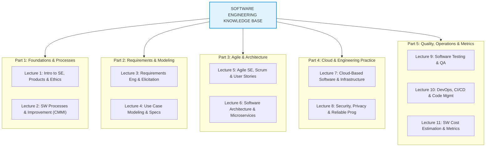

---
tags:
  - software-engineering
  - index
  - mega-guide
created: 2026-08-03
updated: 2026-08-03
type: index
---

# Software Engineering - Comprehensive Master Index

> [!SUMMARY] คลังความรู้ Software Engineering ระดับสมบูรณ์แบบ (LLM Wiki System)
> สารบัญดัชนี (Master Index) รวบรวม **"Mega Guides"** สำหรับหลักสูตรวิศวกรรมซอฟต์แวร์ (Software Engineering) เนื้อหาทั้งหมดถูกสรุปและวิเคราะห์อย่างละเอียดจากสไลด์บทเรียนทั้งหมด (`New slide`, สไลด์ 1-10, เอกสารบรรยายกรณีศึกษา, usecaseDia-2, se_chapter4, Workshop/Homework ในโฟลเดอร์ `work`) และอ้างอิงตำรามาตรฐาน **Software Engineering - Ian Sommerville (10th Edition)** 

---

# 📚 Part 1: Foundations & Processes (รากฐานและกระบวนการพัฒนา)

รากฐานสำคัญของวิศวกรรมซอฟต์แวร์ นิยาม คุณลักษณะซอฟต์แวร์ที่ดี โมเดลกระบวนการพัฒนา และระดับความน่าเชื่อถือขององค์กร

- 🔹 **[[Lecture 1 - Introduction to Software Engineering, Products & Ethics]]**
  - นิยาม Software Engineering, ประสิทธิภาพและต้นทุนระบบ
  - คุณลักษณะ 4 ประการของซอฟต์แวร์ที่ดี (Maintainability, Dependability, Efficiency, Acceptability)
  - กิจกรรมพื้นฐาน 4 ประการ & ประเภทแอปพลิเคชัน 7 มิติ
  - Project-based SE vs Product Software Engineering
  - รูปแบบการประมวลผล (Stand-alone, Hybrid, Software as a Service)
  - Product Vision & Moore's Vision Template (FOR, WHO, PRODUCT, THAT, UNLIKE, OUR PRODUCT)
  - บทบาทหน้าที่ของ Product Manager (PM) & Technical Interactions 6 ด้าน
  - จริยธรรมทางวิศวกรรมซอฟต์แวร์ และ ACM/IEEE Code of Ethics 8 ประการ
  - กรณีศึกษา 4 ระบบใหญ่: Personal Insulin Pump, Mentcare, Weather Station, iLearn

- 🔹 **[[Lecture 2 - Software Processes & Process Improvement]]**
  - Software Process Framework, Plan-driven vs Agile Processes
  - Software Process Models: Waterfall Model, Incremental Development, Integration and Configuration (Reuse-oriented SE)
  - กิจกรรมในกระบวนการ: Specification, Design & Implementation, Validation (V-Model), Evolution
  - การรับมือความเปลี่ยนแปลง (Coping with Change): Change Anticipation, Change Tolerance, System Prototyping, Incremental Delivery
  - กระบวนการปรับปรุงซอฟต์แวร์ (Process Improvement Cycle): Measurement, Analysis, Change
  - SEI Capability Maturity Model (CMMI Levels 1-5: Initial, Managed, Defined, Quantitatively Managed, Optimizing)

---

# 🎯 Part 2: Requirements & Modeling (การวิเคราะห์ความต้องการและการจำลองระบบ)

เจาะลึกกระบวนการค้นหา วิเคราะห์ และจัดทำข้อกำหนดความต้องการ พร้อมการเขียนแผนภาพ Use Case และสเปกข้อความอย่างละเอียด

- 🔹 **[[Lecture 3 - Requirements Engineering, Elicitation & Case Studies]]**
  - ระดับความ abstraกต์ของความต้องการ: User Requirements vs System Requirements (Davis Abstraction Level & Target Readers Matrix)
  - จำแนก Non-Functional Requirements เชิงลึกตาม Ian Sommerville: Product, Organisational, External Requirements (9+ หมวดย่อย)
  - กระบวนการ RE Spiral Model: Elicitation & Analysis, Specification, Validation, Change Management
  - เทคนิคการเก็บรวบรวมความต้องการ 6 เทคนิค + Ethnography & Focused Ethnography (Air Traffic Control) และ iLearn Scenarios
  - รูปแบบการจัดทำสเปกข้อกำหนด 5 Notations, Natural Language Guidelines (`shall` vs `should`), Form-based Specs (Insulin Pump) & Tabular Specs
  - โครงสร้างเอกสารข้อกำหนด SRS (IEEE 830 / Sommerville 10 หัวข้อ) และกลุ่มผู้ใช้งาน
  - การตรวจสอบความถูกต้อง (Requirements Validation): 5 Core Checks (Validity, Consistency, Completeness, Realism, Verifiability) & Review Checklist
  - การบริหารการเปลี่ยนแปลงและการติดตาม (Requirements Change Management & Traceability Matrices: Source, Requirement, Design)
  - กรณีศึกษาและแบบฝึกหัด 10 ระบบจริง: FreshMart, KMUTNB Cafeteria, PizzaFriend, ReadSmart, EasyClinic, Mentcare, Insulin Pump, iLearn, BookNest, ParkEasy & StudyMate

- 🔹 **[[Lecture 4 - Use Case Modeling & Textual Specifications]]**
  - องค์ประกอบ UML Use Case Diagram: Actors, Use Cases, System Boundary, Communication Links
  - ความสัมพันธ์ใน Use Case Diagram: Association, Include (`<<include>>`), Extend (`<<extend>>`), Generalisation
  - ขั้นตอนการเขียน Use Case Diagram 8 ขั้นตอน & Scenario vs Use Case
  - ตารางสเปก Use Case ภาษาเขียน (Textual Use Case Specifications): Summary, Actors, Preconditions, Basic Sequence, Exceptions, Postconditions
  - สเปก Use Case 14 ข้อสมบูรณ์จาก BookNest และกรณีศึกษา ATM, Library System, Elevator System
  - ข้อผิดพลาดที่พบบ่อย (Common Mistakes) & แนวปฏิบัติที่ดีที่สุด (Best Practices)

---

# ⚡ Part 3: Agile & Architecture (วิธีการแบบเอไจล์และสถาปัตยกรรมซอฟต์แวร์)

เทคนิคการพัฒนาซอฟต์แวร์ยุคใหม่ด้วย Scrum Framework การบริหาร Features/User Stories และแบบรูปสถาปัตยกรรมระดับองค์กร

- 🔹 **[[Lecture 5 - Agile Software Engineering & Scrum Framework]]**
  - Agile Principles & Agile Manifesto (4 ค่านิยม 12 หลักการ)
  - Scrum Framework ละเอียด: Roles (PO, Scrum Master, Developers), Events (Sprint, Sprint Planning, Daily Scrum, Review, Retrospective), Artifacts (Product Backlog, Sprint Backlog, Increment)
  - Extreme Programming (XP) practices: Pair Programming, Test-Driven Development, Refactoring, CI
  - Personas, Scenarios & User Stories (`As a... I want... So that...`)
  - Acceptance Criteria & Definition of Done (DoD)
  - Story Mapping & Velocity Estimation

- 🔹 **[[Lecture 6 - Software Architecture & Microservices]]**
  - ความสำคัญของ Software Architecture และ Architectural Views (4+1 View Model)
  - Architectural Patterns: Layered, Repository, Client-Server, Pipe & Filter, MVC
  - Microservices vs Monolith Architecture: เปรียบเทียบข้อดี ข้อเสีย และเงื่อนไขการเลือกใช้
  - การออกแบบ Microservices: Service Decomposition, Database per Service, RESTful APIs
  - Microservices Infrastructure Patterns: API Gateway, Service Discovery, Event-Driven Architecture, Distributed Transactions & Saga Pattern

---

# ☁️ Part 4: Cloud & Engineering Practice (คลาวด์ ความปลอดภัย และการเขียนโปรแกรมที่น่าเชื่อถือ)

โครงสร้างพื้นฐานคลาวด์ คอนเทนเนอร์ การรักษาความปลอดภัย และการเขียนโปรแกรมทนทานต่อความผิดพลาด

- 🔹 **[[Lecture 7 - Cloud-Based Software & Infrastructure]]**
  - นิยามและสถาปัตยกรรม Cloud Computing (IaaS, PaaS, SaaS)
  - Virtualization vs Containerization (Docker Architecture & Benefits)
  - Multi-tenancy Architecture Strategies (Shared DB vs Separate DB)
  - Serverless Computing & Function-as-a-Service (FaaS)
  - Cloud Scalability (Vertical vs Horizontal Scaling) & Elasticity
  - โมเดลค่าใช้จ่ายในระบบ Cloud (Pay-as-you-go, Reserved)

- 🔹 **[[Lecture 8 - Security, Privacy & Reliable Programming]]**
  - Security Engineering Concepts: Confidentiality, Integrity, Availability (CIA Triad)
  - Threat Modeling & OWASP Top 10 Vulnerabilities
  - Privacy Compliance: พ.ร.บ. คุ้มครองข้อมูลส่วนบุคคล (PDPA) & GDPR หลักการและการปฏิบัติตามกฎหมาย
  - Cryptography: Symmetric Encryption (AES-256) vs Asymmetric Encryption (RSA/ECC), TLS/SSL
  - Reliable Programming: Fault Tolerance, Exception Handling Patterns, Defensive Programming, Assertions, Memory Safety & Thread Safety

---

# 🧪 Part 5: Quality, Operations & Metrics (การทดสอบ เดฟออปส์ และการประเมินราคาซอฟต์แวร์)

กระบวนการประกันคุณภาพ การทดสอบ CI/CD และการประเมินขนาดและต้นทุนซอฟต์แวร์ด้วยโมเดลคณิตศาสตร์

- 🔹 **[[Lecture 9 - Software Testing & Quality Assurance]]**
  - ระดับการทดสอบซอฟต์แวร์: Unit Testing, Integration Testing, System Testing, Acceptance Testing
  - Test-Driven Development (TDD) Cycle (Red -> Green -> Refactor)
  - เทคนิคการออกแบบ Test Case: Black-box Testing vs White-box Testing
  - Equivalence Partitioning & Boundary Value Analysis (BVA)
  - วัดผลด้วย Code Coverage Metrics (Statement, Branch, Path Coverage)

- 🔹 **[[Lecture 10 - DevOps, CI-CD & Code Management]]**
  - DevOps Culture & CALMS Model (Culture, Automation, Lean, Measurement, Sharing)
  - Continuous Integration & Continuous Delivery/Deployment (CI/CD Pipelines)
  - Git Version Control & Branching Strategies (GitFlow vs Trunk-Based Development)
  - Infrastructure as Code (IaC) & Configuration Management
  - System Monitoring, Logging & Observability

- 🔹 **[[Lecture 11 - Software Cost Estimation & Metrics]]**
  - การประมาณการขนาด (Size), ค่าใช้จ่าย (Cost), และกำลังคน (Effort)
  - เทคนิคการวัดขนาด: LOC, DSI (Delivered Source Instruction)
  - โมเดลการประมาณการ: LaBolle Model, Wolverton Model (Top-down, Similarity, Bottom-up), Walston & Felix Model ($E = 5.2 \times \text{KDSI}^{0.91}$)
  - COCOMO Model (Constructive Cost Model): Basic, Intermediate, Advanced COCOMO
  - Function Point Analysis (FPA) สมบูรณ์แบบ:
    - 5 ประเภทฟังก์ชัน: EI, EO, EQ, ILF, EIF
    - การวัดความซับซ้อนด้วย DET, RET, FTR และเปิดตาราง Complexity-Weight
    - การคำนวณ Unadjusted Function Point (UFP)
    - ปัจจัยคุณลักษณะของระบบ 14 ปัจจัย (General System Characteristics: GSCs, DI 0-5)
    - สูตรการคำนวณ $VAF = 0.65 + (0.01 \times \text{Total DI})$
    - สูตรการคำนวณ $FP = UFP \times VAF$
    - การแปลง FP เป็น LOC สำหรับภาษาต่าง ๆ (Java, C++, C, Perl, Access, HTML)
    - การคำนวณ Productivity ($\text{Output Size} / \text{Effort}$)
    - ตัวอย่างโจทย์คำนวณและการแสดงวิธีทำอย่างละเอียด

---

## 📌 เอกสารประกอบและสถานะ
ดูความก้าวหน้าการจัดทำเนื้อหาได้ที่ **[[Progress Checklist]]**
